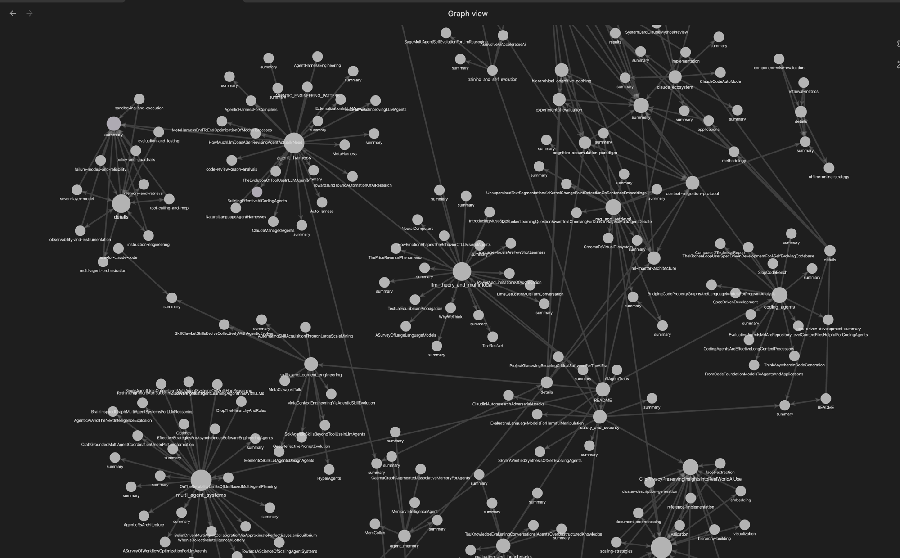

# AI Knowledge Wiki

Curated extraction of summaries from AI-related research papers, organized as a hierarchical wiki optimized for [Obsidian](https://obsidian.md) and LLMs.

Papers are grouped into 12 thematic categories covering agent systems, RAG & retrieval, LLM theory, training, safety, and more. See [`knowledge_base/index.md`](knowledge_base/index.md) for the full category index.
