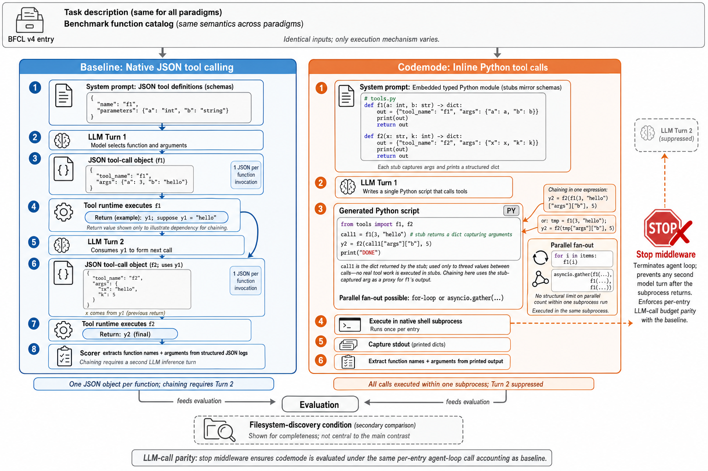

# The Bitter Lesson of Tool Calling

**Paper:** [The Bitter Lesson of Tool Calling (Patel, Sen, Lumer, Subbiah, 2026)](https://arxiv.org/abs/2608.06370)

## Human Readable TL;DR

When an AI assistant needs to look something up or run a calculation, it usually has to describe the request as a rigid JSON form — one field at a time, one request at a time. This paper asks: what if the assistant could just write a short Python script instead, the way a programmer would? Testing 14 AI models on a standard tool-use exam, the authors find that for newer, code-capable models this "write code instead of forms" approach ties or beats the old JSON approach — and pulls dramatically ahead once the assistant has to do several things in a row or many things at once. Older or smaller models, though, sometimes botch the code formatting and do worse. The lesson echoes Rich Sutton's famous "Bitter Lesson" in AI: the interface that lets the model use its most general capability (writing code) tends to win as models get more capable, rather than the interface humans hand-designed to be easy for early models.

## TL;DR

The paper empirically compares programmatic tool calling (PTC) — where a model writes one Python script against typed stub functions, executed in a single subprocess — against native JSON tool calling, across 14 LLMs (5 Anthropic, 9 OpenAI) on a 309-entry BFCL v4 subset plus three targeted ablations (chaining, parallel fan-out, context rot). PTC matches or exceeds baseline in 11 of 14 models, with the gap tracking model generation rather than model family: all Anthropic models and the three newest GPT-5.6 variants win or tie, while three older/weaker GPT models lose due to a specific code-formatting failure (emitting literal `\n` instead of real newlines). PTC's advantage is largest under structural stress — long chains, high fan-out, and flooded context — where JSON tool calling hits per-turn and per-response limits that PTC's single-subprocess execution avoids.

---

## Problem & Motivation

Tool-augmented LLMs standardly emit structured JSON objects at each function call — the dominant deployment pattern today. For models that can already write executable code, this is a design choice, not a necessity: programmatic tool calling lets the model express calls, chaining, and parallelism as a Python script instead. Prior work made a theoretical case for code-as-action (CodeAct: up to 20% higher task success, 30% fewer turns) and a null result on code-only restrictions in coding-agent tasks (±3% pass-rate change), but nobody had tested **function calling** — precise argument serialization, multi-step chaining, fan-out — across paradigms, model families, and generations on a standardized benchmark. This paper closes that gap.

---

## Main Original Ideas

1. **Model-generation, not model-family, predicts PTC viability.** The split between "PTC wins" and "PTC loses" models doesn't follow vendor lines — it follows how recently the model was trained. All 5 Anthropic models (irrespective of tier) win or tie; among OpenAI models, the split is GPT-4o/GPT-4.1/GPT-5.4-mini (lose) vs. GPT-5-nano/GPT-5/GPT-5.4/GPT-5.6-family (win) — a capability that entered training data between GPT-5.4-mini and GPT-5, not a fixed limitation of the vendor.
2. **A single, isolated failure mode explains nearly all of PTC's losses.** The three sub-baseline OpenAI models all fail the same way: they emit literal `\n` escape sequences instead of real newlines in generated multiline Python, causing subprocess syntax errors. This is a code-generation formatting bug, not a reasoning or tool-selection failure — and it evaporates in newer models under an identical prompt.
3. **PTC removes the two structural bottlenecks native JSON tool calling has** — the extra inference turn per chain link, and the per-response cap on how many parallel tool-call objects a model reliably emits. Both bottlenecks scale with task complexity, so PTC's advantage widens exactly where agentic workloads are hardest (long chains, high fan-out).
4. **Enumeration accuracy exposes a shortcut**, not just a metric choice: several models produce the "correct" aggregate answer from parametric world knowledge without ever executing the enumeration calls — a reminder that final-answer correctness alone can mask whether an agent actually used its tools.

---

## Key Findings

**Main evaluation (BFCL v4, n=309, 14 models):** 11/14 models match or exceed their own JSON baseline under PTC; GPT-5.6 family gains up to +10.6pp; the 3 sub-baseline OpenAI models drop 19.7–26.9pp.

| Ablation | n | Headline result |
|---|---|---|
| Chaining (lengths 2–20) | 52 | Claude Sonnet 5 +15.4pp (80.8→96.2); GPT-4.1 collapses 98.1→40.4 (sole outlier, `\n` bug) |
| Parallelism (fan-out 7–48, + probes to N=100) | 32 + probes | PTC wins/ties 13/14; GPT-5 +25.0pp (71.9→96.9); Claude Sonnet 5 JSON drops to 0% at N=100 while PTC holds 100% |
| Context rot (filtered vs. 128-schema flood) | 31/condition | JSON −2.3% mean, PTC **+5.5%** mean; a filesystem-discovery reference condition degrades −32.0% |

- Token cost crosses over at N≈26 concurrent calls: below it PTC's fixed system-prompt overhead makes it costlier; above it JSON's per-call enumeration in the response makes it costlier (at N=48: JSON 5,097 vs. PTC 3,535 tokens).
- PTC roughly halves wall-clock chaining latency for 13/14 models (ratios 0.32–0.96× baseline); GPT-5 is the exception at 2.8× baseline due to extended-reasoning overhead.
- Per-category breakdown (Appendix, macro-avg over all 14 models) hides an opposite split inside the near-tied overall number (JSON 78.6% vs. PTC 77.0%): JSON leads single-step/parallel-simulation categories, PTC leads every live multi-call category (+9.9pp on `live_multiple`).

---

## Suggestions & Future Directions

- The `\n`-escaping failure is flagged as a fixable, near-term code-generation bug rather than a fundamental limitation — worth checking against a model's current release before assuming PTC is unviable for it.
- Small ablation samples (n=31–52) mean individual per-model deltas are directional; the authors explicitly restrict strong claims to the cross-model aggregate patterns and recommend readers do the same.
- Open question the paper flags but doesn't resolve: why the Claude/Anthropic family shows a hard JSON fan-out ceiling (N=70–72) that GPT-5.6-Sol does not — attributed to how Anthropic models serialize parallel tool-call blocks, not investigated further.
- BFCL v4's echo-return stubs (functions return arguments verbatim, no real API execution) mean this measures argument-serialization fidelity, not end-to-end tool-use correctness with real side effects — an explicit boundary on how far the results generalize.

---

## Authors & Institutions

Patel, Sen, Lumer, Subbiah (2026) — institutional affiliations not stated in the extracted wiki pages; see [source PDF](source/2608.06370.pdf) for full author list and affiliations.

## Figures

