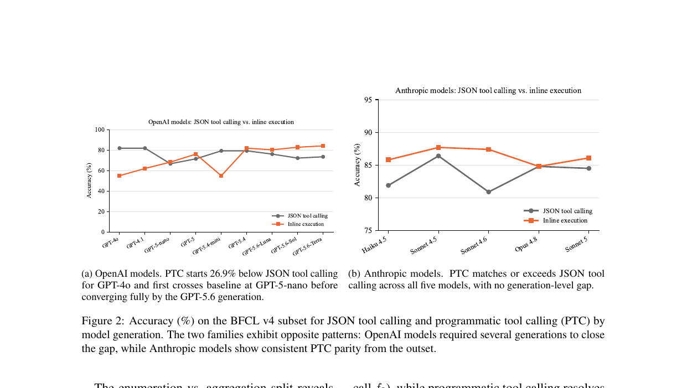

> [[../index|Wiki]] | [[../summary|Summary]] | [[../digest|Digest]]

# Analysis

**In one sentence:** Programmatic tool calling (PTC) accuracy tracks model generation rather than family — all five Anthropic models and the three newest GPT-5.6 variants match or beat the JSON baseline, fan-out up to N=100 degrades JSON but not PTC, and PTC roughly halves chaining latency for 13 of 14 models.

## Key points

- PTC accuracy relative to JSON tool calling tracks model generation, not model family: all five Anthropic models and the three newest GPT-5.6 variants match or exceed baseline, while GPT-4o, GPT-4.1, and GPT-5.4-mini fall below it.
- The sub-baseline OpenAI models share one specific failure: they emit `\n` character sequences instead of real newlines in generated Python code, causing a syntax error on any multiline script — a capability gap, not a prompt issue (GPT-5-nano produces correct multiline code under the same prompt).
- On the parallelism ablation, PTC lifts GPT-5 near-ceiling accuracy from 71.9% (JSON) to 96.9%, while JSON tool calling accuracy degrades once fan-out counts exceed 13.
- For Claude Sonnet 5, JSON enumeration accuracy is 100% at N ≤ 70, drops to 75% at N = 72, and reaches 0% at N = 100 — the degradation onset is between N = 70 and N = 72 — while PTC holds 100% enumeration accuracy at both N = 72 and N = 100.
- The asymmetry is Anthropic-specific: GPT-5.6-Sol holds 100% baseline enumeration accuracy through N = 100, suggesting the structural limit is in how Anthropic models serialize parallel tool-call blocks, not a universal property of JSON tool calling.
- The enumeration-vs-aggregation split exposes shortcut behavior: several models produce the correct aggregation answer from parametric world knowledge rather than actually executing the enumeration calls, which is why enumeration accuracy is reported as the primary metric.
- PTC completes chaining entries in roughly half the wall-clock time of baseline for 13 of 14 models, with per-entry latency ratios from 0.32 to 0.96 of baseline; GPT-5 is the exception, running at 2.8× baseline latency due to extended reasoning inflating generation time.

---

## Model Generation Predicts Programmatic Tool Calling Viability

The clearest pattern in the results is that programmatic tool calling accuracy relative to JSON tool calling tracks model generation, not model family. All five Anthropic models match or exceed baseline across all three ablation studies, and so do the three newest GPT-5.6 variants. The models that fall below baseline under programmatic tool calling — GPT-4o, GPT-4.1, and GPT-5.4-mini — share a specific failure: they produce Python code with `\n` character sequences in place of real newlines, causing the subprocess to raise a syntax error on any multiline script. The same system prompt, with the same newline instructions, produces correct multiline code from GPT-5-nano (a smaller and earlier model) while failing for GPT-5.4-mini (a larger and later model from a different training run), ruling out prompt configuration as the cause. The authors interpret this as a capability gap, though the specific cause is outside the scope of the paper. Figure 2 illustrates both trends side by side.

Figure 2 plots accuracy (%) on the BFCL v4 subset for JSON tool calling versus PTC, ordered by model generation: panel (a) shows OpenAI models where PTC starts ~26.9% below JSON at GPT-4o (≈55% vs ≈80%), overtakes it in the GPT-5 era, and fully converges by the GPT-5.6 generation, while panel (b) shows the five Anthropic models where PTC matches or slightly exceeds JSON from the first model, peaking a touch higher around Sonnet 4.x. The two families exhibit opposite trajectories: PTC parity is acquired over generations in OpenAI's line but present from the outset in Anthropic's.

## Enumeration vs. Aggregation Behavior

Programmatic tool calling achieves near-ceiling accuracy for GPT-5 on the parallelism ablation, improving from 71.9% to 96.9% while JSON tool calling accuracy degrades above fan-out counts of 13. In JSON tool calling, the model must emit a parallel tool-call block in a single response, and at high fan-out it begins omitting calls. In programmatic tool calling, fan-out is expressed as a loop or a sequence of function calls in Python, which imposes no structural limit on count and benefits from the model's code-generation training.

The enumeration vs. aggregation split reveals a programmatic tool calling behavior that departs from the intended design: several models produce the correct aggregation answer by drawing on parametric world knowledge rather than executing the enumeration calls. The authors report enumeration accuracy as the primary metric precisely because it measures whether the model actually invoked the tools, not just whether the final answer was correct.

To quantify the fan-out count at which this structural advantage emerges for Anthropic models, they probe Claude Sonnet 5 baseline at N ∈ {60, 70, 72, 75, 100}. Enumeration accuracy is 100% at N ≤ 70, drops to 75% at N = 72, and reaches 0% at N = 100, placing the degradation onset between N = 70 and N = 72. Programmatic tool calling maintains 100% enumeration accuracy at both N = 72 and N = 100. This asymmetry does not appear in GPT-5.6-Sol, which holds 100% baseline enumeration accuracy through N = 100, suggesting the structural limit is specific to how Anthropic models serialize parallel tool-call blocks rather than a universal property of JSON tool calling.

## Programmatic Tool Calling Reduces Latency on Chaining Tasks

Programmatic tool calling completes chaining entries in roughly half the wall-clock time of baseline for 13 of 14 models, with per-entry latency ratios ranging from 0.32 to 0.96 of baseline. JSON tool calling requires two inference turns for a sequential chain (one to call f1, one to receive its result and call f2), while programmatic tool calling resolves both calls in a single inference turn followed by one subprocess execution. GPT-5 is the exception, running at 2.8× baseline latency under programmatic tool calling: its extended reasoning output inflates generation time enough to erase the turn-reduction benefit.

**Covers:** Section 5 (Analysis): 5.1, 5.2, 5.3; Figure 2
