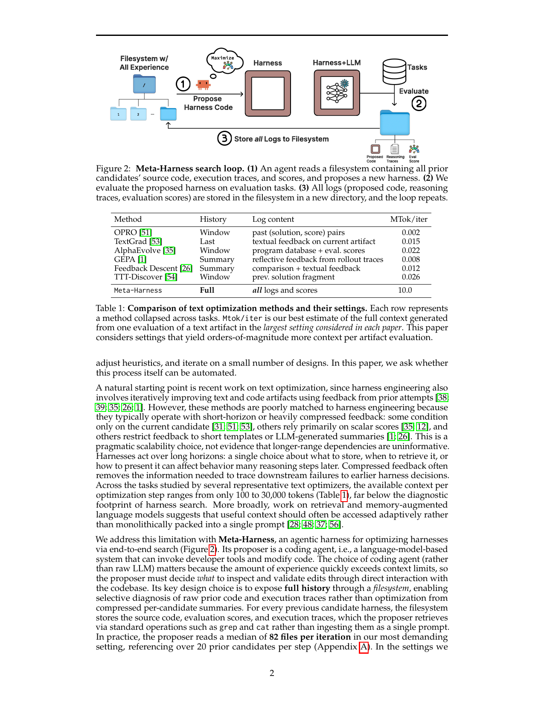
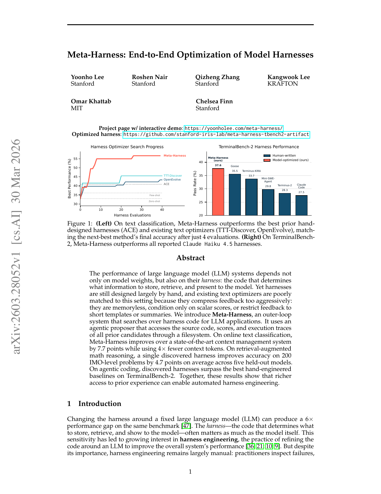

> [[../index|Wiki]] | [[../summary|Summary]] | [[../digest|Digest]]

# Motivation and Related Work

**In one sentence:** Harnesses — the code around an LLM that decides what to store, retrieve, and show to the model — matter as much as the model weights themselves, but are still engineered by hand, and existing text optimizers are poorly matched to automating this because they compress feedback too aggressively; Meta-Harness therefore runs an agentic outer-loop search over harness code that gives the proposer full, filesystem-accessible history of prior candidates' source code, scores, and execution traces, yielding large gains over hand-designed and model-optimized baselines on text classification (7.7 points over ACE with 4× fewer context tokens), math reasoning (4.7 points across five held-out models on 200 IMO-level problems), and agentic coding (best of all reported Claude Haiku 4.5 harnesses on TerminalBench-2).

## Key points

- Changing only the harness around a fixed LLM can produce a 6× performance gap on the same benchmark [47]; the harness (code deciding what to store, retrieve, and show to the model) often matters as much as the model itself.
- Harness engineering — refining the code around an LLM to improve overall system performance [36; 21; 10; 9] — remains largely manual: practitioners inspect failures, adjust heuristics, and iterate on a small number of designs; the paper asks whether this process itself can be automated.
- Prior text optimizers are poorly matched to harness engineering because they operate with short-horizon or heavily compressed feedback: some condition only on the current candidate [31; 51; 53], others rely primarily on scalar scores [35; 12], and others restrict feedback to short templates or LLM-generated summaries [1; 26].
- The scale gap is quantified: representative text optimizers (OPRO 0.002 MTok/iter, TextGrad 0.015, AlphaEvolve 0.022, GEPA 0.008, Feedback Descent 0.012, TTT-Discover 0.026) operate with only 100 to 30,000 tokens of context per optimization step, whereas Meta-Harness's largest setting can produce up to 10,000,000 tokens of diagnostic information per evaluation (10 MTok/iter) — roughly three orders of magnitude more, since harnesses act over long horizons where early choices cause downstream failures.
- Meta-Harness's key design choice is to expose full history through a filesystem: the agentic coding proposer uses standard operations (grep, cat) to selectively inspect prior source code, scores, and execution traces rather than ingesting a single compressed prompt; in the most demanding setting the proposer reads a median of 82 files per iteration, referencing over 20 prior candidates per step (Appendix A).
- Choosing a coding agent (an LM system that can invoke developer tools and modify code) as the proposer — rather than a raw LLM — matters because the volume of accumulated experience quickly exceeds context limits, so the proposer must decide *what* to inspect and validate edits through direct interaction with the codebase.
- Results: on online text classification, Meta-Harness improves over ACE (Zhang et al. [59]) by 7.7 points while using 4× fewer context tokens and matches the next-best text optimizer's final performance after only 4 evaluations (the next best needed 60 proposals); on retrieval-augmented math reasoning, a single discovered harness improves accuracy on 200 IMO-level problems by 4.7 points on average across five held-out models; on TerminalBench-2 the discovered harness surpasses Terminus-KIRA and ranks #1 among all Haiku 4.5 agents.
- Meta-Harness's high-level framing brings credit-assignment and meta-learning ideas [40; 46; 3; 17; 44; 2] into a new regime enabled by coding agents: instead of updating model weights, it assigns credit at the harness level — using experience from past rollouts to reason about which steps and components are responsible for failures, then rewriting the external code that governs future behavior.

---

## The harness-engineering problem (Abstract and Section 1, Introduction)

The performance of large language model (LLM) systems depends not only on model weights but also on their *harness*: the code that determines what information to store, retrieve, and present to the model. Changing the harness around a fixed LLM can produce a 6× performance gap on the same benchmark [47], which is why the harness often matters as much as the model itself. This sensitivity has driven growing interest in **harness engineering**, the practice of refining the code around an LLM to improve the overall system's performance [36; 21; 10; 9]. Despite this, harness engineering remains largely manual: practitioners inspect failures, adjust heuristics, and iterate on a small number of designs. The paper asks whether this process itself can be automated. The abstract frames the gap: existing text optimizers are poorly matched to this setting because they compress feedback too aggressively — they are memoryless, condition only on scalar scores, or restrict feedback to short templates or summaries. Meta-Harness is an outer-loop system that searches over harness code for LLM applications, using an agentic proposer that accesses the source code, scores, and execution traces of all prior candidates through a filesystem. Headline numbers: on online text classification, a 7.7-point improvement over a state-of-the-art context management system (ACE) while using 4× fewer context tokens; on retrieval-augmented math reasoning, a single discovered harness improving accuracy on 200 IMO-level problems by 4.7 points on average across five held-out models; and on agentic coding, discovered harnesses that surpass the best hand-engineered baselines on TerminalBench-2.

A natural starting point is recent work on text optimization, since harness engineering also involves iteratively improving text and code artifacts using feedback from prior attempts [38; 39; 35; 26; 1]. However, these methods are poorly matched to harness engineering because they typically operate with short-horizon or heavily compressed feedback: some condition only on the current candidate [31; 51; 53], others rely primarily on scalar scores [35; 12], and others restrict feedback to short templates or LLM-generated summaries [1; 26]. The paper stresses this is a pragmatic scalability choice, *not* evidence that longer-range dependencies are uninformative. Harnesses act over long horizons: a single choice about what to store, when to retrieve it, or how to present it can affect behavior many reasoning steps later, and compressed feedback often removes the information needed to trace downstream failures back to the earlier harness decision that caused them.

Table 1 of the paper quantifies this scale gap by comparing each method's history log content and estimated megatokens generated per iteration at the largest setting considered in each paper:

| Method | History / log content | MTok/iter |
|---|---|---|
| OPRO [51] | Window of past (solution, score) pairs | 0.002 |
| TextGrad [53] | Last textual feedback on current artifact | 0.015 |
| AlphaEvolve [35] | Window of program database + eval. scores | 0.022 |
| GEPA [1] | Summary reflective feedback from rollout traces | 0.008 |
| Feedback Descent [26] | Summary comparison + textual feedback | 0.012 |
| TTT-Discover [54] | Window of previous solution fragment | 0.026 |
| **Meta-Harness** | **Full — all logs and scores** | **10.0** |

Across the tasks studied by representative text optimizers, the available context per optimization step ranges from only 100 to 30,000 tokens — far below the diagnostic footprint of harness search. More broadly, work on retrieval and memory-augmented language models suggests that useful context should often be accessed adaptively rather than monolithically packed into a single prompt [28; 48; 37; 56].

### Meta-Harness and its search loop (Figure 2)

We address this limitation with **Meta-Harness**, an agentic harness for optimizing harnesses via end-to-end search. Its proposer is a *coding agent* — a language-model-based system that can invoke developer tools and modify code. The choice of coding agent (rather than a raw LLM) matters because the amount of experience quickly exceeds context limits, so the proposer must decide *what* to inspect and validate edits through direct interaction with the codebase. Its key design choice is to expose **full history** through a *filesystem*, enabling selective diagnosis of raw prior code and execution traces rather than optimization from compressed per-candidate summaries.

Figure 2 is a schematic of the closed, repeating search loop with three stages: **(1) Propose** — an agent (with a "maximize" goal) reads a filesystem containing *all* prior experience — the source code, execution/reasoning traces, and scores of every prior candidate, stored as a directory tree — and writes out a new harness. **(2) Evaluate** — the proposed harness is combined with an LLM (Harness+LLM) and run against a set of evaluation tasks, producing a new bundle of proposed code, reasoning traces, and an evaluation score. **(3) Store** — all logs from that iteration (proposed code, reasoning traces, evaluation scores) are written back to the filesystem as a new directory, which becomes part of the input for the next iteration, and the loop repeats. The takeaway the figure conveys is the core design choice: rather than feeding a compressed per-candidate summary into the optimizer (as typical text-optimization methods do), Meta-Harness exposes the full accumulated history through a filesystem the agent can inspect selectively, closing a propose → evaluate → store loop end-to-end — an iterative, memory-rich search process rather than single-shot prompt optimization.

In practice, the proposer uses standard filesystem operations such as `grep` and `cat` to retrieve relevant material from prior candidates rather than ingesting them as a single prompt: it reads a median of **82 files per iteration** in the most demanding setting, referencing over 20 prior candidates per step (Appendix A). In the settings studied, a single evaluation can produce up to **10,000,000 tokens** of diagnostic information, roughly three orders of magnitude beyond the largest feedback budgets used in prior text optimization settings (Table 1).

### Headline results (Figure 1)

Meta-Harness is evaluated on online text classification, mathematical reasoning, and agentic coding. On online text classification, harnesses discovered by Meta-Harness improve over Agentic Context Engineering (ACE, Zhang et al. [59]) by **7.7 points** while using 4× fewer context tokens, and match the next-best text optimizer's final performance after 60 proposals with only four evaluations. On retrieval-augmented math reasoning, a single discovered harness improves accuracy on 200 IMO-level problems by **4.7 points** on average across five held-out models. On TerminalBench-2, the discovered harness **surpasses Terminus-KIRA and ranks #1 among all Haiku 4.5 agents**.

Figure 1 is a two-panel headline-results plot. The **left panel** ("Harness Optimizer Search Progress") plots best performance (%) on the y-axis (roughly 30–55) against the number of harness evaluations on the x-axis (0–40), with curves for Meta-Harness, TTD-Discover, OpenEvolve, and ACE plus few-shot/zero-shot reference lines near the bottom. Meta-Harness climbs sharply within the first handful of evaluations to the top of the chart (≈50–55%) and plateaus there; the existing optimizers (TTD-Discover, OpenEvolve) rise more slowly to a lower ceiling (≈45%), and ACE stays lowest of the learned methods (≈40%), only slightly above the zero/few-shot references. In other words, Meta-Harness matches the best prior method's *final* accuracy after only a few evaluations, finding a strong harness much faster than the hand-designed (ACE) or existing text-optimizing methods. The **right panel** ("TerminalBench-2 Harness Performance") is a bar chart of pass rate (%) (≈20–40) by harness: the model-optimized Meta-Harness bar is the tallest (≈38%), followed by the human-written harnesses Goose (≈35%), Terminus-KIRA (≈33–35.5%), Mini-SWE-Agent (≈30%), Terminus-2 (≈28%), and Claude Code (≈27%), with the legend distinguishing human-written (blue) from model-optimized (ours, red). On agentic coding, the discovered harness beats every reported Claude Haiku-based human-written harness. Overall, the figure argues that richer access to prior experience (source code, scores, execution traces) enables automated harness engineering that (i) matches the best final accuracy of prior optimizers in a fraction of the evaluations and (ii) surpasses hand-engineered baselines on agentic coding — the harness, not just the model weights, is a lever that can be optimized automatically.

## Section 2: Related Work

At a high level, Meta-Harness brings ideas from the broader literature on credit assignment and meta-learning [40; 46; 3; 17; 44; 2] into a new regime enabled by recent advances in coding agents. Rather than updating model weights, the system assigns credit at the harness level: it uses experience from past rollouts to deliberately reason about which steps and components are responsible for failures, then rewrites the external code that governs future behavior. More specifically, the method lies at the intersection of three recent research threads, each of which the paper positions itself against below.

### External memory and adaptive access

Several prior works note the benefits of treating large knowledge sources or long inputs as external resources that a language model accesses adaptively, rather than consuming them in a single pass. Concretely: retrieval-augmented generation [28], interleaved retrieval and reasoning [48], memory-based agents [37], and recursive language models [56] are all mechanisms for adaptive access to external context. Meta-Harness uses a similar access pattern, but in the more demanding setting of harness engineering, where the proposer selectively inspects a large external history of code, scores, and execution traces in order to improve the context-management procedures themselves.

### Executable code search

Recent methods search over executable code for functions, workflows, or agent designs. Early work proposes using large models as mutation and crossover operators in evolutionary program search [27]. Later methods evolve designated functions within fixed program scaffolds [39], use meta-agents to program new agents from prior discoveries [20], or search over workflow graphs for agentic systems [58]. Another line of work searches over memory designs for continual-learning agents, where memory persists across task streams [57; 50]. In contrast, Meta-Harness searches over domain-specific harnesses — including prompt construction, retrieval, and state-update strategies that reset between tasks. Its outer loop is deliberately minimal: instead of relying on a fixed scaffold, an archive of prior discoveries, or a persistent memory mechanism, it gives the proposer unrestricted filesystem access to prior experience. This lets the agent decide what information to inspect and enables search over full harness implementations rather than a predefined space of context-management procedures.

### Text optimization methods

Meta-Harness is also closely related to methods such as ProTeGi, TextGrad, OPRO, GEPA, AlphaEvolve/OpenEvolve, and Feedback Descent [38; 31; 53; 51; 1; 35; 43; 26], which iteratively improve prompts or other text artifacts using feedback from prior attempts. These methods are less well suited to harness engineering, where the optimization target is a *complete executable procedure* and the relevant environmental feedback is distributed across code, scores, and execution traces in a way that is hard to summarize up front. Rather than reacting only to aggregate scores or summaries, the proposer in Meta-Harness can reason over failed examples and their execution traces to propose targeted edits. The paper points to Table 1 for a comparison of problem scale (context per iteration) between those papers and its own, and to Figures 1 and 4 for a direct empirical comparison with OpenEvolve, GEPA, and TTT-Discover in the same problem setting.

**Covers:** Abstract, Section 1 (Introduction), Section 2 (Related Work)
