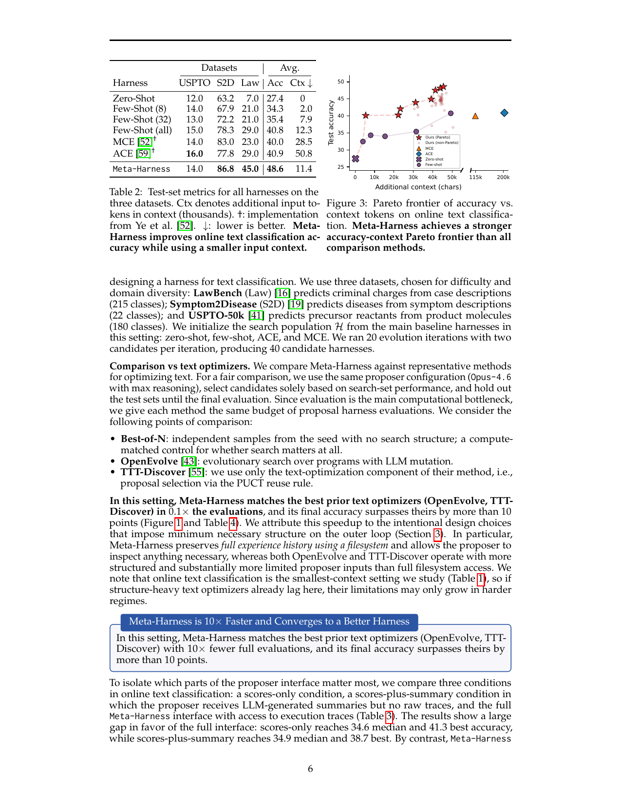

> [[../index|Wiki]] | [[../summary|Summary]] | [[../digest|Digest]]

# Classification and Reasoning Experiments

**In one sentence:** Meta-Harness's discovered harnesses beat both text optimizers (10+ points better with 10x fewer evaluations) and hand-designed harnesses (ACE +7.7 points with 4.5x less context, dominating the accuracy-context Pareto frontier), generalize best to nine unseen datasets, and the same approach discovers a retrieval strategy for olympiad math that lifts all five held-out models by an average of 4.7 points.

## Key points

- Online text classification (GPT-OSS-120B; LawBench, Symptom2Disease, USPTO-50k): the best discovered harness reaches 48.6% average test accuracy with only 11.4K additional context tokens, vs. 40.9% / 50.8K for ACE and 40.0% / 28.5K for MCE — a 7.7-point improvement over ACE and 8.6 points over MCE with ~4.5x fewer context tokens.
- On the per-dataset test set (Table 2), Meta-Harness wins on LawBench (86.8% vs. ACE's 77.8%) and USPTO (45.0%, the only harness above ACE's 29.0%), while ACE marginally wins Symptom2Disease (77.8% vs. 72.2%).
- Vs. text optimizers (search set, Table 4): Meta-Harness reaches 50.0 median / 56.7 best accuracy, beating OpenEvolve (39.1/43.3), TTT-Discover (34.1/45.6), Best-of-N (34.0/44.2), and GEPA (32.6/40.2) — matching the best prior optimizers while using 0.1x their evaluations (a 10x evaluation-count speedup) and surpassing them by more than 10 points.
- Proposer-interface ablation (Table 3): scores-only hits 34.6 median / 41.3 best, scores+summary 34.9/38.7, but the full Meta-Harness interface with raw execution traces reaches 50.0/56.7 — even its median candidate beats the best candidates of either ablation.
- Figure 3 (Pareto frontier): Meta-Harness dominates the accuracy–context tradeoff curve of every comparison method; the frontier extends from ~30% accuracy at near-zero context up to ~50% accuracy, with comparison methods saturating lower (around 25–40%) at 0–50k context and far larger (115k–200k) context spends.
- Out-of-distribution generalization (9 held-out datasets, Table 5): Meta-Harness averages 73.1% accuracy — the best — beating ACE (70.2%) by 2.9 points, and it wins 6/9 datasets; few-shot accuracy actually degrades when scaling from 32 to all examples on 7/9 tasks (average: 69.6% → 68.2%).
- Retrieval-augmented math (200 IMO-level problems, 5 held-out models, Table 6): the discovered harness beats the no-retriever baseline on every model, gaining +8.7 (GPT-5.4-nano), +1.6 (GPT-5.4-mini), +6.3 (Gemini-3.1-Flash-Lite), +3.7 (Gemini-3-Flash), +3.0 (GPT-OSS-20B) for an average of 34.1% → 38.8% (+4.7 points).
- The search itself was compact: 20 evolution iterations × 2 candidates (40 harnesses) for text classification, and 40 iterations producing 109 candidate retrieval harnesses over a 250-problem olympiad search set — yet the discovered harnesses dominate both baselines and hand-designed ones.

---

## Online text classification setup

The setup follows the online text classification setting of Zhang et al. [ACE] and Ye et al. [MCE]: an LLM receives labeled examples one at a time, updates its memory, and is evaluated on a held-out test set. The LLM classifier is **GPT-OSS-120B**. Three datasets are used, chosen for difficulty and domain diversity:

- **LawBench (Law)** — predicts criminal charges from case descriptions (215 classes)
- **Symptom2Disease (S2D)** — predicts diseases from symptom descriptions (22 classes)
- **USPTO-50k** — predicts precursor reactants from product molecules (180 classes)

The search population is initialized from the main baseline harnesses in this setting (zero-shot, few-shot, ACE, MCE). The search ran **20 evolution iterations with two candidates per iteration, producing 40 candidate harnesses**. Two baseline classes are compared against: (1) **human-designed strategies** (ACE, MCE — hand-crafted, state-of-the-art context construction), and (2) **program-search methods** (OpenEvolve, TTT-Discover — search over candidate harnesses with feedback/reward signals, designed for smaller-scale settings than harness engineering).

## Comparison vs. text optimizers and hand-designed harnesses

**Text optimizers (search set; identical proposer config — Opus-4.6 with max reasoning — and identical evaluation budget for fairness):**

| Method | Median acc | Best acc | vs. zero-shot (n runs) |
|---|---|---|---|
| Scores-only (ablation) | 34.6 | 41.3 | 26 |
| Scores + Summary (ablation) | 34.9 | 38.7 | 23 |
| GEPA | 32.6 | 40.2 | — |
| Best-of-N (control) | 34.0 | 44.2 | — |
| OpenEvolve | 39.1 | 43.3 | — |
| TTT-Discover | 34.1 | 45.6 | — |
| **Meta-Harness (full)** | **50.0** | **56.7** | **39** |

Meta-Harness **matches the best prior text optimizers (OpenEvolve, TTT-Discover) in 0.1× the evaluations** — a 10x fewer-evaluation speedup — and its final accuracy **surpasses theirs by more than 10 points**. The authors attribute this to the intentionally minimal structure on the outer loop: Meta-Harness preserves the full experience history using a filesystem and lets the proposer inspect anything, whereas OpenEvolve and TTT-Discover operate with more structured, substantially more limited proposer inputs. Since online text classification is the smallest-context setting studied, structure-heavy text optimizers that already lag here may only get worse in harder regimes.

The **proposer-interface ablation** isolates what matters: with only scores, median drops to 34.6 (best 41.3); adding LLM-generated summaries (no raw traces) gives 34.9 median (best 38.7 — lower); the full interface with **raw execution traces** reaches 50.0 median / 56.7 best. The median candidate under the full interface outperforms *either ablation's best candidate*. Interpretation: full trace access is the key ingredient; summaries do not recover the missing signal and may even hurt by compressing away diagnostically useful detail.

**Vs. hand-designed harnesses (test set; 3 datasets, avg):**

| Harness | Law | S2D | USPTO | Avg acc | Ctx (K tokens) ↓ |
|---|---|---|---|---|---|
| Zero-Shot | 12.0 | 63.2 | 7.0 | 27.4 | 0 |
| Few-Shot (8) | 14.0 | 67.9 | 21.0 | 34.3 | 2.0 |
| Few-Shot (32) | 13.0 | 72.2 | 21.0 | 35.4 | 7.9 |
| Few-Shot (all) | 15.0 | 78.3 | 29.0 | 40.8 | 12.3 |
| MCE (Ye et al.) | 14.0 | 83.0 | 23.0 | 40.0 | 28.5 |
| ACE (Zhang et al.) | **16.0** | 77.8 | 29.0 | 40.9 | 50.8 |
| **Meta-Harness** | 14.0 | **86.8** | **45.0** | **48.6** | **11.4** |

Meta-Harness reaches **48.6%** average test accuracy, outperforming **ACE by 7.7 points** and **MCE by 8.6 points** — and *without* more context: only **11.4K context tokens vs. 50.8K (ACE)** and **28.5K (MCE)**, i.e., ~4.5x fewer context tokens than ACE. (Footnote: in the tables, "Meta-Harness" denotes the best discovered harness; elsewhere it refers to the search procedure.)

## Accuracy-context tradeoffs

Figure 3 plots accuracy (y-axis, ~25→50%) against additional context (x-axis, 0→50k, with far-right points at 115k and 200k context chars/tokens). **Meta-Harness achieves a stronger accuracy–context Pareto frontier than all comparison methods.** Because Meta-Harness performs free-form optimization over harness code, it can express a joint preference over both accuracy and context cost rather than committing to a single scalar objective in advance: given only the current metrics and the desired trade-off, the proposer discovers harnesses across a broad range of the frontier, yielding a smooth accuracy–context Pareto curve. This lets you trade additional context for higher test accuracy in a controlled way instead of being stuck at one hand-designed operating point — the frontier shows that Meta-Harness's discovered harnesses strictly dominate the baselines: higher accuracy at the context budgets the baselines use (e.g., beating ACE's 40.9% at 11.4K context where ACE spends 50.8K), and higher still when larger context budgets (115k–200k) are afforded.

## Out-of-distribution evaluation

To test generalization, the discovered harness is evaluated on **nine diverse datasets never seen during search** (details in Appendix C.1), with additional context tokens reported as the average across all nine:

| Harness | SciC | FiNER | Amz5 | FPB | GoEmo | Bank77 | News | SciT | TwHate | Avg | Ctx (K) ↓ |
|---|---|---|---|---|---|---|---|---|---|---|---|
| Zero-shot | 32.7 | 56.0 | 52.7 | 90.0 | 42.0 | 80.7 | 84.7 | 89.3 | 75.3 | 67.0 | — |
| Few-shot (8) | 34.0 | 63.0 | 54.0 | 90.0 | 44.0 | 82.7 | 84.7 | **91.3** | 76.7 | 68.9 | 2.2 |
| Few-shot (32) | 38.7 | 62.0 | 53.3 | 90.7 | 43.3 | **86.0** | 85.3 | 90.7 | 76.7 | 69.6 | 5.2 |
| Few-shot (all) | 35.3 | 61.0 | 50.0 | 93.3 | 42.7 | 80.7 | 84.0 | 90.0 | 76.7 | 68.2 | 7.4 |
| ACE | 40.7 | **74.0** | 48.0 | **96.7** | 44.0 | 83.3 | 86.0 | 90.7 | 68.7 | 70.2 | 11.7 |
| **Meta-Harness** | **53.3** | 67.0 | **60.0** | 94.0 | **46.0** | **82.7** | **86.7** | **91.3** | **77.3** | **73.1** | 7.3 |

*(Bold follows the table's highlighting: Meta-Harness is bold on SciC, Amz5, GoEmo, Bank77, News, SciT, TwHate; the best on FiNER is ACE (74.0) and on FPB ACE (96.7). SciT is a 91.3 tie shared with few-shot (8). Per the text, Meta-Harness shows the highest performance on 6/9 datasets.)*

The selected Meta-Harness system achieves the **best average accuracy (73.1%)**, outperforming ACE (70.2%) — a 2.9-point edge — and all few-shot baselines, while using the *lowest* context cost (7.3K vs. ACE's 11.7K). Two notable findings: (1) naively adding more few-shot examples beyond 32 **hurts performance in 7/9 tasks** (average drops 69.6% → 68.2%); (2) Meta-Harness posts the highest performance on **6/9 datasets**, indicating the discovered harness captures generally effective text-classification strategies rather than overfitting to the three search datasets.

## Retrieval-augmented math reasoning

A non-standard olympiad-math setup: augment the model with retrieval from a large corpus. Rationale: solutions share reusable proof patterns, so prior reasoning traces carry information a model can exploit at inference time — yet retrieval has not become standard here because naive retrieval rarely surfaces the right traces in the right form. So rather than hand-designing a retrieval policy, Meta-Harness is given a hard olympiad problem set and the retrieval behavior is allowed to emerge from search.

**Setup:** the retrieval corpus contains **≥500,000 solved problems** from eight open-source datasets, carefully deduplicated and decontaminated against both evaluation benchmarks and the search set (no exact prefix matches under a string-based filter; top BM25 retrievals for held-out examples manually inspected, Appendix C.2). Search ran **40 iterations** over a **250-problem search set** of Olympiad-difficulty math (OlympiadBench + Omni-MATH hard), producing **109 candidate retrieval harnesses**, initialized from zero-shot, few-shot, and ACE. One harness is selected by search-set performance and evaluated on **200 previously unseen IMO-level problems** from IMO-AnswerBench, IMO-ProofBench, and ArXivMath. The same harness is tested on GPT-OSS-20B plus four models never seen during search: GPT-5.4-nano, GPT-5.4-mini, Gemini-3.1-Flash-Lite, Gemini-3-Flash. Protocol: pass@1 averaged over three samples per problem. Note: unlike dense-retrieval baselines, Meta-Harness operates entirely in code space on top of the *same BM25-based lexical retrieval stack* as the sparse baseline — no additional dense encoder.

**Results (Table 6; absolute improvement over no-retriever in parentheses):**

| Method | GPT-5.4-nano | GPT-5.4-mini | Gemini-3.1-Flash-Lite | Gemini-3-Flash | GPT-OSS-20B | Avg |
|---|---|---|---|---|---|---|
| No Retriever | 23.0 | 28.8 | 28.6 | 42.6 | 47.6 | 34.1 |
| Dense Retrieval (k=1) | 27.1 (+4.1) | 24.5 (−4.3) | 31.3 (+2.7) | 42.3 (−0.3) | 46.9 (−0.7) | 34.4 (+0.3) |
| Dense Retrieval (k=5) | 31.1 (+8.1) | 28.3 (−0.5) | 37.1 (+8.5) | 47.2 (+4.6) | 46.7 (−0.9) | 38.1 (+4.0) |
| Random Few-shot | 23.1 (+0.1) | 24.5 (−4.3) | 31.0 (+2.4) | 40.4 (−2.2) | 41.8 (−5.8) | 32.2 (−1.9) |
| BM25 Retrieval | 30.2 (+7.2) | 29.2 (+0.4) | 32.8 (+4.2) | 46.6 (+4.0) | 48.9 (+1.3) | 37.5 (+3.4) |
| **Meta-Harness** | **31.7** (+8.7) | **30.4** (+1.6) | **34.9** (+6.3) | 46.3 (+3.7) | **50.6** (+3.0) | **38.8** (+4.7) |

The discovered retrieval harness **outperforms the no-retrieval baseline across all five held-out models, with an average gain of 4.7 points** (34.1% → 38.8%). It also matches or exceeds the strongest fixed baselines on average, **outperforming BM25 retrieval by 1.3 points overall** (+4.7 vs. +3.4), while avoiding the regressions dense retrieval and random few-shot prompting incur on several models (e.g., dense k=1 loses −4.3 points on GPT-5.4-mini; random few-shot loses −5.8 on GPT-OSS-20B). Only Gemini-3-Flash is a slight exception where Meta-Harness (46.3) falls marginally below BM25 (46.6) — but it still beats all other baselines there except dense k=5 (47.2).

**Covers:** Section 4.1 (Online Text Classification), Section 4.2 (Harnesses for Retrieval-Augmented Reasoning)
