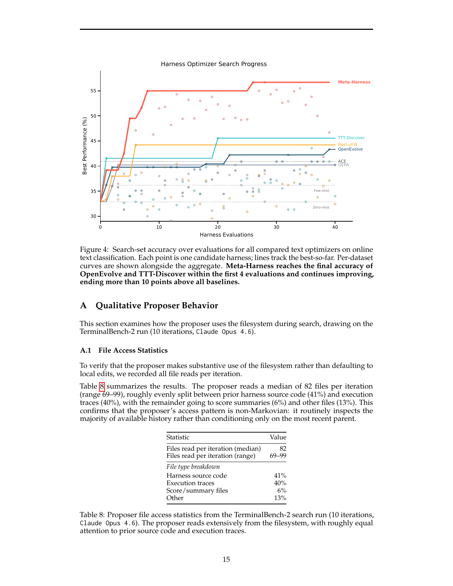
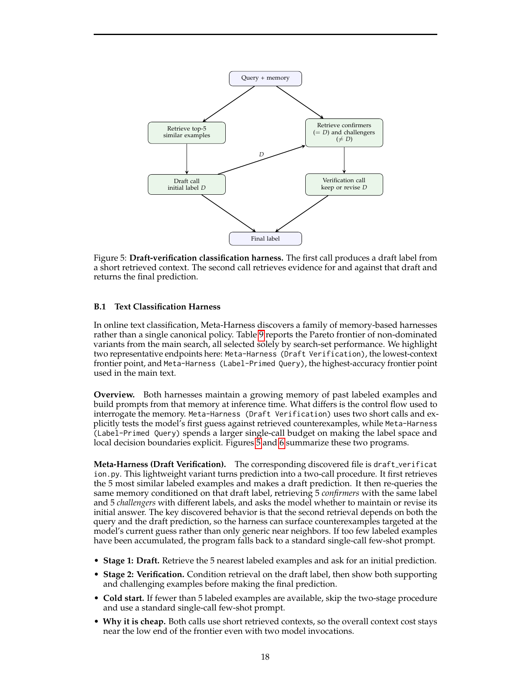
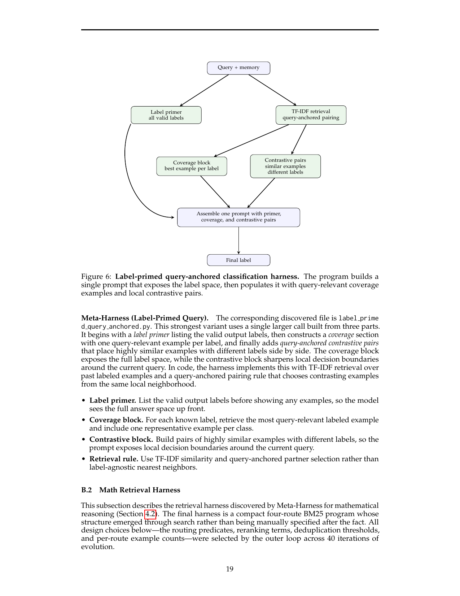
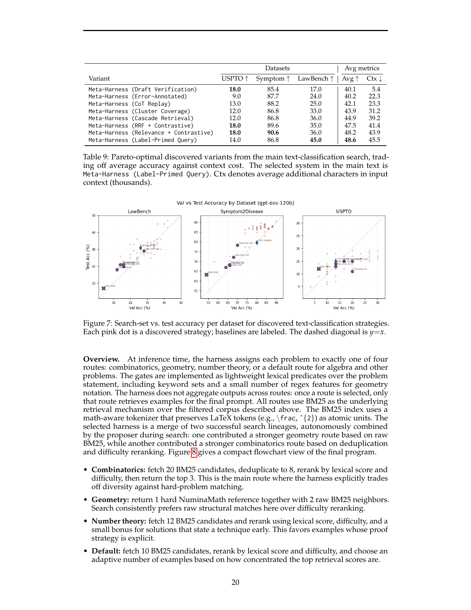
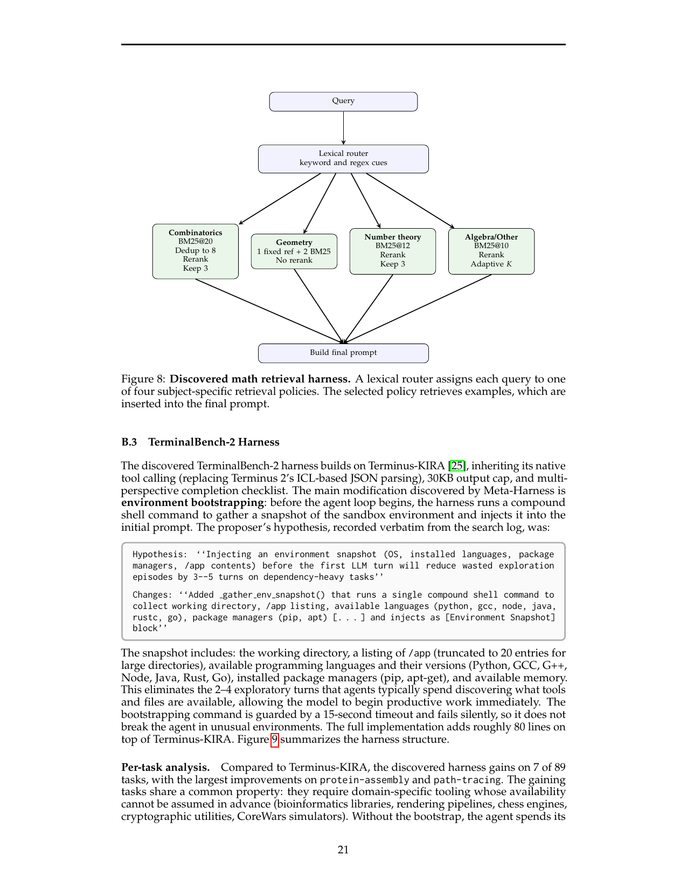
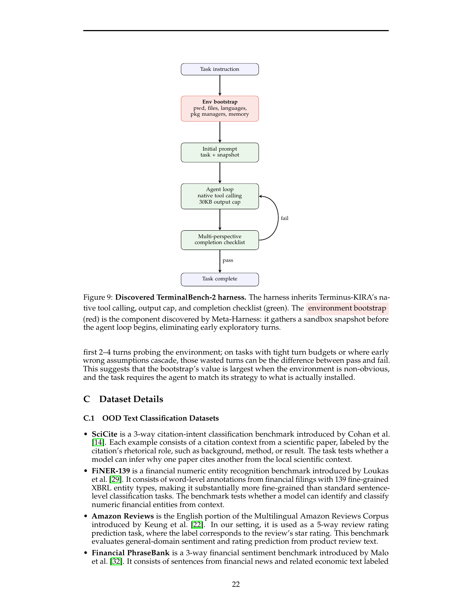

> [[../index|Wiki]] | [[../summary|Summary]] | [[../digest|Digest]]

# Appendix: Case Studies and Discovered Harnesses

**In one sentence:** The appendices show that the agent proposer genuinely does causal, history-conditioned reasoning over its own regressions (identifying prompt-edit confounds and pivoting to additive fixes), that the search produces concrete, describable executable harnesses — a two-call draft-verification classifier, a label-primed contrastive classifier, a four-route lexical math retrieval router, and a TerminalBench environment-bootstrapping wrapper — each selected purely by search-set performance and transferable to held-out tests.

## Key points

- In the TerminalBench-2 search (10 iterations, Claude Opus 4.6), the proposer reads a median of 82 files per iteration (range 69–99), split ~41% prior harness source, ~40% execution traces, ~6% score summaries, ~13% other — evidence of non-Markovian, full-history access rather than conditioning only on the most recent parent.
- Iterations 1–2 both bundled plausible structural bugfixes with prompt-template rewrites and both regressed sharply from the 64.4% Terminus-KIRA baseline; by iteration 3 the proposer explicitly identified the shared prompt rewrite as the confound, and iteration 4 grounded its diagnosis in concrete trajectory evidence (agents stuck in 30–60 step verification spirals on `configure-git-webserver`).
- After six consecutive regressions, iteration 7 — a purely additive "add information before the loop begins" change that avoids touching the fragile completion machinery — became the best candidate; iteration 8 attempted to compose it with an earlier structural fix, and iteration 10 transferred lessons from a separate earlier search run.
- On text classification the search discovered a *family* of memory-based harnesses on a Pareto frontier (Table 9) trading accuracy vs. context cost: e.g., Draft Verification at 48.2 avg accuracy with only 22.3K added context characters, versus Label-Primed Query at 48.6 avg accuracy (90.6% Symptom) with 45.5K context; 7 non-dominated variants are reported.
- The Draft-Verification harness (`draft_verification.py`) makes two short calls: retrieve 5 nearest examples → draft label; then re-retrieve conditioned on that draft label (5 confirmers + 5 challengers) → keep or revise; with a single-call few-shot fallback for cold start.
- The Label-Primed Query harness (`label_prime_d_query_anchor_ed.py` in the source, `label_primed_query_anchored`) builds one larger single-call prompt from a label primer + per-label coverage examples + query-anchored contrastive pairs, using TF-IDF retrieval with query-anchored partner selection.
- The math retrieval harness is a four-route (combinatorics / geometry / number theory / default) BM25 program with lexical routing predicates, deduplication, difficulty reranking, and a math-aware tokenizer preserving LaTeX tokens; it is an autonomous merge of two successful search lineages, and all design parameters (counts, thresholds, reranking terms) were selected by 40 iterations of outer-loop evolution.
- The TerminalBench-2 harness inherits Terminus-KIRA (native tool calling, 30KB output cap, multi-perspective completion checklist) and adds ~80 lines of "environment bootstrapping" — a 15-second-timeout shell snapshot of the sandbox (cwd, /app listing, languages+versions, package managers, memory) injected into the initial prompt, eliminating 2–4 exploratory turns; it gains on 7 of 89 tasks, most on tasks needing domain-specific tooling (protein-assembly, path-tracing).

---

## The search trajectory: a case study (Appendix A)

Appendix A draws on the TerminalBench-2 run (10 iterations, Claude Opus 4.6) to show *how* the proposer uses the filesystem during search. Two things are documented.

**File access statistics (A.1).** To verify the proposer makes substantive use of the filesystem rather than defaulting to local edits, all file reads per iteration were recorded. The proposer reads a median of **82 files per iteration (range 69–99)**, roughly evenly split between **prior harness source code (41%)** and **execution traces (40%)**, with score/summary files (6%) and other files (13%) making up the rest. The authors conclude the access pattern is *non-Markovian*: the proposer routinely inspects the majority of available history rather than conditioning only on the most recent parent.

**Causal reasoning over prior failures (A.2).** The search log shows a clear narrative arc in which the proposer learns from its own regressions instead of wandering through local edits. All quoted log text is verbatim from the proposer's recorded reasoning (emphasis in the paper is the authors').

- **Iterations 1–2: promising bugfixes confounded by prompt edits.** Both early candidates bundle a plausible structural fix with a prompt-template change and both regress sharply from the **64.4% Terminus-KIRA baseline**. Iteration 1 targets observation corruption from leaked terminal markers and adds a loop breaker, but also introduces a new cleanup-oriented prompt template plus a verification checklist. Iteration 2 proposes a different state-machine fix — removing the pending-completion mechanism entirely — while still carrying over the marker stripping and the new prompt. The result is two failed candidates with *different* structural changes but *one shared* prompt intervention.

- **Iteration 3: the proposer identifies the confound.** The proposer explicitly infers that the regressions are not primarily due to the structural bugfixes themselves; the common factor across the first two failures is the cleanup-heavy prompt rewrite. It reverts to the original prompt and tests only marker-stripping plus the loop breaker. This candidate still underperforms slightly (**63.3%, −1.1pp**) but loses far less than the earlier versions — supporting the confound diagnosis. The authors call this "the key causal step in the trajectory."

- **Iterations 4–6: direct fixes to the diagnosed failure mode still regress.** The proposer continues probing the same design space with more explicit theories. Iteration 4 attributes failures to a concrete state-machine bug in which verification commands reset the completion flag and trap the agent in repeated checklist cycles — even citing concrete trajectory evidence that `configure-git-webserver` produced baseline failures with agents stuck in **30–60 step verification spirals** after effectively solving the task. Iteration 5 tries to soften the cleanup language while preserving confirmation, but still edits the prompt and regresses badly. Iteration 6 returns to the safer "evolution only" base and proposes a systems-level optimization — which also regresses. The empirical lesson learned: *modifications to prompts and completion flow are high risk, even when the local hypothesis sounds reasonable.*

- **Iteration 7: the winning candidate.** After six consecutive regressions, the proposer shifts strategy from modifying the control loop to **adding information before the loop begins**. This is the best result of the run. The authors stress that the important point is not merely that iteration 7 wins, but that the proposer articulates *why* it should be safer: it avoids the previously fragile completion machinery and instead adds information useful mainly on hard tasks.

- **Iteration 8: composition.** Having found one additive improvement, the proposer attempts to compose it with an earlier structural fix.

- **Iteration 10: cross-run transfer.** The proposer references results from a separate earlier search run, transferring lessons across runs.

**Summary from the source:** across the first seven iterations the proposer identifies a confound, tests the confound-isolating hypothesis directly, observes that control-flow and prompt edits remain fragile, and deliberately pivots to a purely additive modification that becomes the best candidate; it then composes the win with earlier fixes and transfers lessons across runs. The authors frame this causal reasoning over prior failures as precisely what full-history filesystem access enables and what compressed-feedback optimizers cannot support.

*Figure 4 ("Harness Optimizer Search Progress") plots the trajectory context quantitatively: best-so-far search-set accuracy (step lines) plus per-candidate accuracies (scattered points) over successive harness evaluations, on online text classification, with Few-shot and Zero-shot reference lines around the mid-30s %. Meta-Harness shows the steepest early climb — to ~50% by ~5 evaluations and ~55% by ~8 — then a late step to ~56–57% and finishes highest; TTT-Discover jumps to ~42% then steps to ~45–46% and plateaus; Best-of-N steps early to ~44% and stays flat; OpenEvolve rises to ~40% with modest later steps to ~42–43%; ACE/GEPA are essentially flat around 40–41%. Candidate points span ~30–55% with most mass at 35–50%. Takeaway: Meta-Harness matches OpenEvolve's and TTT-Discover's final accuracy within the first ~4 evaluations and keeps improving, finishing more than ~10 points above every baseline — faster convergence and a higher ceiling.*

## Discovered classification harnesses (Appendix B)

Appendix B opens with the framing that Meta-Harness discovers *executable inference-time procedures specific to the problem setup*: structured, domain-specific policies with nontrivial control flow (routing, filtering, conditional context construction), selected solely by search-set performance. The presented harnesses are compact, method-style abstractions; full implementations are 100–1000 lines each.

On online text classification the search yielded a *family* of memory-based harnesses rather than one canonical policy. Both endpoints below maintain a growing memory of past labeled examples and build prompts from that memory at inference time; they differ in the control flow used to interrogate the memory. Table 9 reports the Pareto frontier of non-dominated variants (all selected solely by search-set performance) trading average accuracy against average added context (thousands of characters):

| Variant | USPTO ↑ | Symptom ↑ | LawBench ↑ | Avg ↑ | Ctx ↓ |
|---|---|---|---|---|---|
| Meta-Harness (Draft Verification) | 18.0 | 85.4 | 17.0 | 40.2 | **22.3** |
| Meta-Harness (Error-Annotated) | 9.0 | 87.7 | 24.0 | 42.1 | 23.3 |
| Meta-Harness (CoT Replay) | 13.0 | 88.2 | 25.0 | 43.9 | 31.2 |
| Meta-Harness (Cluster Coverage) | 12.0 | 86.8 | 33.0 | 44.9 | 39.2 |
| Meta-Harness (Cascade Retrieval) | 12.0 | 86.8 | 36.0 | 47.5 | 41.4 |
| Meta-Harness (RRF + Contrastive) | **18.0** | 89.6 | 35.0 | 48.2 | 43.9 |
| Meta-Harness (Relevance + Contrastive) | **18.0** | **90.6** | 25.0 | **48.6** | 41.4 |
| Meta-Harness (Label-Primed Query) | 14.0 | 86.8 | **45.0** | 44.9 | 45.5 |

(Values are as printed in Table 9 of the source; the main-text selected system is Meta‑Harness (Label‑Primed Query), the highest-accuracy frontier point, with Draft Verification as the lowest-context endpoint.)

*Figure 5 is a control-flow diagram (not a plot) of the two-call procedure. A root node "Query + memory" fans into two branches: (1) retrieve top-5 similar examples → a **Draft call** emitting initial label D; (2) retrieve **confirmers (label = D) and challengers (label ≠ D)** → a **Verification call** that keeps or revises D. A dependency arrow labeled D runs from the Draft call into the confirmers/challengers retrieval — the second retrieval is *conditioned on the draft prediction*, not just the raw query. Both calls converge on a **Final label* node.*

**Meta-Harness (Draft Verification)** (discovered file `draft_verification.py`) turns prediction into a two-call procedure:

- **Stage 1 — Draft.** Retrieve the 5 nearest labeled examples and ask for an initial prediction (label D).
- **Stage 2 — Verification.** Condition retrieval on D, retrieving 5 *confirmers* (same label) and 5 *challengers* (different labels), then ask whether to maintain or revise. The key discovered behavior: the second retrieval depends on both the query *and* the draft prediction, so the harness surfaces counterexamples targeted at the model's current guess rather than only generic nearby examples.
- **Cold start.** Fewer than 5 labeled examples available → skip the two-stage procedure and use a standard single-call few-shot prompt.
- **Why it is cheap.** Both calls use short retrieved contexts, so total context cost stays near the low end of the frontier even with two invocations.

*Figure 6 is a flowchart of the prompt-construction pipeline (single-call strategy; no axes). Starting from "Query + memory," two parallel branches prepare the prompt: a **Label primer** listing all valid output labels, and a **TF-IDF retrieval / query-anchored pairing** stage that fans out into a **Coverage block** (one most query-relevant example per label) and a **Contrastive-pairs block** (highly similar examples with different labels). All branches merge in an **Assemble-one-prompt** step, and the model emits a single **Final label***.

**Meta-Harness (Label-Primed Query)** (discovered file `label_primed_query_anchored.py` in the source; the paper's hyphenation renders as "label prime_d_ query_anchor_ed") is the strongest variant — one larger call built from three parts:

- **Label primer.** List the valid output labels before any examples, so the model sees the full answer space up front.
- **Coverage block.** For each known label, retrieve the most query-relevant labeled example — one representative per class.
- **Contrastive block.** Pairs of highly similar examples with different labels, exposing local decision boundaries around the current query.
- **Retrieval rule.** TF-IDF similarity with *query-anchored* partner selection — contrasting examples drawn from the same local neighborhood as the query, not label-agnostic nearest neighbors.

Design logic: first *expose the full label space*, then *populate it with query-relevant coverage*, then *sharpen local decision boundaries* — three complementary signals assembled into one prompt before a single final label is produced.

*Figure 7 is a three-panel scatter (gpt-oss-120b) of search/val accuracy (x) vs. test accuracy (y) for LawBench, Symptom2Disease, and USPTO — both axes in accuracy %, with ranges differing per dataset (Symptom2Disease in the mid-50s to low-90s band; LawBench up to ~50%; USPTO up to ~30%). Each pink dot is a discovered strategy; darker labeled markers are baselines (zero-shot, few-shot prompt lengths, and the manually authored "AIC" harness); a dashed diagonal marks y = x. In all three panels the points form a loose cloud centered on the diagonal — validation accuracy tracks test accuracy well, and several discovered configurations reach the upper-right (higher val *and* test) while baselines cluster lower-left. Takeaway: the search-time val objective is a trustworthy proxy for held-out performance, and the discovered strategies generally dominate the simple baselines.*

## Discovered math retrieval harness (Appendix B)

For mathematical reasoning the final harness is a **compact four-route BM25 program** whose structure emerged through search, not manual design. Every design choice — routing predicates, reranking terms, deduplication thresholds, per-route example counts — was selected by the outer loop across **40 iterations of evolution**.

At inference time the harness assigns each problem to exactly one of four routes — **combinatorics, geometry, number theory, or a default (algebra/other)** — via lightweight *lexical predicates* over the problem statement (keyword sets plus a few regex features for geometry notation). It does *not* aggregate across routes: once a route is chosen, only that route retrieves examples for the final prompt. All routes use BM25 over the filtered corpus with a **math-aware tokenizer** that preserves LaTeX tokens (e.g., `_frac`, `^2`) as atomic units.

The selected harness is an **autonomous merge of two successful search lineages** combined by the proposer during search: one contributed a stronger geometry route (raw BM25), the other a stronger combinatorics route (deduplication + difficulty reranking).

- **Combinatorics:** fetch 20 BM25 candidates → deduplicate to 8 → rerank by lexical score and difficulty → return top 3. The main route where the harness explicitly trades diversity against hard-problem matching.
- **Geometry:** return 1 hard NuminaMath reference + 2 raw BM25 neighbors. Search consistently prefers raw structural matches here over difficulty reranking.
- **Number theory:** fetch 12 BM25 candidates, rerank by lexical score + difficulty + a small bonus for solutions that state a technique early — favoring examples with explicit proof strategy.
- **Default:** fetch 10 BM25 candidates, rerank by lexical score and difficulty, choose an *adaptive* example count based on how concentrated the top retrieval scores are.

*Figure 8 is a directed pipeline diagram (a small DAG, no axes) showing the three-stage fan-out/fan-in: a **Query** node → a **Lexical router** that classifies via keyword/regex cues and branches into exactly four subject-specific policies — Combinatorics (BM25 top-~20 → dedup to ~8 → rerank → keep ~3), Geometry (~1 fixed reference + ~2 BM25 hits, no reranking), Number theory (BM25 top-~12 → rerank → keep ~3), Algebra/Other (BM25 top-~10 → rerank → adaptive keep count) — all converging on a **Build final prompt** node into which the retrieved examples are inserted. (Numeric pool/keep counts are approximate in the figure.)*

## Discovered TerminalBench-2 harness (Appendix B)

The discovered TerminalBench-2 harness builds on **Terminus-KIRA**, inheriting its native tool calling (replacing Terminus 2's ICL-based JSON parsing), **30KB output cap**, and **multi-perspective completion checklist**. The one main modification Meta-Harness discovered is **environment bootstrapping**: before the agent loop begins, the harness runs a compound shell command to snapshot the sandbox environment and injects it into the initial prompt.

The snapshot includes: the working directory, a listing of `/app` (truncated to 20 entries for large directories), available programming languages and versions (Python, GCC, G++, Node, Java, Rust, Go), installed package managers (pip, apt-get), and available memory. This eliminates the **2–4 exploratory turns** agents typically spend discovering what tools/files exist, letting the model begin productive work immediately. The bootstrap is guarded by a **15-second timeout** and fails silently, so it does not break the agent in unusual environments. The full implementation adds **~80 lines** on top of Terminus-KIRA.

**Per-task analysis.** Compared to Terminus-KIRA, the harness gains on **7 of 89 tasks**, with the largest improvements on `protein-assembly` and `path-tracing`. The gaining tasks share a property: they require domain-specific tooling whose availability cannot be assumed up front (bioinformatics libraries, rendering pipelines, chess engines, cryptographic utilities, CoreWars simulators). Without the bootstrap the agent wastes its first 2–4 turns probing the environment; on tasks with tight turn budgets or where early wrong assumptions cascade, those wasted turns can flip pass/fail. The bootstrap's value is thus largest when the environment is non-obvious and the agent must match its strategy to what is actually installed.

*Figure 9 is a top-to-bottom flowchart (one conditional feedback loop), color-coding inherited components (green) vs. the discovered one (red). Pipeline: **Task instruction** → **Env bootstrap** (red: collects cwd, files, languages, package managers, memory) → **Initial prompt** (green: task + snapshot) → **Agent loop** (green: native tool calling, ~30KB output cap) → **Multi-perspective completion checklist** (green) gating the outcome — pass → Task complete; fail → loop back to the Agent loop. The red environment-bootstrap stage is the Meta-Harness-discovered component; by gathering the sandbox snapshot before the loop starts it removes the ~2–4 early exploratory turns, most valuable on tight-turn-budget or non-obvious-environment tasks.*

## Dataset details (Appendix C)

**C.1 — OOD text-classification datasets.** Nine held-out classification benchmarks are summarized: **SciCite** (3-way citation-intent classification from citation context), **FiNER-139** (word-level financial numeric entity recognition over 139 fine-grained XBRL types), **Amazon Reviews** (English Multilingual Amazon Reviews as 5-way star-rating prediction), **Financial PhraseBank** (3-way financial sentiment: positive/neutral/negative), **GoEmotions** (27 emotions + neutral, treated as 28-way), **Banking77** (77-intent banking utterance classification), **AG News** (4-way news topic), **SciTail** (science-domain textual entailment), **TweetEval (Hate)** (binary hate-speech on noisy short-form text).

**C.2 — Math retrieval corpus (Table 10).** The corpus totals **535,356 problems** from eight sources: OpenMathReasoning (281,743), NuminaMath-1.5 (129,520), DeepMath-103K (103,021), PolyMath (11,083), Omni-MATH (4,289), FineProofs-SFT (4,275), AIME 1983–2024 (933), Putnam-AXIOM (492). Median solution lengths range ~363–5,000 chars; overall 22% are proof-type. Filtering before merge: NuminaMath-1.5 filtered to competition-math subsets (AMC/AIME, olympiad references, number theory, inequalities), discarding low-quality web-scraped entries; OpenMathReasoning deduplicated to one solution per problem (highest pass-rate on an independent verifier) with benchmark-family matches (IMO, AIME, HMMT, SMT, USAMO, Putnam) removed first; **decontamination** against all eval benchmarks and the search set via exact prefix matching plus fuzzy Jaccard (threshold 0.8); OpenMathReasoning/DeepMath solutions truncated to 5,000 chars. Runtime constraints: retrieval restricted to non-empty solutions under 4,000 chars; inserted solutions truncated to 3,000 chars; the geometry route additionally builds a separate hard-reference index from NuminaMath problems with difficulty > 6.

**C.3 — Math IMO-level test set (Table 11).** 200 IMO-level problems: IMO-AnswerBench 100 (stratified subset) + IMO-ProofBench 60 + ArXivMath Dec. 2025 17 + ArXivMath Jan. 2026 23. The four datasets mix answer-style, proof, and research-style problems; the appendix notes per-benchmark breakdowns should be reported separately for Base vs. Meta-Harness across the five held-out models.

## Practical implementation tips (Appendix D)

The authors frame these as engineering lessons (not scientific claims) that consistently mattered across the three domains. Applying Meta-Harness in a new domain requires operating in a "relatively new regime" of LLM-assisted coding, where the proposer conditions on long-horizon histories and writes programs whose effects may surface many steps later.

- **Write a good skill.** The skill text is the primary steering interface and the strongest lever on whether the loop works. It should constrain outputs and safety-relevant behavior (what is forbidden, what artifacts to produce, what objectives to optimize), *not* the proposer's diagnosis procedure — leave the model free to inspect scores, traces, and prior code. After enough iterations, accumulated traces often shape proposer behavior more than the skill. Iterating on the skill text had a larger effect than changing iteration count or population size. **Run a few short evolution runs (3–5 iterations) specifically to debug/refine the skill before committing to a full run.**
- **Start with a baseline harness and a search set that is hard for it.** Write a simple baseline (e.g., few-shot); build the search set by filtering examples the baseline gets wrong or selecting a diverse subset of difficult instances — the search has little to optimize if the baseline already saturates the eval. Keep it small enough for roughly **50 full evaluations per run** (50–100 examples in classification, 88 problems for math); a fast, discriminative eval beats a large one.
- **Log everything in a format that is easy to navigate.** Evaluation code should write code, scores, and traces in a form the proposer can query reliably: machine-readable (e.g., JSON), hierarchical artifacts, reasonable consistent file names, naming schemes that let simple tools like regex search work well.
- **Make logs queryable through a small CLI (optional, but helpful).** As history grows, raw filesystem access becomes cumbersome. A short CLI listing the Pareto frontier, showing top-k harnesses, and diffing code/results between run pairs makes the experience store easier to use and aligns with coding-agent workflows. If relevant offline experience exists (other models' rollouts, solved corpora, papers), converting it into the same directory structure can warm-start exploration and ground new ideas; this layer also saves tokens the proposer might waste on navigation.
- **Lightweight validation before expensive benchmarks.** Write a small validation test that imports the module, instantiates the class, and calls both methods on a tiny example set. Proposed harnesses should pass before full evaluation — a simple test script catches most malformed candidates in seconds.
- **Automate evaluation outside the proposer.** Running evals is simple enough that it's not worth making the proposer do it; a separate harness should score candidates and write results to the filesystem.

## Extended related work (Appendix E)

This appendix expands Section 2's brief related-work discussion. The recurring distinction: **Meta-Harness optimizes executable harness implementations and gives the proposer selective access to prior code, scores, and execution traces via the filesystem.**

- **AlphaEvolve / OpenEvolve.** Evolve code via LLM-guided mutations with structured feedback: the proposer receives a program database with scalar scores (4–22K tokens per step; Table 1) and applies fixed mutation strategies to tournament-selected parents. Designed for algorithm discovery/optimization (conjectures, scheduling heuristics, hardware kernels) — a single *stateless* function with a clean scalar objective and local mutations. Harness engineering is a different regime: harnesses are *stateful* programs that accumulate experience across many examples, and one design choice (e.g., what to store in memory) can cascade through an entire evaluation sequence. Meta-Harness addresses this by giving an unstructured coding agent full filesystem access to selectively read any prior candidate's source, traces, and scores.
- **GEPA.** Closest text optimizer in feedback richness (provides rollout traces per candidate). Designed for prompt optimization on short-feedback-loop tasks (math, instruction-following, code) where each rollout is a single LLM call or a short pipeline — one prompt, one answer, one score, so per-candidate reflection works well. Harness engineering requires reasoning across *many examples and many candidates simultaneously* (e.g., why a retrieval strategy works for one problem class but degrades on another needs comparing traces across the whole population). GEPA operates one candidate at a time (2–8K tokens/step) with a fixed critique format that must pre-anticipate relevant information; Meta-Harness gives the proposer access to *all* prior candidates simultaneously and lets the agent decide what to examine.
- **Prompt orchestration frameworks.** LMQL, LangChain, and DSPy make prompt engineering more systematic via higher-level interfaces for prompt templates, control flow, and modular LLM pipelines — but still require *manual design* of retrieval policies, memory updates, and orchestration logic. Meta-Harness operates at a different level: it searches over the *implementation* of these policies in executable code, treating the harness itself as the optimization target.

**Covers:** Appendices A (Qualitative Proposer Behavior), B (Discovered Harnesses), C (Dataset Details), D (Practical Implementation Tips), E (Extended Related Work)
