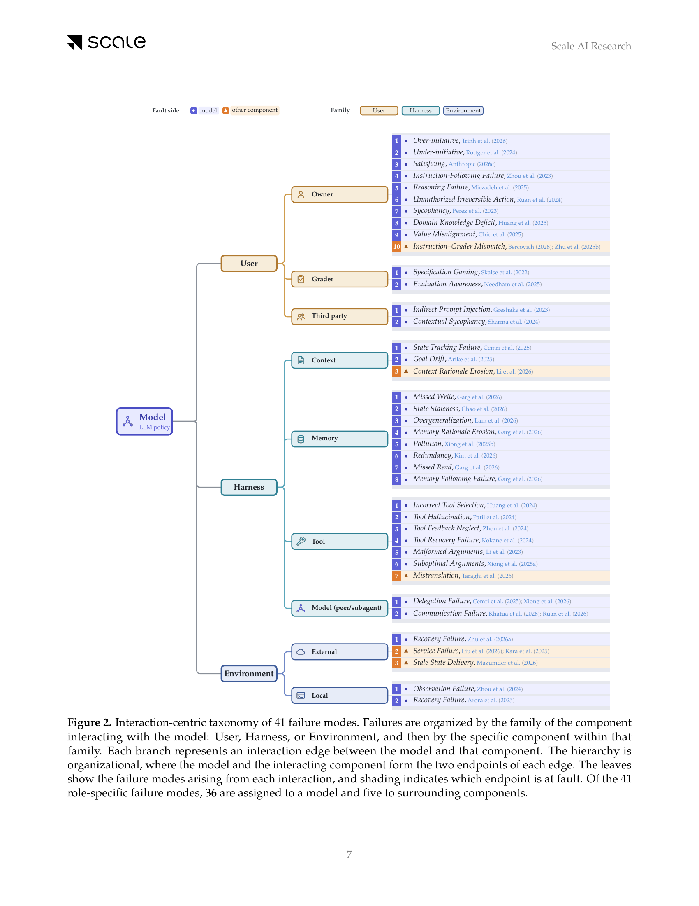

# Model or Harness? An Interaction-Centric Taxonomy for Localizing Agent Failures

**Paper:** [Model or Harness? An Interaction-Centric Taxonomy for Localizing Agent Failures (Raj et al., 2026)](https://arxiv.org/abs/2607.28802)

## Human Readable TL;DR

When an AI agent messes up, blaming "the AI" is often the wrong diagnosis -- the exact same visible mistake can be caused by the model itself, the scaffolding wired around it (the "harness"), a broken tool, a badly worded instruction, or a flaky outside service. This paper builds a map of 41 specific ways agent systems break, and for each one it pins down exactly who is at fault -- the model, the person who gave the task, a memory store, a tool, or the environment -- so a team knows whether to retrain the model, fix the surrounding code, or go fix a broken service instead. They also tested whether other AI systems, used as independent judges, could look at the same evidence as a human expert and reach the same verdict, and found they mostly agree -- except for one recurring blind spot: the AI judges tend to blame the model even when a broken tool or a buggy test environment is the real culprit.

## TL;DR

The paper introduces an interaction-centric taxonomy that represents every agent failure as an edge between the model and one of eight system components (Owner, Grader, Third party, Context, Memory, Tool, Local env., External env.), plus a fault-side label derived by tracing backward to the earliest unrecoverable failure. This yields 41 failure modes (36 model-side, 5 non-model), grounded in 40 worked examples pulled from benchmarks, system cards, and logged trajectories. The taxonomy is validated with an agent-as-a-judge protocol: four frontier-model judges (GPT-5.5, Claude Opus 4.6/4.7/4.8) independently reconstruct evidence and re-derive labels, reaching up to Cohen's kappa = 0.76 against human category labels and 0.84 pairwise, with a documented systematic bias toward over-blaming the model, illustrated by a Harbor-Mix case study where a harness bug gets mislabeled as a model observation failure.

---

## Problem & Motivation

As LLM agents move into longer-running, more autonomous settings -- repeatedly touching users, tools, persistent memory, and external environments -- their failure surface has outgrown outcome-level failure labels. The paper frames this as a **"repair-assignment problem"**: the same visible failure can call for model post-training, harness engineering, environment redesign, or benchmark repair, and an outcome-level label alone cannot tell you which.

The canonical illustration: in a long-running Claude Code session, an agent ignores an earlier user instruction. This could happen because (1) the harness's context compaction removed the instruction (a harness-level fix), or (2) the instruction was still available but the model failed to follow it (a model-level fix). The observed behavior is identical, but the required repair is not.

Prior taxonomies fall short of solving this because they are scoped to one part of the interaction surface: benchmark-specific taxonomies, multi-agent coordination taxonomies, flat failure-mode lists, and module-based taxonomies (Zhu et al., 2025a, which classifies by internal agent module -- memory, reflection, planning, action). None of these jointly names the **interaction edge** where a failure occurred and the **fault side** (which endpoint is responsible), which is precisely the missing piece needed to route a failure to the right fix.

---

## Main Original Ideas

1. **Mechanism axis (interaction edges).** Every failure is written as `COMPONENT 1 — COMPONENT 2 · fault: SIDE`. The model sits at the hub of a radial map; the User, Harness, and Environment families (Owner/Grader/Third party; Context/Memory/Tool/Model-peer-or-subagent; External/Local) form an inner ring, and each failure is an edge from the model out to one specific component on the outer ring.
2. **Fault-side attribution rule.** Fault is assigned by tracing the causal chain backward from the observed system-level failure to the **earliest failure from which execution does not recover** -- later errors are treated as downstream consequences, not independently labelable events. This "critical failure" rule (following Barke et al., 2026) is what turns the taxonomy into a root-cause scheme rather than a symptom list, and it is applied consistently whether the fault ultimately lands on the model or elsewhere.
3. **The 41-mode taxonomy.** Built empirically and iteratively from public benchmarks, system cards, published reports, and logged trajectories, then frozen. It spans 10 interaction edges (Owner, Grader, Third party, Context, Memory, Tool, Model-peer, Model-subagent, Local env., External env.) and assigns 36 of the 41 failure modes to the model and 5 to non-model components -- a skew the authors attribute partly to a deliberately model-centric attribution rule (a failure counts as model-side whenever a more capable model could plausibly have avoided or recovered from it), not to a claim that models cause most real-world failures.
4. **Agent-as-a-judge validation protocol.** Rather than handing a candidate label to a static LLM-as-judge, four frontier models are run as full agents with read-only WebSearch/WebFetch/Bash/Read/Grep/Glob access and a hook that blocks them from ever seeing the human label. Each judge runs a fixed three-turn protocol -- evidence reconstruction, classification, then reflection against a disambiguation checklist -- to independently reconstruct evidence and re-derive both the interaction edge and the failure mode.
5. **OWASP/MAST impact overlay.** Failures with clear safety or security relevance get a second, separate annotation (mostly OWASP LLM Top 10 / Agentic Security Initiative categories, plus MAST and XSTest tags in the worked-examples catalog) layered on top of the edge/fault-side label -- treating "is this harmful" as a distinct, only loosely correlated question from "where did this originate."

---

## Key Findings

**Judge agreement with human labels (40 worked examples):**

| Judge | Category Acc | Category kappa (vs. human) | Failure-mode Acc |
|---|---|---|---|
| **GPT-5.5** | **0.80** | **0.76** | **0.72** |
| Claude Opus-4.6 | 0.75 | 0.71 | 0.70 |
| Claude Opus-4.7 | 0.75 | 0.71 | 0.62 |
| Claude Opus-4.8 | 0.75 | 0.70 | 0.68 |

Highest pairwise judge-judge category kappa: **0.84** (Opus-4.6 vs. Opus-4.8) -- comparable to judge-human agreement, suggesting judges converge on shared evidence-driven structure rather than on annotator-specific habits.

**Selective voting: precision/coverage tradeoff (category label):**

| Agreement threshold | Coverage | Category Precision | Failure-mode Precision |
|---|---|---|---|
| >=2 of 4 judges | 1.00 | 0.78 | 0.70 |
| >=3 of 4 judges | 0.90 | 0.83 | 0.75 |
| 4 of 4 (unanimity) | 0.68 | **0.96** | **0.89** |

- **Model-side skew is a rule artifact, not a clean measurement.** Because the attribution rule credits the model whenever a more capable model could have recovered, ambiguous or jointly-caused failures get pulled toward the model side by construction; the 5 (of 41) non-model modes that survive this conservative filter are precisely the cases where "just use a better model" would not have helped.
- **Harbor-Mix case study (the paper's clearest judge failure).** An agent completes phase 1 of a task perfectly, matching 8 of 12 oracle actions, then waits on a scripted reply email that never arrives because of a bug in the evaluation harness. Judge Claude Opus-4.7 blames the model (`LOCAL ENVIRONMENT — MODEL · Observation Failure`) for "not looking hard enough," while the correct human label is `EXTERNAL ENVIRONMENT — MODEL · Stale State Delivery` -- the paper's canonical demonstration that agent-judges default to blaming the model and need explicit disambiguation support to attribute harness/environment-side defects correctly.
- **Worked-examples catalog pattern.** Of the 40 catalog examples, 32 are model-attributed and 8 are not (OWNER, CONTEXT x2, TOOL, SUBAGENT, ENVIRONMENT x3) even though every example sits on a model-adjacent edge; identical-looking symptoms split fault differently depending on mechanism (e.g., all four Context-Model examples share the label "Context Following Failure," but two are ruled CONTEXT-at-fault because compaction dropped a rationale, and two are ruled MODEL-at-fault because the needed information was present but unused).
- **Failure-mode accuracy tracks category accuracy.** Handing a judge the gold category (rather than letting it predict one) raises Opus models' failure-mode accuracy substantially (e.g., Opus-4.6: 0.70 to 0.80), showing a meaningful share of error originates at category selection, not confusion within a correct category. GPT-5.5 barely moves, suggesting its errors are less category-driven.

---

## Suggestions & Future Directions

1. **Treat the taxonomy as descriptive, not a base-rate estimate.** It organizes and attributes failures but makes no claim about the true frequency of each failure mode across models or deployments; any proportions reported (e.g., the 36-vs-5 model/non-model split) describe the reviewed corpus, not the general population of agent failures, and the taxonomy is expected to need expansion as agent architectures and harness designs evolve.
2. **Evidence-dependency limits real-world applicability.** Correctly assigning a unique root cause requires enough trace detail (tool arguments, intermediate reasoning, environment state) to disambiguate competing explanations; terse incident reports or system-card summaries can leave a case genuinely ambiguous between two edges (e.g., context-compaction vs. unauthorized model action), capping how confidently the taxonomy can be applied to secondhand reports.
3. **Judge deployment faces a precision-coverage tradeoff with no free win.** Judge accuracy is limited, especially on fine-grained failure-mode labels; ensembling raises precision but the paper's own numbers show it does so by abstaining on the hardest, most ambiguous cases -- exactly the cases where automated fault attribution would be most valuable if it worked reliably.
4. **Explicit disambiguation support is necessary, not optional, for judges.** Because judges systematically default to blaming the model, deploying agent-as-a-judge systems for this task requires the kind of fixed disambiguation checklist used in the paper's Turn-3 reflection step, plus continued attention to whether a given residual error reflects thin source evidence or a genuine root-cause misidentification.

---

## Authors & Institutions

Harsh Raj, Vipul Gupta, Anas Mahmoud, Razvan-Gabriel Dumitru, Darvin Yi, Aakash Sabharwal, Yunzhong He -- Scale AI Research.

## Figures

