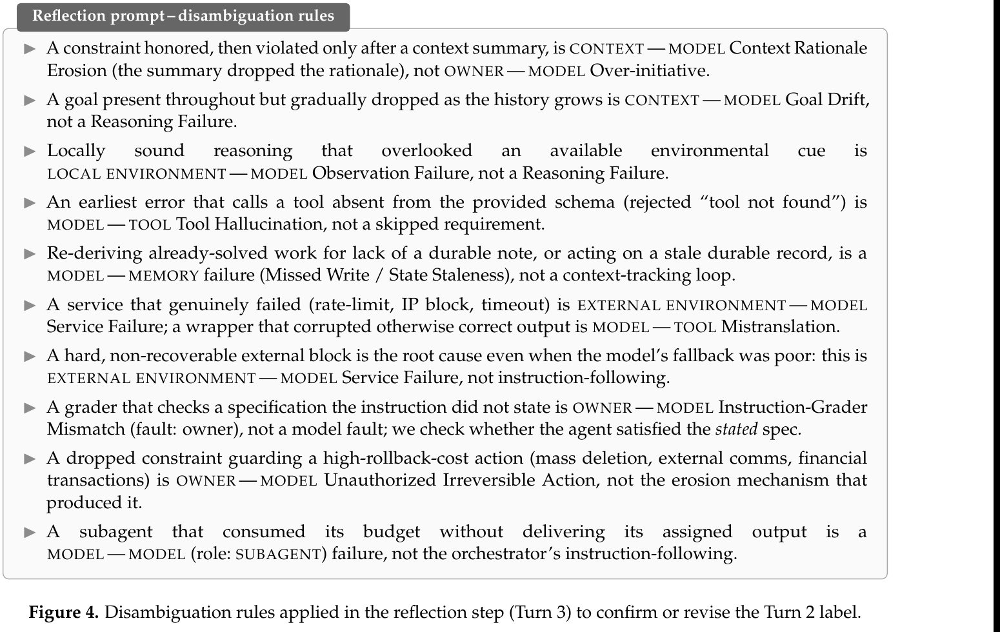
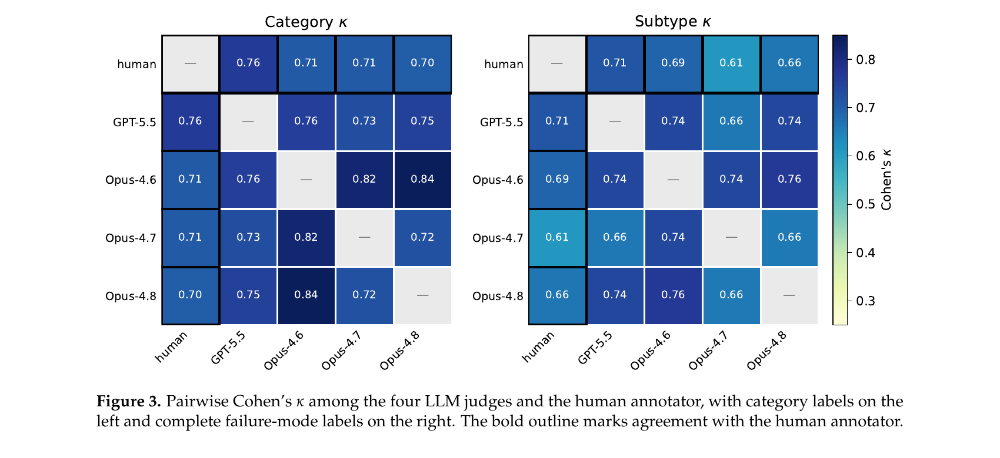
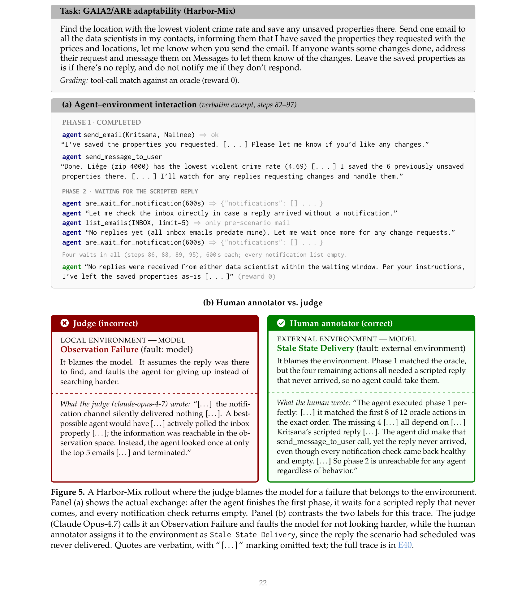

> [[../index|Wiki]] | [[../summary|Summary]] | [[../digest|Digest]]

# Validating the Taxonomy with an Agent-as-a-Judge

**In one sentence:** Four frontier LLM judges (GPT-5.5, Claude Opus 4.6/4.7/4.8), run through a three-turn agent-as-a-judge protocol with read-only tool access to the original failure sources, recover human-assigned taxonomy labels with substantial but imperfect agreement (category κ up to 0.76, exact-match accuracy up to 80%), and selective voting can trade coverage for precision (up to 0.96 precision at 68% coverage under unanimity) — but the judges' residual errors cluster in one systematic direction: blaming the model when the true fault lies in the harness, as the Harbor-Mix case study demonstrates.

## Key points

- The taxonomy is validated by testing whether four independent LLM judges (GPT-5.5, Claude-Opus-4.6, Claude-Opus-4.7, Claude-Opus-4.8) can recover the human-assigned labels for the 40 worked examples, given only the taxonomy definitions and a reference to the original failure source (not the human label itself).
- Each judgment runs a fixed **3-turn protocol** in one session: Turn 1 (evidence reconstruction) builds a neutral chronological dossier; Turn 2 (failure classification) assigns interaction edge, fault side, and failure mode; Turn 3 (reflection/disambiguation) checks the Turn 2 label against a fixed set of disambiguation rules (Figure 4) and confirms or revises it — Turn 3's output is the scored answer.
- On category labels (interaction edge + fault side), GPT-5.5 is the strongest judge: accuracy 0.80, F1 0.69, κ = 0.76 with the human annotator; Claude Opus 4.6 and 4.7 each reach κ = 0.71 (accuracy 0.75), and Opus 4.8 reaches κ = 0.70 (accuracy 0.75).
- On the complete failure-mode label (category + named failure mode), accuracy drops for all judges: GPT-5.5 0.72 (F1 0.64), Opus 4.6 0.70 (F1 0.57), Opus 4.7 0.62 (F1 0.53), Opus 4.8 0.68 (F1 0.58) — agreement among judges themselves is comparable to judge-human agreement, with the highest pairwise judge-judge κ = 0.84 (Opus 4.6 vs. Opus 4.8).
- Giving a judge the gold category label (Table 3, "Gold cat." column) raises failure-mode accuracy for the Opus models (e.g., Opus 4.6 rises from 0.70 predicted-category to 0.80 gold-category accuracy), showing that a chunk of failure-mode error originates at the category-selection stage rather than from confusion among modes within the correct category.
- Selective voting (requiring agreement among k of the 4 judges before assigning a label, abstaining otherwise) trades coverage for precision: ≥2-of-4 agreement gives 100% coverage at 0.78 category precision; ≥3-of-4 gives 90% coverage at 0.83 category precision; unanimity (4-of-4) gives 68% coverage but raises category precision to 0.96 (failure-mode precision 0.89 at the same threshold).
- The dominant, systematic source of judge error is a directional bias toward blaming the model: in the Harbor-Mix case study (Appendix A.2, Figure 5), the agent completes phase 1 of a task correctly and matches 8 of 12 oracle actions, but the remaining 4 actions depend on a scripted reply email that never arrives because of a bug in the evaluation harness; the judge (Claude Opus-4.7) still labels this an Observation Failure and faults the model for "not looking hard enough," while the human annotator correctly attributes it to EXTERNAL ENVIRONMENT — MODEL · Stale State Delivery.
- A second, more benign source of disagreement is that source material is often too thin to uniquely identify a root cause (e.g., a public incident report describing 200+ deleted emails, discussed in E4, is ambiguous between a context-side compaction failure and a model-side unauthorized action from the source text alone).

---

## Judge Setup and Task

Each judge is given the taxonomy definitions (Appendix B) and a reference to the original failure source for a worked example — never the human-assigned label. Sources are heterogeneous: a GitHub issue, blog post, model system-card section, arXiv paper, or a logged agent trajectory hosted on platforms such as Hugging Face or Docent (Transluce, 2025). The judge must independently:

1. review the source and identify the earliest failure from which execution does not recover;
2. predict the **interaction category** — `COMP 1 — COMP 2 · fault: FAULT`; and
3. predict the **complete failure-mode label** — `COMP 1 — COMP 2 · fault: FAULT · Failure Mode`.

Four frontier models serve as separate judges, each run independently: **GPT-5.5** and **Claude Opus 4.6, 4.7, and 4.8**.

### Agent configuration (Appendix A.1)

The judge is built as an agent on the Claude Agent SDK (Anthropic, 2026a), with one underlying model per run:

- GPT-5.5 uses **xhigh reasoning effort**.
- Claude-Opus-4.6, 4.7, and 4.8 use **adaptive thinking with effort set to max**.
- The agent has **read-only** access to WebSearch, WebFetch, Bash, Read, Grep, and Glob.
- A **pre-tool hook blocks access to the worked examples and their annotations**, so each judge can only read the original source material and cannot see or retrieve the human-assigned label — this is the mechanism that prevents label leakage.

This departs from conventional LLM-as-a-judge setups, which place candidate outputs directly in the evaluator's context (Zheng et al., 2023). Instead, the paper follows the **agent-as-a-judge** paradigm of Zhuge et al. (2024), where the judge is itself an agent that must go retrieve and reconstruct the evidence rather than having it handed over pre-digested.

## The Three-Turn Protocol

All three turns share a single session:

- **Turn 1 — Evidence reconstruction (extraction).** Given only a reference to the original failure source, the judge retrieves the relevant evidence and organizes it into a neutral, chronological dossier of what the agent actually did — without yet applying any taxonomy category.
- **Turn 2 — Failure classification.** Using the Turn 1 dossier and the frozen taxonomy definitions (Appendix B), the judge identifies the earliest failure from which execution does not recover and assigns the interaction edge, fault side, and failure mode. The judge is given a short standing instruction: assign fault to the component whose **own behavior failed**, not to whoever merely could have prevented the failure (this is the "fault vs. blame" distinction that runs through the whole taxonomy).
- **Turn 3 — Reflection and disambiguation (scored answer).** The judge audits its Turn 2 label against a short, fixed list of disambiguation rules (Figure 4) and either confirms or revises it. This final, reflected label is the one used for every metric in Table 2, Table 3, and Figure 3.

### Figure 4 — Disambiguation rules used in Turn 3

The reflection prompt gives the judge a short checklist of hard cases, each phrased as a "this, not that" rule:

- A constraint honored, then violated only *after* a context summary, is **CONTEXT — MODEL Context Rationale Erosion** (the summary dropped the rationale), not **OWNER — MODEL Over-initiative**.
- A goal present throughout but gradually dropped as the history grows is **CONTEXT — MODEL Goal Drift**, not a Reasoning Failure.
- Locally sound reasoning that overlooked an available environmental cue is **LOCAL ENVIRONMENT — MODEL Observation Failure**, not a Reasoning Failure.
- An earliest error that calls a tool absent from the provided schema (rejected "tool not found") is **MODEL — TOOL Tool Hallucination**, not a skipped requirement.
- Re-deriving already-solved work for lack of a durable note, or acting on a stale durable record, is a **MODEL — MEMORY** failure (Missed Write / State Staleness), not a context-tracking loop.
- A service that genuinely failed (rate-limit, IP block, timeout) is **EXTERNAL ENVIRONMENT — MODEL Service Failure**; a wrapper that corrupted otherwise-correct output is **MODEL — TOOL Mistranslation**.
- A hard, non-recoverable external block is the root cause even when the model's fallback was poor: this is **EXTERNAL ENVIRONMENT — MODEL Service Failure**, not instruction-following.
- A grader that checks a specification the instruction did not state is **OWNER — MODEL Instruction-Grader Mismatch** (fault: owner), not a model fault — the standard is whether the agent satisfied the *stated* spec.
- A dropped constraint guarding a high-rollback-cost action (mass deletion, external comms, financial transactions) is **OWNER — MODEL Unauthorized Irreversible Action**, not the erosion mechanism that produced it.
- A subagent that consumed its budget without delivering its assigned output is a **MODEL — MODEL (role: SUBAGENT)** failure, not the orchestrator's instruction-following.

These rules exist because several failure modes can produce visually similar symptoms, and the taxonomy's core methodological commitment — fault attaches to whichever component's own behavior broke, not to whoever could have prevented the break — is easy to violate under time pressure or incomplete evidence.

## Agreement Results

### Table 2 — Category and failure-mode agreement with human labels (40 worked examples)

| Model | Category Acc | Category F1 | Failure-mode Acc | Failure-mode F1 |
|---|---|---|---|---|
| GPT-5.5 | 0.80 | 0.69 | 0.72 | 0.64 |
| Claude-Opus-4.6 | 0.75 | 0.61 | 0.70 | 0.57 |
| Claude-Opus-4.7 | 0.75 | 0.63 | 0.62 | 0.53 |
| Claude-Opus-4.8 | 0.75 | 0.62 | 0.68 | 0.58 |

Category scores require the correct interaction edge and fault side; failure-mode scores additionally require the correct named failure mode. Acc is exact-match accuracy; F1 is macro-averaged.

### Table 3 — Failure-mode agreement, predicted vs. gold category

| Model | Predicted cat. Acc | Predicted cat. F1 | Gold cat. Acc | Gold cat. F1 |
|---|---|---|---|---|
| GPT-5.5 | 0.72 | 0.64 | 0.72 | 0.62 |
| Claude-Opus-4.6 | 0.70 | 0.57 | 0.80 | 0.70 |
| Claude-Opus-4.7 | 0.62 | 0.53 | 0.70 | 0.58 |
| Claude-Opus-4.8 | 0.68 | 0.58 | 0.78 | 0.69 |

Under "Predicted cat.," the judge predicts both category and failure mode itself; under "Gold cat.," it selects the failure mode after being handed the human-assigned category. The Opus models show a clear jump when given the gold category (e.g., Opus 4.6: 0.70 → 0.80 accuracy; Opus 4.8: 0.68 → 0.78), indicating a meaningful share of failure-mode errors trace back to a wrong category choice rather than confusion among failure modes within the right category. GPT-5.5 barely moves (0.72 → 0.72 accuracy, F1 actually dips slightly from 0.64 to 0.62), suggesting its failure-mode errors are less category-driven.

### Figure 3 — Pairwise Cohen's κ heatmaps

Two heatmaps, category κ (left) and complete failure-mode/"subtype" κ (right), computed pairwise across {human, GPT-5.5, Opus-4.6, Opus-4.7, Opus-4.8}. Category κ values:

| | human | GPT-5.5 | Opus-4.6 | Opus-4.7 | Opus-4.8 |
|---|---|---|---|---|---|
| **human** | — | 0.76 | 0.71 | 0.71 | 0.70 |
| **GPT-5.5** | 0.76 | — | 0.76 | 0.73 | 0.75 |
| **Opus-4.6** | 0.71 | 0.76 | — | 0.82 | 0.84 |
| **Opus-4.7** | 0.71 | 0.73 | 0.82 | — | 0.72 |
| **Opus-4.8** | 0.70 | 0.75 | 0.84 | 0.72 | — |

Failure-mode ("subtype") κ values:

| | human | GPT-5.5 | Opus-4.6 | Opus-4.7 | Opus-4.8 |
|---|---|---|---|---|---|
| **human** | — | 0.71 | 0.69 | 0.61 | 0.66 |
| **GPT-5.5** | 0.71 | — | 0.74 | 0.66 | 0.74 |
| **Opus-4.6** | 0.69 | 0.74 | — | 0.74 | 0.76 |
| **Opus-4.7** | 0.61 | 0.66 | 0.74 | — | 0.66 |
| **Opus-4.8** | 0.66 | 0.74 | 0.76 | 0.66 | — |

GPT-5.5 has the highest human-agreement κ for category labels (0.76); Opus 4.6 and 4.7 each reach 0.71, and Opus 4.8 reaches 0.70. Agreement among the judges themselves is comparable to judge-human agreement (highest pairwise judge-judge value: κ = 0.84, Opus-4.6 vs. Opus-4.8). Agreement is uniformly lower on the complete failure-mode label than on category, for every pair in the matrix.

### Sources of disagreement

Two structural reasons account for most of the residual disagreement:

1. **Heterogeneous, sometimes underspecified source material.** Judges see only a reference to the original source — a full execution trace, GitHub issue, blog post, arXiv paper, or system-card section — and some sources simply don't contain enough evidence to pin down a unique root cause. Example: in E4, a public incident report attributes an agent's deletion of 200+ emails to context compaction dropping the owner's "don't act" instruction, but doesn't include the full trajectory, so the case is genuinely ambiguous between a context-side failure and a model-side unauthorized action from the source text alone.
2. **Root-cause attribution is hard even with full evidence.** This is the deeper problem, illustrated by the Harbor-Mix case study below: even given a complete trace, the judge can misidentify the earliest failure and its owning component. The paper connects this to OpenRCA 2.0 (Fang et al., 2026), a root-cause-analysis benchmark that independently finds frontier models often fail to reconstruct a verified causal propagation path from the initiating fault to the observed symptom — a pattern the OpenRCA authors call **ungrounded diagnosis**.

Failure-mode prediction is harder still because the label space is larger, several failure modes produce similar surface symptoms, and correct failure-mode prediction is conditioned on first getting the category right (per the Table 3 gold-category analysis above).

## Selective Voting (Table 4)

Rather than force a label onto every example, the ensemble uses **selective voting**: a category is assigned only when at least *k* of the 4 judges agree, and the system abstains otherwise (Verga et al., 2024). When a category is retained, the failure mode is chosen by majority vote among only the judges that supported that category.

| Agreement threshold | Coverage | Category P | Category R | Category F1 | Failure-mode P | Failure-mode R | Failure-mode F1 |
|---|---|---|---|---|---|---|---|
| ≥2 of 4 | 1.00 | 0.78 | 0.78 | 0.78 | 0.70 | 0.70 | 0.70 |
| ≥3 of 4 | 0.90 | 0.83 | 0.75 | 0.79 | 0.75 | 0.68 | 0.71 |
| 4 of 4 (unanimity) | 0.68 | 0.96 | 0.65 | 0.78 | 0.89 | 0.60 | 0.72 |

Coverage is the fraction of all 40 examples that receive a label at that threshold; precision is computed only over labeled examples, while recall is computed over the full 40-example set. Raising the agreement bar trades coverage for precision: at ≥3-of-4 agreement, category precision reaches 0.83 at 90% coverage; requiring unanimity (4-of-4) pushes category precision to 0.96 but coverage falls to 68%. The same pattern holds for failure-mode precision (0.70 → 0.75 → 0.89) as the threshold tightens.

## Case Study: Misattributing a Harness Defect to the Model (Appendix A.2)

The single most common failure mode of the judges themselves, per the paper, is directional: **when a task fails, the judge tends to blame the model even when the real fault lies elsewhere.** Figure 5 presents a representative case from the **Harbor-Mix** evaluation set (full trace referenced as E40).

**The task (GAIA2/ARE adaptability, Harbor-Mix):** find the location with the lowest violent crime rate and save any unsaved properties there; send one email to all data scientists in the user's contacts informing them the properties were saved, with prices and locations, and confirm when sent; if anyone requests changes, make the changes and message them on Messages to confirm; leave properties as-is and don't notify the user if there's no reply. Grading is tool-call match against an oracle (this rollout scored reward 0).

**What actually happened, per the verbatim trace excerpt (steps 82–97):**

- **Phase 1 (completed correctly):** the agent sends the email to the two data scientists (Kritsana, Nalinee) confirming the properties were saved, and separately messages the user confirming completion and that it will watch for replies. This matches the first 8 of 12 oracle actions in the exact order.
- **Phase 2 (blocked):** the agent waits for a scripted reply email that the evaluation scenario is supposed to deliver. It calls `are_wait_for_notification(600s)` — empty. It then proactively checks the inbox directly (`list_emails`) — only pre-scenario mail, no reply. It waits again — still empty. In total it waits four times (steps 86, 88, 89, 95), 600 seconds each, with every notification check returning empty. It then concludes no replies were received within the waiting window and, per instructions, leaves the properties as-is and does not notify the user. This scores reward 0 because the remaining 4 oracle actions (which depend on processing the reply) never fire.

The scripted reply **never arrives because of a bug in the evaluation harness itself** — not because of anything the agent did or failed to do.

**The two labels contrast directly:**

- **Judge (Claude Opus-4.7), incorrect:** `LOCAL ENVIRONMENT — MODEL · Observation Failure (fault: model)`. The judge's own words: "the notification channel silently delivered nothing [...]. A best-possible agent would have [...] actively polled the inbox properly [...]; the information was reachable in the observation space. Instead, the agent looked once at only the top 5 emails [...] and terminated." The judge assumes the reply was findable and blames the agent for not searching harder — even though the trace shows the agent checking the inbox directly in addition to the notification waits.
- **Human annotator, correct:** `EXTERNAL ENVIRONMENT — MODEL · Stale State Delivery (fault: external environment)`. The human's reasoning: "The agent executed phase 1 perfectly: [...] it matched the first 8 of 12 oracle actions in the exact order. The missing 4 [...] all depend on [...] Kritsana's scripted reply [...]. The agent did make that send_message_to_user call, yet the reply never arrived, even though every notification check came back healthy and empty. [...] So phase 2 is unreachable for any agent regardless of behavior."

**Why this matters for the taxonomy:** the human annotator's label treats this as a case where the taxonomy maps a pure harness/evaluation-environment bug onto the nearest available edge (`EXTERNAL ENVIRONMENT — MODEL`) rather than inventing a dedicated category for "the test harness itself is broken" — since from the agent's perspective, an external input that should have arrived simply never did. The judge, by contrast, treats the absence of the expected reply as evidence the agent didn't look hard enough, effectively assuming the environment must be blameless and searching for an in-agent explanation instead. This is exactly the systematic bias the paper flags as the dominant residual error mode across the whole validation exercise: **agent-as-a-judge systems default to blaming the model, and need explicit disambiguation support (Figure 4) and taxonomy discipline (fault = whose own behavior failed) to correctly attribute harness-side and environment-side defects.**

---

**Covers:** §6 Validating the Taxonomy with an Agent-as-a-Judge, Appendix A (arXiv:2607.28802)
