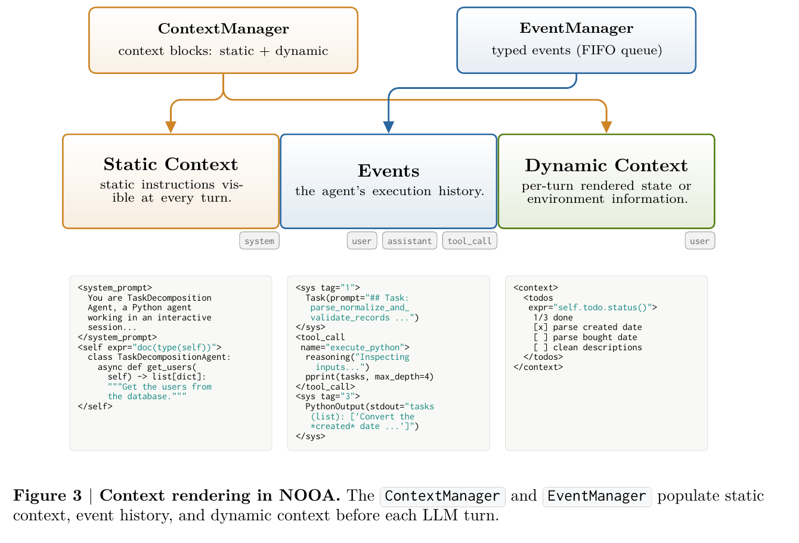

> [[../index|Wiki]] | [[../summary|Summary]] | [[../digest|Digest]]

# Agent Loop, Strategies, and Context

**In one sentence:** An agentic method's execution is governed by a strategy (single-shot Predict or iterative CodeAct) that renders a three-region context — cacheable static prefix, append-only event history, and re-evaluated dynamic suffix — on every turn, using bounded "pass by reference" previews so the model can operate on objects far larger than what actually appears in the prompt.

## Key points

- An agentic method's body is just `...`; the harness implements it as a full loop that renders live program state into context, calls the LLM, optionally executes model-written Python, updates events and state, and repeats until the model returns a type-validated value.
- Strategy is a per-method decorator controlling what context is rendered, how turns execute, and how outputs are validated, with per-method overrides (e.g., a small fast model for classification vs. the agent's default larger model); within one agent, externally initiated calls to agentic methods are serialized, nested same-agent calls follow ordinary stack discipline sharing the same event history, while other methods and other agents run concurrently under async/await.
- `PredictStrategy` is single-shot: it renders context, asks the model once, and validates the result against the return type with a local retry loop on failure — suited to bounded classification/extraction tasks. `CodeActStrategy` generalizes this into an iterative REPL where the model calls `execute_python(...)` to act and `return_result(...)` to finish, looping until the returned value is type-validated.
- Figure 2's CodeAct loop runs four steps per turn — Render Context, Call LLM, Execute Python, Update State — then feeds the updated events/state back into the next turn; a validation failure on `return_result(...)` sends an error back as the next observation instead of returning control to the caller.
- Context has three regions: a static prefix (NOOA system prompt ~1k characters, the active strategy's instructions ~2.5k characters for CodeAct, an execution-context block, and a `doc(self)` rendering) that stays constant and cacheable; an append-only event history of typed, queryable events that can be collapsed into summaries (an explicit MemGPT analogy) while the full history stays searchable; and a dynamic suffix (`pprint(self)`) re-evaluated every turn — this layout maximizes KV-cache reuse since only the growing history and the small trailing dynamic block change turn to turn.
- The renderer maps these onto LLM messages: static blocks concatenate into a cacheable system prefix, the event history becomes interleaved `user`/`assistant`/`tool_call` messages, and dynamic blocks become a trailing `user` `<context>` message that shows each block's generating expression (e.g., `expr="self.todo.status()"`); media arguments render as native multimodal content blocks rather than text.
- "Pass by reference" means a large CodeAct argument is bound as the full live Python object in the execution environment but shown in the prompt only as a bounded preview — concrete type, true length, and a head/tail sample (e.g., a 100-element list renders showing only its first and last 5 elements) — so the amount of data an agent can process is bounded by the execution environment, not by the prompt. Predict-strategy arguments instead render in full up to a size cap, since a single-shot call gives the model no follow-up turn in which to inspect a variable via code.
- NOOA borrowed the name and API surface of Rich's `pprint()` (no standard library exists for truncating arbitrary values) but changed its output format based on experimentation across open and closed models; finding still-better, more LLM-obvious formats and extending preview support to more types remains open work.

---

An agentic method in NOOA — one whose body is just `...` — is not a single LLM call bolted onto a Python function. It is a full loop: the harness renders the live state of the program into model context, calls the LLM, optionally executes Python code the model wrote, updates events and state, and repeats until the model returns a type-validated value. This page follows that loop (Section 3.1) and then digs into how context is built and kept cheap to re-render on every turn (Section 3.2), including the "pass by reference" trick that lets an agent operate on data far larger than its context window.

## Agents and Strategies

A NOOA agent class can freely mix ordinary Python methods with **agentic methods** — methods whose body contains the ellipsis literal `...`. Control flow is ordinary Python until execution reaches an agentic method; at that point the harness takes over and implements the method as an agent loop. The method's docstring and arguments become the prompt for the task at hand, the type signature defines the input/output contract, and the model may call other methods and read/write state on `self` before returning a result.

Agentic execution is controlled by a **strategy**, declared as a decorator on the method. A strategy preserves the method's ordinary Python signature and typed boundary but controls what context is rendered, how turns are executed, and how candidate outputs are validated. Strategies are per-method and are explicitly an extension point — new strategies can be added over time. The decorator also accepts per-method overrides (model, truncation, scoped context), so, for example, a small fast model can back a classification method while the agent's default (larger) model handles open-ended ones.

Concurrency has clear rules: within a single agent, externally initiated calls to agentic methods are **serialized**, so independent invocations never interleave their turns. Nested same-agent calls follow ordinary stack discipline — the caller is suspended until the callee returns, and both executions append to the *same* event history. Other methods, and other agents entirely, run in parallel under Python's standard `async`/`await` concurrency model.

NOOA ships two built-in strategies:

1. **`PredictStrategy`** — a single-shot strategy for classification or extraction. It renders the context, asks the model for a value once, then validates the output against the Python return type, running a local retry loop if validation fails.
2. **`CodeActStrategy`** — generalizes the same contract into an iterative Python read-eval-print loop (REPL). The model may call `execute_python(...)` to compute, inspect internal agent state, call helpers, or invoke other generation methods; the harness records the observation, re-renders the updated state, and repeats until the model calls `return_result(...)` with a value that is then type-validated.

The same agent can mix both strategies method by method — choosing whichever execution mode fits the task. In the paper's running support-agent example, `classify_ticket` uses Predict while `triage` uses the default CodeAct.

### The CodeAct loop mechanics


Figure 2 lays out the loop precisely. When a caller invokes a CodeAct method, each turn proceeds as:

1. **Render Context** (Sec. 3.2) — the harness renders the live Python execution state (static blocks, event history, dynamic blocks) into model context.
2. **Call LLM** (Sec. 3.3) — the rendered context is sent to the model as a request.
3. **Execute Python** (Sec. 3.4) — if the model chooses a code action, the harness executes the corresponding Python in the method's REPL session.
4. **Update State** (Sec. 3.5) — the harness updates events and state with the code's output, errors, return values, and locals.

The loop then repeats: "Next Turn: updated events & state" feeds back into **Render Context**, so each subsequent turn sees the accumulated history. When the model instead submits a result via `return_result(...)`, the harness validates it against the method's declared return type (Sec. 3.6). A validation failure sends an error message back to the model as the next observation (looping again); success returns control — and the validated value — to the caller.

### Predict vs CodeAct strategies

The two built-in strategies trade iteration for simplicity in opposite directions:

- **Predict** is one LLM call in, one validated value out — appropriate for bounded tasks like classification or extraction where the model doesn't need to inspect intermediate state or take multiple actions. Its only "loop" is a local retry on validation failure, not a multi-turn conversation.
- **CodeAct** is the general-purpose loop of Figure 2: it lets the model write and execute arbitrary Python across multiple turns — inspecting `self`, calling helper methods, invoking other agentic methods — before committing to a final `return_result(...)`.

Because arguments are rendered differently for the two strategies (see **Pass by Reference** below — Predict has no opportunity for the model to inspect a variable across turns, so it renders values in full up to a size cap, whereas CodeAct renders only bounded previews since the model can always inspect more via code), the choice of strategy is also a choice about how much of an argument's value the model actually sees up front.

## Context: static prefix, event history, dynamic suffix

The first step of every CodeAct turn is rendering the live Python execution state into model context. NOOA splits context into three regions:

- **Static context blocks** — computed once and reused across turns.
- **Event history** — the accumulated execution trace.
- **Dynamic context blocks** — re-evaluated before every model call.

**Static and dynamic blocks** are developer-controlled, named, structured pieces of text rendered into the context window. Static blocks hold information that stays stable across the whole call — the system prompt is the canonical example. Dynamic blocks hold information that changes as the program runs — a TODO list, or a selected set of relevant fields on `self`.

**Event history** is an append-only sequence of typed events the harness produces as execution proceeds: model tool calls, Python outputs, and return values. Each event is a typed Python object with a unique tag, so agent code can query prior events directly rather than scanning a flat transcript. Long histories can be collapsed into summary events — the paper draws an explicit analogy to MemGPT's context management — and strategies can restrict which events are visible to a nested call; the full (uncollapsed) event history remains searchable even after summarization. Together, blocks and events form the complete model context of an agentic method. Critically, context management is not an external prompt-building script bolted onto the framework — it is part of the same object-oriented API the agent itself uses, so both developer and agent manipulate context through ordinary Pythonic calls (`self.context[...]`, `self.context.set_dynamic(...)`, `self.events.query(...)`, `self.events.collapse(...)`).

NOOA ships sensible defaults so simple agents work out of the box, while still letting developers override any context block at any time. The default **static prefix** contains, in order:

- a small NOOA system prompt (**about 1k characters**),
- the active strategy's instructions (**about 2.5k characters** for CodeAct),
- an execution-context block showing imported types and libraries, and
- a concise `doc(self)` rendering of the agent's own API.

The default **dynamic suffix** contains compact views of live agent state via `pprint(self)`. The `doc()` helper provides documentation for types, while `pprint()` formats values and instances. Unless scoped by a strategy or method, the event-history block renders all visible execution events accumulated so far.



As Figure 3 shows, these three sources are maintained by two programmable objects:

- **`ContextManager`** — stores the static and dynamic context blocks.
- **`EventManager`** — stores the event history as an ordered log of typed events (a FIFO queue in the diagram).

A renderer then maps these sources into LLM API messages (e.g., OpenAI chat messages). Concretely:

- Static framework blocks — such as `<system_prompt>` and `<self>` (the agent's own `doc()` rendering) — are concatenated into a **cacheable system prefix** that is visible at every turn.
- The event history becomes the interleaved `user`, `assistant`, and `tool_call` messages that record execution: system-generated task messages, the agent's `tool_call`s, and Python output (e.g., a `<sys tag="N">PythonOutput(stdout=...)</sys>` event).
- Dynamic blocks are re-rendered every turn into a trailing `user` `<context>` message. Each dynamic block shows its generating expression to the model (e.g., `expr="self.todo.status()"`), reinforcing that this is live, re-evaluated state rather than a static note.

By default, context blocks and events are wrapped in XML-like tags, and events are rendered as typed Python `repr`s (visible at the bottom of Figure 3). Media arguments — images, audio, video, and files — are rendered as native multimodal content blocks rather than text, which is how the `triage` method in the paper's introductory example receives its photo. The renderer itself is an extension point: developers retain full control over what goes into context and how it's rendered.

**Why this maximizes KV-cache reuse:** this three-region layout — static prefix, append-only event history, dynamic suffix — is deliberately designed so that most of the previous turn's computation can be reused. The static prefix never changes across turns. The event history only grows by appending new messages (never rewriting earlier ones). Volatile, per-turn dynamic blocks are pushed to the very tail of the prompt. Consequently, updates to live state never invalidate the cached prefix, and each turn can reuse the KV cache from most of the previous turn's context rather than recomputing it from scratch.

## Pass by Reference: bounded previews over live objects

Rendering context does not mean serializing the whole program state into the prompt. A CodeAct method receives its arguments as **live Python objects**, and for large arguments the model never sees the full value. In the spirit of progressive disclosure, the model instead sees each argument's variable name paired with a bounded preview: the concrete type, the true length, and a short head/tail sample. The model reads that shape, understands the name refers to a real object, and operates on it directly in generated code — this is "pass by reference" rather than "pass by value" into the prompt.

For example, a method called with a list of one hundred integers renders in the prompt as a single compact preview:

```
records = list(len=100, [:5]=[42, 17, 89, 33, 8], [-5:]=[56, 71, 12, 45, 28])
```

The preview states the concrete type (`list`), the true length (`len=100`), and a head/tail sample; the elided middle is implied. Crucially, the variable `records` itself is **not** truncated — it is the full hundred-element list bound as a local in the execution environment — so model-generated code can index, slice, or iterate over all of it (e.g., `for r in records: ...`) even though only ten elements ever actually appear in the context window.

This is precisely what lets the object model scale past the context window: **the amount of data an agent can process is bounded by the execution environment, not by the prompt.** A method can accept a multi-million-row table or a multi-megabyte string, and the agent works on the whole thing by writing code, while the prompt carries only a fixed-size preview regardless of the underlying object's actual size.

Python has no standard library for truncating arbitrary values. The closest analogue is Rich's `pprint()`, so NOOA borrowed its name and API surface (both already familiar to models from their training data) but changed the output format based on experimentation across open and closed models. The paper notes that finding even better formats — ones that are immediately obvious to LLMs — and extending preview support to more types remains open work.

This preview mechanism is specific to CodeAct. Methods using the **Predict** strategy render argument values in full, guarded only by a size cap: since a Predict call is a single LLM call with no follow-up turn, the model never gets the opportunity to inspect a variable via code, so there is no point showing it a bounded preview instead of the real value.

---

**Covers:** Section 3.1 (Agents and Strategies), Section 3.2 (Context)
