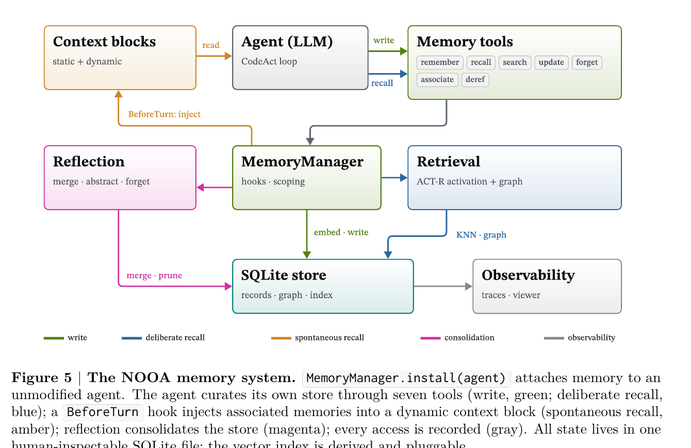

> [[../index|Wiki]] | [[../summary|Summary]] | [[../digest|Digest]]

# Execution, Validation, and Memory

**In one sentence:** A turn ends either with a typed value the model returns directly or with Python it executes against the live agent object in a restricted, repairable sandbox — every return validated against the method's type contract before control resumes to the caller — and an optional long-term memory subsystem lets the agent persist and curate its own state across calls, worth +11.8 RHAE points over file-based notes in the ARC-AGI-3 ablation.

## Key points

- Control passes from harness to model with a strategy-specific contract: under `PredictStrategy` the model must produce a value matching the return annotation directly, while under `CodeActStrategy` it must choose between continuing computation with `execute_python(...)` or terminating the method with `return_result(...)`.
- CodeAct Python cells execute in a restricted, Jupyter-like session against the *live* agent object — with the method's arguments, `self`, the agent's source-file environment, and direct `await` injected as locals — so the model can bind huge typed results to variables and process them programmatically while only the bounded previews it chooses to print enter the context window; this is the second half of pass-by-reference (the first half being the typed rendering in Sec. 3.2).
- The sandbox rejects dangerous or loop-breaking calls (`eval`, `exec`, `compile`, `input`, blocking event-loop calls) with specific errors and renders syntax errors and tracebacks in IPython format with source locations and caret/source-line context, so the next LLM turn can repair the cell the way a human repairs a notebook; cells can also define new `@strategy`-decorated functions and fan them out with `asyncio.gather` for parallel subagent calls.
- Typed events (tool calls, Python outputs, final return values) are appended to the event manager after every model response or execution; REPL locals are method-scoped and disappear when the method returns, while anything reached through `self` or library calls can have side effects that outlive the method, exactly as in an ordinary Python program.
- The harness validates the model's returned result against the return annotation — sending an error message describing the failure and continuing the loop if invalid, or returning the result to the caller if valid — which is what makes the strategy decorator's type contract binding rather than advisory.
- `MemoryManager.install(agent)` attaches an optional, fully reversible long-term memory subsystem giving the model seven tools (`remember`, `recall`, `search`, `update_memory`, `forget`, `associate`, `deref`) that take verbal descriptors mapped to numeric scores internally; a `BeforeTurn` hook also spontaneously injects associated memories into a dynamic context block without reinforcing them, and retrieval unions embedding and keyword candidates, ranks them by ACT-R activation (relevance, recency, importance), and propagates activation over a typed memory graph, with decay-based forgetting keeping the store bounded.
- The store is one inspectable SQLite file where a memory can hold typed `kind:key` references resolved against live agent state at recall time — extending pass-by-reference into persistence; asynchronous reflection runs outside the agent loop to merge near-duplicates, reconcile conflicting values, link related memories, re-score importance, distill episodes, and prune decayed memories, never removing recent memories, protected types, or open todos — and the subsystem measured +11.8 RHAE points over file-based notes in the ARC-AGI-3 ablation (Sec. 4.4).
- Appendix C's four load-bearing design decisions — a verbal/numeric boundary, injection that never self-reinforces (spontaneous recall runs the same pipeline with `touch=False`), one SQLite file as source of truth, and pass-by-reference memories resolved by strict name lookup rather than `eval` — position NOOA at the intersection of the three families dominating current harnesses (flat always-in-context markdown, similarity-retrieved vector stores, and structured self-edited context), adding cognitively grounded ACT-R/Ebbinghaus retrieval where Table 8 shows Claude Code, Codex CLI, Cursor, Gemini CLI, LangGraph/LangMem, AutoGen, CrewAI, and Letta instead rely on plain similarity search or manual editing.

---

This page covers the back half of the NOOA turn loop and the subsystem that lets an agent persist beyond it. Once the harness has rendered context and the model has responded (Sec. 3.1-3.2 territory), control moves through calling the LLM, executing any Python the model wrote against the live agent object, folding the results back into event history and object state, and validating whatever the model finally returns against the method's type contract. The last section, long-term memory, is the one piece of NOOA state that survives a single method call or session: `MemoryManager.install(agent)` attaches an optional, fully reversible memory subsystem to an unmodified agent, giving the model seven callable tools to author its own memories, an ACT-R-style activation mechanism for retrieval, and a single inspectable SQLite file as the source of truth. Appendix C, included here, documents the four load-bearing design decisions behind that subsystem and Table 8's comparison against memory support in Claude Code, Codex CLI, Cursor, Gemini CLI, LangGraph/LangMem, AutoGen, CrewAI, and Letta.

## 3.3 Calling the LLM

Once the harness has rendered the current turn, control passes from Python to the model. The LLM receives the structured context assembled in the previous rendering step, together with the strategy-specific contract for what it may do next:

- Under **`PredictStrategy`**, the model must produce a value matching the return annotation directly.
- Under **`CodeActStrategy`**, the model must choose between continuing computation with `execute_python(...)` or terminating the method with `return_result(...)`.

This is the fork point that separates a plain structured-output call from a full CodeAct turn — see [[02-agent-loop-strategies-and-context|Agent Loop, Strategies, and Context]] for how the strategy and its contract get assembled.

## 3.4 Executing Python

When a CodeAct model chooses a Python action, NOOA executes the cell in a restricted, Jupyter-like session against the *live* agent object rather than against serialized arguments.

**What gets injected as locals:**
- the method's arguments
- the live agent as `self`
- the agent's environment: imports, methods, and constants defined in the agent's source file
- `await` can be used directly inside the cell

**What the cell can do:** inspect objects with `doc(obj)`, print bounded previews with `pprint()`, call deterministic helpers, await generation methods, spawn subagents, or return an in-process Python value with `return_result(...)`.

This is the second half of pass-by-reference (the first half is described in Sec. 3.2): the model writes code against real objects rather than serialized tool arguments. All tool calls are strongly typed and pass by reference in both directions, so the agent can call a method with a huge input, bind the huge typed result to a variable, and process it programmatically — slice it, aggregate it, feed it to the next call — while only the bounded previews it chooses to print ever enter the context window. The paper frames this as a principled version of a pattern models already improvise in bash: spilling results to files and processing them with follow-up commands. NOOA replaces the untyped text on disk with typed, live variables that persist from cell to cell.

**Safety and repairability:**
- Dangerous or loop-breaking APIs — `eval`, `exec`, `compile`, `input`, and blocking event-loop calls — are rejected with specific errors.
- Stdout, stderr, images, returned values, locals, and exceptions are all captured as structured results.
- Syntax errors and tracebacks are rendered in IPython format, including source locations and caret/source-line context, so the next LLM turn can repair the code the way a human would repair a notebook cell.

Cells can contain loops, conditionals, library calls, async operations, helper calls, and subagent invocations. This gives the model the same orchestration tools as the developer: inside a cell it can define a new `@strategy`-decorated function with an ellipsis body and fan it out over a batch with `asyncio.gather`, creating parallel subagent calls in ordinary Python.

## 3.5 Updating Events and State

After every model response or Python execution, the harness appends typed events to the event manager: tool calls, Python outputs, and final return values.

State updates follow standard Python scoping rules:
- **REPL locals are method-scoped** — they persist across cells within a single CodeAct call and then disappear when the method returns, so intermediate values stay local to the task.
- **Anything reached through `self` or through library calls**, by contrast, can have side effects that outlive the method — exactly as they would in an ordinary Python program.

## 3.6 Validating the Return

When the model returns a result, the harness validates it against the return annotation.

- If the result is **invalid**, the harness sends the model an error message describing the failure, and the loop continues.
- If the result is **valid**, the harness returns it to the caller and normal Python execution resumes.

This is the enforcement point that makes the earlier type contract (from the strategy decorator) actually binding rather than advisory.

## 3.7 Long-Term Memory: the Agent Curates Its Own State

The mechanisms described above are all scoped to a method call or a session, yet an agent with frozen weights can only improve through the state it retains. The paper's companion work on workspace optimization [49] shows agents can learn by writing typed, evidence-gated artifacts in place of parameter updates, but its principal open problem is transfer, because the workspace is discarded at every task boundary. NOOA addresses transfer with an **optional long-term memory subsystem**: `MemoryManager.install(agent)` attaches it to an unmodified agent, and uninstalling restores the agent exactly.

**The agent authors its own memory.** Following Principle 5, writing a memory is a deliberate action of the model rather than the output of a background extraction pipeline. Seven model-callable tools operate on the store:

- `remember`
- `recall`
- `search`
- `update_memory`
- `forget`
- `associate`
- `deref`

They accept ordered verbal descriptors (*critical . . . trivial*) that map to numeric scores internally, and a standing context block states that the store is the agent's own to maintain.

**Deliberate and spontaneous recall.** Memory reaches the model through two channels: the agent queries the store with its tools, and a `BeforeTurn` hook derives a query from recent events and injects associated memories into a dynamic context block. Injected memories are **not reinforced**, so what the harness surfaces does not distort the usage signal. Retrieval unions embedding and keyword candidates, ranks them by **ACT-R activation** [3] — relevance, recency, and importance, the triad of generative agents [44] — and propagates activation over a typed memory graph. Decay-based forgetting keeps the store bounded.

**Asynchronous reflection.** Consolidation runs outside the agent loop, after a task completes or while the agent is idle, as an ordered pass:
1. near-duplicate memories are merged;
2. conflicting values can be reconciled into a single current record, archiving the superseded ones;
3. related memories are linked;
4. importance is re-scored;
5. episodes can be distilled into higher-level records;
6. memories whose activation has decayed are pruned.

Pruning never removes recent memories, protected types, or open todos.

**One inspectable file; live references.** The entire store is one SQLite file that can be inspected directly; vector indexes are derived from it and interchangeable. A memory may hold typed references (`kind:key`) that are resolved against live agent state at recall time — extending pass-by-reference into persistence, so recall does not answer from stale copies — and owner scoping governs reads and writes when several agents share one store.

The subsystem's end-to-end effect is measured in the ARC-AGI-3 ablation (Sec. 4.4): **+11.8 RHAE points** over the identical agent with file-based notes in place of memory. See [[06-arc-agi-3-and-world-models|ARC-AGI-3 and World Models]] for the full evaluation. The rest of this page covers Appendix C, which details the design and compares memory support across contemporary harnesses.

## Appendix C: Memory-System Details

### C.1 Design decisions

The subsystem is additive by construction: `MemoryManager.install(agent)` wires storage, retrieval, and hooks onto an unmodified agent through existing extension points (event subscriptions, call middleware, context blocks), and uninstalling restores the agent exactly. Four decisions are load-bearing:

1. **Verbal boundary.** Tools accept and render verbal descriptors (*critical . . . trivial*; *open/done/dropped*) while scoring stays numeric internally, keeping the model-facing vocabulary in-distribution.
2. **Injection never self-reinforces.** Spontaneous recall runs the same retrieval pipeline with `touch=False`, so what the harness chooses to show does not inflate ACT-R activation; only deliberate tool recall does.
3. **One SQLite file as source of truth.** Records, a typed memory graph, maintenance log, and per-memory access records all live in a single human-inspectable file; vector indexes (numpy, sqlite-vec, or Chroma) are derived and rebuilt on demand.
4. **Pass-by-reference memories.** A record may hold `kind:key` references resolved against live agent state at recall time by strict name lookup (never `eval`), returning a live value or an explicitly dangling snapshot — eliminating the stale-copy failure mode measured with copied values.

Beyond the four load-bearing decisions: prospective state is first-class — todo memories carry a lifecycle, survive pruning while open, and can be surfaced each turn. Together, the tools and the reflection pipeline carry skill-library and self-critique memory [51, 50] into the object model. Observability is self-contained: every access is recorded on the memory itself, a retrieval call can be replayed with `explain()`, and memory events bridge to OpenTelemetry spans with trace-record cross-links.

The controlled measurement of the subsystem's effect is the ARC-AGI-3 ablation (Sec. 4.4): **+11.8 RHAE points** over the identical agent with file-based notes in place of memory. In small internal pilots, reflection helped when retrieval was the bottleneck and hurt pinpoint lookup (abstraction blurs the exact fact), which is why consolidation is configurable per store.

### C.2 Memory across today's harnesses

Three families dominate current systems:

- **Flat markdown, always in context** (Claude Code's CLAUDE.md, Codex's AGENTS.md, Gemini CLI's GEMINI.md, Cursor rules): human-authored, transparent, versionable — but token cost grows linearly and nothing is learned automatically.
- **Vector stores, similarity-retrieved** (AutoGen teachability, CrewAI, Mem0-style layers, Letta archival): automatic accumulation at unbounded scale — but opaque to the user and unverified at write time.
- **Structured self-edited context** (Letta memory blocks, LangMem managed memories): typed segments the agent maintains, occasionally consolidated in the background.

During 2025-2026 the CLI harnesses converged on a two-layer hybrid — a human instruction file plus a model-written auto-memory layer — differing mainly in whether the auto layer is user-readable and whether retrieval is bounded. The NOOA memory system sits at the intersection of the families: file-based and human-auditable like the first, automatically written like the auto-memory layers, and typed, scored, and graph-linked like the structured family, with cognitively grounded retrieval (ACT-R activation, Ebbinghaus decay) in place of plain similarity search.

**Table 8 | Memory subsystems of agent harnesses and frameworks, July 2026**

| System | Storage form | Write policy | Retrieval | Human-editable |
|---|---|---|---|---|
| Claude Code [11] | markdown files + auto-memory dir | user + automatic (model-written) | bounded index always loaded; topic files on demand | yes (plain files) |
| Codex CLI [42] | AGENTS.md + generated memory files | user + background-automatic | auto-injected next session | partially ("generated state") |
| Cursor [12] | rules files + backend memories | user + auto w/ approval | rule modes; auto-inject | rules yes; memories no |
| Gemini CLI [23] | hierarchical GEMINI.md | user + `save_memory` tool | always in context | yes |
| LangGraph / LangMem [28] | JSON docs + vector index | tools + background manager | semantic search (developer-wired) | no (DB) |
| AutoGen [35] | vector DB of memos | model-automatic | similarity, every turn | no |
| CrewAI [17] | Chroma + SQLite tiers | framework-automatic | automatic RAG | no |
| Letta [2] | in-context blocks + vector archival | agent self-edits via tools | blocks in context; search tools | via API/GUI |
| **NOOA** | one SQLite file: records + typed graph + logs | agent tools + on-event hooks | ACT-R + graph spread; spontaneous injection + tools | yes (single file, viewer, `explain()`) |

(Scope column omitted for space; per the source, scopes range from per-project/per-user for Claude Code and Codex, through per-crew and per-agent for CrewAI/AutoGen/Letta, to NOOA's per-agent, owner-scoped sharing model.)

---

**Covers:** Sections 3.3-3.7, Appendix C (Memory-System Details)
