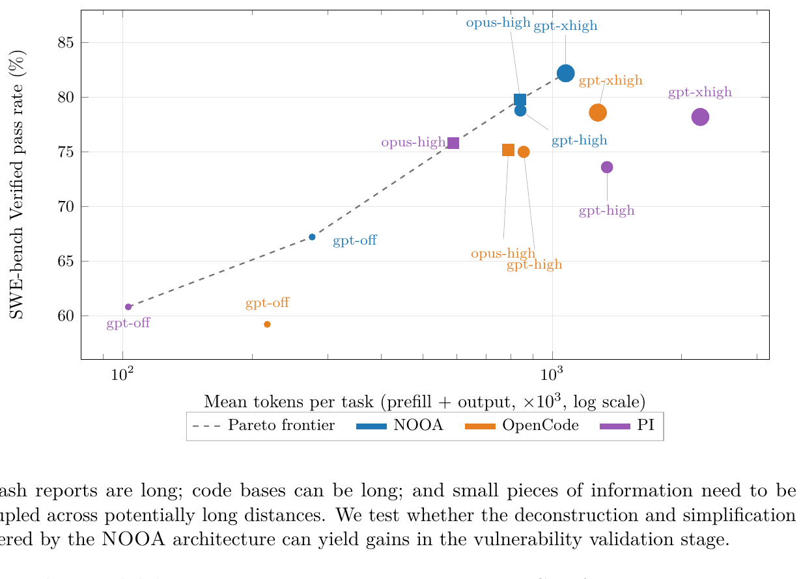

> [[../index|Wiki]] | [[../summary|Summary]] | [[../digest|Digest]]

# SWE-bench, Terminal-Bench, and CyberGym

**In one sentence:** Across SWE-bench Verified, Terminal-Bench 2.0, and CyberGym L1, the same benchmark-agnostic NOOA `BenchAgent` — a typed todo list, tree-sitter repository navigation, and a validated typed return value for termination — beats the open general-purpose harnesses OpenCode and PI at equal or lower token cost and narrows the gap to specialized closed-source systems, all without any benchmark-specific tuning.

## Key points

- On SWE-bench Verified, NOOA with GPT-5.5 reaches 67.2% (reasoning off), 78.8% (high), and 82.2% (xhigh) pass rate, and with Opus 4.6 reaches 76.8% (off) and 79.8% (high), beating OpenCode (59.2–78.6%) and PI (60.8–78.2%) in every matched configuration (Table 3).
- NOOA's 79.8% SWE-bench result with Opus 4.6 improves by 11.4 points on OpenHands v3's reported 68.4% under the same backend, and its GPT-5.5 xhigh score of 82.2% approaches the specialized closed systems Codex (88.7%) and Claude Code (80.8%), against a published leaderboard SOTA of 79.2%.
- On SWE-bench with GPT-5.5 xhigh, NOOA hits 82.2% using ~28 model calls and ~1.1M prefill+output tokens per task, versus OpenCode's ~1.3M tokens for 78.6% and PI's 66 calls/2.2M tokens for 78.2% — NOOA sits at or above the score-cost Pareto frontier traced in Figure 6.
- With reasoning disabled, NOOA leads OpenCode and PI on SWE-bench by 8.0 and 6.4 points respectively (67.2% vs. 59.2% and 60.8%), a margin that narrows as reasoning effort increases for all three harnesses.
- On Terminal-Bench 2.0 (89 tasks), NOOA scores 46.1% (GPT-5.5 off), 73.0% (GPT-5.5 high and xhigh, unchanged between the two), and 65.2% (Opus 4.6 high) — ahead of OpenCode (34.8/60.7/43.8%) throughout, though PI's GPT-5.5 xhigh result of 75.3% edges out NOOA's 73.0% (leaderboard SOTA 84.7%, NexAU-AHE + GPT-5.5).
- NOOA's Opus 4.6 Terminal-Bench score of 65.2% is comparable to the 62.9–65.4% reported for the specialized systems Claude Code and Terminus-2.
- On CyberGym L1 vulnerability discovery, NOOA with GPT-5.5 (network access blocked) achieves an 86.8% solve rate — the top open-source result, ahead of OpenAI Codex with a submission-format skill (83.5%) and plain Codex (64.9%), though behind the closed-source Microsoft MDASHv2 (95.6%) and Crystalline on Opus 4.6 (89.6%).
- NOOA's validated typed `TaskResult` termination step, which requires evidence and a verification command before a trial can end, is credited with preventing unsupported completion claims — a failure mode that affects OpenCode, which stops on any non-tool-call response and terminates within ten steps on 77% of its failed Terminal-Bench GPT-5.5 trials.

---

This page covers the paper's real-world software-engineering benchmarks (Section 4.2) and its security-vulnerability-discovery benchmark (Section 4.3). Both sections evaluate **BenchAgent**, a single benchmark-agnostic NOOA agent, against two open general-purpose coding harnesses, OpenCode and PI, across GPT-5.5 and Claude Opus 4.6 backends at multiple reasoning-effort settings. The consistent finding is that NOOA's object-oriented, [[02-agent-loop-strategies-and-context|CodeAct]]-based architecture — a typed todo list, tree-sitter-based repository navigation, and a validated typed return value for termination — produces higher pass rates than the comparison harnesses at equal or lower token cost, and narrows the gap to specialized closed-source systems, without any benchmark-specific tuning of the agent's prompts or tools.

## SWE-bench Verified results

SWE-bench Verified [25] contains 500 software-engineering tasks derived from real GitHub issues. An agent must inspect an unfamiliar codebase, identify the cause of a reported problem, modify the repository, and produce a patch that passes the benchmark's hidden tests.

**Agent under test.** For both SWE-bench and Terminal-Bench, the paper uses the same benchmark-agnostic agent, `BenchAgent`. It has a todo list, shell tools for command execution and file editing, and repository-navigation tools based on tree-sitter. Its dynamic context contains the task description, todo-list status, context-window statistics, and the current working state of its shell and repository tools. The agent terminates by returning a typed `TaskResult` containing the identified root cause, supporting evidence, and a verification command; this return value is validated by the harness before execution ends. The complete agent is 253 lines of ordinary Python and is included in the NOOA repository.

**Comparison harnesses.** OpenCode [4] is a full-featured terminal coding agent with file, search, and shell tools, plus automatic transcript summarization. PI [19] is a deliberately minimal agent with a small prompt and standard file and shell tools. All three harnesses are evaluated with the same GPT-5.5 and Claude Opus 4.6 backends at the available reasoning-effort settings (off / high / xhigh for GPT-5.5; off / high for Opus 4.6).

**Table 3 — SWE-bench Verified pass rates** (published leaderboard SOTA at submission: 79.2%, with a specialized agent + Opus 4.5):

| Harness | GPT-5.5 off | GPT-5.5 high | GPT-5.5 xhigh | Opus 4.6 off | Opus 4.6 high |
|---|---|---|---|---|---|
| NOOA | 67.2 | 78.8 | 82.2 | 76.8 | 79.8 |
| OpenCode 1.14.33 | 59.2 | 75.0 | 78.6 | 76.0 | 75.2 |
| PI v0.72.1 | 60.8 | 73.6 | 78.2 | 75.6 | 75.8 |

NOOA obtains the highest pass rate among the open harnesses in every evaluated model and reasoning configuration. It also improves on the original CodeAct paradigm as implemented by OpenHands v3 [53], which under Opus 4.6 is reported to have a 68.4% pass rate — NOOA builds on this by 11.4 points under the same model (79.8% vs. 68.4%). With GPT-5.5, NOOA reaches 67.2%, 78.8%, and 82.2% at off, high, and xhigh reasoning effort respectively; at xhigh, OpenCode reaches 78.6% and PI reaches 78.2%. With Opus 4.6, NOOA reaches 79.8%, compared with 75.2% for OpenCode and 75.8% for PI.

**The score-cost Pareto frontier claim, concretely.** The higher pass rates do not come from longer trajectories. On SWE-bench with GPT-5.5 xhigh, NOOA reaches 82.2% using approximately 28 model calls and 1.1 million tokens per task (prefill + output). OpenCode uses a similar number of calls but approximately 1.3 million tokens for its 78.6% result, while PI uses 66 calls and 2.2 million tokens for 78.2%. Plotted as pass rate against mean tokens per task (Figure 6), NOOA's points sit at or above the accuracy achieved by OpenCode and PI at every comparable token budget — i.e., NOOA occupies most of the Pareto frontier: for a given cost it is at least as accurate, and for a given accuracy it is at least as cheap, as the other two harnesses. The paper attributes this to interaction and context efficiency rather than to a stronger prompt: because tool outputs remain available as live Python values (pass-by-reference) instead of being repeatedly re-serialized into the transcript, NOOA needs far fewer tokens to reach a given level of task understanding. Bounded prompt previews also keep NOOA well below the context limit, avoiding the lossy transcript compaction used by OpenCode and PI while preserving prefix-cache reuse.

**Effect of reasoning effort.** Increasing reasoning effort improves all three harnesses, but the interface matters most when the model provides less planning and verification discipline of its own. With reasoning disabled, NOOA leads OpenCode and PI by 8.0 and 6.4 points respectively on SWE-bench (67.2% vs. 59.2% and 60.8%). These margins narrow at higher effort, suggesting that the explicit object state, typed actions, and programmable loop behavior exposed by NOOA partly substitute for behaviors that stronger reasoning models increasingly perform on their own.

**Validated termination.** Trace analysis identifies termination handling as a key difference between the harnesses. OpenCode stops whenever the model responds without a tool call — on Terminal-Bench, 77% of its failed GPT-5.5 trials terminate within ten steps. In NOOA, the model must instead return a validated `TaskResult` containing evidence and a verification command, which prevents unsupported declarations of completion and is especially valuable on tasks whose intermediate state can appear correct before hidden checks run. This illustrates the paper's broader argument for treating type annotations as executable contracts: termination becomes a programmatically validated action rather than an informal convention encoded only in the prompt (see also [[02-agent-loop-strategies-and-context|context rendering]] and the [[02-agent-loop-strategies-and-context|CodeAct loop]] design).

**Comparison with specialized systems.** The results narrow the gap between open general-purpose harnesses and specialized closed systems. On SWE-bench Verified, NOOA reaches 82.2% with GPT-5.5 and 79.8% with Opus 4.6, compared with 88.7% for Codex and 80.8% for Claude Code. The paper concludes that a small, benchmark-agnostic NOOA agent is competitive with specialized systems while consistently outperforming the open general-purpose harnesses in the comparison, supporting the broader "agent-as-a-Python-object" claim: ordinary classes, methods, state, and type contracts provide a simple developer-facing abstraction without making the interface less effective for models.

## Terminal-Bench 2.0 results

Terminal-Bench 2.0 [34] contains 89 tasks performed through a command-line environment, including software installation, configuration, debugging, and service operation. The same `BenchAgent`, OpenCode, and PI harnesses are compared under the same models and reasoning-effort settings as SWE-bench.

**Table 4 — Terminal-Bench 2.0 (89 tasks), task pass rate (%)** (published leaderboard SOTA at submission: 84.7%, NexAU-AHE + GPT-5.5):

| Harness | GPT-5.5 off | GPT-5.5 high | GPT-5.5 xhigh | Opus 4.6 off | Opus 4.6 high |
|---|---|---|---|---|---|
| NOOA | 46.1 | 73.0 | 73.0 | 64.0 | 65.2 |
| OpenCode 1.14.33 | 34.8 | 60.7 | 52.8 | 49.4 | 43.8 |
| PI v0.72.1 | 37.1 | 68.5 | 75.3 | 65.2 | 58.4 |

NOOA's advantage over the open harnesses is larger on Terminal-Bench than on SWE-bench. With GPT-5.5 and reasoning disabled, NOOA reaches 46.1%, compared with 34.8% for OpenCode and 37.1% for PI (leads of 11.3 and 9.0 points). At high effort, NOOA reaches 73.0%, ahead of OpenCode by 12.3 points (60.7%) and PI by 4.5 points (68.5%). PI obtains the best GPT-5.5 xhigh result at 75.3%, compared with 73.0% for NOOA (NOOA's xhigh score is unchanged from its high-effort score). With Opus 4.6 at high effort, NOOA reaches 65.2%, while OpenCode and PI reach 43.8% and 58.4% respectively.

On Terminal-Bench 2.0, NOOA's 65.2% with Opus 4.6 is comparable to the 62.9-65.4% reported for Claude Code and Terminus-2, again placing a small, benchmark-agnostic open harness within range of specialized closed systems.

## CyberGym L1 vulnerability-discovery results

CyberGym [54] is a security benchmark in which an agent must inspect a codebase, identify a security-relevant bug, and validate it by producing a proof-of-concept (PoC) that reliably triggers it. Agentic vulnerability discovery is notoriously difficult and can consume large amounts of context: crash reports are long, codebases can be long, and small pieces of information need to be coupled across potentially long distances. Section 4.3 tests whether the deconstruction and simplification offered by the NOOA architecture yields gains specifically in the vulnerability-validation stage.

**CyberGym NOOA agent.** The agent runs in the trial container as a CodeAct agent with shell and todo-manager tools. It reads the task description, investigates the mounted source, writes a PoC, and submits it through the CyberGym submission interface. A deterministic layer around the model keeps the important scoring mechanics out of the prompt loop:
- a submission method sends the authored PoC and processes the benchmark's response;
- a lightweight judge checks that the model's summary still matches the described vulnerability before accepting a submission; and
- accepted submissions are re-submitted a few times to reject non-deterministic crashes.

No domain knowledge is included beyond this scaffolding — performance is predicated on agent architecture rather than cybersecurity steering.

**Table 5 — Vulnerability discovery performance on CyberGym L1:**

| Harness | Model | Network | Solve rate (%) | Open source? |
|---|---|---|---|---|
| Microsoft MDASHv2 | MDASH | unknown | 95.6 | No |
| Crystalline | Opus 4.6 | blocked | 89.6 | No |
| **NOOA** | GPT-5.5 | blocked | 86.8 | Yes |
| OpenAI Daybreak | GPT-5.5 | unknown | 85.6 | No |
| OpenAI Codex + submission skill | GPT-5.5 | open | 83.5 | Yes |
| Anthropic Glasswing | Mythos | unknown | 83.1 | No |
| OpenAI Codex | GPT-5.5 | blocked | 64.9 | Yes |

NOOA scores highly, beating the majority of closed-source solutions (all but Microsoft MDASHv2's MDASH at 95.6% and Crystalline's Opus 4.6 at 89.6%), and is the top-scoring open-source agent at 86.8%, ahead of both OpenAI Codex baselines (83.5% with a submission-format skill, 64.9% without).

**Network access.** Monitoring network access affects performance, since a networked agent could in principle look up information about the specific disclosed vulnerability or about the benchmark itself rather than deriving it from the problem setup. The authors implemented a rigorous "cheat check" — rule-based analysis of agent trajectories — to ensure that NOOA's results (run with network access "blocked") are based only on information the agent processes and induces directly from the problem setup, not on external lookups.

---

**Covers:** Section 4.2 (Software Engineering and Terminal Interaction), Section 4.3 (Securing Software on CyberGym L1)
