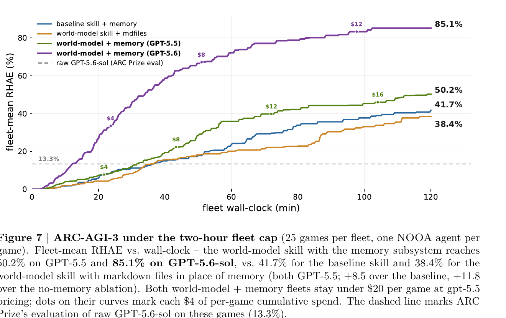

> [[../index|Wiki]] | [[../summary|Summary]] | [[../digest|Digest]]

# ARC-AGI-3 and World Models

**In one sentence:** A single NOOA agent running one 50-line world-model skill compresses DreamTeam's six-agent, ~150k-line world-model system down to ~6.1k lines and pushes the ARC-AGI-3 score–cost Pareto frontier past it, with framework primitives (the CodeAct REPL, context blocks, the memory subsystem) absorbing DreamTeam's apparatus, a layered sandbox and red-team audit confirming the untrusted agent-written-code fleet stayed contained, and per-game evidence tying the RHAE gains to the persisted world models and memory subsystem rather than to raw model capability alone.

## Key points

- A single NOOA agent running one 50-line world-model skill beats DreamTeam — the six-agent, ~150k-line prior-best system with 1,821 lines of role prompts — on the ARC-AGI-3 score–cost Pareto frontier (Sec. 4.4).
- At the two-hour competition cap, the world-model + memory fleet scores RHAE 50.2% (118 levels) on GPT-5.5 and 85.1% (170 levels) on GPT-5.6-sol for under $20/game, versus 41.7% for a hypothesis-driven baseline with memory (+8.5 points) and 38.4% for the same world-model skill with memory replaced by plain markdown files (+11.8 points) — isolating the memory subsystem's contribution.
- Guarded, cache-aware fleets cost $17.85/game (GPT-5.5) and $13.28/game (GPT-5.6-sol); raw GPT-5.6-sol scores only 13.3% on ARC Prize's own evaluation of the same 25 public games, so the NOOA harness delivers a 6.4× effect on the same base model.
- The compression keeps the underlying methodology intact — latent encoding under a declared schema, executable dynamics, retrodiction as the sole refinement signal, search over the learned model, level-boundary reflection with carry-forward — while collapsing DreamTeam's apparatus (six roles, inter-agent protocol, a 4,690-line harness-side retrodiction engine, background search workers) into framework primitives: the CodeAct REPL as simulator, context blocks as shared state, and the memory subsystem as carry-forward ledgers (Table 9).
- 22 of 25 games persisted executable world-model code (~4.4k lines, 37 modules); by deepest use, 5 games ran the full predict+search+retrodiction loop, 7 planned or predicted only, and 10 used their model for perception/encoding only — e.g., game m0r0 replayed twenty live frames through `encode` to validate a stored 42-action plan mid-execution and finished 6/6 levels near the per-level score cap.
- The fleet's two hung games both came from unbounded, ad-hoc in-cell searches (one branched over 3,456 click targets per node with no budget) while their own persisted, better-engineered `predict` functions sat uncalled — the paper's direct argument for the memory-and-workspace discipline and for hard cell timeouts.
- The sandbox layers per-cell AST/module-denylist/`open()` guards plus an opt-in per-cell OS sandbox (Landlock, seccomp, RLIMIT_AS/CPU caps, SIGTERM→SIGKILL timeout), a per-run uid drop with bubblewrap, and end-to-end game-alias anonymisation; an 18-pass red-team audit over the live 25-game fleet found zero leakage on any rule and exactly one blocked escape attempt.
- Across the fleet, agents wrote 3,262 memories, received 12,654 spontaneous injections, and made 27,115 deliberate reads at a 99% hit rate; deliberate recalls per decision correlate with levels completed at Spearman ρ = +0.52 (writes per decision, ρ = +0.36), and winning games recall 1.63 and write 1.87 memories per decision versus 1.21 and 1.46 for the rest.

---

This page covers the paper's headline empirical result: a single NOOA agent running one 50-line skill compresses DreamTeam — a prior six-agent, ~150k-line "world-model" system that held the previous best published score — and, on the ARC-AGI-3 interactive-reasoning benchmark, pushes the score–cost Pareto frontier past it. Section 4.4 gives the fleet-level RHAE numbers and the memory-ablation delta; Appendix D fills in the mechanics — the DreamTeam-to-NOOA element mapping (Table 9), the sandboxing model that lets untrusted model-written code run safely, the evidence for what the persisted world models actually did (and where ad-hoc code failed instead), and a full accounting of the memory subsystem's three interfaces during play (Table 6, Figures 8–9).

## The ARC-AGI-3 result and the score–cost Pareto frontier

ARC-AGI-3 [20] drops an agent into an unknown grid game that it must learn to play — mechanics, objective, and controls all discovered purely by acting, with no instructions. The companion **DreamTeam** system [49] — six specialized agents coordinating around a shared executable world model — set the previous best published score on the benchmark. Section 4.4 asks whether that methodology survives radical simplification: one NOOA agent and one 50-line skill, replacing DreamTeam's six role prompts (1,821 lines) and its 4,690-line harness-side retrodiction engine with framework primitives — the CodeAct REPL standing in as simulator, context blocks as shared state, and the memory subsystem ([[03-execution-validation-and-memory|Execution, Validation, and Memory]], Sec. 3.7) as the team's carry-forward ledgers.

The world-model skill instructs the agent to persist an executable model as ordinary workspace modules: `encode(grid) → z`, a latent capturing the few fields that actually drive the game; `predict(z, action) → z'`, the learned dynamics; **retrodiction** every turn — a predict-vs-observed mismatch is the *sole* refinement signal; search over its own `predict` once it is trusted; and memory discipline carried across levels. Every turn ends with `submit_actions(..., rationale="predict: ...")` — each action batch is a checked experiment against the model's own forecast.

**Results.** Four 25-game fleets ran, one agent per game, under the competition's two-hour cap: the world-model skill with the memory subsystem on GPT-5.5 and on GPT-5.6-sol, the same skill with plain markdown files standing in for memory (an ablation), and a hypothesis-driven baseline skill with memory (the last two on GPT-5.5). Figure 7 plots fleet-mean RHAE — the competition's action-efficiency score against per-level human baselines — over time and spend.

At the cap:

- **World-model + memory, GPT-5.5:** RHAE **50.2%** (118 levels)
- **Hypothesis-driven baseline (with memory), GPT-5.5:** RHAE **41.7%** — the world-model + memory fleet is **+8.5 points** ahead
- **World-model skill, markdown-file ablation (no memory subsystem), GPT-5.5:** RHAE **38.4%** — the world-model + memory fleet is **+11.8 points** ahead of the *same skill* without the memory subsystem
- **World-model + memory, GPT-5.6-sol:** RHAE **85.1%** (170 levels), for less than **$20 per game**

The guarded, cache-aware fleets cost **$17.85** (GPT-5.5) and **$13.28** (GPT-5.6-sol) per game at gpt-5.5 pricing. For scale, ARC Prize's own evaluation of raw GPT-5.6-sol — the only performant base model on the benchmark as of July 2026 — averages **13.3%** on the same 25 public games at maximum reasoning effort (arcprize.org/results/openai-gpt-5-6-sol, July 2026; evaluation budgets differ, so the comparison is indicative). The same model inside the NOOA harness reaches **85.1%** — a **6.4×** harness effect. The RHAE curves visibly separate once a game's mechanics have been observed enough to encode and predict.

**World-model use.** 22 of 25 games persisted executable model code (~4.4k lines total). In game **m0r0**, the agent replayed twenty live frames through its `encode` to validate a stored 42-action plan mid-execution, then completed 6/6 levels near the per-level score cap.

**Memory use (headline).** The fleet exercised all three memory interfaces (Table 6, below): 3,262 memories written, 12,654 spontaneous injections, and 27,115 deliberate tool reads at a 99% hit rate. Retrieval favors what the agent itself marked important (mean importance 6.1 written vs. 7.5 deliberately recalled), injection stays bounded at 4.1 memories per turn, and recall frequency tracks success: winning games average 1.63 deliberate recalls per decision, and recalls per decision correlate with levels completed at Spearman ρ = +0.52 (detailed in Appendix D.4, below).

## From DreamTeam to one agent and one skill

Appendix D.1 maps every element of the DreamTeam system [49] onto the NOOA example. The underlying methodology is kept intact — latent encoding under a declared schema, executable dynamics, retrodiction as the sole refinement signal, search over the learned model, level-boundary reflection with carry-forward — while the *apparatus* (roles, inter-agent protocol, the harness-side evaluation engine, background search workers) is either absorbed by framework primitives or performed by the agent itself inside its own REPL.

**Table 9 | World-model methodology: the DreamTeam system vs. the NOOA example**

| Element | DreamTeam (paper system) | NOOA example |
|---|---|---|
| Encode → latent 𝑧 | Observer role (198-line prompt); schema-validated `observable.py`; per-step encoding log | skill item: `encode(grid)→z` with declared `Z_SCHEMA`, persisted as a helper module |
| Predict dynamics | Simulator role; `predict()` + recurrent `history()` with per-hypothesis branches | single `predict(z,a)→z'` |
| Retrodiction | harness-computed each step by a 4,690-line evaluation engine (DreamerV3 pattern) | agent-performed in the REPL each turn |
| Search / planning | Explorer role; sub-goal/policy registries; background search worker process | BFS/greedy/best-first over own `predict` inside CodeAct cells |
| Verification | Critic + team-leader roles; per-action approve/reject; feedback protocol | turn contract: `submit_actions(..., rationale="predict: ...")` checked next turn |
| Memory across levels | per-role step/level logs with carry-forward ledgers; harness-forced reflection | memory subsystem (Sec. 3.7): recall before deciding, reflect at level boundaries and before RESET |
| Team communication | feedback protocol, file registry, shared workspace | none — one agent, one workspace |

The scale of the compression: the paper system (DreamTeam) is **~150k lines** with **1,821 lines** of role prompts across its six roles; the NOOA example is **~6.1k lines** with a **50-line skill**. Everything DreamTeam's inter-agent protocol, file registry, and background search-worker process existed to coordinate collapses into a single agent operating on its own workspace, with the memory subsystem (see [[03-execution-validation-and-memory|Execution, Validation, and Memory]]) providing the carry-forward that DreamTeam's per-role logs and harness-forced reflection used to provide by hand.

## Containment and the red-team audit

Running model-written code against a live competition benchmark means running *untrusted* code, so the ARC-AGI-3 fleet operates inside a layered sandbox whose threat model has three rules: no internet, no access to a game's generating source or identity, and no access to other runs, other games, or prior solutions. The defenses are layered so that the hard layers are **external to the agent** — reading the defense code does not help escape it:

1. **Per cell:** an in-process **AST cell guard**, **module denylist**, and **`open()` jail**, backed by an opt-in **per-cell OS sandbox** that forks each CodeAct cell into a locked-down worker with four kernel-enforced, irrevocable guards installed *before any cell bytecode runs*: **Landlock** filesystem default-deny, a **seccomp** block on `socket(AF_INET/AF_INET6)`, `RLIMIT_AS`/`RLIMIT_CPU` memory/CPU caps, and a hard SIGTERM→SIGKILL cell timeout.
2. **Per run:** an OS-level uid drop (`setpriv --no-new-privs`; game source readable only by root; sibling runs carved out), with a fail-closed namespace sandbox (**bubblewrap**) as the current default.
3. **End-to-end anonymisation:** agents only ever see an opaque `game-<hex>` alias, with redaction applied to outputs and state.

A red-team loop re-scanned the live 25-game fleet every 30 minutes — **18 passes** — classifying the code inside every executed cell and the data returned by every tool result. Results: **no leakage on any rule**. Zero network invocations; zero game-source bytes returned; cross-game reads failed with `EACCES` and per-game memory stores remained fully isolated; a name-leak scanner found **zero** occurrences of any real game identifier across **13,335** agent logs (aliases only).

There was exactly **one escape attempt** across the fleet: an agent invoked a filesystem-recon shell command (`find`/`grep` for its own store alias); the cell guard replaced the cell before execution and zero bytes were returned. One latent finding — harness log files world-readable inside the run directory — was never referenced by any agent, and the one-line fix is documented. A companion analysis also documents a known cell-guard gap (dynamic attribute lookup can evade the AST scan) together with its backstop: under the uid drop, even a reached shell cannot read the game source. No game used the gap.

## World-model usage evidence and failure modes

Of the 25 games, 22 persisted executable model code (37 modules, ~4.4k lines); six games grew a new per-level module as mechanics accumulated (hazards → tokens → doors → pressure plates). By deepest observed use: **5 games** ran the full loop (predict + search + retrodiction), **7** planned or predicted with their models, and **10** used them for perception/encoding only.

Representative closed loops:

- **m0r0** stored a 42-action plan, replayed twenty real frames through `encode` to check it mid-execution ("matched the model exactly"), released the next batch, and pre-announced the completing action of its final level — **6/6 levels** near the per-level score cap.
- **tu93** passed its planner's output verbatim to `submit_actions`, with the prediction carried in the rationale.
- **ar25** wrote its model on turn one from a single exploratory action, then submitted a 16-action plan ending "expect level completion on the last DOWN" — **8/8 levels in 24 turns**.

Model depth tracked what each game demanded rather than raw level count; its payoff shows up as action efficiency — near-cap per-level scores and long, verified action batches.

**Failure mode.** The two games that hung did so in ad-hoc, in-cell searches that lacked the bounds (`max_depth`, visited sets, node budgets) their own persisted planners carried — one branched over all **3,456** click targets per node with no budget while its persisted `predict` went uncalled. Durable, curated artifacts were reliably better engineered than improvised cell code, which is the direct argument both for the memory-and-workspace discipline of [[03-execution-validation-and-memory|Execution, Validation, and Memory]] and for hard cell timeouts in the harness — now provided by the per-cell OS sandbox described above.

## Memory-system usage during play

Appendix D.4 instruments all three memory interfaces across the 25 per-game stores: writes (agent tools plus consolidation-created records), spontaneous reads (the `BeforeTurn` injection into the dynamic context block), and deliberate reads (the recall/search tools). Ground truth comes from the SQLite stores themselves — each record carries uncapped per-channel counters — with event-level statistics (injections per turn, hit rates) from OTel trace exports.

**Table 6 | Memory-system use by the ARC-AGI-3 fleet (25 games).** Read columns count occurrences (one memory surfacing once); imp. = mean importance (verbal scale mapped to 0–10); len = mean characters.

| Type | Written n (%) | imp. | len | Injected (spont.) occurrences (%) | Recalled / searched occurrences (%) |
|---|---|---|---|---|---|
| info | 2,130 (65%) | 6.7 | 555 | 9,055 (72%) | 22,302 (82%) |
| skill | 91 (3%) | 8.3 | 587 | 293 (2%) | 956 (4%) |
| episode | 321 (10%) | 6.7 | 430 | 3,079 (24%) | 3,439 (13%) |
| todo | 18 (1%) | 6.7 | 560 | 56 (0%) | 49 (0%) |
| reflection | 702 (22%) | 3.9 | 377 | 171 (1%) | 369 (1%) |
| **all** | **3,262** | **6.1** | **505** | **12,654** | **27,115** |

Five observations from Appendix D.4:

1. **The channels select differently.** Mean importance climbs written → injected → deliberate (6.1 → 7.2 → 7.5), and the high verbal level carries 61% of writes but 87% of injected and 91% of deliberate occurrences — the ACT-R importance term biases both read channels toward what the agent itself marked important.
2. **Injection is selective and bounded.** Only 632 of 3,262 memories (19%) ever surfaced spontaneously, at 4.1 memories ≈ 1.9k characters per turn — the char-budgeted block prevents context flooding by memory.
3. **Episodes are the recency channel.** 10% of writes but 24% of injected occurrences (13% deliberate) — the base-level recency term surfaces the latest level attempts unprompted, while deliberate recall goes after facts (info: 82% of tool-read occurrences at a 99–100% hit rate, 9.7 results per call).
4. **Skills are few, dear, and deliberately fetched.** 3% of writes but the highest importance of any type (8.3), and over-represented in deliberate reads — agents went back for their verified procedures.
5. **Consolidation compressed the store rather than growing it.** Reflection records are 22% of rows yet ~1% of both read channels (importance 3.9), and 45% of all records ended archived by decay-based forgetting. The intent and scratch types went unused; todo appeared in 18 records. Per-game store sizes ranged 23/129/255 (min/median/max).

**Memory engagement per decision tracks performance.** Raw store volume largely reflects run length (longer games accumulate more turns, and every turn leaves memory behind), so the informative measure is memory use *per decision* — one decision being one agent turn ending in `submit_actions`. On this measure the relationship with performance is clearly positive: deliberate recalls per decision correlate with levels completed at Spearman ρ = **+0.52**, and writes per decision at ρ = **+0.36**. Winning games check memory **1.63** times and write **1.87** memories per decision (medians, vs. **1.21** and **1.46** for the remaining games), and every winning game makes at least one deliberate recall per decision — the skill's recall-before-deciding discipline in action. Spontaneous injection is cadence-fixed at ≈1 per turn by design and therefore uniform across the fleet. With n = 25 and 16 outcomes right-censored by the operator kill, these are associations rather than causal claims.

**Reproduction (Appendix D.5).** The RHAE curves and two-hour numbers come from the guarded, cache-aware fleets `20260716_204102_competition_gpt55_guarded` (GPT-5.5) and `20260718_012940_competition_gpt56sol_guarded` (GPT-5.6-sol), with `20260710_154254_competition_memory_visual` (baseline) and `20260714_201702_competition_md` (markdown-file ablation) for reference — all 25 games each, regenerated from per-game event logs via `tmp/nooa_paper_contribution/artifacts/performance_2h.py`. The memory-usage analysis is from `20260711_193827_competition_memory_visual_wm` (world-model skill, 25 games, GPT-5.5) via `memory_usage_analysis.py` in the same directory. Pricing used throughout: $5/$30/$0.50 per Mtok (input/output/cached).

---

**Covers:** Section 4.4 (Advancing the score–cost Pareto frontier on ARC-AGI-3), Appendix D (ARC-AGI-3 Example Details)
