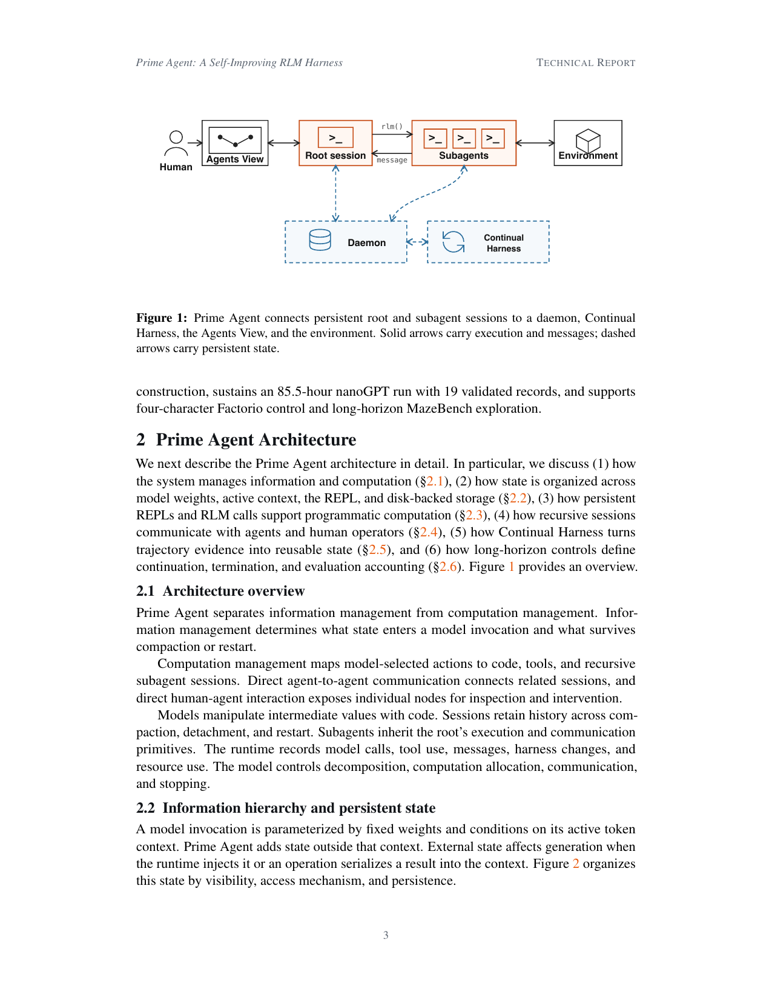
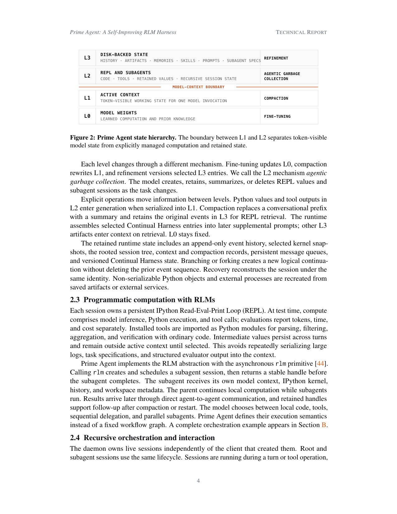
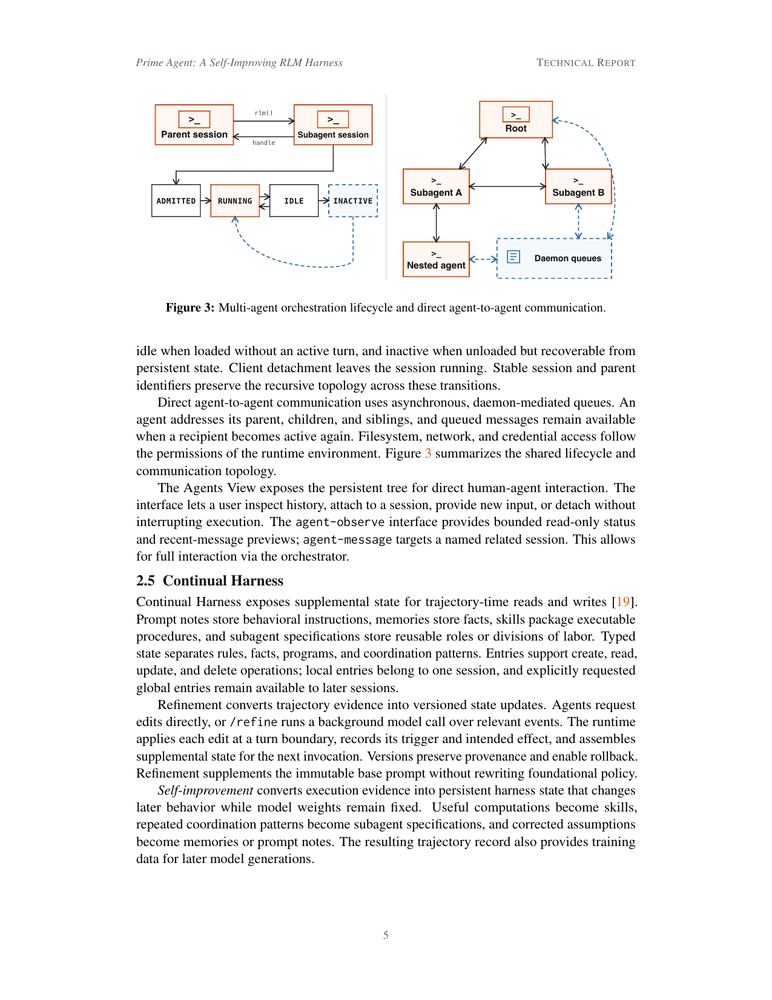
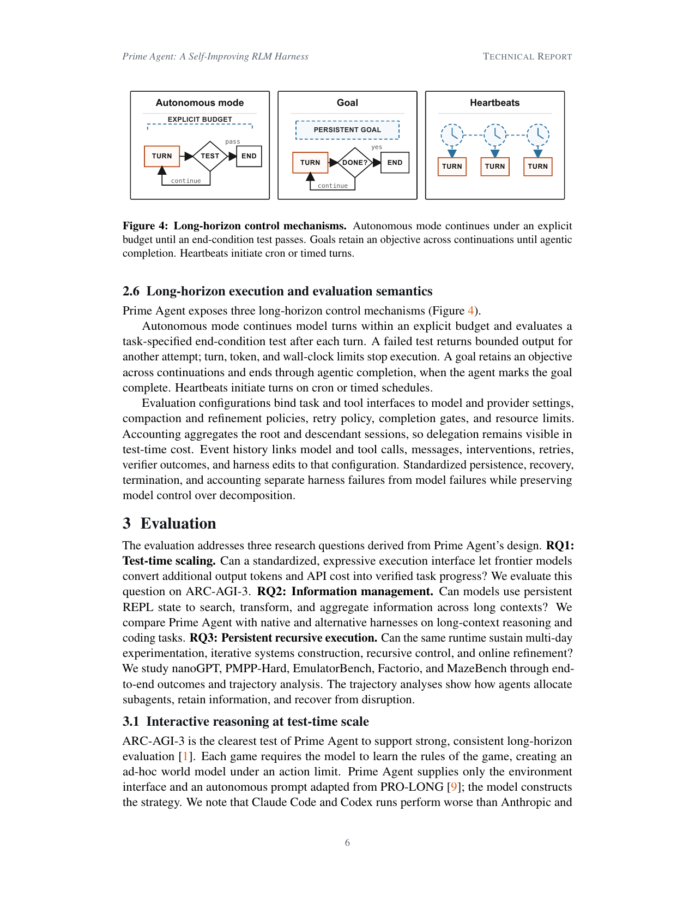

> [[../index|Wiki]] | [[../summary|Summary]] | [[../digest|Digest]]

# Prime Agent Architecture

**In one sentence:** Prime Agent is a runtime harness that separates information management (what state enters a model invocation and survives compaction or restart) from computation management (mapping model-selected actions to code, tools, and recursive subagent sessions), so the model can self-direct long-horizon work while the harness provides persistent state, programmatic computation, and controlled self-improvement.

## Key points

- The harness splits into two management planes: information management (determines what enters a model call and survives compaction/restart) and computation management (maps model-selected actions to code, tools, and recursive subagent sessions); direct agent-to-agent communication connects sessions and direct human-agent interaction exposes nodes for inspection.
- State is organized into four levels — L0 model weights, L1 active context, L2 REPL/subagents, L3 disk-backed state — with the model-context boundary drawn between L1 and L2; a red dashed MODEL-CONTEXT BOUNDARY line separates token-visible model state from explicitly managed computation and retained state.
- Each state level is mutated by a distinct single mechanism: fine-tuning for L0, compaction for L1, "agentic garbage collection" for L2 (model creates, retains, summarizes, or deletes REPL values and subagent sessions), and refinement for L3.
- Every session owns a persistent IPython REPL; intermediate values persist across turns outside active context until the model selects them for serialization — avoiding repeatedly serializing large logs, task specs, and evaluator output into the context.
- The RLM abstraction is implemented with the asynchronous `rlm` primitive: calling `rlm` creates and schedules a subagent session and returns a stable handle before it completes; the subagent gets its own model context, IPython kernel, history, and workspace metadata while the parent keeps computing.
- Sessions have a four-state lifecycle (admitted → running ↔ idle → inactive) owned by the daemon independently of the creating client; client detachment does not stop a session, and stable session/parent identifiers preserve recursive topology across transitions.
- Continual Harness exposes typed supplemental state — prompt notes (behavioral rules), memories (facts), skills (executable procedures), subagent specifications (reusable roles) — that refinement converts trajectory evidence into versioned, roll-backable updates while model weights stay fixed; the resulting trajectory record also doubles as training data.
- Three long-horizon controls drive extended execution: autonomous mode (budget-bounded loop of turns gated by a task-specified end-condition test), goals (objective retained across continuations until the agent itself marks completion), and heartbeats (turns initiated on cron/timed schedules).

---

## Architecture overview (2.1)

System-architecture diagram of the Prime Agent harness: a Human operator feeds an Agents View panel, a Root session (REPL node) is the central hub linking to Subagents and an Environment, with a Daemon (database store) and Continual Harness forming a persistent-state layer; solid arrows carry execution and messages (e.g., `rlm()` calls and message returns) while dashed arrows carry persistent state (session ↔ Daemon ↔ Continual Harness).

Prime Agent separates information management from computation management. **Information management** determines what state enters a model invocation and what survives compaction or restart. **Computation management** maps model-selected actions to code, tools, and recursive subagent sessions.

Core design properties:

- Models manipulate intermediate values with code rather than only with context.
- Sessions retain history across compaction, detachment, and restart.
- Subagents inherit the root's execution and communication primitives.
- The runtime records model calls, tool use, messages, harness changes, and resource use.
- The model controls decomposition, computation allocation, communication, and stopping.

Direct agent-to-agent communication connects related sessions, and direct human-agent interaction exposes individual nodes for inspection and intervention.

## Information hierarchy and persistent state (2.2)

A model invocation is parameterized by fixed weights and conditions on its active token context. Prime Agent adds state *outside* that context; external state affects generation only when the runtime injects it or an operation serializes a result into the context.

State is organized by visibility, access mechanism, and persistence:

- **L0 — Model weights:** learned computation and prior knowledge; updated by **fine-tuning** (fixed at inference time).
- **L1 — Active context:** token-visible working state for one model invocation; rewritten by **compaction**.
- **L2 — REPL and subagents:** code, tools, retained values, recursive session state; managed by **agentic garbage collection** — the model creates, retains, summarizes, or deletes REPL values and subagent sessions as the task changes.
- **L3 — Disk-backed state:** history, artifacts, memories, skills, prompts, subagent specs; versioned by **refinement**.

Explicit operations move information between levels: Python values and tool outputs in L2 enter generation when serialized into L1; compaction replaces a conversational prefix with a summary while retaining the original events in L3 for REPL retrieval; the runtime assembles selected Continual Harness entries into later supplemental prompts, and other L3 artifacts enter context on retrieval; L0 stays fixed.

The retained runtime state includes an append-only event history, selected kernel snapshots, the rooted session tree, context and compaction records, persistent message queues, and versioned Continual Harness state. Branching or forking creates a new logical continuation without deleting the prior event sequence. Recovery reconstructs the session under the same identity; non-serializable Python objects and external processes are recreated from saved artifacts or external services.

A four-row L0→L3 hierarchy (model weights, active context, REPL/subagents, disk-backed state), each row annotated with its state, examples, and the single mechanism that changes it (fine-tuning, compaction, agentic garbage collection, refinement), with a red dashed MODEL-CONTEXT BOUNDARY line separating token-visible model state (L1 and below) from explicitly managed state (L2 and above).

## Programmatic computation with RLMs (2.3)

Each session owns a persistent IPython Read-Eval-Print Loop (REPL). At test time, compute comprises model inference, Python execution, and tool calls; evaluations report tokens, time, and cost separately. Installed tools are imported as Python modules for parsing, filtering, aggregation, and verification with ordinary code. Intermediate values persist across turns and remain outside the active context until selected, which avoids repeatedly serializing large logs, task specifications, and structured evaluator output into the context.

Prime Agent implements the RLM abstraction with the asynchronous `rlm` primitive:

- Calling `rlm` creates and schedules a subagent session, then returns a stable handle before the subagent completes.
- The subagent receives its own model context, IPython kernel, history, and workspace metadata.
- The parent continues local computation while subagents run in parallel.
- Results arrive later through direct agent-to-agent communication; retained handles support follow-up after compaction or restart.

The model chooses between local code, tools, sequential delegation, and parallel subagents — Prime Agent defines the execution semantics rather than a fixed workflow graph. A complete orchestration example appears in Section B.

## Recursive orchestration and interaction (2.4)

The daemon owns live sessions independently of the client that created them, and root and subagent sessions use the same lifecycle:

- **running** — during a turn or tool operation;
- **idle** — loaded without an active turn;
- **inactive** — unloaded but recoverable from persistent state.

Client detachment leaves the session running; stable session and parent identifiers preserve the recursive topology across these transitions.

Direct agent-to-agent communication uses asynchronous, daemon-mediated queues: an agent can address its parent, children, and siblings, and queued messages remain available when a recipient becomes active again. Filesystem, network, and credential access follow the permissions of the runtime environment.

For human interaction, the **Agents View** exposes the persistent session tree for direct inspection: a user can inspect history, attach to a session, provide new input, or detach without interrupting execution. The **agent-observe** interface provides bounded read-only status and recent-message previews, and **agent-message** targets a named related session — this enables full human interaction via the orchestrator.

Two side-by-side panels: a session lifecycle state machine (admitted → running ↔ idle → inactive, with a recoverable re-activation path from inactive back to running) for parent and subagent sessions linked by `rlm()`/`handle` arrows, and a recursive communication topology (root → Subagent A/B, with Subagent A spawning a nested agent) whose messages flow through dashed daemon queues.

## Continual Harness (2.5)

Continual Harness exposes supplemental state for trajectory-time reads and writes. Typed state separates rules, facts, programs, and coordination patterns across four entry kinds:

- **prompt notes** — behavioral instructions;
- **memories** — facts;
- **skills** — packaged executable procedures;
- **subagent specifications** — reusable roles or divisions of labor.

Entries support create, read, update, and delete operations; local entries belong to one session, while explicitly requested global entries remain available to later sessions.

**Refinement** converts trajectory evidence into versioned state updates: agents request edits directly, or `/refine` runs a background model call over relevant events. The runtime applies each edit at a turn boundary, records its trigger and intended effect, and assembles supplemental state for the next invocation. Versions preserve provenance and enable rollback. Refinement supplements the immutable base prompt without rewriting foundational policy.

**Self-improvement** is the conversion of execution evidence into persistent harness state that changes later behavior while model weights remain fixed: useful computations become skills, repeated coordination patterns become subagent specifications, and corrected assumptions become memories or prompt notes. The resulting trajectory record also provides training data for later model generations.

## Long-horizon execution and evaluation semantics (2.6)

Prime Agent exposes three long-horizon control mechanisms:

- **Autonomous mode** — continues model turns within an explicit budget and evaluates a task-specified end-condition test after each turn; a failed test returns bounded output for another attempt, while turn, token, and wall-clock limits stop execution.
- **Goals** — retain an objective across continuations and end through *agentic completion*, when the agent itself marks the goal complete.
- **Heartbeats** — initiate turns on cron or timed schedules.

Evaluation configurations bind task and tool interfaces to model and provider settings, compaction and refinement policies, retry policy, completion gates, and resource limits. Accounting aggregates the root and descendant sessions, so delegation stays visible in test-time cost. Event history links model and tool calls, messages, interventions, retries, verifier outcomes, and harness edits to that configuration. Standardized persistence, recovery, termination, and accounting separate harness failures from model failures while preserving model control over decomposition.

Three schematic flow diagrams of the control primitives: autonomous mode as a budget-bounded loop of turn → end-condition test → continue/end, a goal as a persistent-objective loop that ends when the agent itself answers done, and heartbeats as clock-triggered turns initiated on cron/timed schedules.

**Covers:** Section 2 (2.1-2.6), Figures 1-4
