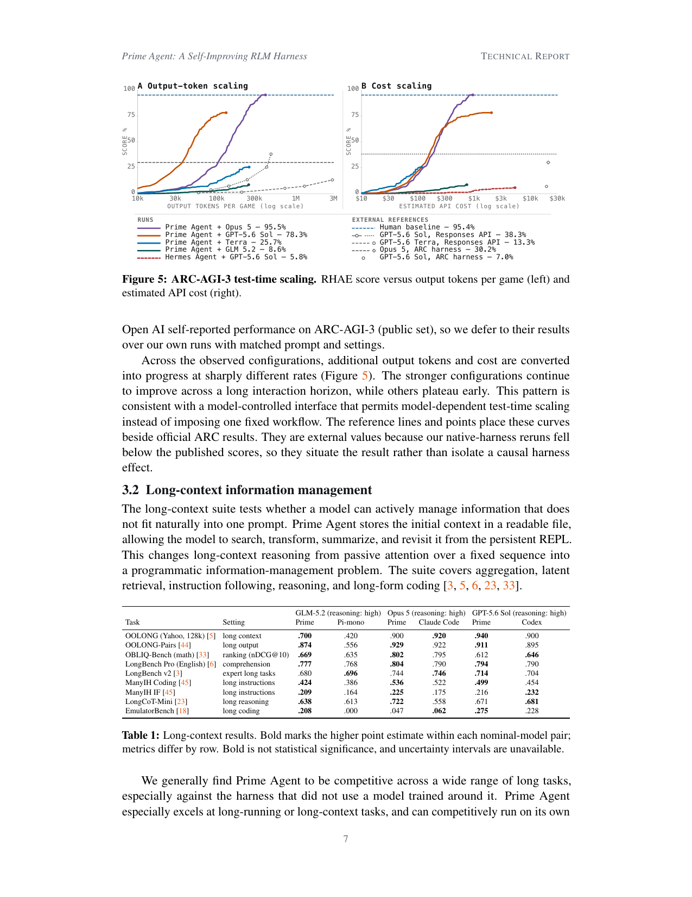

> [[../index|Wiki]] | [[../summary|Summary]] | [[../digest|Digest]]

# ARC-AGI-3 and Long-Context Evaluation

**In one sentence:** Prime Agent's standardized, model-controlled execution interface lets strong frontier models convert extra output tokens and API cost into verified task progress (matching the human baseline on ARC-AGI-3) and turns long-context work from passive attention into programmatic information management, where Prime Agent is competitive across nine long-context benchmarks.

## Key points

- Section 3's evaluation is organized around three research questions: RQ1 test-time scaling (evaluated on ARC-AGI-3), RQ2 information management (long-context reasoning and coding suite), and RQ3 persistent recursive execution (nanoGPT, PMPP-Hard, EmulatorBench, Factorio, MazeBench studied through end-to-end outcomes and trajectory analysis).
- On ARC-AGI-3, Prime Agent supplies only the environment interface plus an autonomous prompt adapted from PRO-LONG; the model itself must learn each game's rules and construct the strategy under an action limit.
- Prime Agent + Opus 5 reaches a 95.5% ARC-AGI-3 score, matching the human baseline (95.4%); Prime Agent + GPT-5.6 Sol reaches 78.3%, while Terra plateaus at 25.7%, GLM 5.2 stays at 8.6%, and Hermes Agent + GPT-5.6 Sol at 5.8%.
- The authors defer to self-reported frontier results (GPT-5.6 Sol Responses API 38.3%, GPT-5.6 Terra 13.3%, Opus 5 ARC harness 30.2%, GPT-5.6 Sol ARC harness 7.0%) because their Claude Code and Codex native-harness reruns fell below published scores, so reference lines situate rather than isolate a causal harness effect.
- For long-context tasks, Prime Agent stores the initial context in a readable file and lets the model search, transform, summarize, and revisit it from the persistent REPL, converting long-context reasoning from passive attention over a fixed sequence into a programmatic information-management problem.
- In Table 1, Prime Agent is generally competitive across nine long-context tasks (aggregation, latent retrieval, instruction following, reasoning, long-form coding), e.g. OOLONG 94.0 (Opus 5) and 92.0 (GPT-5.6 Sol), OOLONG-Pairs 92.9, ManyIH Coding 53.6, LongCoT-Mini 72.2, EmulatorBench 27.5 — with the best per-row point estimates in most rows for the Prime Agent columns.
- The gains from added tokens/cost are model-dependent: strong configurations keep improving across a long interaction horizon while weaker ones plateau early, a pattern the authors attribute to a model-controlled interface permitting model-dependent test-time scaling instead of one fixed workflow.

---

## Research questions

Section 3 frames three research questions derived from Prime Agent's design:

- **RQ1 — Test-time scaling.** Can a standardized, expressive execution interface let frontier models convert additional output tokens and API cost into verified task progress? Evaluated on ARC-AGI-3.
- **RQ2 — Information management.** Can models use persistent REPL state to search, transform, and aggregate information across long contexts? Prime Agent is compared against native and alternative harnesses on long-context reasoning and coding tasks.
- **RQ3 — Persistent recursive execution.** Can the same runtime sustain multi-day experimentation, iterative systems construction, recursive control, and online refinement? Studied on nanoGPT, PMPP-Hard, EmulatorBench, Factorio, and MazeBench through end-to-end outcomes and trajectory analysis showing how agents allocate subagents, retain information, and recover from disruption.

## Interactive reasoning at test-time scale (3.1, ARC-AGI-3)

ARC-AGI-3 is described as the clearest test of Prime Agent's ability to support strong, consistent long-horizon evaluation: each game requires the model to learn the game's rules — creating an ad-hoc world model — under an action limit. Prime Agent contributes only the environment interface and an autonomous prompt adapted from PRO-LONG; the model constructs the strategy.

The authors note that their Claude Code and Codex runs performed worse than the publicly self-reported results of Anthropic and OpenAI on ARC-AGI-3 (public set), so they defer to those published numbers and use them as external references in place of their own matched-prompt runs.

Across the observed configurations, additional output tokens and cost are converted into progress at sharply different rates (Figure 5). The stronger configurations continue to improve across a long interaction horizon, while others plateau early. This pattern is consistent with a model-controlled interface that permits model-dependent test-time scaling instead of imposing one fixed workflow. The reference lines and points are external values because the authors' native-harness reruns fell below the published scores; they situate the result rather than isolate a causal harness effect.

Two paired log-scale panels of ARC-AGI-3 RHAE score versus compute — output tokens per game (10⁴–10⁶) on the left and estimated API cost ($10–$10⁴) on the right, against a 0–100% score axis — overlaying five run curves (Prime Agent with Opus 5, GPT-5.6 Sol, Terra, GLM 5.2, and Hermes Agent + GPT-5.6 Sol) plus dashed reference lines for the human baseline (~95%) and external ARC/Responses-API baselines, where the two strongest configurations climb steeply to the ~95% human-baseline line while the mid-tier and weakest models plateau early.

## Long-context information management (3.2)

The long-context suite tests whether a model can actively manage information that does not fit naturally into one prompt. Prime Agent stores the initial context in a readable file, allowing the model to search, transform, summarize, and revisit it from the persistent REPL. This changes long-context reasoning from passive attention over a fixed sequence into a programmatic information-management problem. The suite covers aggregation, latent retrieval, instruction following, reasoning, and long-form coding.

| Task | Setting | GLM-5.2 — Prime | GLM-5.2 — Pi-mono | Opus 5 — Prime | Opus 5 — Claude Code | GPT-5.6 Sol — Prime | GPT-5.6 Sol — Codex |
|---|---|---|---|---|---|---|---|
| OOLONG (Yahoo, 128k) [5] | long context | **.700** | .420 | **.900** | **.920** | **.940** | .900 |
| OOLONG-Pairs [44] | long output | **.874** | .556 | **.929** | .922 | **.911** | .895 |
| OBLIQ-Bench (math) [33] | ranking (nDCG@10) | **.669** | .635 | **.802** | .795 | .612 | **.646** |
| LongBench Pro (English) [6] | comprehension | **.777** | .768 | **.804** | .790 | **.794** | .790 |
| LongBench v2 [3] | expert long tasks | .680 | **.696** | .744 | **.746** | **.714** | .704 |
| ManyIH Coding [45] | long instructions | **.424** | .386 | **.536** | .522 | **.499** | .454 |
| ManyIH IF [45] | long instructions | **.209** | .164 | **.225** | .175 | .216 | **.232** |
| LongCoT-Mini [23] | long reasoning | **.638** | .613 | **.722** | .558 | .671 | **.681** |
| EmulatorBench [18] | long coding | **.208** | .000 | .047 | **.062** | **.275** | .228 |

*Table 1: Long-context results. Bold marks the higher point estimate within each nominal-model pair; metrics differ by row. Bold is not statistical significance, and uncertainty intervals are unavailable.*

The authors generally find Prime Agent to be competitive across a wide range of long tasks, especially against the harness that did not use a model trained around it. Prime Agent especially excels at long-running or long-context tasks and can competitively run on its own as an autonomous agent.

**Covers:** Section 3 intro, 3.1, 3.2, Figure 5
