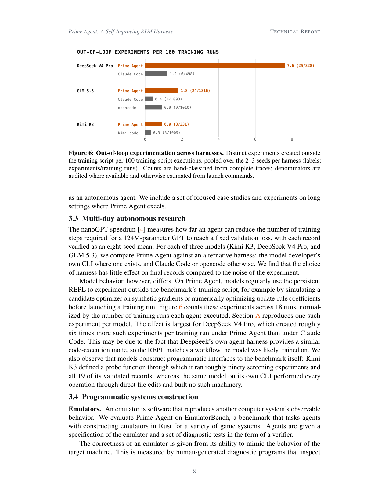
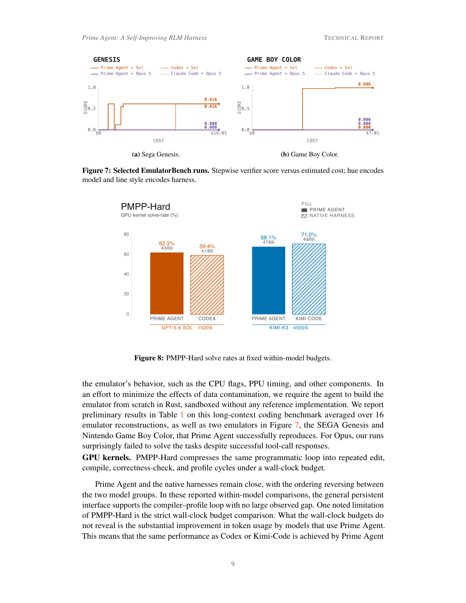

> [[../index|Wiki]] | [[../summary|Summary]] | [[../digest|Digest]]

# Autonomous Research and Programmatic Systems

**In one sentence:** Across multi-day research (nanoGPT speedrun) and programmatic systems tasks (EmulatorBench, PMPP-Hard), the choice of harness changes *how* models work — eliciting far more out-of-loop experimentation and programmatic self-machinery than it changes final results, which are dominated by the model itself and by cost/token efficiency in the harness's favor.

## Key points

- On the nanoGPT speedrun benchmark, the choice between Prime Agent and the reference harness (the model developer's own CLI, or Claude Code / opencode) has little effect on final records compared with the noise of the experiment.
- Prime Agent reliably elicits more out-of-loop experimentation: models use the persistent REPL to probe the benchmark — e.g., simulating a candidate optimizer on synthetic gradients or numerically optimizing update-rule coefficients — before launching a training run.
- DeepSeek V4 Pro is the most affected model, creating roughly six times more out-of-loop experiments per training run under Prime Agent than under Claude Code, likely because DeepSeek's own CLI offers a similar code-execution mode that matches the model's training-time workflow.
- Models build programmatic interfaces to the benchmark itself under Prime Agent: Kimi K3 defined a probe function through which it ran roughly ninety screening experiments and all 19 of its validated records, whereas the same model on its own CLI did every operation through direct file edits and built no such machinery.
- On EmulatorBench (emulators of game consoles built from scratch in Rust), the model dominates the outcome: Sol-backed runs reach a high verifier-score plateau at low cost (≈0.6 on SEGA Genesis, near 1.0 on Game Boy Color) while Opus-backed runs score ≈0.0 across the entire cost range.
- Opus runs on EmulatorBench failed to solve the tasks despite successful tool-call responses, and EmulatorBench results are reported as preliminary, averaged over 16 emulator reconstructions.
- On PMPP-Hard GPU kernels at fixed within-model wall-clock budgets (GPT-5.6 Sol @ 1500 s; Kimi-K3 @ 4500 s), Prime Agent and the native harness remain close, with the ordering reversing between the two model groups: Prime Agent slightly ahead on Sol (≈62.3% vs ≈59.4%) and slightly behind on Kimi (≈68.1% vs ≈71.0%).
- Beyond wall clock, Prime Agent shows a substantial token-usage advantage: the same performance as Codex or Kimi-Code is achieved at substantially reduced cost, so token-for-token Prime Agent has the advantage.

---

## Multi-day autonomous research (3.3, nanoGPT speedrun)

The nanoGPT speedrun [4] measures how far an agent can reduce the number of training steps required for a 124M-parameter GPT to reach a fixed validation loss, with each record verified as an eight-seed mean. For each of three models — Kimi K3, DeepSeek V4 Pro, and GLM 5.3 — the paper compares Prime Agent against an alternative harness: the model developer's own CLI where one exists, and Claude Code or opencode otherwise. The choice of harness has little effect on final records compared to the noise of the experiment.

Model *behavior*, however, differs. On Prime Agent, models regularly use the persistent REPL to experiment outside the benchmark's training script — for example by simulating a candidate optimizer on synthetic gradients or numerically optimizing update-rule coefficients before launching a training run. Figure 6 counts these experiments across 18 runs, normalized by the number of training runs each agent executed; Section A reproduces one such experiment per model. The effect is largest for DeepSeek V4 Pro, which created roughly six times more such experiments per training run under Prime Agent than under Claude Code. This may be because DeepSeek's own agent harness provides a similar code-execution mode, so the REPL matches a workflow the model was likely trained on. The authors also observe that models construct programmatic interfaces to the benchmark itself: Kimi K3 defined a probe function through which it ran roughly ninety screening experiments and all 19 of its validated records, whereas the same model on its own CLI performed every operation through direct file edits and built no such machinery.

Grouped bars compare distinct out-of-loop experiments per 100 training-script executions (pooled over 2–3 seeds, raw ratios annotated per bar) for each of DeepSeek V4 Pro, GLM 5.3, and Kimi K3 under Prime Agent (orange) versus the reference harness — the model's own CLI or Claude Code/opencode (gray) — with the Prime Agent bar exceeding the reference in every group and the largest gap on DeepSeek V4 Pro.

## Programmatic systems construction (3.4)

### Emulators

An emulator is software that reproduces another computer system's observable behavior. The paper evaluates Prime Agent on EmulatorBench, which tasks agents with constructing emulators in Rust for a variety of game systems. Agents are given a specification of the emulator and a set of diagnostic tests in the form of a verifier; an emulator's correctness is measured by its ability to mimic the target machine's behavior, inspected via human-generated diagnostic programs that check components such as the CPU flags and PPU timing. To minimize the effects of data contamination, the agent must build the emulator from scratch in Rust, sandboxed without any reference implementation.

Preliminary results are reported in Table 1 on this long-context coding benchmark, averaged over 16 emulator reconstructions, as well as two emulators in Figure 7 — the SEGA Genesis and Nintendo Game Boy Color — that Prime Agent successfully reproduces. For Opus, the runs surprisingly failed to solve the tasks despite successful tool-call responses.

Two-part image: (a) stepwise verifier score versus estimated cost ($0–$16) for the SEGA Genesis and (b) for Game Boy Color ($0–$7), where Sol-based harnesses (orange; Prime Agent solid, Codex dashed) climb quickly to a ≈0.6 (Genesis) / near-1.0 (GBC) plateau while Opus 5-based runs (purple; Claude Code dotted) stay flat near 0.0; and PMPP-Hard GPU-kernel solve rates where Prime Agent is slightly ahead on GPT-5.6 Sol (62.3% / 43 of 69 vs 59.4% / 41 of 69) and slightly behind on Kimi-K3 (68.1% / 47 of 69 vs 71.0% / 49 of 69) at fixed within-model budgets (1500 s and 4500 s respectively).

### GPU kernels (PMPP-Hard)

PMPP-Hard compresses the same programmatic loop into repeated edit, compile, correctness-check, and profile cycles under a wall-clock budget. Prime Agent and the native harnesses remain close, with the ordering reversing between the two model groups. In these reported within-model comparisons, the general persistent interface supports the compiler–profile loop with no large observed gap. One noted limitation of PMPP-Hard is the strict wall-clock budget comparison: what the wall-clock budgets do not reveal is the substantial improvement in token usage by models that use Prime Agent. This means that the same performance as Codex or Kimi-Code is achieved by Prime Agent at substantially reduced cost, and, token-for-token, Prime Agent has an advantage.

**Covers:** Section 3.3, 3.4, Figures 6, 7, 8
