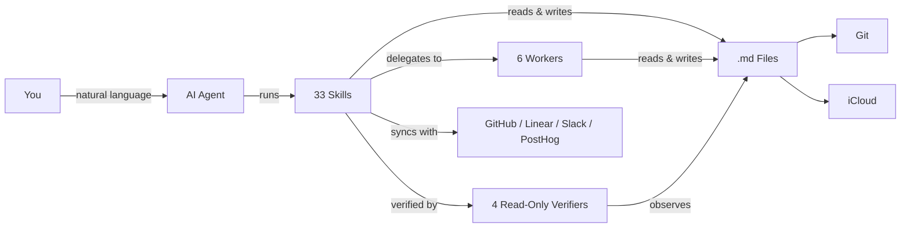

PDF-Location: https://github.com/huytieu/COG-second-brain (no local source.pdf; kind repo via git-clone)
# huytieu/COG-second-brain
Source: https://github.com/huytieu/COG-second-brain
Kind: repo
Fetched: 2026-09-26T13:43:06.941205+00:00
Tool: git-clone
Research-Target: /Users/sergii/.ai/knowledge/research_topics/agent_memory/research/AgentBrain
Topic: agent_memory

# huytieu/COG-second-brain

Commit: c6cb32807254254abff0a04a8a59df2ac9e39eb9

## README

# COG: The Agentic Second Brain That Actually Self-Evolves

**Cognition + Obsidian + Git** — A self-evolving second brain powered by AI agents, markdown files, and version control. No database, no vendor lock-in — just `.md` files that think.

[Quick Start](#quick-start) | [Skills](#skills) | [Features](#features-at-a-glance) | [FAQ](#faq) | [SETUP.md](SETUP.md)

> Works with [Claude Code](https://claude.ai/download) &bull; Antigravity &bull; [Cursor](https://cursor.com/) &bull; [Kiro](https://kiro.dev/) &bull; [Gemini CLI](https://github.com/google-gemini/gemini-cli) &bull; [OpenAI Codex](https://github.com/openai/codex) &bull; any AI that reads markdown
>
> Inspired by [Garry Tan's gstack](https://github.com/garrytan/gstack) and [gbrain](https://github.com/garrytan/gbrain)




## Quick Start

**1. Clone & enter the repo:**
```bash
git clone https://github.com/huytieu/COG-second-brain.git
cd COG-second-brain
```

**2. Run onboarding in your agent:**

| Agent | Command | How it finds skills |
|---|---|---|
| Claude Code | `code .` → "Run onboarding" | `.claude/skills/` |
| Antigravity | Open folder → "Run onboarding" | `.agents/skills/` + `.agents/rules/cog.md` |
| Cursor | Open folder → "Run onboarding" | `.cursor-plugin/` + `.cursorrules` |
| Kiro | Open folder → "setup COG" | `.kiro/powers/` |
| Gemini CLI | `gemini` → `/onboarding` | `GEMINI.md` + `.gemini/commands/` |
| OpenAI Codex | `codex` → "Run onboarding" | `AGENTS.md` |
| Other agents | Point at `AGENTS.md` → "Run onboarding" | `AGENTS.md` |

**Or install via [skills.sh](https://skills.sh):**
```bash
npx skills add huytieu/COG-second-brain
```

Done — COG is personalized and ready in ~2 minutes. See [SETUP.md](SETUP.md) for optional config (Git sync, iCloud, Obsidian Tasks, etc.).


## Agent Support Matrix

COG ships a **full Claude Code surface**, a **full Antigravity surface**, plus **core native surfaces** for Kiro and Gemini CLI, with `AGENTS.md` as the universal fallback for Codex and other markdown-reading agents.

| Surface | Current support | Notes |
|---|---|---|
| Claude Code | 33 native skills + 10 agents (6 workers + 4 verifiers) | Full first-class surface |
| Antigravity | 33 skills + 10 agents (pointer-stub format) | Full surface — thin stubs in `.agents/` delegate to the `.claude/` playbooks, which stay authoritative |
| [Agent Plugins](https://agent-plugins.org) standard | Root `plugin.json` + `skills/` (33 skills) | Spec 1.0.0 conformant; any standard-aware client loads COG as a plugin |
| Cursor | Plugin manifest + rules | `.cursor-plugin/plugin.json` + `.cursorrules` |
| Kiro | 7 native powers | Core workflows today |
| Gemini CLI | 7 native commands | Core workflows today |
| `AGENTS.md` | 33 documented commands | Universal fallback for Codex and other agents |

Before publishing or updating framework files, run `./scripts/validate-agent-surface.sh` to catch drift between manifests, docs, and shipped files. See [docs/AGENT-SUPPORT.md](docs/AGENT-SUPPORT.md) for the detailed support matrix and contributor rules.


### Core Skills (Personal Knowledge)

| Skill | What it does | Try saying... |
|---|---|---|
| **onboarding** | Personalize COG for your workflow (run first!) | "Run onboarding" |
| **braindump** | Capture raw thoughts with intelligent classification | "I need to braindump" |
| **daily-brief** | Verified news intelligence (7-day freshness) | "Give me my daily brief" |
| **url-dump** | Save URLs with auto-extracted insights | "Save this URL" |
| **weekly-checkin** | Cross-domain pattern analysis | "Weekly review" |
| **knowledge-consolidation** | Build frameworks from scattered notes | "Consolidate my knowledge" |
| **update-cog** | Update framework files without touching your content | "Update COG" |
| **memory-hygiene** | Trust sweep of persistent memory — re-verify claims against the live environment, stamp `last_verified` + confidence | "Audit my memories" |


### Team Intelligence Skills (for Product & Engineering Leads)

| Skill | What it does | Try saying... |
|---|---|---|
| **team-brief** | Cross-reference GitHub + Linear + Slack + PostHog into a daily team intelligence brief with two-way Linear sync-back | "Team brief" / "What did we ship?" |
| **meeting-transcript** | Process meeting recordings into structured decisions, action items, and team dynamics | "Process this meeting" |
| **comprehensive-analysis** | Deep 7-day analysis for weekly reviews, board prep, or strategic planning (~8-12 min) | "Weekly analysis" / "Board prep" |


### PM Workflow Skills (for Product Managers)

| Skill | What it does | Try saying... |
|---|---|---|
| **create-user-story** | Create user stories with duplicate checking across Linear, GitHub Issues, or Jira | "Create a user story for..." |
| **generate-prd** | Draft PRDs with approval gate before publishing to Confluence/Notion | "Generate a PRD for..." |
| **generate-release-notes** | Generate release notes from GitHub milestones, Linear cycles, or manual input | "Generate release notes for v2.1" |
| **export-open-issues** | Audit and export open issues from any tracker into a structured vault summary | "Export open issues" |
| **publish-to-confluence** | Publish any vault markdown file to Confluence | "Publish this to Confluence" |
| **update-knowledge-base** | Maintain product knowledge base from releases, features, and project changes | "Update the knowledge base with v2.1 changes" |

> **PM Workflow:** These skills form a complete product management lifecycle: **Research** (`/auto-research`) → **PRD** (`/generate-prd`) → **Stories** (`/create-user-story`) → Development → **Release Notes** (`/generate-release-notes`) → **Knowledge Base** (`/update-knowledge-base`). Use `/export-open-issues` for audits and `/publish-to-confluence` to share externally.


### Strategic Research

| Skill | What it does | Try saying... |
|---|---|---|
| **auto-research** | Deep strategic research engine — decomposes questions into parallel research threads with multiple agents | "Research the future of AI testing tools" |


### Content Creation

| Skill | What it does | Try saying... |
|---|---|---|
| **content-factory** | Autonomous content pipeline — scout announcements, triage by trend momentum + your unique angle, publish with ledger dedup, hard volume caps, and screenshot-verified posting | "Run the content factory" |


### Verification Harness

Opt-in. Ask for one of these and work walks a **V**: decompose left into falsifiable criteria, build at the apex, verify right with evidence traced back to each criterion. Say nothing and none of it runs: ordinary work carries no checkpoints and no evidence ledger. Turn it on per request, or by default for build tasks with `verification_harness: on` in `00-inbox/MY-PROFILE.md`. Full lifecycle in [WORKFLOW.md](WORKFLOW.md).

| Skill | What it does | Try saying... |
|---|---|---|
| **closed-loop** | Plan → build → component verify → integration verify → acceptance. The worker never grades its own homework; verifiers observe the artifact, not the worker's summary | "Run this through the closed loop" |
| **ultragoal** | A goal too big for one session, run as a chain of phases with cross-session state and a north-star acceptance gate | "Track this as an ultragoal" |
| **harvest** | Capture session learnings, stage them for approval, propose skill patches. Never writes durable knowledge unapproved | "Harvest what we learned" |
| **retro** | Audit the run's checkpoints and *evidence quality*. A run can pass every gate on weak observations | "Retro this run" |
| **review-cockpit** | One living doc per multi-item session: progress, per-item cards, and an approval slot you edit in place | "Set up a review cockpit" |


### Craft Skills (Writing & Visuals)

| Skill | What it does | Try saying... |
|---|---|---|
| **no-ai-slop** | Sharpen a draft without flattening its voice, or just detect AI-slop patterns | "Make this less AI-sounding" |
| **slop-gate** | Refuse slop tells in anything about to be written, published, or sent; runs in CI or as a hook | "Scan this before I publish" |
| **voice-baseline** | Measure the words and shapes you over-use so an agent stops amplifying your tics | "Why do my drafts all sound the same?" |
| **editorial-illustrations** | Claim → geometry: derive the *right* figure from what the text argues, render it as self-contained theme-aware HTML/SVG | "Make a diagram for this argument" |
| **data-forms** | 20+ chart and diagram forms with when-to-use, failure modes, and the encoding discipline that makes any of them readable | "The bar chart is burying the point" |
| **museum-art** | Real public-domain artwork from museum open-access APIs instead of AI-generated or stock imagery | "Find a hero image for this post" |
| **daily-journal** | A passive work journal the agent keeps for you, plus a guided reflection on request | "Reflect on today" |


### Design Skills (Anti-Slop UI)

A paired set. `taste-skill` owns first-impression surfaces, `product-ui-taste` owns surfaces people use every day. Never run both on the same component.

| Skill | Owns | Try saying... |
|---|---|---|
| **taste-skill** | Landing pages, portfolios, marketing, editorial. States a "Design Read" before writing code so it stops defaulting to one house aesthetic | "Build a landing page for this" |
| **product-ui-taste** | Dashboards, data tables, forms, wizards, settings, admin consoles. Budgets the frame in px first, then survives real data: overflow, long labels, empty/error/permission-denied states | "Build the admin table for this" |


### Agents (Specialist Sessions)

COG uses a worker agent architecture inspired by [garrytan/gstack](https://github.com/garrytan/gstack) specialist sessions and [garrytan/gbrain](https://github.com/garrytan/gbrain) knowledge patterns. Workers handle data-heavy tasks cheaply (Sonnet) while the lead session does reasoning (Opus).

| Agent | What it does | Model |
|---|---|---|
| **worker-data-collector** | Structured extraction from GitHub, Slack, Jira, Linear | Sonnet |
| **worker-researcher** | Web research with source citations | Sonnet |
| **worker-file-ops** | Vault file operations, metadata, profiles | Sonnet |
| **worker-executor** | Pre-approved mutations (Jira, Linear, APIs) | Sonnet |
| **worker-publisher** | Publishing to Slack, Confluence, Notion | Sonnet |
| **brief-people-updater** | Batch-update people profiles from meetings/briefs | Sonnet |

**Read-only verifiers** (they cannot edit files or mutate external state):

| Agent | What it does | Checkpoint |
|---|---|---|
| **task-verifier** | Checks output against acceptance criteria by observing the artifact | CP-3v |
| **integration-verifier** | Cross-task wiring and global acceptance | CP-4 |
| **fix-agent** | Targeted fixes after a `FAIL:fixable` verdict; max 2 attempts | CP-3v retry |
| **harvest-curator** | Shapes session learnings into adoption notes; propose-only | CP-7 |

> Workers write results to `/tmp/` files and return only a status + path. The lead reads the file for synthesis. This eliminates slow token generation in agent output.
>
> Verifiers receive **paths only**, never a worker's output. Pasted context induces narrativisation: the verifier classifies the framing instead of independently reading the source.


### People CRM (Knowledge-Based Team Profiles)

Track the people you work with using progressive, evidence-based profiles in `05-knowledge/people/`. Profiles auto-escalate via tiered enrichment:

- **Tier 3 (Stub)** — 1 mention: name, role, one-line context
- **Tier 2 (Moderate)** — 3+ mentions: executive snapshot, working style, stren

... (truncated, 8880 more characters)

## Top-level layout

- .agents/ (dir, 46 files, ~452 lines)
- .claude/ (dir, 93 files, ~16010 lines)
- .claude-plugin/ (dir, 1 files, ~327 lines)
- .cursor-plugin/ (dir, 1 files, ~218 lines)
- .cursorrules (~58 lines)
- .gemini/ (dir, 14 files, ~426 lines)
- .github/ (dir, 3 files, ~242 lines)
- .gitignore (~57 lines)
- .kiro/ (dir, 7 files, ~772 lines)
- 00-inbox/ (dir, 1 files, ~0 lines)
- 01-daily/ (dir, 4 files, ~0 lines)
- 02-personal/ (dir, 2 files, ~0 lines)
- 03-professional/ (dir, 2 files, ~0 lines)
- 04-projects/ (dir, 1 files, ~0 lines)
- 05-knowledge/ (dir, 6 files, ~77 lines)
- 06-templates/ (dir, 2 files, ~41 lines)
- AGENTS.md (~1081 lines)
- CHANGELOG.md (~877 lines)
- CLAUDE.md (~249 lines)
- cog-update.sh (~565 lines)
- COG-VERSION (~1 lines)
- CONTRIBUTING.md (~249 lines)
- docs/ (dir, 2 files, ~152 lines)
- GEMINI.md (~39 lines)
- LICENSE (~21 lines)
- marketplace-entry.json (~40 lines)
- plugin.json (~32 lines)
- README.md (~333 lines)
- scripts/ (dir, 2 files, ~195 lines)
- SETUP.md (~532 lines)
- skills/ (dir, 72 files, ~13876 lines)
- WORKFLOW.md (~186 lines)

