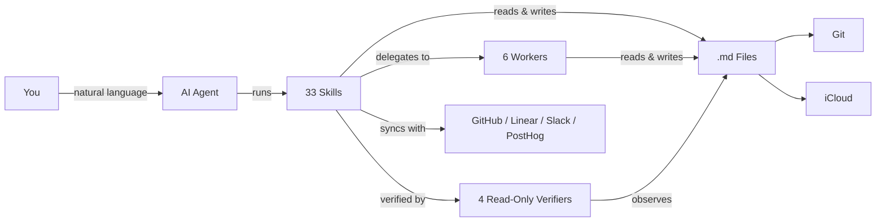

> [[../index|Wiki]] | [[../summary|Summary]] | [[../digest|Digest]]
# Overview
**In one sentence:** COG is a self-evolving second brain built on Cognition + Obsidian + Git — AI agents, markdown files, and version control with no database and no vendor lock-in.
## Key points
- COG is defined as **Cognition + Obsidian + Git**, a self-evolving second brain where `.md` files do the thinking, with no database and no vendor lock-in (`README.md:9`).
- The runtime flow is You → AI Agent → 33 Skills → 6 Workers plus 4 read-only Verifiers → `.md` files → Git/iCloud, with external sync to GitHub / Linear / Slack / PostHog (`README.md:17-29`).
- Onboarding takes ~2 minutes: clone the repo, run onboarding in your agent (per-agent command table), optionally via `npx skills add huytieu/COG-second-brain` (`README.md:35-58`).
- COG ships a full Claude Code surface (33 skills + 10 agents) and a full Antigravity surface (pointer stubs delegating to authoritative `.claude/` playbooks), plus an Agent Plugins standard surface, Cursor plugin + rules, 7 Kiro powers, 7 Gemini CLI commands, and `AGENTS.md` as universal fallback (`README.md:64-74`).
- The skill catalog spans personal knowledge (8 skills), team intelligence (3), PM workflows (6 forming a Research → PRD → Stories → Release Notes → Knowledge Base lifecycle), strategic research, content factory, an opt-in verification harness (5 skills), craft skills (7), and a paired anti-slop design set (`README.md:80-172`).
- Workers run data-heavy tasks cheaply on Sonnet while the lead session reasons on Opus; workers write results to `/tmp/` files and return status + path, and verifiers receive paths only to avoid narrativisation (`README.md:177-199`).
- People CRM keeps evidence-based team profiles in `05-knowledge/people/` with tiered enrichment (Stub at 1 mention, Moderate at 3+ mentions); the chunk truncates the Tier 2 description mid-word so further tiers are not described here (`README.md:203-208`).
---
## Concept and data flow
COG's whole model is one line (`README.md:9`):
> **Cognition + Obsidian + Git** — A self-evolving second brain powered by AI agents, markdown files, and version control. No database, no vendor lock-in — just `.md` files that think.
It works with Claude Code, Antigravity, Cursor, Kiro, Gemini CLI, OpenAI Codex, and any AI that reads markdown (`README.md:13`), and is inspired by `garrytan/gstack` and `garrytan/gbrain` (`README.md:15`). The architecture (`README.md:17-29`):

## Quick start and onboarding
Clone and enter the repo, then run onboarding in your agent (`README.md:35-41`):
```bash
git clone https://github.com/huytieu/COG-second-brain.git
cd COG-second-brain
```
| Agent | Command | How it finds skills (`README.md:43-51`) |
|---|---|---|
| Claude Code | `code .` → "Run onboarding" | `.claude/skills/` |
| Antigravity | Open folder → "Run onboarding" | `.agents/skills/` + `.agents/rules/cog.md` |
| Cursor | Open folder → "Run onboarding" | `.cursor-plugin/` + `.cursorrules` |
| Kiro | Open folder → "setup COG" | `.kiro/powers/` |
| Gemini CLI | `gemini` → `/onboarding` | `GEMINI.md` + `.gemini/commands/` |
| OpenAI Codex | `codex` → "Run onboarding" | `AGENTS.md` |
| Other agents | Point at `AGENTS.md` → "Run onboarding" | `AGENTS.md` |
Alternative install (`README.md:53-56`):
```bash
npx skills add huytieu/COG-second-brain
```
Done state is personalized and ready in ~2 minutes; `SETUP.md` holds optional config (Git sync, iCloud, Obsidian Tasks) (`README.md:58`).
## Agent support matrix
COG ships a full Claude Code surface, a full Antigravity surface, plus core native surfaces for Kiro and Gemini CLI, with `AGENTS.md` as the universal fallback (`README.md:64`). Before publishing or updating framework files, run `./scripts/validate-agent-surface.sh`; `docs/AGENT-SUPPORT.md` holds the detailed matrix and contributor rules (`README.md:76`).
| Surface | Current support | Notes (`README.md:66-74`) |
|---|---|---|
| Claude Code | 33 native skills + 10 agents (6 workers + 4 verifiers) | Full first-class surface |
| Antigravity | 33 skills + 10 agents (pointer-stub format) | Full surface — thin stubs in `.agents/` delegate to the `.claude/` playbooks, which stay authoritative |
| [Agent Plugins](https://agent-plugins.org) standard | Root `plugin.json` + `skills/` (33 skills) | Spec 1.0.0 conformant; any standard-aware client loads COG as a plugin |
| Cursor | Plugin manifest + rules | `.cursor-plugin/plugin.json` + `.cursorrules` |
| Kiro | 7 native powers | Core workflows today |
| Gemini CLI | 7 native commands | Core workflows today |
| `AGENTS.md` | 33 documented commands | Universal fallback for Codex and other agents |
## Skills catalog
Core personal-knowledge skills (`README.md:80-92`):
| Skill | What it does | Try saying... |
|---|---|---|
| **onboarding** | Personalize COG for your workflow (run first!) | "Run onboarding" |
| **braindump** | Capture raw thoughts with intelligent classification | "I need to braindump" |
| **daily-brief** | Verified news intelligence (7-day freshness) | "Give me my daily brief" |
| **url-dump** | Save URLs with auto-extracted insights | "Save this URL" |
| **weekly-checkin** | Cross-domain pattern analysis | "Weekly review" |
| **knowledge-consolidation** | Build frameworks from scattered notes | "Consolidate my knowledge" |
| **update-cog** | Update framework files without touching your content | "Update COG" |
| **memory-hygiene** | Trust sweep of persistent memory — re-verify claims against the live environment, stamp `last_verified` + confidence | "Audit my memories" |
Team intelligence skills for product and engineering leads (`README.md:95-101`):
| Skill | What it does | Try saying... |
|---|---|---|
| **team-brief** | Cross-reference GitHub + Linear + Slack + PostHog into a daily team intelligence brief with two-way Linear sync-back | "Team brief" / "What did we ship?" |
| **meeting-transcript** | Process meeting recordings into structured decisions, action items, and team dynamics | "Process this meeting" |
| **comprehensive-analysis** | Deep 7-day analysis for weekly reviews, board prep, or strategic planning (~8-12 min) | "Weekly analysis" / "Board prep" |
PM workflow skills for product managers (`README.md:105-114`):
| Skill | What it does | Try saying... |
|---|---|---|
| **create-user-story** | Create user stories with duplicate checking across Linear, GitHub Issues, or Jira | "Create a user story for..." |
| **generate-prd** | Draft PRDs with approval gate before publishing to Confluence/Notion | "Generate a PRD for..." |
| **generate-release-notes** | Generate release notes from GitHub milestones, Linear cycles, or manual input | "Generate release notes for v2.1" |
| **export-open-issues** | Audit and export open issues from any tracker into a structured vault summary | "Export open issues" |
| **publish-to-confluence** | Publish any vault markdown file to Confluence | "Publish this to Confluence" |
| **update-knowledge-base** | Maintain product knowledge base from releases, features, and project changes | "Update the knowledge base with v2.1 changes" |
PM lifecycle order (`README.md:116`): **Research** (`/auto-research`) → **PRD** (`/generate-prd`) → **Stories** (`/create-user-story`) → Development → **Release Notes** (`/generate-release-notes`) → **Knowledge Base** (`/update-knowledge-base`); `/export-open-issues` for audits, `/publish-to-confluence` to share externally.
Strategic research (`README.md:120-124`): **auto-research** decomposes questions into parallel research threads with multiple agents. Content creation (`README.md:128-132`): **content-factory** scouts announcements, triages by trend momentum + unique angle, publishes with ledger dedup, hard volume caps, and screenshot-verified posting.
Craft skills for writing and visuals (`README.md:150-160`): **no-ai-slop**, **slop-gate** (runs in CI or as a hook), **voice-baseline**, **editorial-illustrations** (claim → geometry as theme-aware HTML/SVG), **data-forms** (20+ chart/diagram forms), **museum-art** (public-domain museum open-access imagery), **daily-journal** (passive work journal plus guided reflection).
Design skills are a paired anti-slop set that must never both run on the same component (`README.md:164-171`): **taste-skill** owns first-impression surfaces (landing, portfolio, marketing, editorial; states a "Design Read" first) and **product-ui-taste** owns everyday surfaces (dashboards, tables, forms, wizards, settings, admin; budgets the frame in px first, survives overflow, long labels, empty/error/permission-denied states).
## Verification harness
Opt-in only: ask for a skill with a **V** and work walks a V-shape — decompose left into falsifiable criteria, build at the apex, verify right with evidence traced to each criterion; unasked, ordinary work carries no checkpoints and no evidence ledger; enable per request or by default for build tasks with `verification_harness: on` in `00-inbox/MY-PROFILE.md`, full lifecycle in `WORKFLOW.md` (`README.md:138`).
| Skill | What it does | Try saying... (`README.md:140-146`) |
|---|---|---|
| **closed-loop** | Plan → build → component verify → integration verify → acceptance. The worker never grades its own homework; verifiers observe the artifact, not the worker's summary | "Run this through the closed loop" |
| **ultragoal** | A goal too big for one session, run as a chain of phases with cross-session state and a north-star acceptance gate | "Track this as an ultragoal" |
| **harvest** | Capture session learnings, stage them for approval, propose skill patches. Never writes durable knowledge unapproved | "Harvest what we learned" |
| **retro** | Audit the run's checkpoints and *evidence quality*. A run can pass every gate on weak observations | "Retro this run" |
| **review-cockpit** | One living doc per multi-item session: progress, per-item cards, and an approval slot you edit in place | "Set up a review cockpit" |
## Workers, verifiers, and handoff discipline
Worker architecture is inspired by `garrytan/gstack` specialist sessions and `garrytan/gbrain` knowledge patterns; workers handle data-heavy tasks cheaply (Sonnet) while the lead session does reasoning (Opus) (`README.md:177`).
| Agent | What it does | Model (`README.md:180-186`) |
|---|---|---|
| **worker-data-collector** | Structured extraction from GitHub, Slack, Jira, Linear | Sonnet |
| **worker-researcher** | Web research with source citations | Sonnet |
| **worker-file-ops** | Vault file operations, metadata, profiles | Sonnet |
| **worker-executor** | Pre-approved mutations (Jira, Linear, APIs) | Sonnet |
| **worker-publisher** | Publishing to Slack, Confluence, Notion | Sonnet |
| **brief-people-updater** | Batch-update people profiles from meetings/briefs | Sonnet |
Read-only verifiers that cannot edit files or mutate external state (`README.md:188-195`):
| Agent | What it does | Checkpoint |
|---|---|---|
| **task-verifier** | Checks output against acceptance criteria by observing the artifact | CP-3v |
| **integration-verifier** | Cross-task wiring and global acceptance | CP-4 |
| **fix-agent** | Targeted fixes after a `FAIL:fixable` verdict; max 2 attempts | CP-3v retry |
| **harvest-curator** | Shapes session learnings into adoption notes; propose-only | CP-7 |
Handoff discipline (`README.md:197-199`): workers write results to `/tmp/` files and return only a status + path while the lead reads the file for synthesis; verifiers receive paths only, never a worker's output, because pasted context induces narrativisation.
## People CRM
Profiles live in `05-knowledge/people/` and auto-escalate via tiered enrichment (`README.md:203-205`): Tier 3 (Stub) at 1 mention holds name, role, one-line context; Tier 2 (Moderate) at 3+ mentions holds executive snapshot, working style, and more (`README.md:207-208`). Truncation note: the chunk cuts the Tier 2 line mid-word at "stren" (`README.md:208`), so no further tiers or fields are claimed here.
**Covers:** `README.md` (repo concept, mermaid data flow, Quick Start, Agent Support Matrix, skill catalog, worker/verifier architecture, People CRM); chunk lists macro component `top-level-files/` as a separate page.
