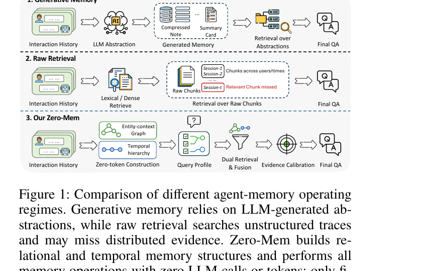

> [[../index|Wiki]] | [[../summary|Summary]] | [[../digest|Digest]]

# Problem, Motivation, and Related Work

**In one sentence:** LLM agents need memory over long interaction histories, but both dominant strategies — LLM-generated abstractions and flat retrieval over raw traces — have structural failure modes, so Zero-Mem asks whether an agent memory system can eliminate LLM calls from every memory operation except the final answer while still supporting structured, query-conditioned evidence access.

## Key points

- LLM agents accumulate growing interaction histories (utterances, actions, tool observations, outcomes), and their reliability depends on recovering the *right* evidence from that history, not just storing more of it — the challenge is retrieving evidence tied to the correct entity, session, and temporal state.
- Generative memory (LLM-generated summaries, compressed notes, graph indexes) makes large histories easier to access, but turns memory management into a recurring generative workload, and omitted details, merged subjects, or blurred temporal updates in the generated abstractions can weaken traceability back to the original interaction.
- Raw retrieval (flat lexical or dense search directly over unstructured traces) preserves source evidence but can confuse semantically similar traces from different users, sessions, or temporal states, and can fail when supporting evidence is distributed across multiple interactions.
- Recent systems (SimpleMem, LightMem) reduce — but do not eliminate — LLM dependence in the memory pipeline: SimpleMem improves token efficiency via semantic structured compression, online semantic synthesis, and intent-aware retrieval planning; LightMem shifts memory operations to small language models and separates online retrieval from offline consolidation. Neither targets a pipeline where final QA is the *only* LLM-dependent stage.
- Zero-Mem defines and targets a new operating regime, "zero-token memory operations": construction, organization, routing, retrieval, evidence closure, and both pre-reader and post-reader calibration use zero LLM calls and zero LLM input/output tokens; only the final-QA reader invokes an LLM (encoder computation is accounted for separately).
- Zero-Mem's approach: retain original interaction traces as the authoritative source of record, and derive two complementary non-generative views over them — an entity-context graph (relational access via co-occurrence/adjacency) and a temporal hierarchy (conversational locality and session state) — coordinated per query by a lightweight profile, with evidence closure and deterministic calibration producing the final evidence set.
- Headline efficiency claim: with an identical final-QA reader and equivalent context budget, Zero-Mem reduces memory-operation latency by 57.6% relative to the most time-efficient compared baseline, while achieving competitive QA performance on long-memory and long-context benchmarks.
- The paper's three stated contributions: (1) defining the zero-token agent memory operating regime; (2) introducing Zero-Mem as a provenance-preserving framework coordinating relational and temporal views for structured evidence selection over raw traces; (3) evaluating Zero-Mem on multiple long-memory benchmarks, showing competitive performance at zero memory-operation LLM cost and analyzing the contributions of its core modules via ablations.

---

## The problem: memory for LLM agents

LLM agents increasingly operate over extended interactions, accumulating utterances, actions, tool observations, and task outcomes. Their reliability depends not only on reasoning over the current input but on recovering the right evidence from a growing interaction history. A memory system must preserve information across sessions while preventing irrelevant or outdated traces from dominating the current decision. The paper frames the central challenge as no longer "how to store more context" but "how to recover evidence associated with the correct entity, session, and temporal state when it becomes relevant."

Across agent-memory and agentic structured-retrieval systems generally, language models have been used to summarize or reflect on experience, construct hierarchical abstractions and graph indexes, and generate or evolve linked memory records. These transformations can make large histories easier to access, but they also convert memory management into a recurring generative workload — every memory update or access potentially costs LLM tokens and time.

## Two existing strategies and their failure modes

The Introduction lays out two opposing strategies and the weakness of each:

- **Generative memory.** Systems generate intermediate records (summaries, compressed notes, abstractions) from the interaction history and mediate later retrieval through these generated artifacts. The risk: when generated abstractions mediate retrieval, omitted details, merged subjects, or blurred temporal updates can weaken traceability back to the original interaction. In other words, the abstraction becomes a lossy proxy for the ground truth, and errors introduced during generation propagate silently into downstream answers.
- **Raw retrieval.** The opposite strategy retains the complete history and retrieves directly from raw traces via flat lexical or dense retrieval. This preserves source evidence (nothing is summarized away), but flat retrieval can confuse semantically similar traces belonging to different users, sessions, or temporal states, and it may fail outright when the evidence needed to answer a query is distributed across multiple interactions rather than concentrated in one retrievable chunk.

The paper's conclusion from this tension: effective memory requires *both* faithful preservation of the original evidence *and* structured, query-conditioned evidence selection — neither pure generative abstraction nor pure flat retrieval delivers both properties.

Figure 1 (reproduced below) visualizes these two regimes alongside Zero-Mem's own pipeline. In the "Generative Memory" panel, interaction history is passed through an LLM to produce compressed notes/summary cards, and final QA retrieves over those abstractions. In the "Raw Retrieval" panel, interaction history across sessions is chunked and searched via lexical/dense retrieval directly, with the diagram noting that a "relevant chunk" can be missed. In the "Our Zero-Mem" panel, interaction history feeds a zero-token construction step that builds an entity-context graph and a temporal hierarchy; a query profile drives dual retrieval and fusion, followed by evidence calibration, before final QA.

Figure 1: Comparison of different agent-memory operating regimes. Generative memory relies on LLM-generated abstractions, while raw retrieval searches unstructured traces and may miss distributed evidence. Zero-Mem builds relational and temporal memory structures and performs all memory operations with zero LLM calls or tokens; only final QA invokes an LLM.

## Positioning against recent work

The Related Work section situates Zero-Mem against a broad set of agent-memory systems, most of which reduce but do not eliminate LLM involvement in the memory lifecycle:

- **Zep** (Rasmussen et al. 2025) builds a temporally aware knowledge-graph memory layer with episodic, semantic-entity, and community subgraphs, plus a dual-time model tracking event time and ingestion time separately.
- **Mem0** (Chhikara et al. 2025) incrementally extracts and updates memories through LLM tool calls for add, update, delete, and no-op operations; its graph variant, **Mem0g**, models entity relations with a directed labeled graph.
- **A-Mem** (Xu et al. 2025) follows the Zettelkasten note-taking method, constructing structured memory notes with keywords, tags, and contextual descriptions, and dynamically links related memories.
- **MemoryOS** (Kang et al. 2025) uses an operating-system-inspired architecture with short-term, mid-term, and long-term storage tiers, paging, and popularity-based updates.
- **GAM** (Yan et al. 2025) combines lightweight offline memory with online deep research under a "just-in-time" memory paradigm, constructing task-specific contexts but at higher query-time cost.
- **CompassMem** (Hu et al. 2026a) organizes experiences into event-centric memory graphs with explicit relations to support complex questions.
- **LightMem** (Fang et al. 2026) decouples memory updates from online inference, applying pre-compression and topic segmentation to reduce latency and token cost, and more specifically shifts several memory operations from large LLMs to specialized small language models while separating online retrieval from offline consolidation.
- **SimpleMem** (Liu et al. 2026) combines semantic structured compression, online semantic synthesis, and intent-aware retrieval planning to reduce token consumption, improving token efficiency relative to naive generative approaches.

The paper's verdict on this whole family: "Together, these systems improve memory efficiency, while many retain generative processing within the memory lifecycle." SimpleMem and LightMem are singled out as the closest, most recent points of comparison — both explicitly target reduced generative overhead — but neither reformulates the pipeline so that final question answering is the *only* LLM-dependent stage. This gap motivates the paper's central question: "Can an agent memory system eliminate LLM calls from every operation outside final question answering, while retaining structured access beyond flat similarity retrieval?"

## Zero-Mem's contribution

Zero-Mem answers that question affirmatively by reformulating memory operation as structured evidence selection over provenance-bearing interaction traces, rather than replacing histories with generated abstractions. Concretely:

- It retains the original interaction traces as the source of record and derives two complementary, non-generative views over them: an **entity-context graph** capturing observed co-occurrence and trace adjacency for relational access, and a **temporal hierarchy** preserving conversational locality and session-level state. Both views resolve to the same underlying provenance-bearing source units.
- At query time, a lightweight query profile coordinates the two views according to the structural requirements of the query; their rankings are fused, and an evidence-closure step supplements the top candidates with relational connections and surrounding trace context.
- Deterministic evidence calibration then produces a compact evidence set R(q) for final QA — discarding conflicting evidence before the reader sees it. The reader is the only LLM-dependent stage; a subsequent deterministic answer-calibration step applies evidence-support, type, and format checks without invoking another model.
- The net effect: no generated memory ever intervenes between the original trace and the evidence exposed to the reader, so the paper's zero-token operating regime (construction, organization, routing, retrieval, evidence closure, and both pre- and post-reader calibration all at zero LLM calls/tokens) is satisfied end to end.

The Abstract's headline results reiterate this: across long-memory and long-context QA benchmarks, Zero-Mem achieves competitive performance while eliminating LLM calls and LLM-token consumption from memory operations, and with the same final-QA reader and context budget it reduces memory-operation time cost by 57.6% relative to the fastest compared baseline. Ablations (detailed later in the paper) are reported to support the contribution of the two views and their query-dependent coordination.

**Covers:** Abstract, Introduction, Related Work (pp. 1-2)
