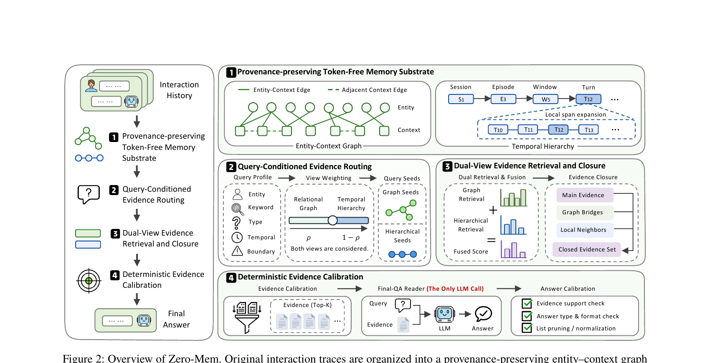

> [[../index|Wiki]] | [[../summary|Summary]] | [[../digest|Digest]]

# The Token-Free Memory Substrate: Entity-Context Graph and Temporal Hierarchy

**In one sentence:** Instead of compressing interaction history into LLM-generated memory statements, Zero-Mem keeps every original trace unit as the provenance-bearing source of record and derives two non-generative, complementary structural views over it — an entity–context graph for relational co-occurrence access and a multi-granularity temporal hierarchy for local/session context — both additionally indexed with BM25 lexical and BGE-M3 dense signals for retrieval.

## Key points

- Zero-Mem does **not** replace raw histories with generated abstractions; each derived unit keeps its original text plus source identifier, session time, boundary identifier, and other available metadata, so retrieved evidence stays traceable to observed interactions rather than model-generated memory statements.
- The agent history is formalized as $H = (s_1, \dots, s_T)$, a sequence of trace units that may contain user messages, assistant responses/actions, tool observations, timestamps, speakers, and session metadata; memory operation is $R(q) = \text{Memory}(q, H)$ and the reader produces $a = \text{Reader}(q, R(q))$.
- The **entity–context graph** $G = (V_d \cup V_e, E_{de} \cup E_{dd})$ is built by running a non-generative Named Entity Recognition model (e.g., spaCy) over each context unit: $V_d$ are context nodes, $V_e$ are entity nodes, $E_{de}$ are entity–context co-occurrence edges, and $E_{dd}$ are adjacency edges between neighboring context units.
- An entity–context edge is added whenever entity $e$ is detected in context unit $d_i$, weighted by normalized occurrence frequency: $w(d_i, e) = \dfrac{c(e, d_i)}{\sum_{e' \in E(d_i)} c(e', d_i)}$, where $c(e, d_i)$ is the occurrence frequency of $e$ in $d_i$ and $E(d_i)$ is the set of entities detected in $d_i$.
- The graph records only **observed** co-occurrence and trace adjacency — it does not generate semantic triples or inferred relations — and adjacent context units are connected to preserve local continuity.
- The **temporal hierarchy** organizes traces at four granularities, $T(H) = U_{turn} \cup U_{window} \cup U_{episode} \cup U_{local}$: turns preserve atomic utterances, windows retain short-range context, episodes group adjacent windows into coherent event regions using semantic continuity and available temporal/session boundaries, and local spans preserve the immediate neighborhood of a candidate turn for when selected evidence needs surrounding context.
- All hierarchy units, like the graph nodes, inherit provenance from their underlying raw traces.
- On top of both structural views, Zero-Mem indexes trace units with lexical statistics (**BM25**) for exact names/dates/numbers/titles/phrases, and dense embeddings (**BGE-M3**) as semantic anchors for when surface overlap is weak — giving every retrieval a dual lexical + dense access signal.

---

## Preliminaries

An LLM agent accumulates a history of past interactions $H = (s_1, \dots, s_T)$, where each trace unit $s_i$ may contain user messages, assistant responses or actions, tool observations, timestamps, speakers, and session metadata. Given a current query $q$, an agent memory system retrieves relevant information from the history to construct an evidence set:

$$R(q) = \text{Memory}(q, H) \tag{1}$$

A reader LLM then uses the retrieved evidence to produce the answer:

$$a = \text{Reader}(q, R(q)) \tag{2}$$

In this work, Zero-Mem instantiates the memory function through non-generative memory construction, organization, retrieval, routing, and calibration.

## Overview of Zero-Mem

Zero-Mem implements the memory function through token-free evidence selection. It retains original interaction traces as the authoritative memory source and builds non-generative retrieval structures over them. Zero-Mem consists of four components:

1. **Provenance-preserving Token-Free Memory Substrate** (this page)
2. Query-Conditioned Evidence Routing
3. Dual-View Evidence Retrieval and Closure
4. Deterministic Evidence Calibration

The graph view recovers relational evidence, while the hierarchical view preserves local, temporal, and session context. Routing controls their relative priority, closure supplements the retrieved candidates with structurally related evidence, and calibration removes inconsistent or unsupported content. All memory operations are token-free, and only the final reader produces the answer. Components 2–4 (routing, dual-view retrieval/closure, and calibration) are covered in depth on the next wiki page; they are only referenced here as the consumers of the substrate described below.

## The provenance-preserving substrate

Zero-Mem does not replace raw histories with generated abstractions. Each derived unit retains its original text together with source identifier, session time, boundary identifier, and other available metadata. Consequently, retrieved evidence remains traceable to observed interactions rather than model-generated memory statements. This is the structural premise that lets every later stage (routing, retrieval, closure, calibration) operate without ever calling an LLM: because nothing about the substrate is generated, there is nothing to hallucinate or verify against a source — the source *is* the substrate.

## Entity-Context Graph construction

**Relational trace graph.** Zero-Mem applies the non-generative Named Entity Recognition (NER) model (e.g., spaCy) to each context unit and constructs an observed entity–context graph from the detected entities:

$$G = (V_d \cup V_e, E_{de} \cup E_{dd}) \tag{3}$$

where $V_d$ and $V_e$ denote context and entity nodes, respectively. $E_{de}$ contains entity–context co-occurrence edges, and $E_{dd}$ contains adjacency edges between neighboring context units.

An entity–context edge is added when entity $e$ is detected in context unit $d_i$, with weight:

$$w(d_i, e) = \frac{c(e, d_i)}{\sum_{e' \in E(d_i)} c(e', d_i)} \tag{4}$$

where $c(e, d_i)$ is the occurrence frequency of $e$ in $d_i$. $E(d_i)$ denotes the set of entities detected in $d_i$. Adjacent context units are also connected to preserve local continuity. The graph records observed co-occurrence and trace adjacency rather than generating semantic triples or inferred relations.

## Temporal Hierarchy

**Hierarchical trace units.** Graph structure alone does not preserve the local order and temporal state of an interaction. Zero-Mem organizes traces at multiple granularities:

$$T(H) = U_{turn} \cup U_{window} \cup U_{episode} \cup U_{local} \tag{5}$$

Turns preserve atomic utterances, windows retain short-range context, and episodes group adjacent windows into coherent event regions according to semantic continuity and available temporal or session boundaries. Local spans preserve the immediate neighborhood of a candidate turn and are used when the selected evidence requires surrounding context. All units inherit provenance from their underlying raw traces.

The figure's Temporal Hierarchy diagram illustrates this nesting concretely: a session S1 contains episode E3, which contains window W5, which contains turn T12, alongside a local span expansion around T12 that reaches out to neighboring turns T10–T13.

## Lexical and dense access signals

Zero-Mem additionally indexes trace units with lexical statistics (BM25) and dense embeddings (BGE-M3). Lexical signals identify exact names, dates, numbers, titles, and phrases, while dense signals provide semantic anchors when surface overlap is weak. These two signals are what later let Query-Conditioned Evidence Routing and Dual-View Evidence Retrieval (page 03) score candidates from both the graph and the hierarchy without any LLM call — the entity–context graph and the temporal hierarchy supply the *structure*, while BM25 and BGE-M3 supply the *matching* signal against a query.

*Figure 2 shows the full Zero-Mem architecture in four panels. This page's focus is the top panel, "Provenance-preserving Token-Free Memory Substrate," depicting the Entity-Context Graph (entity and context nodes linked by entity–context edges and adjacent-context edges) and the Temporal Hierarchy (Session → Episode → Window → Turn, with local span expansion around a candidate turn). The remaining three panels — Query-Conditioned Evidence Routing, Dual-View Evidence Retrieval and Closure, and Deterministic Evidence Calibration — are covered on the next wiki page.*

---

**Covers:** Preliminaries, Method §Provenance-preserving Token-Free Memory Substrate (pp. 2-3)
