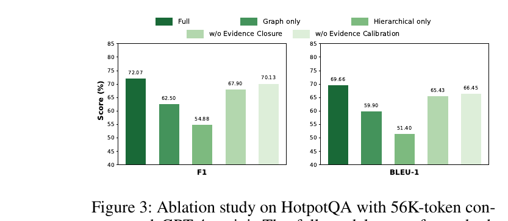
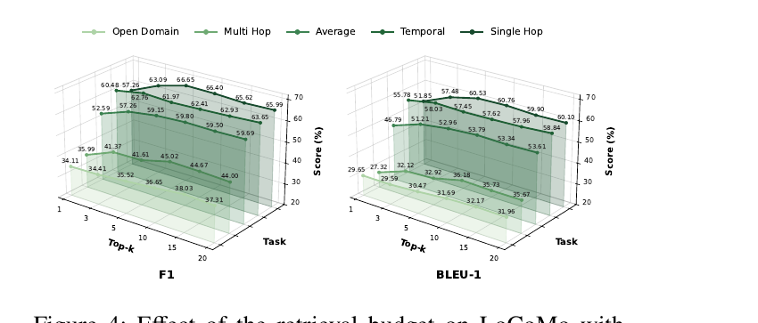

> [[../index|Wiki]] | [[../summary|Summary]] | [[../digest|Digest]]

# Experiments, Results, and Conclusion

**In one sentence:** Across LoCoMo (conversational memory) and HotpotQA (long-context multi-hop QA), under two backbone LLMs and eight memory-based/memory-free baselines, Zero-Mem achieves the best answer quality (average F1/BLEU-1 of 59.15/52.96 on LoCoMo with GPT-4o-mini, +5.40/+5.45 over the strongest baseline GAM) while consuming zero memory-operation tokens and cutting memory-operation latency by 57.6% versus the fastest baseline, with ablations confirming that the graph and hierarchical views are complementary and retrieval saturates around Top-10.

## Key points

- On LoCoMo with GPT-4o-mini, Zero-Mem reaches the best average F1/BLEU-1 of 59.15/52.96, beating the strongest baseline GAM (53.75/47.51) by 5.40 F1 and 5.45 BLEU-1 points; with Qwen2.5-14B, Zero-Mem scores 57.57/51.41 average F1/BLEU-1, beating GAM (52.70/46.55) by 4.87/4.86 points and ranking first across every single question type and metric.
- On HotpotQA, Zero-Mem achieves the highest F1 across all six backbone/context-length combinations (56K/224K/448K tokens, GPT-4o-mini and Qwen2.5-14B), e.g. 72.07 F1 at 56K and 65.04 F1 at 448K with GPT-4o-mini, for an average improvement of 5.52 F1 points over the strongest baseline (GAM) as context length scales up.
- In the efficiency comparison (Table 2, GPT-4o-mini, unified config), Zero-Mem consumes exactly 0 memory-operation tokens versus 28,570,674 for GAM and 877,086 for LightMem (the most token-efficient baseline), a 100% token reduction, while still improving F1/BLEU-1 over GAM by 10.0%/11.5%.
- Zero-Mem's total memory-operation time is 334.77s (0.22s/query), a 57.6% latency reduction relative to LightMem, the fastest baseline at 788.76s (0.51s/query) — demonstrating that removing LLM calls from memory operations does not shift cost into a slower non-generative pipeline.
- The ablation on HotpotQA (56K tokens, GPT-4o-mini) shows the full model at 72.07 F1/69.66 BLEU-1 drops to 62.50/59.90 with graph-view only and to 54.88/51.40 with hierarchical-view only, confirming the two views are complementary rather than redundant.
- Removing evidence closure lowers scores to 67.90 F1/65.43 BLEU-1, and removing evidence calibration lowers them to 70.13 F1/66.45 BLEU-1 (both below the full model's 72.07/69.66), showing each component contributes independent gains.
- The retrieval-budget study (Figure 4, LoCoMo, GPT-4o-mini) shows average F1/BLEU-1 rising sharply from 52.59/46.79 at Top-1 to 59.15/52.96 at Top-5, peaking near Top-10, after which larger budgets yield only minor fluctuations; the paper's chosen Top-5 setting trails the Top-10 peak by just 0.65 F1 and 0.83 BLEU-1.

---

## Experimental setup

**Datasets.** Zero-Mem is evaluated on two complementary benchmarks:

1. **LoCoMo** (Maharana et al. 2024) — a widely adopted benchmark for long-term memory in conversational agents across extended, multi-session interactions. Following prior work (Yan et al. 2025), the evaluation covers four task types: single-hop, multi-hop, temporal-reasoning, and open-domain questions.
2. **HotpotQA** (Yang et al. 2018) — a Wikipedia-based multi-hop question-answering benchmark. Following MemAgent (Yu et al. 2026), the paper adopts the curated memory-evaluation variant that combines gold supporting documents with distractor passages; varying the number of distractors produces three context-length settings — 56K, 224K, and 448K tokens.

**Baselines**, organized into two groups:

- *Memory-free:* **LONG-LLM** (partitions history into text blocks via a sliding window, processes each block independently, returns the highest-confidence candidate answer) and **RAG** (divides history into 2,048-token chunks, retrieves the top five by semantic similarity).
- *Memory-based:* **A-Mem** (Xu et al. 2025), **Mem0** (Chhikara et al. 2025), **MemoryOS** (Kang et al. 2025), **LightMem** (Fang et al. 2026), **SimpleMem** (Liu et al. 2026), **CompassMem** (Hu et al. 2026a), and **GAM** (Yan et al. 2025) — each maintains a specialized memory structure over historical information and accesses it during inference.
- (HippoRAG also appears as an additional comparison point in the LoCoMo table.)

**Implementation details.** GPT-4o-mini and Qwen2.5-14B-Instruct serve as backbone LLMs for Zero-Mem and all baselines, representing closed-source and open-source settings respectively. Within each setting, all methods share an identical final-QA reader and equivalent context budget, so the comparison isolates differences in the memory pipelines themselves. The damping factor γ and the dual-view routing coefficient ρ are both set to 0.6. All experiments run on a common hardware environment with NVIDIA RTX 4090 GPUs. For controlled comparison, the number of retrieved items is capped at five (Top-5) for every method, following evaluation metrics and protocols established in prior work (Yan et al. 2025; Liu et al. 2026).

## Main results: LoCoMo

Table 1 reports performance across the four LoCoMo task types (F1 and BLEU-1) under both backbone LLMs.

|            |              |    Single Hop |             |    Multi Hop |             |    Temporal |             | Open Domain |             |    Average |             |
|:-----------|:-------------|-----:|-----:|-----:|-----:|-----:|-----:|-----:|-----:|-----:|-----:|
| Model | Method | F1 | BLEU-1 | F1 | BLEU-1 | F1 | BLEU-1 | F1 | BLEU-1 | F1 | BLEU-1 |
| GPT-4o-mini | LONG-LLM | 46.68 | 37.54 | 29.23 | 22.76 | 25.97 | 19.42 | 16.87 | 13.70 | 37.31 | 29.57 |
| GPT-4o-mini | RAG | 52.45 | 47.94 | 27.50 | 20.13 | 46.07 | 40.35 | 23.23 | 17.94 | 44.73 | 39.40 |
| GPT-4o-mini | HippoRAG | 54.84 | 48.84 | 33.59 | 25.46 | 48.17 | 39.32 | 28.59 | 23.89 | 47.92 | 41.02 |
| GPT-4o-mini | A-Mem | 44.65 | 37.06 | 27.02 | 20.09 | 45.85 | 36.67 | 12.14 | 12.00 | 39.65 | 32.31 |
| GPT-4o-mini | Mem0 | 47.65 | 38.72 | 38.72 | 27.13 | 48.93 | 40.51 | 28.64 | 21.58 | 45.10 | 35.90 |
| GPT-4o-mini | MemoryOS | 48.62 | 42.99 | 35.27 | 25.22 | 41.15 | 30.76 | 20.02 | 16.52 | 42.84 | 35.54 |
| GPT-4o-mini | LightMem | 41.79 | 37.83 | 29.78 | 24.80 | 43.71 | 39.72 | 16.89 | 13.92 | 38.44 | 34.36 |
| GPT-4o-mini | SimpleMem | 53.48 | 47.59 | 36.93 | 28.80 | 51.30 | 45.29 | 21.78 | 15.67 | 48.02 | 41.68 |
| GPT-4o-mini | CompassMem | 57.36 | 49.79 | 38.84 | 27.98 | 57.96 | 50.51 | 26.61 | 20.01 | 52.18 | 44.09 |
| GPT-4o-mini | GAM | 57.75 | 52.10 | 42.29 | 34.44 | 59.45 | 53.11 | 33.30 | 26.97 | 53.75 | 47.51 |
| GPT-4o-mini | **Zero-Mem** | **66.65** | **60.53** | 41.61 | 32.92 | **61.97** | **57.45** | **35.52** | **30.47** | **59.15** | **52.96** |
| Qwen2.5-14B | LONG-LLM | 46.05 | 39.56 | 32.08 | 24.46 | 30.51 | 24.45 | 14.89 | 11.41 | 38.31 | 31.90 |
| Qwen2.5-14B | RAG | 47.87 | 42.79 | 26.38 | 19.54 | 30.78 | 25.97 | 14.16 | 10.52 | 38.27 | 33.01 |
| Qwen2.5-14B | HippoRAG | 42.45 | 37.14 | 27.57 | 20.62 | 30.66 | 26.33 | 19.74 | 15.81 | 35.85 | 30.53 |
| Qwen2.5-14B | A-Mem | 33.75 | 30.04 | 22.09 | 15.28 | 27.19 | 22.05 | 13.49 | 10.74 | 28.98 | 24.47 |
| Qwen2.5-14B | Mem0 | 42.58 | 35.15 | 31.73 | 24.82 | 28.96 | 26.24 | 15.03 | 11.28 | 36.04 | 29.91 |
| Qwen2.5-14B | MemoryOS | 46.33 | 41.62 | 38.19 | 29.26 | 32.24 | 27.86 | 20.27 | 15.94 | 40.28 | 34.89 |
| Qwen2.5-14B | LightMem | 34.92 | 31.22 | 25.45 | 19.61 | 32.03 | 27.70 | 15.81 | 11.81 | 31.39 | 27.15 |
| Qwen2.5-14B | SimpleMem | 51.11 | 45.47 | 34.04 | 25.65 | 48.46 | 36.07 | 23.41 | 21.45 | 45.71 | 38.39 |
| Qwen2.5-14B | CompassMem | 61.02 | 55.93 | **42.32** | 32.66 | 47.18 | 39.69 | 25.88 | 22.01 | 52.52 | 46.17 |
| Qwen2.5-14B | GAM | 58.93 | 53.74 | 42.96 | **34.48** | 51.52 | 44.43 | 30.63 | 26.04 | 52.70 | 46.55 |
| Qwen2.5-14B | **Zero-Mem** | **64.09** | **58.19** | **44.06** | 35.13 | **58.34** | **53.61** | **37.57** | **32.46** | **57.57** | **51.41** |

*The best result per metric column is bolded (per the paper's convention, GAM is the strongest baseline overall — the second-best on average — with CompassMem occasionally edging ahead on isolated multi-hop cells).*

Zero-Mem achieves the best average F1 and BLEU-1 under both LLM readers. Relative to GAM, the strongest overall baseline, it improves average F1 and BLEU-1 by 5.40 and 5.45 points with GPT-4o-mini, and by 4.87 and 4.86 points with Qwen2.5-14B. With GPT-4o-mini, Zero-Mem leads on single-hop, temporal, and open-domain questions while remaining competitive with GAM on multi-hop questions; with Qwen2.5-14B, it ranks first across every question type and metric. The sizable margins over LONG-LLM and RAG, particularly on temporal and open-domain questions, indicate that long-context access or flat similarity retrieval alone is insufficient for state- and boundary-sensitive recall. This consistency across LLM readers and memory requirements demonstrates that Zero-Mem can recover relevant conversational evidence while preserving its relational and temporal context, despite requiring no LLM calls or tokens for memory operations.

## Main results: HotpotQA

Table 3 reports F1 as context length grows from 56K to 448K tokens, testing whether a method can locate and connect distributed supporting evidence under increasingly long contexts.

| Method | 56K (GPT-4o-mini) | 224K (GPT-4o-mini) | 448K (GPT-4o-mini) | 56K (Qwen2.5-14B) | 224K (Qwen2.5-14B) | 448K (Qwen2.5-14B) |
|:---|---:|---:|---:|---:|---:|---:|
| LONG-LLM | 56.56 | 54.29 | 53.92 | 49.75 | 46.82 | 43.17 |
| RAG | 52.71 | 51.84 | 54.01 | 51.81 | 46.72 | 48.36 |
| A-Mem | 33.90 | 30.22 | 31.37 | 27.04 | 25.65 | 22.92 |
| Mem0 | 32.58 | 31.74 | 27.41 | 30.12 | 32.44 | 26.55 |
| MemoryOS | 26.47 | 23.10 | 24.16 | 24.58 | 30.25 | 23.13 |
| LightMem | 40.93 | 35.28 | 30.02 | 37.30 | 27.72 | 28.25 |
| GAM | 63.22 | 64.56 | 59.81 | 64.07 | 55.99 | 57.87 |
| **Zero-Mem** | **72.07** | **66.43** | **65.04** | **68.58** | **65.47** | **61.02** |

Zero-Mem achieves the highest F1 across all readers and context lengths, including the challenging 448K-token setting, with an average improvement of 5.52 points over the strongest baseline (GAM). Together, the LoCoMo and HotpotQA results show that Zero-Mem is effective for both long-term conversational memory and long-context multi-hop retrieval, demonstrating the generality of its structured evidence-selection framework under zero-token memory operations.

## Efficiency comparison

Table 2 evaluates whether reducing memory-operation overhead comes at the expense of answer quality, comparing Zero-Mem with GAM (the strongest-performing baseline in the main experiments), SimpleMem, and LightMem (two representative efficiency-oriented memory systems). All methods are evaluated using GPT-4o-mini under the same concurrency setting and hardware environment, reporting both answer quality and the total/per-query overhead incurred by memory operations outside the shared final-QA stage.

| Method | F1 Score | BLEU-1 | Tokens | Tokens/Query | Time (s) | Time/Query (s) |
|:---|---:|---:|---:|---:|---:|---:|
| SimpleMem | 48.02 | 41.68 | 14,096,246 | 9,153.41 | 8,365.38 | 5.43 |
| LightMem | 38.44 | 34.36 | 877,086 | 569.54 | 788.76 | 0.51 |
| GAM | 53.75 | 47.51 | 28,570,674 | 18,552.39 | 9,237.25 | 6.00 |
| **Zero-Mem (Ours)** | **59.15** | **52.96** | **0** | **0** | **334.77** | **0.22** |
| Relative Gain/Reduction | 10.0%↑ | 11.5%↑ | 100.0%↓ | 100.0%↓ | 57.6%↓ | 57.6%↓ |

*Relative Gain/Reduction is computed against GAM, the second-best (underlined in the original) result.*

Zero-Mem achieves the highest F1 and BLEU-1 scores, improving them by 10.0% and 11.5% respectively over GAM, the second-best method on both metrics — so eliminating LLM-based memory operations does not compromise answer quality. On overhead, Zero-Mem invokes no LLM during memory processing and consequently consumes zero LLM input or output tokens, whereas even LightMem, the most token-efficient baseline, consumes more than 0.87 million tokens — a 100% token reduction for Zero-Mem. Zero-token operation does not imply zero computation, since encoder inference, memory organization, retrieval, and deterministic calibration still incur processing costs; nevertheless, Zero-Mem requires only 334.77 seconds in total and 0.22 seconds per query, reducing memory-operation latency by 57.6% relative to LightMem, the fastest baseline. This indicates that removing generative memory calls does not shift the cost to a slower non-generative pipeline. Under the unified setting, Zero-Mem outperforms every compared baseline in answer quality while also achieving the lowest memory-operation token count and overhead, demonstrating that its efficiency gains do not come at the expense of answer quality.

## Ablation study

Figure 3 reports ablation results on HotpotQA with 56K-token contexts and GPT-4o-mini, comparing the full model with single-view variants and variants without evidence closure or calibration, while keeping all other settings fixed:

- **Full model:** 72.07 F1 / 69.66 BLEU-1.
- **Graph-only** (retaining only the graph view): 62.50 F1 / 59.90 BLEU-1.
- **Hierarchical-only** (retaining only the hierarchical view): 54.88 F1 / 51.40 BLEU-1.
- **w/o Evidence Closure:** 67.90 F1 / 65.43 BLEU-1.
- **w/o Evidence Calibration:** 70.13 F1 / 66.45 BLEU-1.

The stronger graph-only performance is consistent with HotpotQA's emphasis on relational and cross-document reasoning. However, both single-view variants remain substantially below the full model, showing that the two structures provide complementary evidence: the graph connects information distributed across documents, while the hierarchy preserves local and multi-granular context needed to interpret those connections. Removing evidence closure and removing evidence calibration each produce consistent declines relative to the full model, supporting their roles in completing and refining the evidence returned by dual-view retrieval. Overall, the ablation demonstrates the importance of combining graph and hierarchical retrieval, with evidence closure and evidence calibration providing further support to the retrieved evidence.

## Effect of the retrieval budget

Figure 4 examines Zero-Mem's sensitivity to the retrieval budget, defined as the maximum number of primary candidates retained in M(q) before evidence closure, on LoCoMo with GPT-4o-mini. Increasing Top-K from 1 to 5 substantially improves the average F1 and BLEU-1 scores from 52.59 and 46.79 to 59.15 and 52.96, respectively. Performance reaches its highest overall level at Top-10, while larger budgets yield only minor fluctuations, indicating diminishing returns from additional evidence. Task-wise results show different saturation points: single-hop questions require relatively few candidates, whereas multi-hop, temporal, and open-domain questions generally benefit from broader evidence coverage. Overall, Zero-Mem remains stable across moderate retrieval budgets. The main experiments use Top-5 to match the retrieval setting of all baselines; this configuration trails Top-10 by only 0.65 F1 and 0.83 BLEU-1 while retaining half as many primary candidates.

## Conclusion

The paper introduces Zero-Mem and formalizes zero-token memory operations — an operating regime in which every operation outside final question answering invokes no LLM and consumes no LLM input or output tokens. Zero-Mem preserves original interaction traces and retrieves evidence through complementary relational and temporally ordered views without generating intermediate memory representations. Comprehensive experiments demonstrate competitive (indeed best-in-class) performance across both long-term conversational memory (LoCoMo) and long-context multi-hop reasoning (HotpotQA). Ablations further confirm the complementarity of the two evidence views (graph and hierarchical). With an identical final-QA reader and an equivalent context budget across all compared methods, Zero-Mem eliminates memory-operation token consumption entirely and reduces latency by 57.6% relative to the most time-efficient baseline. These results show that effective agent memory does not require generated intermediate representations, and establish provenance-preserving evidence selection as a practical alternative to generative memory pipelines.

---

**Covers:** Experimental Setup, Main Results (LoCoMo, HotpotQA), Efficiency Comparison, Ablation Study, Effect of Retrieval Budget, Conclusion (pp. 5-7)
