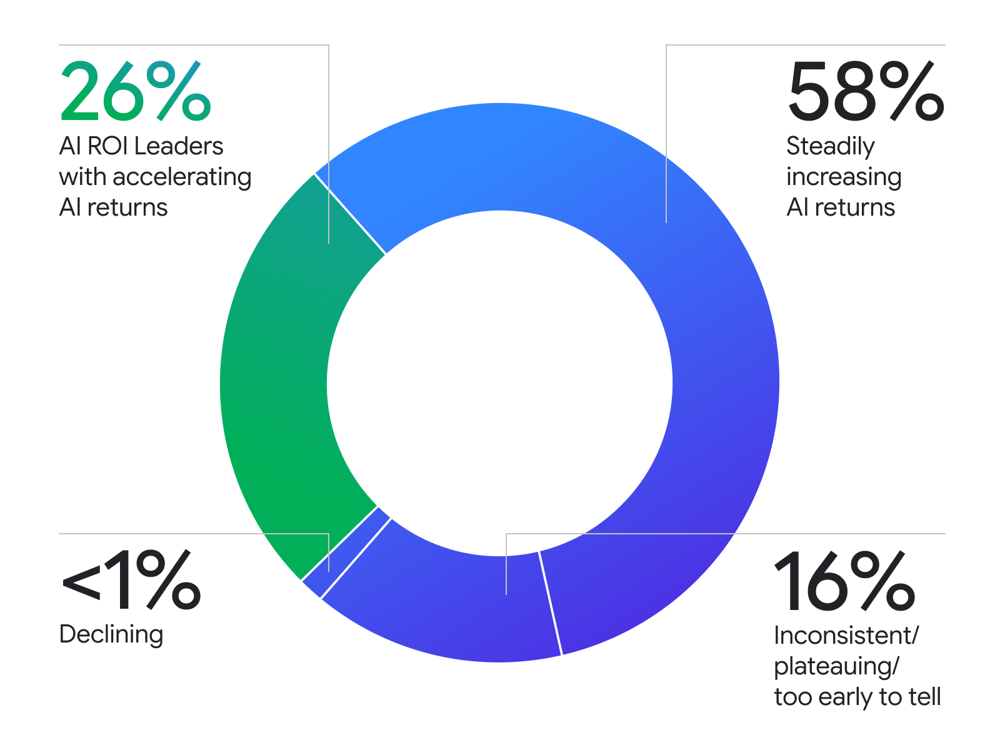

> [[../index|Wiki]] | [[../summary|Summary]] | [[../digest|Digest]]

# The AI ROI Leader Segment

**In one sentence:** Google Cloud's third annual "ROI of AI 2026" survey of 2,403 executives finds 84% report increasing financial returns from AI, and within the total sample a 26% slice -- labeled "AI ROI Leaders" -- reports returns that are *accelerating* year over year rather than merely increasing, a distinction the article's prose blurs but its own donut chart (Figure 1) keeps as parallel, mutually exclusive categories.

## Key points

- The article opens on a practitioner question -- "Where can we derive the best value from AI?" -- and cites Google Trends data showing four-times more search interest in "token efficiency" than in "tokenmaxxing" or "token leaderboards" since January 2026, framing the piece as a shift from AI spending headlines toward AI return-on-investment discipline.
- The underlying research is Google Cloud's third annual survey, run with the National Research Group, covering 2,403 executives (CXOs, VPs, and heads of business units) across global markets and all industries -- the article's prose rounds this to "more than 2,400."
- Google Cloud analyzed roughly 300,000 data points using Gemini Enterprise and Google Antigravity; a separate report call-out box gives a precise figure of 297,782 data points "distilled" to find where AI delivers the greatest financial returns -- the two figures (rounded vs. exact) describe the same underlying dataset.
- The data was evaluated across four dimensions: industry, geography, company size, and AI adoption stage, and supplemented with publicly available Google Search Trends and YouTube Trends data plus qualitative data from Google Cloud customers.
- 84% of surveyed executives report seeing increasing financial returns from AI initiatives; the article's prose then says "among this cohort, 26% report returns that are accelerating year over year," which reads as 26% of the 84% subgroup.
- Figure 1 (the donut chart) instead partitions the *entire* 2,403-respondent sample into four mutually exclusive slices: 58% "steadily increasing," 26% "AI ROI Leaders with accelerating AI returns," 16% "inconsistent/plateauing/too early to tell," and less than 1% "declining." Since 58% + 26% = 84%, the chart shows the 26% is a share of all respondents, sitting alongside the 58% as the two components that sum to the 84% headline figure -- not a 26%-of-84% subset.
- Read as a share of the 84% cohort that has increasing returns, the 26%-of-total AI ROI Leaders group works out to roughly 26/84 ≈ 31% of that cohort, not the 26% the prose's "among this cohort" phrasing implies. The chart's arithmetic (58 + 26 = 84) is the more internally consistent reading of the two.
- "AI ROI Leader" is Google Cloud's label for this 26%-of-total-sample group specifically because their returns are *accelerating* year over year, distinguishing them from the larger 58% slice whose returns are merely "steadily increasing" -- the entire rest of the article's practices, agent findings, and case studies are framed around what distinguishes this specific 26% cohort.

---

## Opening framing: the ROI question and the "token efficiency" signal

The article opens with a framing question the author says comes up "every day" in customer conversations: "Where can we derive the best value from AI?" It positions this as a natural consequence of heavy AI spending and social conversation about that spending, which the author says has produced "renewed interest in AI's ROI."

As external evidence of this shift, the article cites Google Trends data: search interest in "token efficiency" has run **four times higher** than interest in "tokenmaxxing" or "token leaderboards" since January 2026. The article links the specific Google Trends query (`Tokenmaxxing, token efficiency, token leaderboard`, worldwide, 2026-01-01 to 2026-06-30). This is presented as evidence that public and professional attention is moving from raw AI usage/scale metrics ("tokenmaxxing," leaderboard rankings) toward efficiency and return -- i.e., toward the ROI framing the rest of the article develops.

The author also notes this pattern is visible directly with Google Cloud customers "large and small, all around the world": they are said to "grasp the importance of not simply investing in AI but **prioritizing AI investments for real business outcomes**," and to be "becoming particularly adept with measurement to ensure their ROI is captured and reinvested in the right places."

## The survey: scope and methodology

The research behind the article is described in the article's own methodology block, quoted here in full:

> "Working with the **National Research Group**, we surveyed **2,403 executives** across global markets and all industries. We used **Gemini Enterprise** and **Google Antigravity** to analyze roughly **300,000 data points**. We evaluated the data across four key dimensions: **industry, geography, company size, and AI adoption stage**. We supplemented this with publicly available data from **Google Search Trends** and **YouTube Trends**, and qualitative data from **Google Cloud customers**."

Key methodology facts:

| Element | Value |
|---|---|
| Research partner | National Research Group |
| Respondents | 2,403 executives (CXOs, VPs, heads of business units) |
| Geographic scope | Global markets |
| Industry scope | All industries |
| Data points analyzed | ~300,000 (methodology block) / 297,782 (report call-out) |
| Analysis tools | Gemini Enterprise, Google Antigravity |
| Evaluation dimensions | Industry, geography, company size, AI adoption stage |
| Supplementary data | Google Search Trends, YouTube Trends, qualitative Google Cloud customer data |
| Edition | Third annual |

Two different data-point figures appear in the article for what is presented as the same underlying analysis: the methodology section rounds to "roughly 300,000 data points," while a separate report call-out box states a precise figure -- "We distilled **297,782 data points** to uncover where AI can deliver the greatest financial returns." 297,782 rounds to "roughly 300,000," so the two statements are consistent; the article simply uses the round number in the narrative methodology paragraph and the exact figure in the promotional call-out for the full report.

The respondent count is stated as "2,403 executives" in the methodology block but rounded in the body prose to "more than 2,400 CXOs, VPs, and heads of business units," and again as "the 2,400 executives we surveyed" later in the article. All figures refer to the same 2,403-person sample; this is the third consecutive year Google Cloud and the National Research Group have run this survey ("our third annual survey of executives").

Both major survey charts in the article (Figures 2, 3, and 5 per the source transcription) are explicitly labeled with the same base: "N=2,403," confirming the full sample is the denominator for the outcome and investment-priority statistics, not a filtered subgroup.

## The segmentation: 84%, 26%, and the "AI ROI Leader" label

The article's core segmentation claim is stated in two places that use different framings of the same underlying figures.

**Prose framing.** The body text states:

> "Among the more than 2,400 CXOs, VPs, and heads of business units that we surveyed, **84% of executives said they are seeing increasing financial returns from AI initiatives**. Among this cohort, 26% report returns that are accelerating year over year."

Read literally, "among this cohort" means 26% is a proportion *of the 84% subgroup* -- i.e., of the executives who already report increasing returns, just over a quarter report that the increase is accelerating rather than steady.

**Chart framing (Figure 1).** The donut chart breaks the *entire* 2,403-person sample into four mutually exclusive categories:

| Return trajectory | Share of all 2,403 respondents |
|---|---|
| Steadily increasing AI returns | 58% |
| AI ROI Leaders with accelerating AI returns | 26% |
| Inconsistent / plateauing / too early to tell | 16% |
| Declining | <1% |

These four categories are exhaustive and non-overlapping (they describe distinct self-reported trajectories, and their shares sum to 100%: 58 + 26 + 16 + <1 ≈ 100%). Critically, 58% + 26% = **84%** -- exactly the headline "increasing financial returns" figure from the prose. This means the chart's own arithmetic treats the 84% figure as the *sum* of two parallel slices ("steadily increasing" and "accelerating"), not as a base population from which the 26% is then drawn as a sub-percentage.

**The discrepancy.** These two framings are not equivalent:

- If 26% is of the total sample (chart-consistent, and the only reading that reproduces 58 + 26 = 84), then AI ROI Leaders are **26% of all 2,403 respondents**.
- If 26% is of the 84% cohort (literal prose reading of "among this cohort"), AI ROI Leaders would be 26% × 84% ≈ **21.8% of all respondents** -- and the "steadily increasing" slice would need to be 84% − 21.8% ≈ 62.2% of the total, not the 58% the chart actually shows.
- Conversely, expressing the chart's 26%-of-total figure as a share of the 84% cohort gives 26/84 ≈ **31%** -- not the 26% the prose states for "among this cohort."

The chart's figures are internally self-consistent (they sum correctly to both 100% of the sample and to the 84% headline), while the prose's "among this cohort" wording is not consistent with the chart's own numbers. Since Figure 1 is the article's own visual breakdown of the full sample and its components sum exactly to the stated headline (84%), the chart's reading -- 26% of the total 2,403 respondents, appearing alongside the 58% "steadily increasing" slice as the two additive components of the 84% figure -- is the arithmetically supported one. The prose's "among this cohort" phrasing appears to be loose language rather than a distinct, independently-surveyed sub-percentage.

**The label.** Google Cloud names the accelerating-returns group "**AI ROI Leaders**" and defines the term as: "these leaders aren't just good at driving returns on AI but prioritizing where AI is applied to drive the greatest impact." The article states this group "consistently use[s] the same set of practices to achieve this success," setting up the three-practices analysis (clear ownership, embedded workflows, mandated fluency) that occupies the next section of the article -- see [[02-three-practices-of-roi-leaders]] for that detail. The remainder of the article's findings on agents, measurable outcomes, and case studies are all framed as explaining or illustrating what this 26% cohort does differently.

**Covers:** the article's opening framing (the "where can we derive the best value from AI?" question and the Google Trends "token efficiency" vs. "tokenmaxxing"/"token leaderboards" 4x signal); the "Google Cloud, working with the National Research Group..." paragraph and the full "Methodology and process" block (2,403 executives, ~300,000/297,782 data points, Gemini Enterprise, Google Antigravity, four evaluation dimensions, Search/YouTube Trends and customer qualitative data, third annual edition); the 84%/26% segmentation paragraph and Figure 1 (the return-trajectory donut chart: 58% steadily increasing, 26% AI ROI Leaders accelerating, 16% inconsistent/plateauing/too early to tell, <1% declining); and the "Report call-out" 297,782-data-points box.
