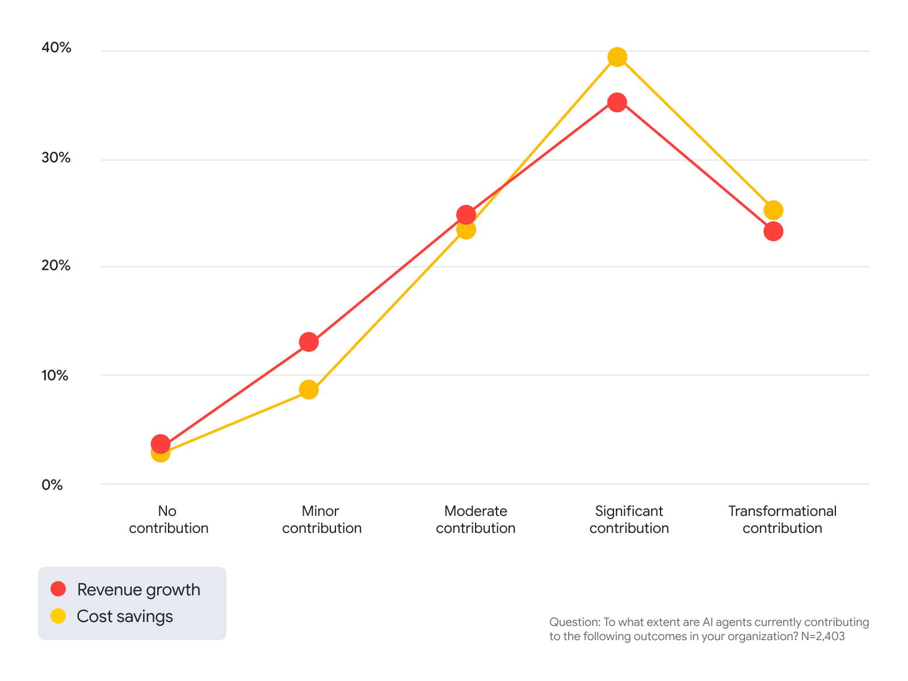
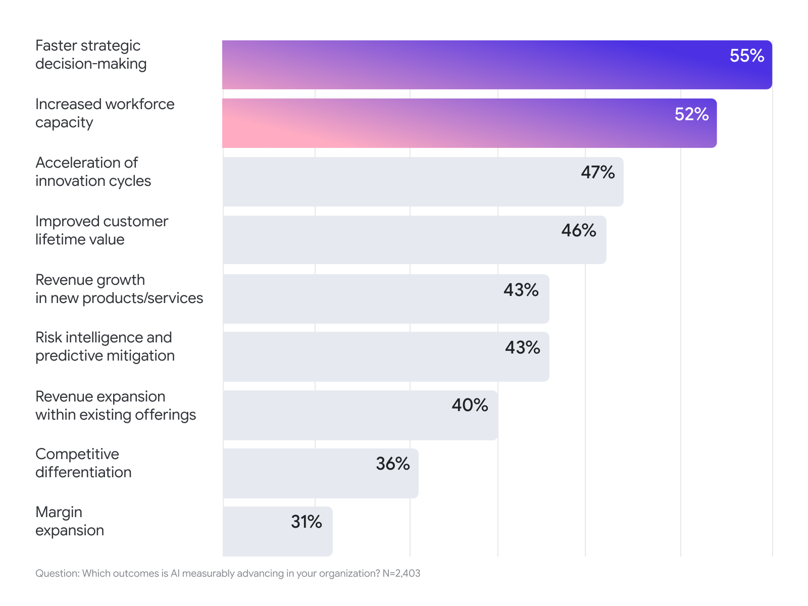

> [[../index|Wiki]] | [[../summary|Summary]] | [[../digest|Digest]]

# Agents as the ROI Engine, and Where ROI Shows Up

**In one sentence:** Agentic AI is identified as the single biggest factor behind AI ROI gains -- with 94% of respondents reporting agents contribute to revenue growth and cost savings and only 4%/3% reporting none -- yet the outcomes organizations most commonly cite as measurably advancing are decision speed and workforce capacity, not the directly financial metrics (margin expansion ranks last of nine).

## Key points

- Among organizations already seeing returns from AI, agents are named as the single biggest factor in those ROI gains, ahead of any other capability the survey asked about.
- Agentic AI is reported to positively impact all three core business metrics the survey tracks: revenue growth, cost savings, and operational or profit margin improvement.
- The published headline -- "94% of respondents report AI agents contribute to both cost savings and revenue, with 6% reporting no contribution" -- is the complement of the "no contribution" level in a five-point scale (no / minor / moderate / significant / transformational); it aggregates minor-and-above, not just strong contribution.
- The underlying per-metric data (Figure 2) put "no contribution" at roughly 4% for revenue growth and roughly 3% for cost savings, implying roughly 96% and 97% "any contribution" respectively -- both close to, but not identical to, the rounded 94%/6% figures in the published chart caption.
- The article's claim of a "modestly higher weighting towards savings" is visible at the strong end of the scale, not the "any contribution" end: significant-plus-transformational contribution is about 58% for revenue growth versus about 64% for cost savings, while at the minor-contribution tier revenue growth is actually ahead of cost savings (~13% vs ~9%).
- ROI is described as having moved beyond foundational productivity gains: the two outcomes cited by the most respondents as measurably advancing are "faster strategic decision-making" (55%) and "increased workforce capacity" (52%), the article's basis for stating "the value of every member of the workforce is increasing."
- Customer-facing impact ranks immediately behind those two: "acceleration of innovation cycles" (47%) and "improved customer lifetime value" (46%) are the third- and fourth-most-cited measurable outcomes, which the article frames as organizations being "more focused than ever on customer impact."
- Margin expansion -- one of the three core metrics the agents section credits agentic AI with improving -- ranks last of the nine measurable outcomes at 31%, and the directly financial outcomes generally (new-product revenue 43%, existing-offering revenue expansion 40%, margin expansion 31%) rank below the harder-to-audit outcomes of decision speed and workforce capacity.

---

## Agents are the key to ROI

For organizations already seeing returns from AI, the article states that one factor "rises above all the rest" in driving those ROI gains: agents. The survey frames agentic AI as positively impacting all three core business metrics it tracks -- revenue growth, cost savings, and operational or profit margin improvement -- rather than any single one of them.

The specific evidence offered is a five-point contribution scale asked separately for revenue growth and for cost savings, in response to the question "To what extent are AI agents currently contributing to the following outcomes in your organization?" (N=2,403). The article's text states that "nearly every respondent (94%) reports that AI agents are contributing to cost savings and revenue, with a modestly higher weighting towards savings." The chart's own published caption reads: "94% of respondents report AI agents contribute to both cost savings and revenue, with 6% reporting no contribution."

Read precisely, 94% is not a separate top-line statistic -- it is the complement of the "no contribution" level in the full distribution below, i.e. it counts every respondent who reported minor, moderate, significant, or transformational contribution. The full breakdown:

| Contribution level | Revenue growth | Cost savings |
|---|---|---|
| No contribution | ~4% | ~3% |
| Minor contribution | ~13% | ~9% |
| Moderate contribution | ~25% | ~23% |
| Significant contribution | ~35% | ~39% |
| Transformational contribution | ~23% | ~25% |

Two things follow directly from this table:

- **The 94%/6% figures are rounded composites, not exact per-metric numbers.** Summing "any contribution" (minor + moderate + significant + transformational) gives roughly 96% for revenue growth and roughly 97% for cost savings -- both higher than the quoted 94%, and neither metric's "no contribution" share (4% or 3%) individually matches the caption's "6%." The 94%/6% headline appears to be a rounded, combined characterization of the two series rather than a value read off either series alone.
- **The "modestly higher weighting towards savings" shows up at the strong end of the scale, not at the "any contribution" end.** Adding significant and transformational contribution together gives about 58% for revenue growth versus about 64% for cost savings -- a real gap in cost savings' favor. But at the minor-contribution tier, revenue growth is reported more often than cost savings (~13% vs ~9%), and at "no contribution" revenue growth is also slightly higher (~4% vs ~3%). So the savings-tilt the article describes is a property of the high-conviction end of the distribution, not of overall participation.

## Where is ROI showing up?

The article argues that AI ROI has moved beyond foundational productivity gains, and that "driving faster strategic decision making" and "increased workforce capacity" are now the top-cited measurable impacts of AI investment. It draws from this the conclusion that "the value of every member of the workforce is increasing." It further argues that organizations are "more focused than ever on customer impact," citing "improved customer lifetime value" and "acceleration of innovation cycles" as evidence of a growing customer-facing orientation. The chart's own published caption summarizes this as: "Faster decision making + increased workforce capacity + extra focus on customer value = higher returns for organizations investing in AI."

This is drawn from responses to "Which outcomes is AI measurably advancing in your organization?" (N=2,403), a ranked list of nine outcomes:

| Outcome | Share |
|---|---|
| Faster strategic decision-making | 55% |
| Increased workforce capacity | 52% |
| Acceleration of innovation cycles | 47% |
| Improved customer lifetime value | 46% |
| Revenue growth in new products/services | 43% |
| Risk intelligence and predictive mitigation | 43% |
| Revenue expansion within existing offerings | 40% |
| Competitive differentiation | 36% |
| Margin expansion | 31% |

Two factual observations follow from this ranking that are worth stating alongside the article's own framing:

- **Margin expansion ranks last, at 31%** -- the lowest of all nine measurable outcomes -- even though the preceding section names operational or profit margin improvement as one of the three core metrics agentic AI is reported to positively impact. The metric the agents section credits agents with moving is the outcome respondents least often say AI is measurably advancing.
- **The top-ranked outcomes are the hardest to convert into audited financials; the directly financial outcomes rank lower.** "Faster strategic decision-making" (55%) and "increased workforce capacity" (52%) are qualitative or capacity-based judgments, not line items that appear on a P&L. The outcomes with a direct financial reporting line -- revenue growth in new products/services (43%), revenue expansion within existing offerings (40%), and margin expansion (31%) -- all rank below them.

---

**Covers:** article sections "Agents are the key to ROI" and "Where is ROI showing up?", including the published chart captions for Figure 2 and Figure 3, the full five-point agent-contribution distribution (revenue growth vs. cost savings, N=2,403), and the full nine-item ranked list of measurable outcomes AI is advancing (N=2,403).
