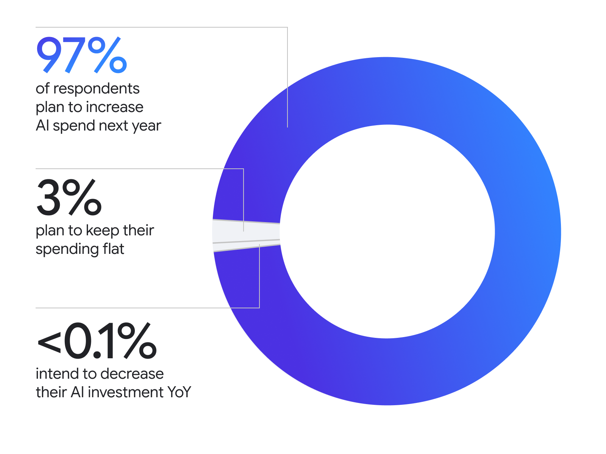
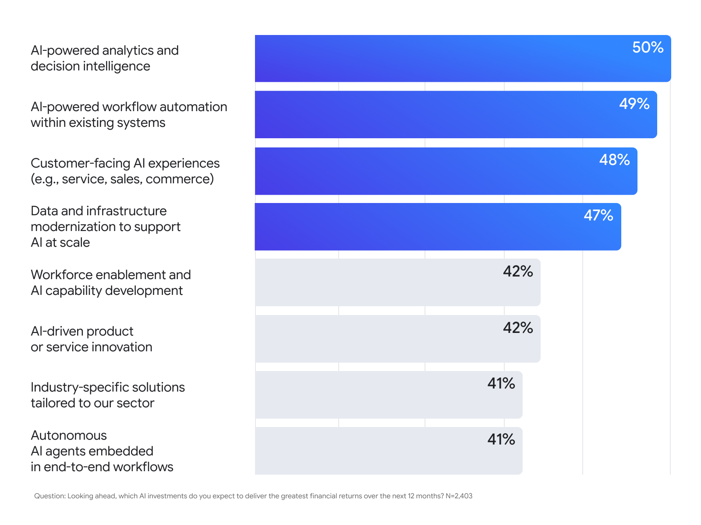

> [[../index|Wiki]] | [[../summary|Summary]] | [[../digest|Digest]]

# Future Investment and Organizational Change

**In one sentence:** The article treats near-universal intent to keep increasing AI spend (97%) as the strongest ROI signal of all, reports eight investment priorities that are spread almost evenly across a 9-point band (50% down to 41%) rather than converging on one clear winner, and closes with the claim that AI's real payoff is not faster execution of current work but a "domino effect" of organizational change culminating in faster, decentralized decision-making.

## Key points

- The article's framing device for this section is that continued investment is itself evidence of ROI: "Arguably the biggest signal organizations are seeing ROI is their continued investment in AI."
- 97% of the 2,403 surveyed executives plan to increase AI spend over the next year; 3% plan to keep spend flat; fewer than 0.1% intend to decrease AI investment year over year (Figure 4).
- Respondents identified eight areas of greatest potential for AI investment over the next 12 months (Figure 5), asked as which investments they expect to deliver the greatest financial returns; the article's own gloss names only the top four -- "AI-powered analytics, workflow automation, customer experiences, and AI infrastructure."
- The eight shares run from 50% down to 41%, a 9-point range across the full list -- the bottom four (42%, 42%, 41%, 41%) sit only a few points below the top four (50%, 49%, 48%, 47%), so respondents are near-uniformly spread across these areas rather than converging on a dominant priority.
- "Autonomous AI agents embedded in end-to-end workflows" ranks last of the eight at 41%, tied with "industry-specific solutions tailored to our sector" -- this sits in tension with the article's earlier section headlined "Agents are the key to ROI" and reports 94% of respondents already crediting agents with cost savings and revenue contribution.
- The article's closing thesis reframes the opportunity: "The real opportunity of AI isn't only about doing our current work faster. The opportunity is transforming how we operate."
- Scaling AI enterprise-wide requires bridging from smaller "pockets of greatness" to scaled production, which the article says triggers a "domino effect": as AI unlocks individual workplace capacity, roles evolve, team dynamics flatten, and traditional corporate hierarchies adapt.
- The article's stated ultimate payoff for AI ROI Leaders is not a productivity boost but organizational speed -- fast, decentralized decision-making that, scaled across the business, produces "a fundamentally more agile organization designed for the future."

---

## Future bets: Higher budgets, stronger strategy, and better ROI

The article opens this section by asserting that continued investment is itself the clearest ROI signal available: "Arguably the biggest signal organizations are seeing ROI is their continued investment in AI." The survey methodology behind this section asked executives "to rate the estimated impact of AI on key use cases" over the next 12 months.

### Investment intent: 97% plan to spend more

- **97%** of respondents plan to increase AI spend next year.
- **3%** plan to keep spending flat.
- **<0.1%** intend to decrease AI investment year over year.

The article states this plainly: "It turns out nearly every organization (97%) plans to invest more in AI."

### The eight areas of greatest potential

The underlying survey question (as captioned on the chart): "Looking ahead, which AI investments do you expect to deliver the greatest financial returns over the next 12 months? N=2,403."

| Rank | Investment area | Share |
|---|---|---|
| 1 | AI-powered analytics and decision intelligence | 50% |
| 2 | AI-powered workflow automation within existing systems | 49% |
| 3 | Customer-facing AI experiences (e.g. service, sales, commerce) | 48% |
| 4 | Data and infrastructure modernization to support AI at scale | 47% |
| 5 | Workforce enablement and AI capability development | 42% |
| 5 (tie) | AI-driven product or service innovation | 42% |
| 7 | Industry-specific solutions tailored to our sector | 41% |
| 7 (tie) | Autonomous AI agents embedded in end-to-end workflows | 41% |

The article's own text glosses this list rather than reproducing it fully: "Our respondents identified eight areas of greatest potential for AI investments. For many, it's all about AI-powered analytics, workflow automation, customer experiences, and AI infrastructure." That gloss corresponds exactly to the top four rows of the table (analytics and decision intelligence, workflow automation, customer-facing experiences, and infrastructure modernization) -- ranks 1 through 4, spanning 50% down to 47%.

What the gloss omits is that the bottom four areas are not far behind. Workforce enablement, product/service innovation, industry-specific solutions, and autonomous agents all sit at 41-42%, only 5-6 points below the top-ranked item. Across all eight areas the spread is a single 9-point band (50% to 41%), which reads as a near-uniform distribution of expected returns across very different categories of investment (analytics, automation, customer experience, infrastructure, workforce, product innovation, vertical specialization, and agents) rather than a sharp prioritization by respondents. This is a data observation, not an evaluation of whether that spread is a good or bad allocation signal.

One specific instance of this near-uniformity is worth flagging on its own: "Autonomous AI agents embedded in end-to-end workflows" is tied for last place at 41%. That sits awkwardly next to the article's earlier section (headlined "Agents are the key to ROI"), which reports that 94% of respondents already see agents contributing to cost savings and revenue today (see [[03-agents-and-where-roi-shows-up|Agents and Where ROI Shows Up]]). The article does not reconcile these two figures -- one describing agents' current contribution, the other describing where the greatest *future* financial returns are expected to come from -- and offers no explanation for why the category the article treats as most important for present ROI ranks last among the eight forward-looking investment priorities.

## AI is everyone's job

The article's closing section reframes the entire piece's argument away from efficiency and toward organizational transformation:

> "The real opportunity of AI isn't only about doing our current work faster. The opportunity is transforming how we operate, so we can elevate the impact our employees deliver and drive business growth in the process."

### From pockets of greatness to scaled production

The article frames enterprise-wide AI value as requiring a bridge: "The evolution from early AI experiments to true enterprise-wide value requires us to bridge the gap between smaller 'pockets of greatness' and scaled production." This is presented as the connective step between isolated wins (the kind illustrated by the nine enterprise case studies -- see [[04-enterprise-case-studies|Enterprise Case Studies]]) and organization-wide impact.

### The domino effect

Making that bridge, the article says, "triggers a powerful domino effect": as AI unlocks individual workplace capacity, three things follow in sequence:

1. **Roles evolve** -- job content and responsibilities shift as AI absorbs or augments parts of the work.
2. **Team dynamics flatten** -- the article implies less hierarchical coordination is needed within teams as individual capacity grows.
3. **Traditional corporate hierarchies adapt** -- the effect is described as propagating up to the structure of the organization itself, not staying contained at the individual or team level.

The article does not provide survey data quantifying this domino effect (unlike the earlier sections' percentages) -- it is presented as the article's own interpretive thesis about the mechanism connecting individual AI adoption to organizational change.

### The ultimate payoff: organizational speed, not just productivity

The article's final claim is that the payoff for AI ROI Leaders is not primarily a productivity metric: "The ultimate payoff for AI ROI Leaders isn't only a boost in productivity; it is the organizational speed that comes with fast, decentralized decision-making." It closes by generalizing this from individual teams to the whole business: "When you can scale this model across the business, you don't just optimize workflows -- you build a fundamentally more agile organization designed for the future."

This closing thesis ties back to a data point from earlier in the article (see [[03-agents-and-where-roi-shows-up|Agents and Where ROI Shows Up]]): the survey's top-cited measurable impact of AI is "faster strategic decision-making" (55%), which the article treats as the leading edge of the same organizational-speed argument made here.

**Covers:** article sections "Future bets: Higher budgets, stronger strategy, and better ROI" (continued investment as an ROI signal, the 97%/3%/<0.1% spend-intent split in Figure 4, and the eight investment-priority areas in Figure 5) and "AI is everyone's job" (the closing thesis on transforming operations, pockets of greatness vs. scaled production, the domino effect, and organizational speed/decentralized decision-making as the ultimate payoff).
