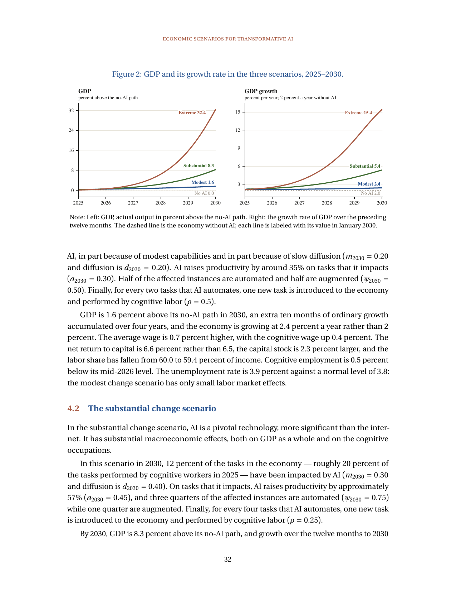
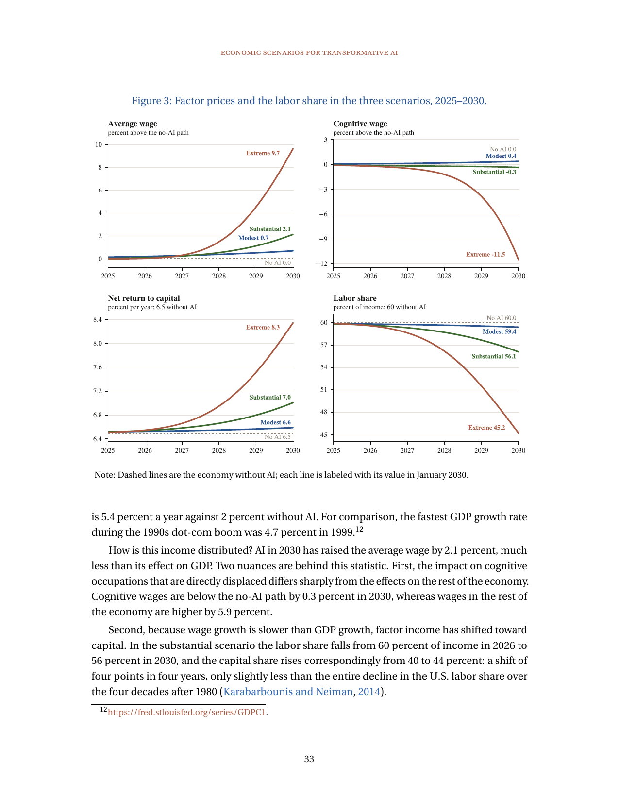
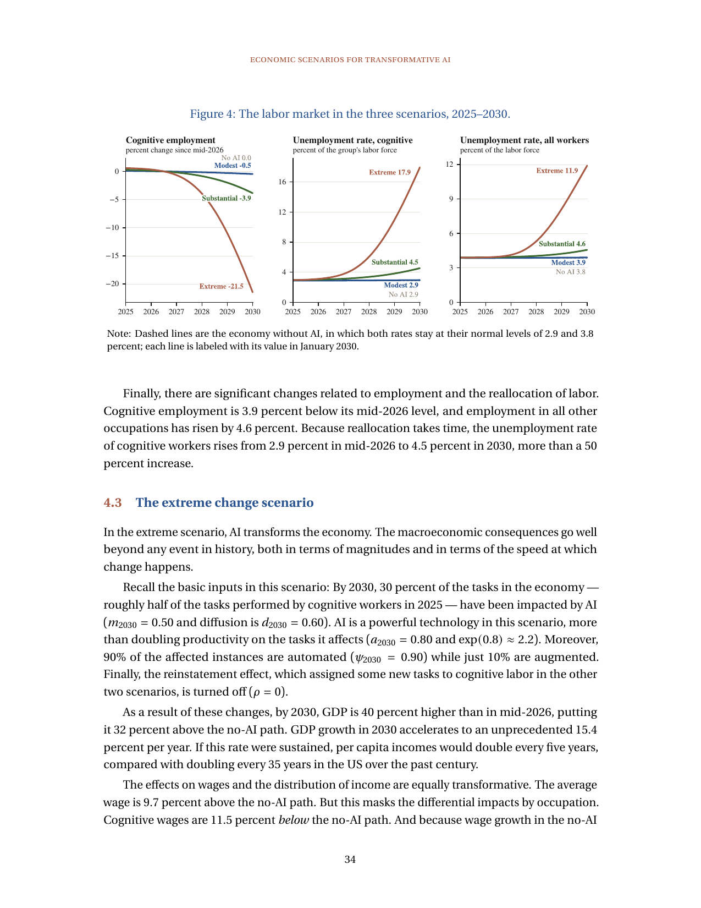

# Economic Scenarios for Transformative AI

**Paper:** [Economic Scenarios for Transformative AI (Korinek, Jones, Sacher, Cotter, McCrory, 2026)](https://www-cdn.anthropic.com/files/4zrzovbb/website/cf58f84d46a4a76bf5a5b039ac695fba6b80041c.pdf)

## Human Readable TL;DR
Economists built a what-if calculator for what happens to jobs, paychecks, and the economy if AI does more office-type work by 2030. They tell three stories from mild to wild: a small boost with almost no job pain, a big boost like a supercharged 1990s boom with some office workers needing new jobs, and a wild boom where the economy grows super fast but many office workers struggle to find work. They also asked about 11,000 regular Americans what they expect, and the typical answer lands near the middle, big-change story. Almost all the differences between stories show up after 2027.

## TL;DR
Task-based model splits work into cognitive vs other occupations, with five AI inputs: affected mass m, diffusion d, gain per task a, automation share psi, and reinstatement rho. Augmented tasks keep workers with higher productivity while automated tasks shift wage bills to capital; displacement plus slow reallocation generates unemployment via search-matching with sticky cognitive wages, alongside a capital-demand channel and a semi-endogenous ideas channel. GDP in 2030 is +1.6% above no-AI in modest, +8.3% in substantial, and +32.4% in extreme, with labor share 59.4 / 56.1 / 45.2%. Median survey answers run through the same model imply near-substantial outcomes at GDP +8.6%.

---

## Problem & Motivation
Why: published AI impact estimates span orders of magnitude and use incomparable frameworks, from negligible productivity effects to explosive growth, so they cannot be compared side by side. Need: an integrated, comparable scenario framework that maps a small set of measurable assumptions into paths for GDP, wages, labor share, reallocation, and unemployment through 2030. The paper stresses scenarios are not predictions and carry no probabilities. Companion scenario explorer at anthropic.com/institute/econ-scenarios lets readers set parameters and see paths. See [[wiki/01-introduction-and-framework|framework]].

---

## Main Original Ideas
1. **Task-based production with cognitive/other split and m/d/a/psi/rho** -- Output is a constant-returns aggregate over task instances with elasticity sigma = 0.5, so tasks are gross complements. Only cognitive occupations are directly affected by AI; each scenario sets affected mass m, diffusion d, log gain a, automation share psi, and reinstatement ratio rho. Measured TFP rises by s_L,t0*m*d*a regardless of automation vs augmentation.
2. **Displacement plus frictional reallocation into search-matching unemployment** -- AI lowers cognitive labor demand, forcing workers toward other occupations. Cognitive wages adjust slowly with rigidity xi = 0.5, so firms lay off excess workers rather than clearing at lower pay. Re-employment runs through a matching function with cross-occupation discount mu and posting speed theta_H, calibrated to CPS (Current Population Survey) flows.
3. **Capital-demand and factor-share channel** -- The same TFP gain splits between wages and rents via the factor-price frontier s_L*Δln w + s_K*Δln r. Automation transfers whole wage bills to capital, raising capital demand, rents, and capital share while pressing labor share down. With scarce capital this can produce so-so automation where wages fall below the no-AI path.
4. **Ideas and innovation channel** -- Research is a share of GDP, so AI raises research spending through higher GDP, feeding semi-endogenous ideas growth in the Jones (1995) tradition. By 2030 this channel is small because level gains apply to a ~1% baseline growth rate and cumulation takes decades. Authors treat it as a lower bound with no feedback from ideas to AI gains.
5. **Survey-disciplined expectations benchmark** -- Representative survey of 10,980 US adults in August 2026 maps capability timing, adoption, speed gains, automation, and job-finding time into m/d/a/psi/mu. Median answers imply m_2030 = 0.44, d_2030 = 0.40, a_2030 = 0.44, psi = 0.47, mu = 0.064, providing a public-expectations counterpoint to the three model scenarios. See [[wiki/05-survey-of-us-expectations|survey]].

---

## Key Findings

| Scenario, 2030 | GDP level vs no-AI | GDP growth per year | Labor share | Cognitive wage vs path | Cognitive unemployment |
|---|---:|---:|---:|---:|---:|
| No AI | 0% (index 112.7) | 2.0% | 60.0% | 0% | 2.9% |
| Modest | +1.6% (index 114.5) | 2.4% | 59.4% | +0.4% | 2.9% |
| Substantial | +8.3% (index 122.1) | 5.4% | 56.1% | -0.3% | 4.5% |
| Extreme | +32.4% (index 149.3) | 15.4% | 45.2% | -11.5% | 17.9% |
| Median survey | +8.6% | 5.3% | 57.2% | +0.6% | 4.6% |

Notes: growth is log change over 12 months to 2030; cognitive employment change since mid-2026 is -0.5 / -3.9 / -21.5 / -4.2% for modest / substantial / extreme / median survey; all-worker unemployment is 3.8 / 3.9 / 4.6 / 11.9 / 4.6% for no-AI / modest / substantial / extreme / median survey. Other-occupation wages vs path are +1.1 / +5.9 / +33.6 / +6.4%. See [[wiki/06-results-three-scenarios|results]].

- Modest is near normal: average wage +0.7%, capital stock +2.3%, TFP +0.7% above no-AI, only +0.1 pp unemployment.
- Substantial splits gains: average wage +2.1% hides cognitive -0.3% vs other +5.9%; capital share 40 to 44%; cognitive employment -3.9% with other employment +4.6%; 4 pp labor-share drop in four years is about the whole US decline since 1980.
- Extreme is transformative: average wage +9.7% hides cognitive -11.5% vs other +33.6%; capital share 40 to 54.8%; capital stock +56.3% with return 6.5 to 8.3%; total labor income +0.5% while capital income +81.4%; cognitive wage bill -31.0%.
- Wage-vs-unemployment trade-off from rigidity runs: in extreme, baseline xi = 0.5 gives cognitive wage -11.5% with 17.9% cognitive unemployment; very rigid xi = 0.9 gives +2.8% with 24.0%; fully flexible xi = 0 gives -42.2% with 2.6%.
- Capital-supply robustness: varying epsilon from 1 to infinity moves extreme 2030 GDP from +21.3% to +43.3% above no-AI; at epsilon = 1 average wage is -1.6% in substantial and -9.2% in extreme vs +2.1% and +9.7% at baseline epsilon = 3.
- Innovation channel small by 2030: ideas stock only +0.07 / +0.20 / +0.61% above no-AI in modest / substantial / extreme; measured TFP +0.7 / +3.1 / +13.4% comes almost entirely from direct AI level effects. See [[wiki/07-robustness-conclusions-appendix|robustness]].

---

## Suggestions & Future Directions
1. Add Euler equation linking capital returns to growth, which could substantially raise returns; planned for a future version.
2. Treat cognitive firms' profit from paying below marginal product more fully; currently at most 0.5% of GDP on these paths.
3. Estimate rather than fix survey-run parameters rho, theta_H, xi, and epsilon, which are now held at substantial values.
4. Replace monthly ideas stepping and measured-TFP approximations with exact forms; current extreme-path gap is within 0.02 pp in 2030.
5. Improve wage-bill accounting that counts unemployed at zero and model precedent-free transfers near 9% of GDP needed to hold cognitive income at no-AI.
6. Keep framework as measurable-parameter organizer: track share of tasks AI can do, firm use, gain per task, and displaced-worker job-finding time to see which scenario incoming data supports.
7. Prepare policy for disruption within a year or two: retraining, insurance and income support, universal basic capital or income, and not-yet-designed sharing mechanisms, since growth alone does not deliver compensation.

---

## Authors & Institutions
Korinek, Jones, Sacher, Cotter, McCrory -- The Anthropic Institute; thanks list note; Claude used as research/writing assistant.

## Figures

