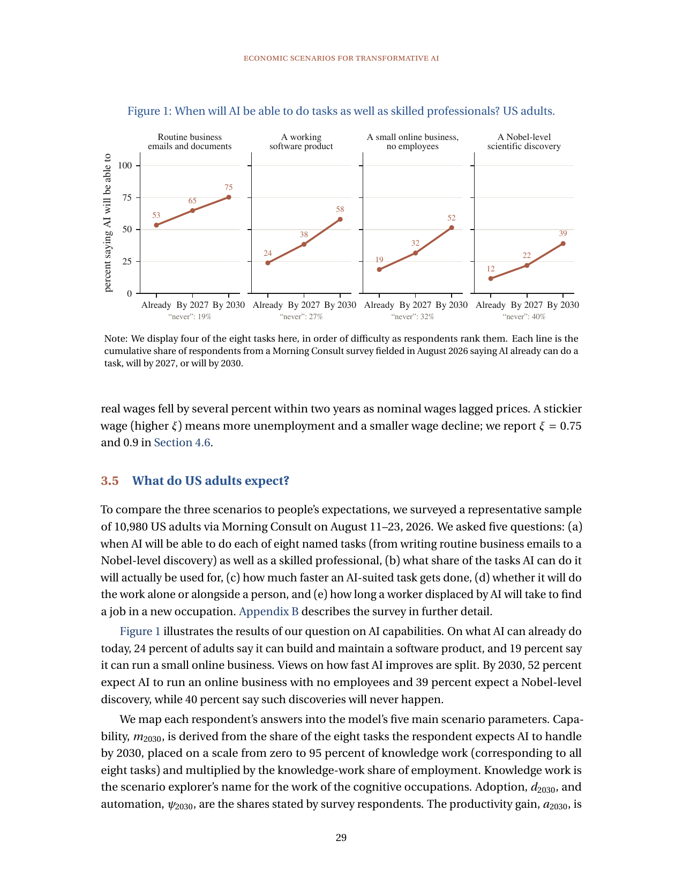

> [[../index|Wiki]] | [[../summary|Summary]] | [[../digest|Digest]]
# What US Adults Expect: The Survey
**In one sentence:** In August 2026, a representative survey of 10,980 US adults found people expect fast AI (Artificial Intelligence) capability growth by 2030 but limited workplace use, with the median answers landing near the paper's substantial-change scenario and views varying widely.

## Key points
- The survey covered 10,980 US adults via Morning Consult on August 11–23, 2026, asking five questions about capability timing, use, speed gains, automation, and job-finding.
- On what AI can already do today, 24 percent say it can build and maintain a software product and 19 percent say it can run a small online business.
- By 2030, 52 percent expect AI to run an online business with no employees, while 39 percent expect a Nobel-level scientific discovery and 40 percent say such discoveries will never happen.
- The median respondent expects AI to handle six of the eight tasks by 2030, implying AI capability m_2030 (share of knowledge work impacted) of 0.44 with interquartile range [0.20, 0.59].
- Median adoption d_2030 (share of feasible tasks actually used at work) is 0.40 [0.22, 0.61], median automation psi (share done alone rather than with a worker) is 0.47 [0.25, 0.65], and median productivity gain a_2030 (log speed-up) is 0.44 [0.09, 1.02].
- Median job-finding parameter mu (speed of finding a new occupation, where three months equals 0.17) is 0.064 [0.025, 0.111], implying about eight months for a worker displaced by AI to find a new-occupation job.
- Views are widely dispersed: about 30 percent expect AI to save no time at all on a suited task, while 49 percent expect it to cut task time at least in half.

---
## Survey design

The paper uses the survey to compare its three economic scenarios against public expectations.

The sample is a representative sample of 10,980 US adults, fielded by Morning Consult on August 11–23, 2026.

Each respondent was asked five questions.

Question (a) is capability timing: when AI will be able to do each of eight named tasks as well as a skilled professional.

The eight tasks range from writing routine business emails to a Nobel-level discovery.

Question (b) is adoption: what share of the tasks AI can do it will actually be used for at work in 2030.

Question (c) is productivity: how much faster an AI-suited task gets done with AI versus without.

Question (d) is automation versus augmentation: whether AI will do the work alone or alongside a person, asked for five tasks.

Question (e) is job-finding expectations: how long a worker displaced by AI will take to find a job in a new occupation.

Appendix B describes the survey in further detail.

A response of "not sure" is excluded item by item, so sample size varies by question.

## Figure 1: when will AI do tasks as well as skilled professionals?

Figure 1 illustrates the results of the capability-timing question.

It is titled "When will AI be able to do tasks as well as skilled professionals? US adults."

It plots cumulative shares saying AI already can do a task, will by 2027, or will by 2030.

The paper displays four of the eight tasks here, in order of difficulty as respondents rank them.

Each line is cumulative, so the 2030 point includes everyone who said "already" or "by 2027."

What the chart and text report for each task:

- Routine business emails and documents: 53 percent say already, 65 percent by 2027, 75 percent by 2030, with 19 percent saying "never."
- A working software product: 24 percent say already, 38 percent by 2027, 58 percent by 2030, with 27 percent saying "never."
- A small online business with no employees: 19 percent say already, 32 percent by 2027, 52 percent by 2030, with 32 percent saying "never."
- A Nobel-level scientific discovery: 12 percent say already, 22 percent by 2027, 39 percent by 2030, with 40 percent saying "never."

The text highlights the split in views on how fast AI improves.

Many expect rapid progress by 2030, but a large minority says the hardest breakthrough will never happen.

On what AI can already do today, the text calls out 24 percent for software products and 19 percent for online business.

By 2030, it calls out 52 percent for online business and 39 percent for Nobel-level discovery.

"Knowledge work" is the scenario explorer's name for the work of the cognitive occupations.

## Dispersion of views

The paper stresses wide disagreement, not just the median.

The clearest example is productivity: approximately 30 percent expect AI to save no time at all on a task suited to it, while 49 percent expect it to cut the time at least in half.

Table 2 interquartile ranges show the same pattern across parameters.

For m_2030 the range is [0.20, 0.59]; for d_2030 it is [0.22, 0.61]; for psi it is [0.25, 0.65].

For a_2030 the range is [0.09, 1.02]; for mu it is [0.025, 0.111].

In other words, the 25th and 75th percentile respondents live in very different expected AI economies.

## How median answers map to the scenarios

Each respondent's answers are mapped into the model's five main scenario parameters.

The median respondent's answers are mixed when placed against the modest, substantial, and extreme scenarios.

Capability m_2030 = 0.44, between the substantial (0.3) and extreme (0.5) scenarios, reflecting six of eight tasks by 2030.

Adoption d_2030 = 0.40, exactly the substantial scenario's 0.4, versus 0.2 modest and 0.6 extreme.

Productivity gain a_2030 = 0.44 in logs, near the substantial 0.45, versus 0.30 modest and 0.80 extreme.

The text describes this as cutting time on an AI-suited task by about a third.

Automation psi = 0.47, near the modest scenario's 0.50 share, versus 0.75 substantial and 0.90 extreme.

The text says about half of use is automation rather than augmentation.

Job-finding mu = 0.064, implying about eight months to re-employment, slower than the substantial scenario assumes and faster than the extreme.

All other parameters are set to the substantial-change scenario's values when running survey answers through the model.

In the associated scenario explorer, a user can set these values freely.

## Methodology notes

Capability m_2030 is derived from the share of the eight tasks the respondent expects AI to handle by 2030.

That share is placed on a scale from zero to 95 percent of knowledge work, where all eight tasks corresponds to 95 percent, then multiplied by the knowledge-work share of employment.

Adoption d_2030 and automation psi_2030 are the shares stated by survey respondents.

The productivity gain a_2030 is set to the log of the reported speed-up.

Respondents are told that a job search in normal times takes about three months.

They are then asked how long a worker displaced by AI in 2030 would take to find a job in a new occupation.

The search discount scales its normal-times value, mu-bar = 0.17, by the ratio of three months to the answer.

Quantiles of binned items are interpolated within the answer bin.

Further details on the parameter mappings are in Appendix B.

This page covers only the survey design and expectations; model outcomes implied by these answers belong to the results section, not here.

**Covers:** Section 3.5, Figure 1
