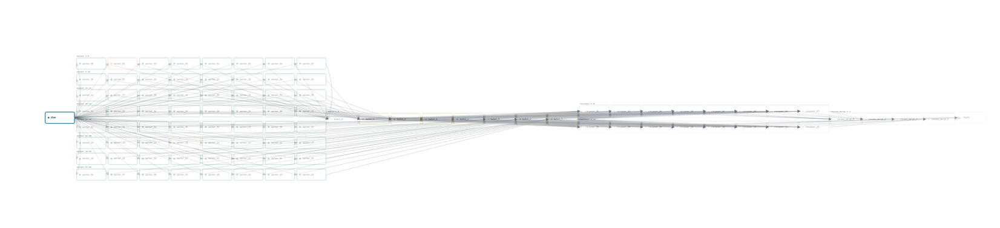

> [[../index|Wiki]] | [[../summary|Summary]] | [[../digest|Digest]]
# Graph DSL: programmatic orchestration
**In one sentence:** The Graph DSL is the Python code layer that builds agent pipelines with nodes, edges, parallel copies, and retry loops, then converts them to a validated specification for execution.
## Key points
- `Graph` is a Python context manager: `with Graph(...):` makes the graph active, node helpers register into it, and exit restores the previous context (`agentflow/dsl.py:114`).
- Edges use the `>>` operator: `a >> b` makes `b` depend on `a`, `plan >> [implement, review]` fans to two nodes, and `[a, b] >> merge` joins them (`agentflow/dsl.py:48`).
- `fanout()` expands one node into many parallel copies with three source modes: `int` for count, `list` for explicit values, `dict` for cartesian matrix (`agentflow/dsl.py:247`).
- `merge()` reduces a fanout group in exactly one of two ways: `by=[...]` for one reducer per field combination, `size=N` for one reducer per N-item batch (`agentflow/dsl.py:325`).
- Prompts use Jinja templating (Jinja = a text template system with `{{ ... }}` placeholders): `{{ nodes.plan.output }}` inserts the output of node `plan` (`examples/airflow_like.py:13`).
- Failure loops use `on_failure` edges: `review.on_failure >> write` restarts `write` when `review` fails, while `review >> summary` continues on success (`agentflow/dsl.py:72`).
- `Graph` run knobs are `concurrency` for parallel workers and `max_iterations` for loop limit, validated as `concurrency >= 1` and `max_iterations >= 1` (`agentflow/dsl.py:88`, `agentflow/specs.py:1385`).
---
## 1. Graph context manager and edges
DSL means Domain-Specific Language, a mini-language for one job. Here the job is building workflows. DAG means Directed Acyclic Graph, a workflow with no loops. `Graph` is the DAG builder, with `DAG = Graph` kept for old code (`agentflow/dsl.py:194`).

The constructor holds pipeline-level settings:

```python
class Graph:
    def __init__(
        self,
        name: str,
        *,
        description: str | None = None,
        working_dir: str = ".",
        concurrency: int = 4,
        fail_fast: bool = False,
        max_iterations: int = 10,
        scratchboard: bool = False,
        use_worktree: bool = False,
        node_defaults: dict[str, Any] | None = None,
        agent_defaults: dict[str | AgentKind, dict[str, Any]] | None = None,
        local_target_defaults: dict[str, Any] | LocalTarget | None = None,
    ) -> None:
        self.name = name
        self.description = description
        self.working_dir = working_dir
        self.concurrency = concurrency
```

A full small graph shows context, nodes, templating, and edges:

```python
with Graph("airflow-like-example", working_dir=".", concurrency=3) as dag:
    plan = codex(
        task_id="plan",
        prompt="Inspect the repo and produce a concise plan.",
        model="gpt-5-codex",
        tools="read_only",
    )
    implement = claude(
        task_id="implement",
        prompt="Implement the approved plan:\n\n{{ nodes.plan.output }}",
        model="claude-sonnet-4-5",
        tools="read_write",
    )
    review = kimi(
        task_id="review",
        prompt="Review the plan and call out risks:\n\n{{ nodes.plan.output }}",
        model="kimi-k2-turbo-preview",
        capture="trace",
    )
    merge = codex(
        task_id="merge",
        prompt=(
            "Merge the implementation and review into one final response.\n\n"
            "Implementation:\n{{ nodes.implement.output }}\n\n"
            "Review:\n{{ nodes.review.output }}"
        ),
        model="gpt-5-codex",
    )

    plan >> [implement, review]
```

`plan >> [implement, review]` adds `plan` to `depends_on` of both children (`agentflow/dsl.py:48`). `[implement, review] >> merge` uses the reverse operator to add both as dependencies of `merge` (`agentflow/dsl.py:56`). Public helpers `Graph`, `codex`, `claude`, `kimi`, `fanout`, `merge`, `python_node`, `shell`, `sync` are re-exported at package root (`agentflow/__init__.py:3`).

## 2. Fanout: one node to many workers
`fanout()` takes a node and a source. The source type selects the mode (`agentflow/dsl.py:247`). Each copy gets an `item` variable with `index`, `number`, `count`, `suffix`, `node_id`, `value`, plus lifted dict keys (`agentflow/dsl.py:229`).

```python
    fuzzer = fanout(
        codex(
            task_id="fuzzer",
            tools="read_write",
            target={"cwd": "{{ item.workspace }}"},
            timeout_seconds=3600,
            retries=2,
            prompt=(
                "You are Codex fuzz shard {{ item.number }} of {{ item.count }} in an authorized campaign.\n\n"
                "Shared workspace:\n"
                "- Root: {{ pipeline.working_dir }}\n"
                "- Shard dir: {{ item.workspace }}\n"
                "- Crash registry: crashes/README.md\n"
                "- Shared notes: docs/global_lessons.md\n\n"
                "Shard contract:\n"
                "- Own only files under {{ item.workspace }} unless you are appending to the shared docs or crash registry with locking.\n"
                "- Keep your inputs and notes deterministic so another engineer can replay them.\n"
                "- Use shard id `{{ item.suffix }}` to vary corpus slices, seeds, flags, or target areas.\n"
                "- Focus on deep, high-signal failure modes rather than shallow lint or unit-test noise.\n"
                "- When you confirm a real issue, copy the minimal reproducer into `crashes/` and append a one-line entry to the registry.\n"
                "- When a target area looks exhausted, write concise lessons to `docs/`.\n"
                "- Continue searching until timeout."
            ),
        ),
        128,
        derive={"workspace": "agents/agent_{{ item.suffix }}"},
    )
```

This example uses `int` mode with `128`, so 128 copies named `fuzzer_000` to `fuzzer_127` (`tests/test_dsl.py:392`). The `derive` map builds a per-shard `workspace` from the template. Validated shape is `FanoutSpec` with `count`, `values`, `matrix`, `include`, `exclude`, `derive` (`agentflow/specs.py:557`).

## 3. Merge: many workers to few reducers
`merge()` needs exactly one of `by=` or `size=` (`agentflow/dsl.py:325`). It also auto-adds a dependency on the source group (`agentflow/dsl.py:340`).

```python
    batch_merge = merge(
        codex(
            task_id="batch_merge",
            timeout_seconds=300,
            prompt=(
                "Prepare the maintainer handoff for shard batch {{ item.number }} of {{ item.count }}.\n\n"
                "Batch coverage:\n"
                "- Source group: {{ item.source_group }}\n"
                "- Total source shards: {{ item.source_count }}\n"
                "- Batch size: {{ item.size }}\n"
                "- Shard range: {{ item.start_number }} through {{ item.end_number }}\n"
                "- Shard ids: {{ item.member_ids | join(', ') }}\n\n"
                "Focus on confirmed crashers first, then recurring lessons, then quiet shards that need retargeting.\n\n"
                "\n"
                "### {{ shard.node_id }} (status: {{ shard.status }})\n"
                "Workspace: {{ shard.workspace }}\n"
                "{{ shard.output or '(no output)' }}\n\n"
                ""
            ),
        ),
        fuzzer,
        size=16,
    )
```

With `size=16`, 128 shards become 8 batch reducers. With `by=["target", "corpus"]`, reducers group by field values instead (`tests/test_dsl.py:340`). Each reducer sees `item.scope` with member outputs, plus `member_ids`, `source_group`, and `source_count` (`agentflow/dsl.py:307`).

## 4. Templating between nodes
Prompts are plain strings with placeholders. `{{ nodes.write.output }}` means the output text of node `write`. Loops and conditions are allowed.

```python
from agentflow import Graph, codex, claude

with Graph("iterative-implementation", max_iterations=5) as g:
    write = codex(
        task_id="write",
        prompt=(
            "You are implementing a Python function that validates email addresses.\n"
            "Requirements: handle edge cases, return bool, include docstring.\n\n"
            "\n"
            "Previous review feedback:\n"
            "{{ nodes.review.output }}\n\n"
            "Fix ALL issues listed above.\n"
            "\n"
            "This is the first attempt. Write the initial implementation.\n"
            ""
        ),
        tools="read_write",
    )
```

`max_iterations=5` caps the write-review loop (`agentflow/dsl.py:90`). `NodeSpec` carries `prompt`, `depends_on`, `on_failure_restart`, and `success_criteria` to the runner (`agentflow/specs.py:716`). `PipelineSpec` carries `name`, `concurrency`, `max_iterations`, and the node list (`agentflow/specs.py:1379`).

## 5. Failure edges and iteration
Normal edges run on success. `on_failure` edges run on failure. The proxy appends target ids to `on_failure_restart` (`agentflow/dsl.py:24`).

```python
    review = claude(
        task_id="review",
        prompt=(
            "Review this implementation for correctness and completeness.\n\n"
            "{{ nodes.write.output }}\n\n"
            "If the implementation is complete and correct, respond with exactly: LGTM\n"
            "Otherwise, list specific issues that must be fixed."
        ),
        success_criteria=[{"kind": "output_contains", "value": "LGTM"}],
    )
    summary = codex(
        task_id="summary",
        prompt=(
            "Summarize the iterative implementation process.\n"
            "Final code:\n{{ nodes.write.output }}\n"
            "Final review:\n{{ nodes.review.output }}"
        ),
    )

    write >> review
    review.on_failure >> write  # loop until LGTM
    review >> summary           # proceed to summary on success
```

`success_criteria` with `output_contains: LGTM` decides pass or fail. Fail goes back to `write`. Pass goes forward to `summary`. `max_iterations` stops infinite loops.

## 6. How large pipelines compose
The same five pieces scale up. A 94-node shape is 1 plan node, 64 workers from one fanout, 8 batch merges with `size=8`, 16 reviews from a second fanout, 4 review merges grouped by field, and 1 final synthesis. Total is 1 + 64 + 8 + 16 + 4 + 1 = 94.



Each stage uses the same mechanism: `>>` wires plan to workers, `merge(..., size=8)` batches workers, a second `fanout()` creates reviewers, `merge(..., by=[...])` groups reviews, and a final `>>` wires everything to synthesis.

**Covers:** agentflow/dsl.py, agentflow/specs.py, agentflow/__init__.py, examples/airflow_like.py, examples/iterative_impl.py
