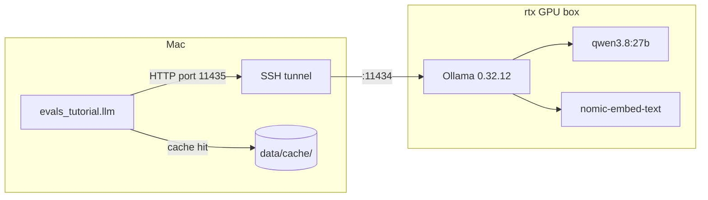

# 00 — Setup: project skeleton, cached Ollama client, GPU check

## What you will learn

- The tools every later chapter relies on: `uv`, `just`, Docker (only chapter 13), Ollama, and the
  SSH tunnel to the GPU box.
- Why the LLM (Large Language Model) lives on a different machine, and how the Mac reaches it.
- The `project/` layout and what each file does.
- How the **on-disk cache** in `evals_tutorial.llm` makes the whole tutorial reproducible and free
  to re-run — what the cache key contains, and how to invalidate it.
- `chat_json` — constrained (schema-checked) output — and why structured answers matter for evals.
- The GPU-sharing rule this tutorial follows so it does not starve a training job running elsewhere.
- The committed public datasets (MT-Bench, RAGTruth) and their licences.
- The real `just check` output, and a "Verified on" table: exact versions of everything that ran.

## Why these tools

- **uv** — a fast Python package manager and project runner. `uv sync` creates a `.venv` and installs
  exactly the versions pinned in `uv.lock`; `uv run <cmd>` runs a command inside that environment
  without you having to activate it. Every command in this tutorial assumes you are in `project/`.
- **just** — a command runner (think `make`, with saner syntax). `just --list` shows every recipe;
  `just <recipe>` runs one. It loads `.env` automatically (`set dotenv-load := true` at the top of the
  `justfile`), so recipes see `OLLAMA_URL` and friends without extra plumbing.
- **Docker** — in this tutorial it is used **only in chapter 13**, to run the Langfuse observability
  stack in a container (profile `langfuse`, UI on `localhost:3030`). Nothing in chapters 00–12 needs
  it; no Docker commands appear until then.
- **Ollama** — a program that serves open-weight LLMs and embedding models over a small HTTP API
  (`/api/chat`, `/api/embed`). Instead of paying a hosted API per token, every model runs locally on
  hardware we control.
- **The SSH tunnel** — Ollama does not run on this Mac. It runs on `rtx`, a machine with an
  RTX 4090 GPU (24 GB of video memory): a 27-billion-parameter chat model like `qwen3.8:27b` (≈ 17.7 GB
  in video memory while loaded) simply does not fit on a laptop. `fleet tunnel` — a wrapper around
  `ssh -N -L 11435:127.0.0.1:11434 rtx` — forwards local port `11435` to Ollama's port `11434` on
  `rtx`. From the Mac's point of view Ollama is just `http://127.0.0.1:11435`; the code never knows a
  remote machine is involved. Third-party tools that need an OpenAI-compatible endpoint use
  `http://127.0.0.1:11435/v1` with any non-empty API key (e.g. `ollama`).



## Project layout

```
project/
├── pyproject.toml            # uv project: package evals_tutorial, deps, Python >= 3.12
├── uv.lock                   # exact dependency versions, committed
├── .env.template             # settings with defaults; copy to .env for local overrides
├── .env                      # local settings (gitignored); .env.template documents each variable
├── .gitignore                # .venv and similar never committed
├── justfile                  # recipes: sync, check, tunnel, gpu-check, cache-stats, test
├── src/evals_tutorial/
│   ├── __init__.py           # package marker
│   ├── config.py             # Settings (pydantic-settings) read from .env, plus settings.path()
│   ├── llm.py                # the cached Ollama client: chat(), chat_json(), embed(), cache_stats()
│   ├── check.py              # just check — one status table; Ollama down or chat failing = exit 1
│   ├── gpu.py                # just gpu-check — is the shared RTX GPU polite to use right now?
│   └── testing.py            # FakeLLM / FakeEmbedder — offline stand-ins used by every test
├── tests/
│   └── test_00_setup.py      # offline chapter-00 tests (CPU, no network)
├── data/
│   ├── public/               # 4 committed public-dataset .jsonl files + README (licences below)
│   └── cache/                # Ollama chat + embedding cache, committed so re-runs cost zero GPU
└── runs/                     # experiments' metrics.json land here from chapter 04 on (plus findings notes)
```

Later chapters each add one module under `src/evals_tutorial/` (plus their `just` recipes), and
chapter 02 generates `data/handbook/` and `data/tickets/` — but the skeleton above stays fixed.

## The cached Ollama client — the most important file of this tutorial

Every call in this tutorial goes through `evals_tutorial.llm`. The reason is simple: a call to
`qwen3.8:27b` over the tunnel costs 20–60 s of real wall-time (more while a model is loading) even
though it costs zero money. Re-running a chapter, a test, or an experiment to check a number should
not pay that again and again. So the module hashes each exact request into a **cache key** and writes
the response to disk *before* returning it. As long as the inputs are unchanged, a re-run reads the
cache and costs zero GPU time — that is what makes the tutorial reproducible and free to re-run.

### The cache key

The key is a SHA-256 hash of a canonical (sorted, compact) JSON encoding of the request:

```python
def _cache_key(endpoint: str, model: str, options: dict, payload_input) -> str:
    blob = _canonical_json({"endpoint": endpoint, "model": model, "options": options, "input": payload_input})
    return hashlib.sha256(blob.encode("utf-8")).hexdigest()
```

What goes in:

- `endpoint` — `/api/chat` or `/api/embed`, so the two kinds of calls can never collide;
- `model` — e.g. `qwen3.8:27b` or `nomic-embed-text`;
- `options` — for chat: `temperature`, `seed`, `num_ctx`, `num_predict`; for embed: `truncate`;
- `input` — for chat: the full message list, the JSON schema (if any) and the `think` flag;
  for embeddings: **one single text** (after the task prefix).

Changing *anything* in the request — one word of the prompt, a different temperature, a different
model — produces a different key, so the old answer is never silently reused.

### The cache layout

```
data/cache/chat/<key[:2]>/<key>.json
data/cache/embed/<model>/<key[:2]>/<key>.json
```

Each entry stores the request, the response, Ollama's `usage` counts and `elapsed_s`, so
`cache_stats()` can report entries and bytes per kind (`just cache-stats`). The first two key
characters are used as a fan-out directory so one folder never holds thousands of files.

Embedding keys are per-text, not per-batch: `embed()` sends misses in batches of ≤ 32 texts to keep
requests small, but writes **one cache entry per text**. Consequence: if you re-embed all 12
handbook sections after editing one of them, only that one section is re-embedded live.

### How to invalidate the cache

The cache is ordinary files on disk, so invalidation is filesystem surgery:

- **one answer**: find the file with `data/cache/chat/…` that contains your prompt
  (each entry stores its `request`) and delete it;
- **a whole model's embeddings**: delete `data/cache/embed/<model>/`;
- **everything**: delete `data/cache/` — the next live call rebuilds each entry automatically.

Be deliberate about it: the cache is committed to git so that tests, `just results`, and chapter
re-runs cost zero LLM calls — wiping it by accident means paying the GPU time back.

### `usage_log` — counting what was live vs cached

A module-level counter `usage_log = {"hits": 0, "misses": 0}` in `llm.py` records, per process, how
many calls were served from the disk (`hits`) versus actually sent over the network (`misses`).
Experiments from chapter 04 on read `hits + misses` to fill the `llm_calls` column of `metrics.json`
and the results table — so "how much GPU did this experiment really use?" is an honest number.

### `chat()` and `chat_json()`

- `chat(messages, *, model=None, temperature=0.0, seed=42, num_ctx=16384, max_tokens=1024,
  json_schema=None, think=False) -> str` — returns the reply text, via the cache. Temperature 0 plus
  a fixed seed means identical input asks for an identical answer, which matters once the results
  feed a table. Transient tunnel drops are retried (3 attempts, exponential backoff) — a long batch
  will occasionally see one dropped connection.
- `think=False` is the default and is worth naming: `qwen3.8:27b` is a "thinking" model, and with
  thinking on its reasoning burns the same token budget as the answer, so a small `max_tokens` can
  leave the `content` field empty.
- `chat_json(messages, schema) -> BaseModel` — the same call but constrained: Ollama's `format`
  field receives the JSON schema, the reply is validated with pydantic, and **if validation fails it
  is retried once** with the validation errors appended to the conversation so the model can fix its
  own output.

Why does structured output matter for evals? Because from chapter 02 on the model is a *component*,
not a conversation partner. The triage step must yield `category`, `priority`, a `needs_escalation`
flag; a judge must yield a verdict plus a critique; a detector must yield a score. Free-text
answers would force a human or a regex to extract those fields, and every extraction failure becomes
a fake "model failure" in the results table. A schema turns "did the model produce a grade I can
count?" into a machine checkable property — and the one retry loop means a model that is *almost*
structured (a stray comma) is graded fairly instead of being punished.

`count_tokens(text)` is also in this module — an approximate token count (tiktoken `cl100k_base`),
good enough for budgeting and reporting, within roughly a factor of two of any given model's true
count.

## The GPU-sharing rule

The 4090 on `rtx` is **shared**: other tutorials run training jobs and RAG experiments on it at the
same time. `qwen3.8:27b` needs ≈ 17.7 GB of the 24 GB while it is loaded, so a careless batch from
this tutorial can evict someone else's work or get evicted itself. The rule this tutorial follows:

- **Single or few calls**: fine at any time.
- **Any batch of more than ~100 LLM calls**: run `just gpu-check` first. If a non-Ollama process
  holds more than **6 GB** of video memory, **wait** — sleep 10 minutes, re-check, retry, up to
  6 hours — instead of starting.

The same rule is why long batches are run in the background with a log file: if the tunnel drops or
the box is busy, stopping and restarting costs nothing, because the cache resumes where it stopped.

## Public datasets and their licences

Chapter 06 studies LLM judges against humans, and chapter 09 measures hallucination detectors; both
need public data with real labels. Four committed subsets live in `project/data/public/` (described
in the README there):

| file | source | licence | rows |
|---|---|---|---|
| `mt_bench_answers.jsonl` | lmsys MT-Bench human judgments (Zheng et al. 2023, arXiv 2306.05685) | CC-BY-4.0 | 480 — 80 questions × 6 models, round 2 answers |
| `mt_bench_human_votes.jsonl` | same | CC-BY-4.0 | 3,355 expert pairwise votes (some pairs voted by several annotators — the basis for human–human agreement) |
| `mt_bench_gpt4_votes.jsonl` | same (`gpt4_pair` split) | CC-BY-4.0 | 2,400 GPT-4 pairwise votes — a frontier judge to compare the local judge with |
| `ragtruth_test_subset.jsonl` | RAGTruth (Niu et al. 2024, arXiv 2401.00396) | MIT | 480 — `test` split, QA + Summary: span-level hallucination labels; 93 of 480 contain ≥ 1 hallucinated span |

The first three files are one dataset (MT-Bench) in three views — the answers, the human votes, and
a model's votes over the same pairs; chapter 06 uses all three. The fourth (RAGTruth) has span-level
"hallucinated here" labels for retrieved-grounding answers; chapter 09 measures detectors against
it. All files are committed, **untouched**, and their row counts are part of `just check`.

## `just check` — the setup gate

`just check` verifies the whole setup in one table: Ollama reachable, chat works, `chat_json`
produces a valid object, embeddings have the expected 768 dimensions, the four public files have the
expected row counts, and the cache is there. Ollama being unreachable or chat failing is a **hard
failure** (exit 1) — everything in this tutorial depends on it. Real output, run on 2026-09-04
(exit 0):

```
                             evals_tutorial check
┏━━━━━━━━━━━━━━━━━━━━━━━━━━━━━━━━━━━━━━━┳━━━━━━━━━━━━━━━━━━━━━━━━━━━━━━━━━━━━┓
┃ check                                 ┃ result                             ┃
┡━━━━━━━━━━━━━━━━━━━━━━━━━━━━━━━━━━━━━━━╇━━━━━━━━━━━━━━━━━━━━━━━━━━━━━━━━━━━━┩
│ Ollama reachable                      │ yes (version 0.32.12)              │
│ chat qwen3.8:27b answers              │ 'OK'                               │
│ chat_json 2-field schema              │ model(word='OK', ok=True) valid    │
│ embedding dim (nomic-embed-text)      │ 768 ok                             │
│ data/public/mt_bench_answers.jsonl    │ 480 rows ok                        │
│ data/public/mt_bench_human_votes...   │ 3355 rows ok                       │
│ data/public/mt_bench_gpt4_votes...    │ 2,400 rows ok                      │
│ data/public/ragtruth_test_subset...   │ 480 rows ok                        │
│ cache size                            │ 3 entries, 14.6 KB                 │
└───────────────────────────────────────┴────────────────────────────────────┘
```

Note how cheap that was: the 3 live LLM calls (2 chat, 1 embed) already sat in
`data/cache/`, so this `just check` cost essentially zero GPU time. The offline tests pass too:
`just test` → **7 passed in 0.19 s** (CPU, no network).

## Verified on

Everything above was run, on 2026-09-05, on a 2025-era Mac (Apple silicon) talking to Ollama
0.32.12 on the `rtx` box:

| item | version |
|---|---|
| Ollama (on `rtx`) | 0.32.12 |
| `qwen3.8:27b` (SUT + default judge, 27.3B, 17.74 GB) | digest `5f86f5def443…3b869b3d5253` |
| `nomic-embed-text` (embeddings, 768-dim, 137M) | digest `0a109f422b47…f3c45e59f` |
| `gemma4:latest` (chapter 06/11, 8.0B, 9.61 GB) | digest `6736aa30b08b…0c7404b603c` |
| uv | 0.11.22 |
| just | 1.53.0 |
| Python (this install) | 3.14.6 (uv picked the newest; `requires-python = ">=3.12"`, so 3.12 works too) |

| package | version | | package | version |
|---|---|---|---|---|
| httpx | 0.28.1 | | numpy | 2.4.6 |
| pydantic | 2.13.5 | | pandas | 3.0.5 |
| pydantic-settings | 2.15.0 | | orjson | 3.12.0 |
| python-dotenv | 1.2.3 | | scikit-learn | 1.9.0 |
| typer | 0.27.2 | | matplotlib | 3.11.1 |
| rich | 14.3.4 | | tiktoken | 0.14.0 |
| pyyaml | 6.0.3 | | pytest | 9.1.1 |
| | | | pytest-timeout | 2.4.0 |

## Troubleshooting

| symptom | cause | fix |
|---|---|---|
| `httpx.ConnectError` / Ollama unreachable, "could not reach Ollama … after 3 attempts" | The SSH tunnel to `rtx` is down (laptop slept, network changed, session expired) | `just tunnel` (or `fleet tunnel`), then re-run — cached calls make the retry cheap; the client already retries transient drops 3× with backoff |
| First call of a session takes minutes instead of ~20–60 s | The model is being loaded into GPU memory (cold) or `rtx` is busy with another job | Don't kill it — load once, then calls are seconds; for batches, run `just gpu-check` first and wait if a non-Ollama process holds > 6 GB |
| Calls are much slower than usual and `nvidia-smi`-style reports show a big non-Ollama tenant | Someone else's training job is running on the shared 4090 and the two are sharing memory/bandwidth | Follow the GPU-sharing rule: stop the batch, wait 10 min, re-check, retry up to 6 h; never kill processes on `rtx` |
| `uv sync` fails to download packages behind a corporate proxy | `uv` cannot reach the package index directly | Export the standard proxy variables for the sync (e.g. `HTTPS_PROXY` / `HTTP_PROXY` and `NO_PROXY`), then re-run `uv sync`; the lock file is committed, so once the index is reachable the install is exact |

## Exercises

1. Run `just check` twice in a row. Compare the elapsed time of the second run and confirm in
   `just cache-stats` that the cache still holds 3 entries — the second run should have cost zero
   live LLM calls.
2. Delete the entries under `data/cache/chat/` (paths look like `data/cache/chat/<2-char prefix>/<40-hex-key>.json`) one by one, running `just check`
   after each deletion, and identify which entry corresponds to the `chat_json` call (the one whose
   `request` contains a `schema`). Restore the files afterwards (they are committed — `git status`
   will show the deletions).
3. Break and heal the tunnel: `pkill -f "ssh.*11435"` (only if you started it yourself), watch
   `just check` fail with the "Is the SSH tunnel to rtx up?" hint, then restore it with
   `just tunnel` and watch the check pass again.
4. Predict the cache key: change *one word* in the prompt of an ad-hoc `chat()` call, then call it
   with the original text again. Which call is a hit and which is a miss in `usage_log`? Explain
   why `temperature` would also change the key.

Next: [01_concepts.md](01_concepts.md) — what an eval is and is not, the three levels of grading,
and how this tutorial measures things.
