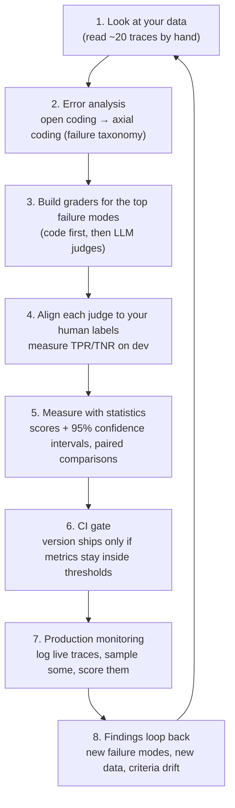

# 01 — Concepts: what evals are, the three levels, graders, the lifecycle, and the tool landscape

## What you will learn
- What an **eval** is and is *not* — how it differs from a unit test, a model benchmark, monitoring
  and an A/B test, and why public leaderboards tell you nothing about *your* app.
- The **three levels of evaluation** (fast code checks, human + model grading on logged traces, A/B
  tests in production), what cadence and cost each implies.
- The three **graders** — code, human, LLM — plus the decision vocabulary: reference-based vs
  reference-free, pointwise vs pairwise, binary vs Likert.
- The **eval lifecycle** this tutorial follows: look at data → error analysis → graders → align the
  judge → measure with error bars → gate merges → monitor production → back to data.
- **LLM-as-judge in one page**: what it is, its documented biases, why a judge must itself be
  measured, and panels of judges.
- **Model benchmarks in one page**: the standard benchmark table, contamination, saturation, and why
  prompt formatting silently changes scores.
- The **tool landscape** — a map of what exists, what runs against Ollama, and which tools this
  tutorial actually runs.
- Exactly **how this tutorial measures things**: the system under test, the ticket set, the two
  public datasets, the one results table, and the CI (Continuous Integration) rule.

## What an eval is — and what it is not

An **eval** (short for *evaluation*) is a measurement you build for your own application: you run
your system on a set of inputs you chose, grade the outputs against a criterion you defined, and get
a number you can compare across changes. That sentence hides the important parts — **your** inputs,
**your** criteria, **your** numbers. Hamel Husain and Shreya Shankar put it this way in their evals
FAQ: evals measure *your* pipeline on *your* data (Hamel Husain & Shreya Shankar, "AI Evals FAQ",
2025). That is the single distinction this tutorial lives and dies on.

People routinely confuse five different things. Here is the map:

| Thing | What it checks | When it runs | What "your" means in it |
|---|---|---|---|
| **Unit test** (code test, e.g. `pytest`) | a function: given input X, does it return Y, without crashing? | every code change, in CI (Continuous Integration) | your *code*; the LLM is either absent or mocked |
| **Eval** (this tutorial) | your *whole LLM pipeline*: prompt, retrieval, tools, grading — on *your* task and *your* data | on every prompt/model change, plus periodically on new data | your product, your users' kind of requests |
| **Model benchmark** (MMLU, GSM8K, …) | a foundation model in the abstract, on public questions | once per model, by anyone with compute | nobody's product — it measures the *model*, not your app |
| **Monitoring** | whether a live system is degrading (latency, error rate, sampled quality) | continuously, in production | your app with real users |
| **A/B test** | whether a *shipped change* actually helped users (clicks, support tickets, revenue) | after a change ships, with real traffic split between variants | your product, in the field |

None of these replaces the others — later chapters use each in its lane. But the common mistake the
*evals ≠ benchmarks* distinction guards against is concrete: MMLU (Massive Multitask Language
Understanding, a multiple-choice knowledge benchmark) can score 90+ for your model's family and your
RAG (Retrieval-Augmented Generation) app can still invent your refund policy, because MMLU was never
asked a single question about your handbook. Public benchmarks have no idea that your product, your
users, or your data even exist.

Why "look at your data" comes before all of this: every source in this field agrees the first thing a
team should do is *read real traces by hand* — a trace is one full record of your system doing one
thing (input, retrieved context, prompt, output). The failure modes you cannot even name yet are the
ones no metric measures. We do exactly that in chapter 03.

## The three levels of evaluation

Hamel Husain's "Your AI Product Needs Evals" (2024) organizes all the other stuff into three levels,
ordered from cheapest-and-fastest to most-expensive-and-most-revealing. You run all three, on
different schedules:

- **Level 1 — code checks, on every change.** Fast, deterministic assertions: does the output parse
  as JSON (JavaScript Object Notation — a text format for structured data)? Is the required field
  present?
  Did the classifier pick one of the allowed categories? These cost milliseconds and you run them in
  CI, on *every* commit, the same way you run unit tests. They cannot judge "is this reply
  good?" but they catch the regressions you fix most often. Chapter 04 is level 1.
- **Level 2 — human and model grading on logged traces, periodically.** You take a batch of real
  (or synthetic) traces — say, 60 tickets — and grade each output: a human reads and writes a pass/
  fail + reason, or an LLM judge does it with your rubric. This costs minutes-to-hours of reading, or
  a few hundred LLM (Large Language Model) calls, so you run it per prompt/model *version*, not per
  keystroke. This is where you find out that "v2 answers better" is true or false. Chapters 03, 05,
  08 and 09 live at level 2.
- **Level 3 — A/B tests in production, after it ships.** Only when the change is live do you split
  real users between the old and new behaviour and measure what actually changed for them. It is the
  most expensive level (it needs traffic, time, and often an experiment platform) and the only one
  that measures *user* outcomes, so you run it rarely and deliberately. Chapter 13 covers how it
  connects.

The cadence idea matters as much as the levels: level 1 every commit, level 2 every version,
level 3 every release. A single "run the benchmark and screenshot the number" workflow skips two of
the three and misses both regressions you can automate and the failures only a reader can see.

## Graders: who does the scoring

A **grader** is anything that turns an output plus a criterion into a score. There are three kinds,
and the order you should try them in is the order you should use them in — prefer the fastest
method that is reliable (Anthropic, "Define success criteria and build evaluations"; Braintrust,
"What is an LLM-as-a-judge?"):

1. **Code grader.** Deterministic code: exact match, schema validity, regex, a classifier F1 (F1 — a
   single number combining *precision*, "of things it said, how many were right", and *recall*, "of
   all the right things, how many did it say"). Free, instant, reproducible — and it only works for
   things you can state as a rule.
2. **Human grader.** A person reads the output and decides. The most faithful judgment you can get,
   the slowest and most expensive, and it does not scale past dozens of items. Its best jobs:
   labelling the *dev* (development) set your judge will be aligned against, and judging the
   disagreements your judge gets wrong.
3. **LLM grader (LLM-as-judge).** A model grades another model's output against your rubric. Fast
   like code, flexible like humans — but it is a *biased instrument* (next section), so it must be
   validated by measuring it against labels you trust.

Three vocabulary pairs separate these graders from each other:

- **Reference-based vs reference-free.** Reference-based: the grader is shown the known-good answer
  (or the source passages a reply must be grounded in) and scores against it. Reference-free: it
  judges quality of the output alone ("is this fluent and on-topic?"). Reference-free is convenient
  in production where no gold answer exists, but it is the weaker measurement — the tutorial leans
  reference-based wherever a gold exists, because it is what makes grading *verifiable*.
- **Pointwise vs pairwise.** Pointwise: one output gets one score ("this reply is a pass").
  Pairwise: two answers to the same question are shown side by side and the grader picks the better
  one. Pairwise is what crowdsourced leaderboards (Chatbot Arena) and chapter 06 do; it is relative,
  good for ranking, and famously order-biased. Pointwise is absolute, good for thresholds and CI
  gates.
- **Binary vs Likert.** Binary: pass/fail, one bit, with a written reason (a **critique**). Likert:
  a 1–5 scale. Here the sources genuinely disagree, and we state it honestly: Hamel Husain and
  Shreya Shankar's FAQ argues strongly for binary — it is faster to produce, more reproducible
  between raters, and an LLM judge is *easier to align* against a binary label than against a scale
  that human raters compress toward 3–4 anyway (Hamel Husain & Shreya Shankar, "AI Evals FAQ",
  2025; Hamel Husain, "A Field Guide to Rapidly Improving AI Products", 2025). Anthropic's docs,
  by contrast, present Likert-scale (1–5) LLM-graded evaluations as first-class worked examples — a
  real tension their docs leave unflagged (Anthropic Claude Docs, checked 2026-09-03). Our
  resolution: **binary pass/fail + a free-text critique** is the default for every gate in this
  tutorial, because a one-bit verdict plus the reason is both what you can gate CI on and what a
  human can audit in 10 seconds. Likert scores remain fine for *exploratory* digging into "how bad
  is it, on a scale" — but never as the number a merge decision rests on.

One more grader family you should not confuse with the three: **specialised small detectors** —
hallucination classifiers like Vectara HHEM (Hallucination Evaluation Model) or LettuceDetect
(chapter 09) — are tiny trained models, not general LLM judges. They are cheap, fast,
reference-based (they score answer *against context*), and they will be one of your production
checks.

## The lifecycle this tutorial follows

An eval is not a one-off measurement; it is a loop. The version we run:

Each arrow is a chapter, in order: 03 (data + taxonomy), 04 (code graders), 05 (judges +
alignment), 07 (statistics), 13 (gate + monitoring). The two measurement terms on this loop:
**TPR** (True Positive Rate — "of the outputs humans marked bad, how many did the judge also mark
bad") and **TNR** (True Negative Rate — "of the outputs humans marked fine, how many did the judge
correctly accept"). A judge with 90% TPR and 90% TNR on your dev set is a usable instrument; one
with 85% *raw agreement* might only be getting the easy majority class right (Hamel Husain, "Your
AI Product Needs Evals", 2024; Shankar et al., "Who Validates the Validators?", 2024).

Why a loop and not a line: **criteria drift**. Shankar et al.'s EvalGen work documents that grading
outputs changes your understanding of what "good" means, which changes your rubric, which changes
how you grade — the criteria do not exist before the work, they are *produced by* the work
(Shreya Shankar et al., UIST 2024). Expect to revise your pass criteria several times; that is the
method working, not the process failing. And production monitoring keeps feeding new failure modes
into step 1, which is why a shipped eval suite is never "done".

## LLM-as-judge, in one page

An LLM judge is a model asked to render a verdict — pass/fail or "A vs B" — with a rubric you write.
It became the default grader because it runs thousands of judgments per dollar and can be told
*which* criteria matter. The research literature (which chapters 05–06 run) also documented what it
is *not*: a neutral referee. The biases are reproducible and named:

- **Position bias** — in a pairwise comparison, the judge favours a particular *position*
  (usually "first"); swap the two answers and the verdict can flip. (Wang et al., "Large Language
  Models are not Fair Evaluators", ACL 2024; Zheng et al., NeurIPS 2023.)
- **Verbosity bias** — the judge systematically prefers the longer answer, even when the shorter
  one is right; correcting for length measurably raises the judge's correlation with human
  rankings. (Dubois et al., "Length-Controlled AlpacaEval", 2024.)
- **Self-preference bias** — a judge favours outputs in the same model family as itself. (Zheng
  et al., 2023; documented across the LLM-judge survey literature, Gu et al. 2024/2025.)
- **General competence ceiling** — on genuinely hard, objectively-checkable cases, even frontier
  judges are barely better than chance. (Tan et al., "JudgeBench", ICLR 2025.)

Two conclusions follow, and this tutorial obeys both:

1. **A judge is a classifier, so it must itself be measured before you trust it.** That is chapter
   05's TPR/TNR alignment against human labels, and chapter 06's full microscopy against 3,355 real
   human votes — the JudgeBench lesson operationalised: never accept a judge's accuracy claim
   without testing it against labels you can verify. (Tan et al. 2025; Zheng et al. 2023.)
2. **Prefer a jury over a single judge.** A panel of diverse, even *smaller and cheaper* judge
   models (PoLL — "Panel of LLM judges", Verga et al. 2024) correlates better with human judgment
   than one large judge, is less biased, and costs a fraction as much. We run two different local
   judges (`qwen3.8:27b` and Atla Selene-Mini) in parallel in chapter 06 and let their *disagreement*
   be part of the answer — a judge that agrees with itself 100% of the time is the least
   informative judge you could have. (Verga et al., 2024.)

## Model benchmarks, in one page

The second half of the tutorial runs real public benchmarks against local models with
`lm-evaluation-harness` and Inspect AI (chapters 11–12). The set worth knowing, with what each
actually measures (from `research/SOURCES_papers.md`, compiled 2026-09-03):

| Benchmark | What it measures | Status in 2026 |
|---|---|---|
| **MMLU** | multiple-choice academic knowledge across many subjects (Hendrycks et al. 2020) | saturated for frontier models; MMLU-Pro is the harder variant |
| **GSM8K** | grade-school math word problems (Cobbe et al. 2021) | near-saturated and contaminated; GSM1k shows up to 8-point drops on a fresh, matched-difficulty set (Zhang et al. 2024) |
| **HumanEval** | functional-correctness code generation (Chen et al. 2021) | mostly saturated; LiveCodeBench refreshes problems continuously |
| **IFEval** | verifiable instruction-following ("answer in exactly 3 bullets") scored by checkers, not a judge (Zhou et al. 2023) | still in active use — one of our two chapter-11 benchmarks |
| **MT-Bench** | multi-turn conversational quality judged by an LLM (Zheng et al. 2023) | a judge *and* a benchmark — the source of our 3.3K human votes in chapter 06 |
| **Chatbot Arena** | crowdsourced pairwise human votes → Bradley–Terry/Elo leaderboard (Chiang et al. 2024) | top models now cluster within ~20 Elo points — differences often not meaningful |
| **SWE-bench (Verified)** | resolving real GitHub issues with unit tests as the grader (Jimenez et al. 2024; OpenAI curation 2024) | OpenAI itself stated in 2026 it no longer discriminates frontier models |
| **τ-bench** | tool-agent-user interaction in retail/airline domains; introduces **pass^k** (success across *all* of k repeated trials) (Yao et al. 2024) | active agent benchmark; pass^k is the idea chapter 10 reuses |
| **HLE** | "Humanity's Last Exam" — expert-vetted frontier-difficulty questions (Phan et al. 2025) | the 2026 frontier set, alongside FrontierMath, GPQA Diamond, ARC-AGI-2 |

Three methodological facts transfer directly to our own product evals:

- **Contamination.** A benchmark score is only as honest as the model's exposure to that benchmark
  during training. GSM1k is the cleanest evidence: a fresh, matched-difficulty version of GSM8K
  where some model families drop up to 8 points — they had overfit the original (Zhang et al.
  2024). Always ask "could this model have seen this test?"
- **Saturation.** A 2026 study of 60 widely used benchmarks found roughly half highly saturated,
  with older ones saturating faster (2026, arXiv 2602.16763). A benchmark has a shelf life; a
  score of 97 is not double a score of 48, it is "the test stopped being able to tell models apart".
- **Prompt formatting changes scores by double digits.** The `lm-evaluation-harness` paper
  documents how small implementation choices — prompt template, order of few-shot examples, answer-
  extraction regex — silently swing results; that is why it exists as a standardized harness, and
  why chapters 11–12 always report the exact harness, template and extraction alongside any score
  (Biderman et al., "Lessons from the Trenches on Reproducible Evaluation of Language Models",
  2024). A number without its setup string is just a number.

And the statistical discipline all of this needs — most reported score *differences* between
models fall inside measurement noise; you need confidence intervals and a power calculation before
"A beats B" (Miller, "Adding Error Bars to Evals", 2024). That is chapter 07.

## The tool landscape

What exists, as a map (from `research/SOURCES_tools.md`, verified 2026-09-03; stars/versions are
approximate). "Runs against Ollama" means it can point at our local server
`http://127.0.0.1:11435`.

| Tool | Category | Licence | Runs against Ollama | Used in chapter |
|---|---|---|---|---|
| lm-evaluation-harness (EleutherAI) | academic benchmark harness | MIT | yes — `local-chat-completions` against the OpenAI endpoint | 11 |
| DeepEval | pytest-style LLM unit testing | Apache-2.0 | yes — `deepeval set-ollama` | 08 |
| RAGAS (vibrantlabsai) | RAG-specific metrics | Apache-2.0 | yes — via LangChain wrappers (with known rough edges) | 08 |
| Inspect AI (UK AISI) | framework: dataset → solver → scorer, agent evals | MIT | yes — `ollama/<model>` provider | 12 |
| Langfuse | tracing + eval datasets + LLM-as-judge evaluators, self-hosted | MIT (self-host) | yes — its compose ships an `ollama` service | 13 |
| evalica | statistics: Elo/Bradley–Terry leaderboards from pairwise judgments | Apache-2.0 / MIT | n/a — pure statistics, no model calls | 06–07 |
| Vectara HHEM-2.1-Open | hallucination-detection classifier (110M params, CPU) | open weights | n/a — runs standalone on CPU | 09 |
| LettuceDetect | token-level span hallucination detector | MIT | n/a — runs standalone | 09 |
| promptfoo | YAML-config prompt testing, CLI (Node.js) | MIT core | yes — `ollama:chat:<model>` provider | comparison only (13 mentions it) |
| openai/evals | framework + benchmark registry | MIT | informally, via OpenAI-compatible base URL | comparison only |
| Phoenix (Arize) | observability + evals UI | Elastic License 2.0 (source-available, not OSI open source) | yes via OpenAI-compatible client | comparison only — note the licence |
| LangSmith | commercial platform, SDK only free | SDK MIT, platform closed | SDK can point anywhere | comparison only — not self-hostable free |
| Opik (Comet) | self-hostable observability + evals | Apache-2.0 | yes, documented | comparison only (13 mentions it) |
| MLflow `genai` | tracking + `evaluate()` API | Apache-2.0 | via `ollama:/<model>` spec | comparison only |
| Weave (W&B) | tracing + eval harness | Apache-2.0 | via OpenAI-compatible client | comparison only |
| lighteval (HF) | academic benchmark harness | MIT | via LiteLLM passthrough | comparison only — overlaps lm-eval-harness |
| OpenCompass | broad model+dataset eval platform | Apache-2.0 | via its `openai_api` wrapper | comparison only — heavyweight install |
| HELM (Stanford) | holistic multi-metric benchmark suite | Apache-2.0 | less turnkey for Ollama | comparison only — research-oriented |
| Atla Selene-Mini (judge model, 8B) | purpose-built LLM judge | open weights | yes — official Ollama pull | 06 |
| Braintrust autoevals | small scoring library (LLM-judge + heuristics) | MIT (library), platform commercial | yes via OpenAI base URL | comparison only |

Two paragraphs before you start shopping with this table.

**Why not just pick one?** Because the landscape is not competing products, it is different *jobs*: a
benchmark harness (lm-eval-harness, Inspect, HELM) standardizes "run a public test fairly"; a
unit-testing framework (DeepEval, promptfoo) makes grading part of your code workflow; a RAG metrics
library (RAGAS) codifies retrieval-vs-generation metrics; observability (Langfuse, Phoenix, Opik,
LangSmith) keeps *continuous* traces you can score later; statistics libraries (evalica, `krippendorff`)
turn pairwise judgments into defensible leaderboards. A mature eval setup uses one of each kind — and
this tutorial does exactly that.

**Why these are the ones we run.** The selection criteria are: permissive licence, first-class local
Ollama support, actively maintained in 2026, and each teaches a *distinct* concept (chapters 04–13).
lm-evaluation-harness is the canonical way to run a real benchmark locally; DeepEval gives
pytest-native grading; RAGAS is the RAG metric *standard* — we deliberately show its local-model
rough edges (NaN scores, executor errors) because you will meet them in the wild; Inspect AI is the
most coherent full framework dataset→solver→scorer; Langfuse is the production observability +
dataset story, fully MIT self-hosted; evalica turns chapter 06's pairwise votes into a
Bradley–Terry leaderboard with confidence intervals; HHEM and LettuceDetect are the two
CPU-friendly, open hallucination detectors that double as "small model beats big generalist for one
narrow job"; and Selene-Mini is the one purpose-built judge with first-class Ollama distribution.
Promptfoo, openai/evals, Phoenix, LangSmith, Opik, MLflow, Weave, lighteval, OpenCompass and HELM
are all real and some are better for some teams — but either they break this tutorial's
constraints (paid platform, Node.js runtime, non-permissive licence, 100+-dataset install) or they
overlap a tool we already use. Chapter 13 revisits this table with the full pros/cons view now that
we have run things.

## How this tutorial measures things

Every number you will read in chapters 04–14 comes from one place, one way. The plain-language map
of the contract (defined in `index.md`):

- **One system under test.** A small customer-support assistant for a fictional shop, *Northwind
  Outdoor*, with three parts, each exercising a different eval kind: **`triage`** (classify a ticket
  into category/priority/escalation — graded by *code*, precision/recall/F1), **`answer`** (retrieve
  handbook sections and write a cited reply — a RAG task, graded by *judges* and hallucination
  *detectors*), and **`agent`** (a tool-calling agent that looks up orders and refunds against a
  mock database — graded on final *state* and trajectory). Versioned prompts (`v1`, `v2`, …) are the
  only thing that changes between experiments, so "v2 is better" is a clean question. (Chapters 02, 10.)
- **One ticket set.** 80 synthetic tickets generated from a persona × topic × scenario grid, where
  the *labels are gold by construction* — category, priority, escalation, which handbook sections a
  good reply needs, and the answer points it must contain. 20 tickets are the **dev** split (for
  tuning prompts and aligning judges; never reported), 60 are the **test** split (everything in the
  results table). (Chapter 02.)
- **Two public datasets with real human labels.** (a) **MT-Bench human judgments**: 3,355 pairwise
  human votes over 6 models on 80 questions, CC-BY-4.0 — used in chapter 06 to measure our LLM
  judge *against humans*, including human-vs-human agreement as the ceiling. (b) **RAGTruth**
  (480-example subset, MIT): span-level hallucination labels for RAG answers — used in chapter 09 to
  measure hallucination *detectors on their home turf*.
- **One results table.** Every experiment writes `project/runs/<experiment>/metrics.json`;
  `just results` rebuilds one markdown table — columns: `experiment | chapter | n | primary metric |
  95 % CI | LLM calls | s/item | notes`. Every quoted number is a row here, always on the test split
  (or the named public dataset), always with its 95% confidence interval (95% CI — the random
  interval that would capture the true value 95% of the time if you re-ran the sampling; chapter 07
  builds it). You will never see a number in this tutorial without its error bar and its sample size.
- **One CI rule.** Chapter 13 turns the table into a gate: a prompt version ships only if its
  primary metric stays inside a threshold *and* the paired comparison's confidence interval says a
  change is real (not inside the noise) — otherwise the merge is blocked and we go back to looking
  at traces.

That is the whole system: one SUT, one fixed dataset, two public human-labelled sets, one table, one
gate. If you remember one sentence from this chapter, make it this one — *evals measure your
pipeline on your data*, and every tool and benchmark in the world exists to make that sentence true
with numbers you can defend.

## Troubleshooting

| Symptom | Likely cause | Fix |
|---|---|---|
| "My judge agrees with itself 100%" | You are grading a trivial class, or position bias with a fixed order, or temperature 0 has collapsed the verdicts into one — a judge never wrong is a judge never testing anything (JudgeBench's whole point) | Add genuinely hard pairs, swap order and require the verdict to survive (chapter 06), or check you are passing both answers |
| "The score went up 3 points" | Inside the confidence interval — measurement noise (Miller 2024) | Report the 95% CI and do a paired comparison before claiming an improvement (chapter 07) |
| MMLU/GSM8K looks great but my app still fails | Benchmark ≠ eval — the test never asked about your handbook (the *evals ≠ benchmarks* distinction) | Build level-1 code checks + level-2 judges on your own ticket set (chapters 03–05) |
| My judge's score jumps when I swap A/B order | Position bias (Wang et al. 2024) | Randomize or run both orders and require agreement; prefer pointwise grading for gates |
| Judge prefers the longer answer | Verbosity bias (Dubois et al. 2024) | Use length-controlled comparisons or length-normalized prompting; don't gate on raw win-rates |
| "Model A scores 97 and B scores 70, so A is better" | Saturation compresses the top of the scale; 97 and 70 may be statistically indistinguishable once error bars are on (Arena's ~20-Elo clustering is the same phenomenon) | Always compare *differences* with a CI, never raw points (chapter 07) |
| I changed a prompt template and my benchmark number moved by double digits | Expected, not a bug — formatting, few-shot example order and answer-extraction regex all change scores (Biderman et al. 2024) | Fix the harness/template and version it; report the score *with* its setup (chapter 11) |
| My team argues "is this answer good?" about everything | No rubric yet — criteria drift is the *first* round, not a failure (Shankar et al. 2024) | Do the open-coding → axial-coding loop on real traces first (chapter 03), then write the rubric from the taxonomy you found |
| I only have a Likert 1–5 judge and a CI gate | Scale scores compress toward 3–4 and don't survive between raters (Hamel & Shankar FAQ) | Convert the gate to binary pass/fail + critique; keep Likert for exploratory views (chapter 05) |
| "Let's just use MMLU as our CI gate" | MMLU is saturated, contaminated and measures nothing app-specific | Keep the gate on *your* metrics; use MMLU only as a model-selection sanity check (chapters 11, 13) |

## Exercises

1. **Vocabulary drill.** Without re-reading this chapter, write in one sentence each: what an eval
   is and is not; level 1 vs level 2 vs level 3 cadence; reference-based vs reference-free;
   pointwise vs pairwise; binary vs Likert; what TPR and TNR mean for a judge. (2–3 minutes.)
2. **Classify your own.** For every AI feature in a product you use (or a side project you have),
   write down its 3 failure modes you actually observed, then say which of them a *code* grader
   could catch and which would need an *LLM* judge or a *human*. This is a single-pass axial
   coding (chapter 03, section 3 — you are doing it informally).
3. **Judge-the-judge sketch.** Take one pass/fail rubric you would *want* to gate on (e.g. "reply
   cites the handbook and never invents a refund policy"). Write down 5 ticket+reply pairs you
   would make a human label as "should pass" and 5 as "should fail", and note *why* each is a
   good hard case (tricky wording, near-miss policy, two-criteria conflict). That is a draft dev
   set for a chapter-05 alignment run — the *reasoning* matters more than the count.
4. **Benchmark-skeptic audit.** Pick one benchmark number from a model card or leaderboard you
   have read this month. Write one honest sentence asking "could this model have seen this
   benchmark?" and one asking "is the score near enough saturation that a 3-point difference is
   real?" You do not need to know the answer — you need to see that the questions exist before the
   numbers.

Next:

Chapter 02 (`02_system_under_test.md`) builds the Northwind Outdoor assistant — `triage`,
`answer` and `agent` — its 80-ticket gold-labelled dataset, and runs prompt version `v1` on all of
them, so that every concept in this chapter has concrete traces to look at.
