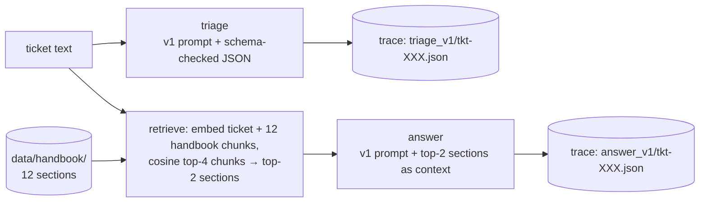

# 02 — The system under test: Northwind Outdoor helpdesk, handbook, tickets, and running v1

## What you will learn

- The shop and its **handbook** — the 12 policy sections every later chapter grades against.
- Why building our own tickets with **gold-by-construction labels** is the right cold-start move,
  and how the persona × topic × scenario grid produces 80 tickets plus their labels.
- The two pipelines, `triage` (classification) and `answer` (RAG — Retrieval-Augmented
  Generation, i.e. retrieve handbook sections, then write a reply from them), and their **versioned
  prompts** (`v1`, `v2`, …).
- The **trace contract** — one JSON file per ticket — that every later chapter, tool and judge reads.
- Real example traces for both pipelines, and a first quick score for v1 (72.5 % category accuracy
  on `test` — no error bar yet, that waits for chapter 07).
- How long all of it took to run, and what "free" really means with the on-disk cache.
- Troubleshooting: JSON-schema refusals, retrieval missing the obvious section, and context
  truncation.
- Exercises to run before moving on.

## The shop and why it is enough

Every eval in this tutorial runs against one small application for a reason: the smaller the system,
the more a number means. We can say *why* a metric moved, not just *that* it moved.

The system is a customer-support assistant for **Northwind Outdoor**, a fictional online shop that
sells bikes and camping gear. It has two working parts in this chapter (the third, a tool-calling
agent, arrives in chapter 10):

| task | kind of problem | input | output | how it will be graded |
|---|---|---|---|---|
| `triage` | **classification** — sort every ticket | ticket text | `category`, `priority`, `needs_escalation`, `reason` (JSON) | pure code, chapter 04 |
| `answer` | **RAG** — answer with only what the handbook says | ticket text + retrieved sections | reply text with `[section_id]` citations | judges + detectors, chapters 05, 08, 09 |

Both are built once, in this chapter, and **never changed again** — except their *prompts*, and
prompts are stored on disk as versioned files (`prompts/triage_v1.txt`, `prompts/triage_v2.txt`, …).
That is the single most important decision of the whole tutorial: when a later chapter says
"v2 is better than v1", it means *same code, same model, same 80 tickets, different file*.



## The handbook — 12 sections, every rule has a number

The shop's policy documents are the ground truth for `answer` and the source of the ticket labels.
There are exactly 12 of them, one file each under `project/data/handbook/`:

`returns`, `shipping`, `warranty`, `payments`, `accounts`, `discounts`, `gift_cards`,
`order_changes`, `damaged_items`, `international`, `loyalty`, `privacy`.

These 12 ids are **fixed** by the data contracts in `index.md` and never change. They are the
category list for `triage`, the retrieval corpus for `answer`, and the citation vocabulary for
every reply.

Each section was generated once through the cached LLM client (chapter 00) with strict rules:
Markdown, concrete, and **every rule must contain real numbers** — days, percentages, amounts,
thresholds. Concrete numbers are what make the labels gradeable: "the prepaid return label costs a
flat fee of $12.50" can be checked; "returns are processed promptly" cannot.

Here is `returns.md` — the one section you will see quoted most:

> **Returns** (abridged)
>
> 1. You have a strict **30-day window** from the date of delivery to initiate a return request.
> 2. …If the item shows signs of wear, dirt, or damage, we will deduct a **15% restocking fee**
>    from your refund amount.
> 3. …We offer a prepaid return label for a flat fee of **$12.50**.
> 4. Refunds are processed within **5 business days** after we receive and inspect your package.
> 5. High-value items, specifically those priced **over $500**, require a signature upon delivery.
>    …You have **48 hours** to retrieve the item from the local depot.

Each file ends with a `## Key facts` block of 5 distilled one-liners. These `key_facts` are not
cosmetic — `tickets.py` samples 1–2 of them per ticket and *makes the ticket about them*, so a good
answer contains exactly those numbers. That is the hook that turns a free-text reply into something
we can grade.

**What we actually got.** All 12 sections came back with 5 facts each. The word-count target was
200–400; most sections landed at 392–557 (every one ≥ 392, the three largest at ~557). We left
them as-is and note the drift here rather than burning extra LLM budget to regenerate — nothing
downstream depends on the exact length, and the handbook is committed, so a mismatch with the spec
is disclosed, not hidden:

| section | words | facts | section | words | facts |
|---|--:|--:|---|--:|--:|
| returns | 392 | 5 | order_changes | 449 | 5 |
| shipping | 446 | 5 | damaged_items | 494 | 5 |
| warranty | 440 | 5 | international | 448 | 5 |
| payments | 489 | 5 | loyalty | 557 | 5 |
| accounts | 521 | 5 | privacy | 465 | 5 |
| discounts | 453 | 5 | gift_cards | 536 | 5 |

## Why synthetic tickets, with gold labels by construction

You will not find 80 real, labelled support tickets at zero cost, zero licence risk, and zero
variance between machines. This is the classic bootstrap problem — you need data to build evals,
but you do not have one yet. Hamel Husain points at **synthetic data** for exactly this, and the
dimension framework we use here is his: pick *features / scenarios / personas*, define the value of
each dimension, and only then let an LLM write the user text for a known combination.

We do that in `tickets.py`, and the order of operations is the whole trick: **label first, text
second.**

```
grid (seed 42)  →  gold labels (pure code, no LLM)  →  LLM writes the customer's voice
```

For every ticket we know, before the LLM sees it:

| label | decided by |
|---|---|
| `category` | the **topic** dimension — a handbook section id |
| `priority` | the **scenario** (`simple_question`→low, `problem_report`→normal, `urgent_blocker`→urgent, `out_of_policy_request`→normal) |
| `needs_escalation` | `out_of_policy_request`, or an `urgent_blocker` on a money/data/safety topic (`payments`, `privacy`, `damaged_items`) |
| `sections` | the topic, plus one *related* section for 20 % of tickets (a fixed lookup) |
| `answer_points` | the 1–2 handbook key facts the ticket must be about |
| `text` | the only thing the LLM writes — 60–160 words, first person, the voice of the persona |

So "gold by construction" means: the label is a row in a lookup table, not a judgement. When
chapter 04 reports that v1 got the category wrong on a ticket, there is no ambiguity in *what the
right answer was* — only in *why the model missed it*, which is exactly the question we want to
be able to ask.

The grid is **6 personas × 12 topics × 4 scenarios**, drawn with a seeded RNG (`seed=42`) so the
same 80 tickets are built on every machine:

| persona | scenario |
|---|---|
| hurried commuter | simple_question |
| polite retiree | problem_report |
| angry first-time buyer | urgent_blocker |
| small-business buyer | out_of_policy_request |
| non-native English speaker | |
| teenager | |

Coverage floors are enforced: **every topic ≥ 5, every scenario ≥ 15**. The actual distribution:

**by scenario**

| scenario | count |
|---|--:|
| simple_question | 23 |
| problem_report | 22 |
| out_of_policy_request | 18 |
| urgent_blocker | 17 |

**by priority** (decided from scenario)

| priority | count |
|---|--:|
| low | 23 |
| normal | 40 |
| urgent | 17 |

**by topic** — every one of the 12 lands at 6 or 7 tickets (accounts, discounts, order_changes,
payments, returns, shipping, warranty at 7; the rest at 6).

**Split.** `dev` (20) / `test` (60), stratified by topic so every topic appears in *both* — 8
topics take 2 dev tickets, 4 take 1, and the code asserts the count is exactly 20/60. Everything
reported in `results.md` later in the tutorial is on `test`; `dev` is where we tune prompts and
judges. The reason for the split: once we start iterating on v2 while looking at a ticket, we can
no longer call that ticket an honest measurement of v2.

## `triage` — classification with a versioned prompt

`triage(ticket_text, version)` is one schema-checked JSON call (chapter 00's `chat_json`):

```python
class Triage(BaseModel):
    category: Category      # one of the 12 handbook section ids
    priority: Priority      # low | normal | high | urgent
    needs_escalation: bool
    reason: str
```

The v1 system prompt (`prompts/triage_v1.txt`) is deliberately plain — no few-shot examples, no
scoring rubric, just the 12 categories with one-line definitions and the four output fields. It is
plain on purpose: chapters 04–06 will keep lifting it, and a weak v1 is the honest baseline to beat.
A slice:

```
You are the triage module of the Northwind Outdoor customer support system.
Northwind Outdoor sells bikes and camping gear.

Classify it and reply with a single JSON object with exactly these fields:
- "category": exactly one of these 12 categories:
  - returns: returning items and getting money back
  - shipping: delivery, tracking, and shipping costs
  …
- "priority": exactly one of "low", "normal", "high", "urgent".
- "needs_escalation": true if the customer asks for something the policy does not
  allow, or if it is an urgent blocker about payments, privacy, or damaged items;
  otherwise false.
```

## `answer` — the RAG pipeline

`answer(ticket_text, version)` does three things, in order:

1. **Chunk** — each handbook section is split into ≤ 120-word chunks along sentence boundaries
   (`CHUNK_MAX_WORDS = 120`).
2. **Retrieve** — embed every chunk plus the ticket with `nomic-embed-text`, take the 4 best chunks
   by cosine (`TOP_K_CHUNKS = 4`), and collapse them to their sections — so the top-2 sections win
   (`TOP_SECTIONS = 2`).
3. **Generate** — send the v1 system prompt plus the *full text* of those 2 sections and the ticket
   as one user message, and ask for a reply that cites the section it used for each claim, as
   `[section_id]`.

The v1 system prompt is the whole rulebook for the reply:

```
You are the Northwind Outdoor support assistant. Northwind Outdoor sells bikes and camping gear.

Answer ONLY from the handbook excerpts. Do not use any knowledge that is not in the excerpts.
Cite the handbook section you used for each claim as [section_id], for example [returns].
If the handbook excerpts do not cover the customer's question, say so plainly and offer to
escalate the ticket to a human agent.
```

Two things make this gradeable: the citations give us a per-claim link back to a section, and the
"say so and offer to escalate" escape hatch gives v1 a *correct* behaviour when retrieval fails —
which chapter 08's hallucination detectors will then check for.

## The trace contract — one JSON file per ticket

Every time we run a task over a ticket, `helpdesk.write_trace` writes
`project/runs/traces/<run>/<ticket_id>.json`, where `<run>` is `<task>_<version>` — e.g.
`runs/traces/answer_v1/tkt-031.json`. One file, always the same keys:

```json
{
  "run": "answer_v1",
  "version": "v1",
  "ticket_id": "tkt-031",
  "input": "the customer's ticket text",
  "retrieved": [
    { "section": "accounts", "score": 0.725791 },
    { "section": "privacy",  "score": 0.638982 }
  ],
  "prompt": "the versioned system prompt, verbatim",
  "output": "the model's reply text   (triage: the parsed JSON object)",
  "latency_s": 41.2,
  "model": "qwen3.8:27b",
  "usage": { "prompt_tokens": 742, "completion_tokens": 61 }
}
```

Why this shape:

- **`prompt` is stored verbatim** — when chapter 08 compares v1 vs v2, the only difference between
  two trace files is the prompt and the output. That is exactly what we want to be able to show.
- **`retrieved` with scores** — retrieval quality (hit@k, recall@k, chapter 08) is measured from
  the trace, not re-run.
- **`latency_s` + `usage`** — cost and speed are data, not impressions.
- **One file per ticket** — you can `cat` any single example, diff two versions ticket-by-ticket,
  and chapter 03's viewer just reads this folder.

## Running v1 on all 80 tickets — and what actually came out

Commands, from `project/`:

(or `just run v1`, which runs both, as the `justfile` recipes do)

```
uv run python -m evals_tutorial.helpdesk run --task triage --version v1 --split all
uv run python -m evals_tutorial.helpdesk run --task answer --version v1 --split all
```

Both wrote 80 trace files each. A few real examples from `runs/traces/`:

**Triage — one clean, one not.** `tkt-004` (test, problem_report, returns): a small-business buyer
complaining about the $12.50 prepaid label and the 15% restocking fee. v1 returns
`category=returns, priority=normal, needs_escalation=false` — fully correct.

`tkt-003` (test, urgent_blocker, returns): the customer is stranded at the airport, missed the
48-hour collection window for a signed $500+ order. Gold says `returns`; v1 returns
`category=shipping, priority=urgent, needs_escalation=true` — **category wrong** and a false
escalation. That confusion is precisely the kind of failure the later chapters exist to catch and
fix, and it is the reason a weak baseline is useful.

**Answer — retrieval found the right section.** `tkt-031` (accounts, test): retrieved
`accounts (0.726)` and `privacy (0.639)`; the reply confirms the two gold facts —
"5 failed login attempts per hour" and the "30 minute" lockout — and cites `[accounts]`.

**Answer — with a hedge.** `tkt-001` (returns, dev): retrieved `returns (0.755)` then
`damaged_items (0.750)`; the reply is correct on the refund timeline *and* on the restocking-fee
scoping, and ends by offering to escalate — the v1 prompt's escape hatch doing its job.

**A first score.** Counting category matches on the whole `test` split:

```
triage v1 correct category:  58 / 80  =  72.5 %
```

That is the number every later chapter will be trying to lift. **We do not yet attach an error bar
to it** — 80 tickets is small, and the bootstrap confidence intervals that make a rate trustworthy
are chapter 07's job. Until then, treat 72.5 % as a plain count, which is what it is. One
honesty note from the findings: the spec allows *two* valid priorities for some scenarios and gold
picks the first; v1 sometimes answers the second. That is "right-ish" on priority but a miss in a
strict comparison — so **category accuracy is the headline number we track.**

**Time and cost.** Triage ran at a mean 23.5 s per call (80 calls, 1877 s wall); answer at 40.0 s
per call (80 calls, 3199 s wall) — sequential, on the shared RTX, total ≈ 85 minutes of GPU time to
build the traces. 255 chat cache entries landed in `data/cache/` (12 handbook + 80 tickets + 160
task calls + a few smoke probes). Because of the chapter-00 cache, **re-running either command now
costs zero** — every call is a cache hit — which is what makes "try it again after changing one
prompt line" a real workflow here instead of a budget decision.

## Troubleshooting

- **"Invalid JSON" or a field missing from `chat_json`.** It is the schema. Check that the model
  actually supports structured output (local models vary), and that you pass the *same* pydantic
  schema the prompt promises. In this project every `category` is a `Literal` over the 12 handbook
  ids — a 13th value is a hard error, which is exactly what we want at the eval boundary.
- **Retrieval missing the obvious section.** First `cat` the `retrieved` block of the trace and
  look at the scores — a close-but-wrong section (see `tkt-001`, `damaged_items` at 0.750 right
  behind the right one) usually means your embedding model or chunk size is the bottleneck, not
  the prompt. Chunks are capped at 120 words and collapsed to the top-2 sections; if a ticket is
  about two sections, the second one may lose that collapse.
- **Context truncation.** If the reply stops mid-sentence or ignores the tail of the context, it is
  the model's context window: `llm.py` sets `num_ctx=16384` with `max_tokens=1024`, and the reply
  is drawn from the *same* token budget as the input. Keep the retrieved sections short, or bump
  `num_ctx` — but remember the shared GPU is the constraint, not the code.
- **A v2 trace overwrote a v1 trace.** It should never happen: the run folder is
  `<task>_<version>`, so `triage_v2` and `triage_v1` live side by side and you can diff them.

## Exercises

1. Run `uv run evals-tutorial-helpdesk run --task triage --version v1 --split dev` and confirm the
   20 dev traces appear under `runs/traces/triage_v1/` — none of them should re-bill the GPU,
   because the chapter-00 cache already holds every call.
2. Open `runs/traces/answer_v1/tkt-001.json` and find the two `retrieved` scores. Ask yourself: if
   `top-2 sections` were `top-3`, would the reply still hedge? (Chapter 08 answers this with
   numbers.)
3. Find `tkt-004` in both `triage_v1` and `answer_v1`. The same ticket produced a perfectly-correct
   triage and a hedged answer — what does that tell you about treating "triage right" and "answer
   right" as one metric? (More on this in chapter 03.)
4. Copy `prompts/triage_v1.txt` to `prompts/triage_v2.txt` and add one line clarifying that a
   `shipping` cost is not a `returns` issue. Re-run triage on `dev` only and diff `tkt-003`'s
   category against v1. This is the entire v1→v2 workflow — do it once by hand before chapter 04
   automates it.

Next:

- **Chapter 03 — Look at your data:** a trace viewer, open coding the v1 failures into a taxonomy,
  and the reference-aware grader that produces the `pass` + `failure_modes` labels every later
  chapter consumes.
