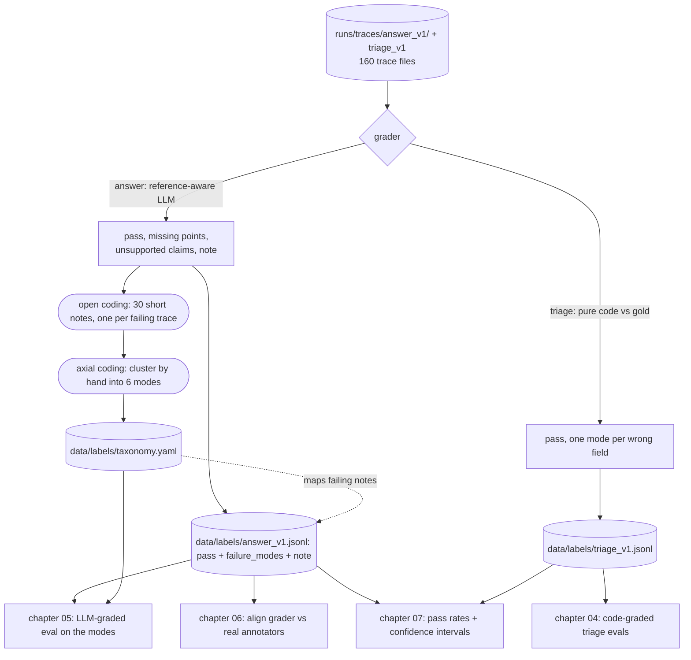

# 03 — Look at your data: open coding, the taxonomy, and the labels every later chapter reads

## What you will learn

- Why **reading traces before writing any automated metric** is the highest-leverage habit in evals — and what "no one has looked at the 80 traces yet" actually costs you.
- A **custom trace viewer** (`viewer.py`) built for *our* trace schema, and why that beats a generic dashboard.
- **Open coding**: writing a short note on every failing trace, and the five real notes that came out of `answer_v1`.
- **Axial coding**: clustering those notes by hand into the six-mode **failure taxonomy** that lands in `data/labels/taxonomy.yaml`.
- The difference between a **failure mode** ("a way it fails") and a **metric** ("a number"), and why we name modes before we measure them.
- **Who labelled this**: the reference-aware grader that stands in for a domain expert, the 12-trace manual review, and the **optimist bias** in these labels.
- **Criteria drift** — why the taxonomy will be revised again, and why that is expected, not a failure.
- How `triage` is graded by **pure code** (no LLM) and what its low pass rate (30.0 %) tells us.
- Per-`topic` and per-`scenario` pass rates that point straight at *where* to fix.
- Troubleshooting and exercises to run before moving on.

## First, look at the traces

Chapter 02 left us with 160 trace files under `project/runs/traces/` — 80 for `triage_v1`, 80 for
`answer_v1` — and one quick count: 72.5 % triage category accuracy on `test`. That number is
directionally true and completely useless for fixing anything. It tells us *that* the app misses,
not *what* it is missing, *why*, or which misses are the expensive kind.

Every practitioner source we read in chapter 01's research makes the same bet — Hamel Husain's
*Field Guide to Evaluating AI Systems* (2025) and the *AI Evals FAQ* both name "look at your data"
as the single highest-leverage step in the whole practice — **before you write an automated metric
or a judge, read a large sample of real outputs.** The friction in that loop — having to `cat` JSON
files, no way to jump from a bad reply back to the ticket and the retrieved sections — is stated in
those same posts as the number-one reason eval work stalls. So this chapter is the loop itself: a
tool to look, then a disciplined way to turn "these look wrong" into "these fail in these six named
modes."

The rule we will keep for the whole tutorial: **you do not graduate a number into `results.md` until
you have looked at the examples behind it.** In chapter 07 that becomes a statistical rule; here it
is just good sense.

## A custom viewer for *our* trace shape

`viewer.py` (chapter 00's `llm`-free world — it reads the two file folders from chapter 02 and never
calls a model) has two commands:

```
uv run evals-tutorial-viewer show tkt-068 --run answer_v1     # one trace, in the terminal
uv run evals-tutorial-viewer html --run answer_v1             # one static HTML page, all 80
```

`show` renders a single ticket — ticket text, gold labels, retrieved sections with their scores, the
reply, latency, and (once the label file exists) the `pass` flag, the failure modes and the
open-coding note. `html` does the same for all 80 in one offline page, with the failing traces
grouped under a per-failure-mode panel that doubles as a filter.

The point of the tool is not the CSS. It is that every field is laid out in **the same order, for the
same schema, on every ticket**: to answer "is this ticket about `returns`?", you open `tkt-068` and
see the ticket, the two sections the retriever grabbed, the reply, and the label next to each other.
A generic observability dashboard would show you tokens and latency; it would not line up
*our* `retrieved` block and *our* `answer_points` in one view. That alignment is the part you
actually iterate on all day, so it is the part we build.

```
$ uv run evals-tutorial-viewer show tkt-068 --run answer_v1
```

opens one trace. Reading even ten of them by hand is the whole "look at your data" habit — the rest
of this chapter is how to do that at the scale of 80 without losing your mind.

## The reference-aware grader — a stand-in for the domain expert

A real team would hand 80 free-text replies to a support-domain expert and ask: pass or fail, and if
fail, what's wrong? We do not have that expert standing by. So for `answer` we use a **reference-aware
grader**: one `chat_json` call per trace (chapter 00's cached client), where the grader is shown
things the *app itself never sees* —

- the customer ticket,
- the **gold answer points** (`ticket.gold.answer_points`),
- the **full text of the gold handbook sections** (`ticket.gold.sections`),
- the app's reply,

plus a rubric (`prompts/reference_grader_v1.txt`). It returns a `pass` flag, the specific missing
facts, the unsupported claims, a tone/promise flag, a did-not-answer flag, and — crucially for the
next section — **a one-sentence note describing the single most important problem**. That note is the
open-coding corpus. (Triage needs none of this — see the code-graded section below.)

Two honest limitations you must carry with the labels:

1. **The grader can only check against the reference we handed it.** It cannot tell whether the
   customer felt resolved, whether the tone was human, or whether a "factually correct" answer was
   genuinely unhelpful. Where those matter, the labels are optimistic.
2. **This is a stand-in, not the thing itself.** Chapter 06 is about replacing this with real
   annotators and measuring how well the grader agrees with them.

**The labels contract** (fixed here, used everywhere after) is one row per ticket in
`data/labels/answer_v1.jsonl`:

```
ticket_id, pass (bool), failure_modes [ids], note
```

plus the grader's raw flags (`missing_points`, `unsupported_claims`, `wrong_tone_or_promise`,
`did_not_answer`) under `raw`. Chapters 05 and 07 will align against exactly this file, so its shape
does not move after this chapter.

## Open coding — one short note per failure

**Open coding** is the first pass of qualitative analysis: read each failure, and write a short,
specific note about *what went wrong*. No buckets yet, no counts, no forced categories — just
"replies that fail, described in our own words." The grader's `note` field is doing this for us, so
the open-coding corpus is already on disk. Print it:

```
uv run evals-tutorial-labels code --run answer_v1
```

which lists all 30 failing `answer_v1` traces with their note and the grader's raw signals. Five of
the thirty, verbatim from `data/labels/answer_v1.jsonl`:

> **tkt-013** — "The reply omits the required confirmation of the $25.00 expedited shipping cost and
> the $150.00 free shipping threshold."

> **tkt-001** — "…claims the handbook does not provide a mechanism for customers to self-verify or
> override the fee, which is an unsupported claim not found in the provided text."

> **tkt-011** — "The reply fails to answer the customer's urgent request by refusing to act and
> offering only a callback, which the customer explicitly rejected."

> **tkt-040** — "The reply incorrectly states the referred customer receives a $10.00 discount,
> contradicting the reference standard which requires conveying … $20.00 credit."

> **tkt-078** — "The reply incorrectly claims the 90-day security audit fact is not in the provided
> handbook" — when it *is* in the gold section, because that section was never retrieved.

Read them slowly and notice what the notes share: they are *specific* (a fee, a deadline, a
mechanism, a number), not vibes. "The reply is bad" is not an open code; "it omits the $25.00
expedited cost" is. Specificity is what lets the next step, clustering, actually converge.

## Axial coding — cluster the notes into a taxonomy

**Axial coding** is the second pass: take the cloud of open notes and cluster them into a *small* set
of recurring **failure modes** — the "axes" around which the failures turn. We want **4–7 modes**, not
one per ticket: if you have thirty modes, you have just renamed the thirty failures and learned
nothing; if you have one ("it's wrong"), you have described nothing.

The clustering is done **by hand, never by an LLM** — this is the one step in the tutorial where the
model is explicitly on the wrong side of the table. Reading the 30 notes and grouping them gives six
modes, written to `data/labels/taxonomy.yaml`, each with a definition and one real example ticket:

| mode | count | definition | one real example |
|---|--:|---|---|
| `missing_required_fact` | 18 | The handbook covers it, yet the reply omits a key fact the reference standard requires (a fee, deadline, condition or number) | `tkt-013` — omits the $25.00 expedited cost and the $150.00 free-shipping threshold |
| `unsupported_claim` | 13 | The reply asserts policy the retrieved sections do not state — invented fees, deadlines, rules, or citations to a section the app never saw | `tkt-001` — claims there is no self-verify/override mechanism (there is no such statement) |
| `wrong_section_retrieved` | 8 | Retrieval never surfaced the covering section, so the model answered from out-of-scope sections and filled gaps with inventions | `tkt-078` — the `privacy` section (90-day audit) was never retrieved |
| `did_not_answer` | 6 | The reply does not engage the customer's actual request — deflects to a callback or refuses to act | `tkt-011` — refuses to act, offers only a callback |
| `wrong_value` | 2 | The reply states a concrete figure that contradicts the reference standard — a higher-severity incorrect fact | `tkt-040` — gives a $10.00 referral discount; gold is $20.00 |
| `over_promise` | 1 | The reply promises or implies a refund/exception/mechanism the handbook does not allow | `tkt-068` — invents a restocking fee on top of the correct 30-day rule |

Counts are *per failing trace* and modes overlap — a trace can be both `missing_required_fact` and
`unsupported_claim` — so they sum to more than 30. The story the table tells: **too little**
(`missing_required_fact`) and **made-up** (`unsupported_claim`) are the two biggest sins, and they
point at the same fix — a rubric that forces the reply to come only from retrieved text and to flag
when it can't. `wrong_section_retrieved` is the only clearly *retrieval-side* mode, and it is a
minority — the right section was in front of the model for most failures and it still dropped or
invented a fact. So generation quality, not the retriever, is where this version hurts most.

Every failing trace got at least one mode (the worker filled `failure_modes` on the label rows); that
mapping is the raw material chapters 04 and 08 grade and compare versions against.

## A failure mode is not a metric

Stop here if this distinction is new, because the rest of the tutorial stands on it. A **failure
mode** is a *category of wrong behaviour*: "the reply invents a fee." It has no number attached and
does not by itself tell you how bad a version is. A **metric** is a *number computed on a distribution*:
"the fraction of `test` traces with ≥ 1 invented claim is 13/80 = 16 %."

Why name the modes before measuring them? Because a metric you invent *before* you have seen how the
app actually fails usually measures the wrong thing — a classic mistake is wiring up BLEU or ROUGE on
free text and celebrating a score that barely correlates with "did we answer the customer." The mode
is the *why the number matters*; the metric is the *handle you move in chapter 04+ and 07+*. When we
report `pass_rate` in `results.md`, that number is only interpretable because we can, in the same
breath, say "this moved because `missing_required_fact` went down."

We also use **binary pass/fail, not a 1–5 score, as the default** for the same reasons: a binary
judgement is faster to produce, more reproducible across raters, and far easier to align an LLM judge
against than a Likert scale (which human raters compress toward 3–4 anyway). Chapter 05 returns to
*why* binary and shows the one place an ordinal score still earns its keep.

### Who labelled this? — and the optimist bias to remember

The labels above were produced by the **reference-aware grader**, a stand-in for a human domain
expert, not by one. To check it, we did a **manual review**: a seeded 12-trace sample
(`random.seed(42)`, 6 pass + 6 fail) read one-by-one with `viewer show`, checked against the gold
answer points in `data/tickets/tickets.jsonl`:

```
fails:   tkt-013, tkt-014, tkt-058, tkt-066, tkt-068, tkt-078
passes:  tkt-003, tkt-009, tkt-023, tkt-024, tkt-026, tkt-059

n agree / disagree = 12 / 0   — no label was flipped (see data/labels/review_answer_v1.md)
```

Two of those 12 are the ones worth memorising, because they expose the label's bias:

- **`tkt-068` (fail, correct fail).** The reply *does* state the right 30-day return window — the
  reference-standard fact — but then invents a restocking fee. A binary fact-check of the 30-day rule
  would call this a pass; the `over_promise` + `unsupported_claim` modes catch the fabrication. This
  is the failure taxonomy doing real work the pass flag alone would miss.
- **`tkt-059` (pass, arguable).** The customer is in a rush and rejects the callback path; a human
  would find the reply deflected and unkind. But both gold facts are present, so the fact-grounded
  rubric scores it a pass. **This is the optimist bias**: the rubric is *fact-grounded, not
  tone-grounded*, so "correct but unhelpful" answers can sail through. We note it rather than flip
  the label — chapter 06 is where real annotators would weigh in here.

That 12/0 is reassuring *within the sample* and says nothing about scale: a real human reviewer has
to *derive* the gold facts from the handbook (the grader is handed them), so disagreement rates will
run higher on the edges. Treat "who labelled this" as an open question this chapter opens, not
closes.

**What you would do differently with a real team** (this is the shape of the answer, not the
implementation — chapter 06 is where we get hands on it):

- Label the **whole** sample yourself (all 80 `answer_v1` traces, not the seeded 12) so the
  reference-aware grader's "yes, but" list is grounded in your full distribution. A real team with a
  larger data set would do the same at ≥ 100 traces.
- Have **two independent annotators** label the same sample, blind to each other.
- **Measure agreement** (not just raw match — raw match flatters when one class dominates; use a
  statistic like Cohen's κ, or precision/recall on `fail` specifically).
- Resolve disagreements by *talking*, not by voting. The disagreement log is the best input to a
  rubric revision (see "criteria drift" above).

The reference-aware grader is a stand-in that lets us ship a working pipeline this chapter. It is
not the end of the labelling chain — it is the beginning of the *validation* chain chapter 06 walks.

## Criteria drift

A subtler point, and it bites everyone: **grading your data helps you write the rubric, and writing the
rubric changes how you grade.** This is not a bug or a sign the process is broken — the field calls it
**criteria drift** (Shankar et al., *EvalGen*, 2024). Expect to revise the taxonomy and the rubric in
**several rounds** as you look at more graded examples.

A concrete example from this very chapter: the grader's rubric already had a `did_not_answer` flag and
a tone/promise flag before we clustered. But the *modes* in `taxonomy.yaml` (`over_promise`,
`unsupported_claim` as separate from `wrong_value`) only became visible **after** reading the notes —
`tkt-068` and `tkt-040` forced us to split "invented fee" from "promised an exception," a distinction
no one would have written into the rubric on a first draft. If we grade `answer_v2` next and find a
`too_verbose` pattern the current rubric has no flag for, the right move is to add that flag and
re-cluster — not to squeeze the model into old boxes.

So when this chapter's 62.5 % / 30.0 % look suspiciously clean, or a mode feels *too* clean (every
trace maps to exactly one mode), that is a hint the criteria have drifted and the taxonomy needs a
pass before we trust the number in chapter 07.

## `triage` — graded by pure code, no LLM

The same label contract, a different grader. `triage` has a closed, enumerable output space — one of
12 categories, one of four priorities, a bool — so **no LLM is needed**: we just compare the app's
fields against the gold row. `grade --run triage_v1` does exactly that, writing
`data/labels/triage_v1.jsonl` with the same four columns, and one failure mode per wrong field
(`wrong_category`, `wrong_priority`, `wrong_escalation`):

| run | pass | fail | pass rate |
|---|--:|--:|--:|
| `answer_v1` | 50 | 30 | **62.5 %** |
| `triage_v1` | 24 | 56 | **30.0 %** |

Triage is graded by pure code (compare `category`, `priority`, `needs_escalation` with gold), and it
is far worse: 30.0 % vs 62.5 %. The failure-mode counts say *why*: `wrong_priority` 40,
`wrong_escalation` 23, `wrong_category` 22. The app is better at guessing *what* a ticket is about
than *how urgent* and *how hand-off-able* it is — which is a prompt/rubric problem on the triage side,
not a retrieval one. The contrast is also the point of a multi-level eval: the *same* label contract,
two different graders (LLM vs code), and you can compare them side by side because they produce the
same rows.

## Where it fails — the tables tell a story

Pass/fail by `topic` and by `scenario` (all on the full 80; the per-`test` numbers return in chapter
07 with confidence intervals). The story the tables tell in one line: **for `answer`, the failures
are mostly generation-side, not retrieval-side — the right section was in front of the model and it
still dropped a fact or invented one. For `triage`, the failures are a prompt/rubric problem, not a
capability one.**

**`answer_v1` by topic**

| topic | pass/total | rate | | scenario | pass/total | rate |
|---|--:|--:|---|---|--:|--:|
| accounts | 7/7 | 100 % | | simple_question | 21/23 | 91 % |
| returns | 6/7 | 86 % | | problem_report | 14/22 | 64 % |
| payments | 6/7 | 86 % | | out_of_policy_request | 9/18 | 50 % |
| discounts | 5/7 | 71 % | | **urgent_blocker** | **6/17** | **35 %** |
| damaged_items | 4/6 | 67 % | | | | |
| warranty | 4/7 | 57 % | | | | |
| gift_cards | 4/7 | 57 % | | | | |
| order_changes | 4/7 | 57 % | | | | |
| privacy | 3/6 | 50 % | | | | |
| loyalty | 3/6 | 50 % | | | | |
| shipping | 3/7 | 43 % | | | | |
| **international** | **1/6** | **17 %** | | | | |

**`triage_v1` by scenario**

| scenario | pass/total | rate |
|---|--:|--:|
| simple_question | 10/23 | 43 % |
| problem_report | 7/22 | 32 % |
| urgent_blocker | 4/17 | 24 % |
| **out_of_policy_request** | **3/18** | **17 %** |

Read the tables as *where to fix*, ordered by severity:

1. **`urgent_blocker` is the weakest scenario on both tasks** (35 % answer, 24 % triage). These are
   tickets from a stressed customer who is about to escalate — the app fails exactly where a miss
   costs the most.
2. **`out_of_policy_request` is the worst `triage` scenario** (17 %) — the app cannot even *classify*
   a request it should refuse, because it is not separating "out of policy" from "urgent."
3. **`international` is the weakest `answer` topic** (17 %). The handbook section is thin; the model
   leans on `unsupported_claim` and `missing_required_fact` to paper the gap — the two biggest modes in
   the taxonomy, and both are *generation-side*.

That ordering is the actual output of "looking at your data": not a single number, but a ranked list
of the places version two should target first. Chapter 04 will turn the code-gradable part of this
(`triage`) into `pytest` metrics and a confusion matrix; chapter 05 will turn the `answer` modes into
a version-comparison; chapters 07–09 will put error bars and detectors around all of it.



## Troubleshooting

- **A `pass` label on a trace that is clearly empty or broken.** First check the rubric wording: the
  grader can only flag what the rubric asks it to watch for, and a "did-not-answer" flag read against
  an empty reply may be judged against *intent* rather than *surface text*. This is a **rubric**
  problem, not a grader problem — tighten the rubric and re-grade, do not hand-flip the label.
- **Notes are too vague to cluster into modes.** ("The reply is not good enough.") The open-coding
  note must name *the offending sentence or fact*. Re-open the trace with `viewer show tkt-XXX` and
  ask: which exact clause makes this a failure? The note should quote or paraphrase that clause.
  Clustering only works on notes that point at a concrete thing.
- **You have too many failure modes.** If a mode covers fewer than 5 % of the 30 failing traces
  (< 2 tickets in this sample), or two modes keep landing on the same tickets, merge one into the
  other. Six is the right size here (per the "4–7 modes" guide); twelve is a re-description of the
  30 failures, not a taxonomy.
- **Grading re-bills the GPU.** It should not. Grade calls go through chapter 00's `chat_json`
  cache; a re-run is all cache hits. If you see live calls, the prompt text or one of the inputs
  (a ticket's gold points) changed and the cache key invalidated — that is a *real* new call, not a bug.
- **Modes' counts sum to more than the number of failures.** Expected — a failing trace can carry
  several modes (e.g. `tkt-014` is `did_not_answer` + `missing_required_fact` + `wrong_section_retrieved`).
  Do not "fix" this by forcing one mode per trace; overlap is the information.
- **Triage pass rate looks far worse than answer — is something broken?** No. They are graded
  differently (code exact-match on *all three* fields vs. reference-aware fact-check), and the
  strictness is the feature: it exposes that the app misjudges urgency and escalation, which is the
  real, findable bug — and the reason chapter 04 targets triage first.

## Exercises

1. **Relabel 10 traces yourself and compute agreement.** Pick any 10 `answer_v1` tickets (aim for a
   mix of pass and fail), and grade each one to yourself using *only* `viewer show` and the ticket's
   gold `answer_points` — decide pass/fail and your leading failure mode, without reading the
   grader's `note` first. Then open `data/labels/answer_v1.jsonl` and compute: how many of your 10
   agree with the grader's `pass`, and how many of your failing ones share at least one of its
   `failure_modes`. Write the two fractions down (e.g. "9/10 pass-agree, 4/5 shared a mode") — that
   is a tiny agreement measurement, the same idea chapter 06 will run on two real annotators.
2. Cluster a **different** 12-trace sample (change `seed` from 42, keep 6 pass + 6 fail) and see
   whether you agree with the existing 6-mode taxonomy. If a note would not fit any mode, you found
   a gap — add the failure-mode id to your draft and note which ticket motivated it. This is
   criteria drift, done on purpose.
3. For `triage_v1`, compute the category-only accuracy (ignore priority and escalation) and compare
   it to the strict all-three-fields 30.0 %. The gap between the two is the size of the
   "right topic, wrong urgency" problem — the one chapter 04's confusion matrix will spell out.
4. Open `data/labels/taxonomy.yaml`. For each of the six modes, find **one** ticket whose `failure_modes`
   list does *not* include that mode, and confirm the reply is genuinely cleaner on that dimension.
   (You are testing that the modes discriminate, not just that they are words.)
5. Re-read the `tkt-059` optimist-bias case. If you were writing the *real* annotator rubric for
   chapter 06, what one line would you add to it so that "factually correct but deflected-and-unkind"
   stops scoring as a pass? (No need to implement it; you are practising the criteria-drift move.)

Next:

- **Chapter 04 — Code-graded evals:** turn the strict `triage` checks into `pytest` — JSON-schema
  validity, classification metrics (precision / recall / F1, confusion matrix), exact match and
  keyword/regex assertions, plus why ROUGE and embedding similarity fail for free text — and write the
  first real rows of `results.md`.
