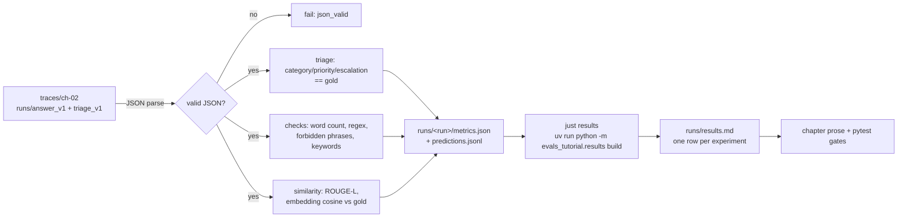

# 04 — Code-graded evals: triage, checks, similarity, and the first results table

In chapter 03 you did the part no metric can replace: read a spread of traces by hand and ended with 60 human labels — 34 `pass`, 26 `fail` — on the test split. That was the *look at your data* step. Now you build the thing that can run on every prompt change without a human in the loop: **code-graded evals**.

A code-graded eval is any check that a piece of code can run over a trace and score — no LLM, no human, no network (usually), and a number out. This chapter builds three of them on the chapter-02 traces:

1. **Triage as a classification problem** — accuracy, precision, recall, F1, a confusion matrix (0 LLM calls).
2. **Verifiable-instruction checks** — six deterministic assertions over every answer reply (0 LLM calls).
3. **Similarity metrics** — ROUGE-L and embedding cosine, measured against the chapter-03 human labels (120 embedding calls).

And it builds the plumbing underneath: every experiment writes a `metrics.json`, and `just results` rolls them all into one table.

## What you will learn

- Where code-graded evals sit in the three levels of evaluation, and why they are level 1 (fast, cheap, run on *every* change).
- The results plumbing: the `metrics.json` schema, `just results`, and why the whole tutorial funnels into a single table.
- How to score `triage` as a classification problem — why macro-F1, not accuracy — plus the confusion matrix and the two most-confused categories, shown with real tickets.
- JSON-validity as the cheapest gate you can buy, and what we got with it (100 %).
- Verifiable instructions (IFEval, Zhou et al. 2023) and our six checks, with real pass rates — and where keyword assertions lie.
- ROUGE-L and embedding similarity: the AUROC against the chapter-03 labels, two counter-examples, and an honest conclusion about what they are and are not good for.
- How to pin these as `pytest` tests, a troubleshooting list, and exercises.

## The three levels of evaluation, and where this chapter sits

Hamel Husain frames evaluation as three levels you run at different cadences (Husain 2024):

| level | what | when you run it | cost |
|---|---|---|---|
| 1 — automated / unit-test style | code checks: schema validity, exact match, classification metrics | on **every** change (CI gate) | ~free, seconds |
| 2 — human & model review | reading traces by hand, LLM-as-judge, annotator alignment | periodically, after level 1 passes | expensive, hours |
| 3 — A/B tests | the live effect on real users | only after a change ships | a production rollout |

The discipline is the *order*: you do not spend level-3 budget (real users, or even level-2 budget, humans and judge LLMs) on a change that a level-1 check would have caught in a second. And you do not trust level 1 alone — a check only tests what you thought to check. Chapter 05 is level 2 (LLM judges aligned against the chapter-03 labels); chapter 13 is level 3. This chapter is the level-1 layer, and it is the one that runs on every commit.

## Results plumbing: one `metrics.json` contract, one table

Every experiment in this tutorial writes the same shape of file, and that is the whole infrastructure:

```
project/runs/<experiment>/
├── metrics.json       # the contract, below
├── predictions.jsonl  # one line per ticket, per-ticket detail
├── config.json        # frozen inputs: model, prompt, split, code hash
└── confusion.png      # (triage only)
```

`metrics.json` (fixed in chapter 02, never changes):

```jsonc
{
  "experiment": "04_triage_v1",
  "chapter": 4,
  "n": 60,
  "metrics": { "f1_macro": 0.697, "category_acc": 0.70, "json_valid_rate": 1.0, "...": "..." },
  "ci": {},                    // empty here — chapter 07 fills confidence intervals
  "llm_calls": 0,
  "seconds": 0.4,
  "details": { "primary": "f1_macro", "notes": "...", "extras": { "per_category": {...} } }
}
```

Then one command rebuilds the human-readable table from *every* `metrics.json`:

```
just results          # → uv run python -m evals_tutorial.results build
```

which produces `project/runs/results.md` with the shared column order:

`experiment | chapter | n | primary metric | 95 % CI | LLM calls | s/item | notes`

Why one table? Three reasons you will appreciate when you reach chapters 07–13:

- **Every number a chapter quotes comes from the same file format.** A reader never has to trust a screenshot of a run or a number typed into prose — the table is generated from `metrics.json`, so the prose and the numbers cannot disagree.
- **The CI column is empty by design right now.** Chapters 04–06 leave it as `—`; chapter 07 fills it in with bootstrap confidence intervals over the same test split. Because the column already exists, "adding statistics" is a one-file change for every experiment, not a redesign.
- **Cross-chapter comparisons become cheap.** "Judge recall is 0.76, code-check `all_checks_pass` is 0.117, `f1_macro` is 0.697" is one row each, same schema, same split. Chapter 14 reads the whole table as a single story.

## Triage is a classification problem

The `triage` app takes a ticket and returns `{category, priority, needs_escalation}`. That is a 12-way classification (plus two more axes), so we score it the way anyone scores a classifier: gold is in `tickets.jsonl`, prediction is the trace's `output` — an exact equality game, zero LLM calls.

**Why macro-F1, not accuracy.** With 12 equal-support categories, plain accuracy hides the interesting failures. A model that nails the five big-ish patterns and fumbles the rest can still look "70 %". Macro-F1 computes F1 **per class** and averages, giving `accounts` and `international` equal weight. On our test split:

| metric | value |
|---|---:|
| **f1_macro (primary)** | **0.697** |
| f1_micro | 0.700 |
| category accuracy | 0.70 |
| priority accuracy | **0.533** |
| escalation accuracy | 0.717 |
| all-three-tuple accuracy | **0.30** |
| JSON validity rate | 1.0 |

Two things jump out immediately:

- **Priority is a coin flip (0.533).** The model learned the topic axis but not the severity axis. `f1_micro ≈ f1_macro` (0.700 vs 0.697), so this is not a class-imbalance artifact — it is genuinely in the labels.
- **Get all three wrong often.** Category + priority + escalation together are right on only **30 %** of tickets. A triage app that mostly gets the "what" but not the "how urgent" is worse than useless for routing — the SLA promise hangs on the priority field.

For context, a random baseline on 12 equal classes sits at `f1_macro ≈ 0.077`, so 0.697 is roughly 9 standard deviations above chance — a model that clearly *learned* the topic axis.

### The confusion matrix, and the two most-confused categories

The run also writes `runs/04_triage_v1/confusion.png`. The text version, per ticket: 12 of 60 (18 %) got the category wrong. The two worst per-class cells, with one real ticket each:

**1. `international` — recall 0.40 (F1 0.57).** 3 tickets in the test split are `international` and the model routes them to `returns`:

> **tkt-066** — *urgent_blocker / small-business buyer*: model predicted `returns`, priority `urgent`, escalation `true`; gold is `international`, `urgent`, `false`.

The pattern is visible in the pair: a return question that *crosses a border* is the whole point of `international`, but the dominant word in the ticket is "return", so the router follows the noun, not the policy boundary. Same failure for **tkt-067** (`returns` → `international`, non-native English speaker) and **tkt-068** (predicted `returns`, gold `international`, a teenager asking an out-of-policy question). This matches chapter 03's axial-coding finding that `wrong_section_retrieved` was the dominant answer failure mode — the triage app is answering from the wrong section of the ticket the same way `answer-v1` did.

**2. `order_changes` — precision 0.33 (F1 0.36, the single worst class).** The model calls 3 of 5 tickets `order_changes` when they are actually `shipping`, and separately loses 3 true `order_changes` tickets to `payments`. Three real tickets in the first direction:

> **tkt-011** — *urgent_blocker / teenager*: model predicted `order_changes`, priority `high`; gold is `shipping`, priority `urgent`. Same shape for **tkt-010** (non-native English speaker) and **tkt-012** (hurried commuter).

The pattern: "my order hasn't arrived / I want it back / what happened to it" is one sentence, and the model routes it to *order manipulation* (`order_changes`) instead of *logistics* (`shipping`). The boundary the model is missing is not a vocabulary boundary — it is a *process* boundary (changing an order vs. tracking one), and that is the kind of thing a prompt boundary paragraph between the two sections is designed to fix.

Reading the matrix by ticket, not by column, is the right habit: each off-diagonal cell is a real routing miss your users will hit, and it tells you exactly which prompt to fix — the boundary description between the two categories.

### JSON-validity: the cheapest gate first

Before any clever metric, the answer must *parse*. Our traces are written with the Ollama `format=json_schema` parameter, so the validity rate is **1.0** (all 60 test tickets parsed) — a free check that would have been the first gate in production if you were not already enforcing the schema. Keep it as the first line of every eval: **if the output cannot be parsed, nothing downstream is defined.**

## Verifiable instructions: IFEval-style checks

For the answer side, the clean level-1 move is to check properties we can *verify in code*. This is the IFEval idea (Zhou et al. 2023): instead of asking "is this a good answer?" (unverifiable), ask "does it obey *this instruction*?" (verifiable — word count, required keywords, forbidden phrases). We run six deterministic checks on every one of the 60 test-split replies:

| check | pass rate | what it tests |
|---|---:|---|
| `nonempty` | 1.000 | reply is not blank |
| `max_words_150` | **0.167** | word count ≤ 150 |
| `mentions_section_name` | 0.900 | at least one handbook section title appears |
| `no_phone_or_email_invented` | 1.000 | no fabricated phone/email (stricter regex than naive `\d+`) |
| `no_forbidden_promises` | 0.917 | none of 10 forbidden phrases appear |
| `mentions_all_answer_point_keywords` | 0.933 | every gold answer-point keyword appears (stemmed) |
| **`all_checks_pass` (primary)** | **0.117** | all six together |

Failure breakdown (of the 60 replies, how many trip each check):

| check | tickets failing |
|---|---:|
| `max_words_150` | **50** |
| `mentions_section_name` | 6 |
| `no_forbidden_promises` | 5 |
| `mentions_all_answer_point_keywords` | 4 |

### Where the keyword assertions lie

Two honest caveats before you read these numbers as "answer quality".

1. **`max_words_150 = 0.167` is a style signal, not a correctness signal.** Model default verbosity blows through 150 words 50 out of 60 times; the check is a *compliance* gate (does the reply conform to the format policy), not a content gate.
2. **`mentions_all_answer_point_keywords = 0.933` is a *necessary*-condition check, not a *sufficient* one.** It is a **cheap proxy** for "covers the required answer points": if a gold keyword is *missing* from the reply, the answer *cannot* be covering that point. But if a keyword is *present*, it may be used in the wrong context (e.g. "we *cannot* refund that" contains the refund keyword). The check catches absence, not misuse. That is its actual job: it is a fast, deterministic floor under the LLM-based checks chapter 05 adds. A reply that fails the keyword check *cannot* be a full pass; a reply that passes it *might still be* a bad answer.

Same caveat for `no_phone_or_email_invented`: the regex is deliberately stricter than naive `\d{7,13}` so policy text like *"30-day window"* or *"3 to 7 business days"* never trips it, while *"044 555 123 456"* does. It is a cheap filter; a true "did we invent a fact" detector needs an LLM-based hallucination check (chapter 09).

## ROUGE-L and embedding similarity — and what they are good for

The last level-1 family is **similarity metrics**: compare the reply against the gold text and get a number. Two of the standard ones:

- **ROUGE-L** — longest-common-subsequence overlap, a lexical (word-for-word) similarity score.
- **Embedding cosine** — embed both texts with `nomic-embed-text` and take the cosine of the vectors, a semantic (meaning-based) similarity score.

These are exactly the "free text similarity" metrics that look attractive in a quick-start blog post. Here is the honest result on our 60 test-split tickets, *measured against the chapter-03 human labels* (34 pass / 26 fail):

| metric | value | meaning |
|---|---:|---|
| `rouge_f_mean` | 0.097 ± 0.102 | mean ROUGE-L F against the gold text — low, because the reply is a paraphrase, not a copy |
| `embed_cosine_mean` | 0.805 ± 0.086 | mean reply-to-gold cosine — high, because any same-topic customer reply is close in this space |
| `auroc_rouge_vs_label` | **0.709** | rank separation of pass vs fail by ROUGE-L |
| **`auroc_embed_vs_label`** | **0.827** | rank separation by embedding cosine — the semantic signal is stronger |
| Pearson `corr_rouge` | 0.298 | weak linear tie |
| Pearson `corr_embed` | 0.549 | moderate linear tie |

**AUROC** (area under the ROC curve) is the "rank-separation" metric: pick one random pass ticket and one random fail ticket, what is the probability the metric is higher on the pass ticket. 0.827 says the embedding score *does* carry real signal, and 0.709 says ROUGE-L does too — but look at the failure mode and you will see why they are not *quality* measures. Embedding cosine in particular has a **floor effect**: two same-topic replies on customer service will *always* be cosine ≈ 0.8, and the spread is only ±0.086 around that. A threshold on the absolute value is useless; a threshold on the *rank* is what the AUROC captures.

### Two counter-examples

Pick any real ticket and the score will lie to you. From `runs/04_similarity_answer_v1/predictions.jsonl`:

- **tkt-041** — the model's reply is rated **`fail`** by the human labels, but has the **highest** embedding cosine of the whole test split (**0.878**, above the mean of 0.805). It is *well-written, on-topic, and confidently wrong* — a reply that scores well on "how much does this look like a reply about this topic" without covering the required answer points. Cosine to gold text does not measure the gold's *facts*.
- **tkt-040 / tkt-060** — both `fail`, both with cosine **0.84+** (near the top of the test split). Same story: on-topic, fluent, wrong in details or missing required coverage. Meanwhile **tkt-007** (cosine 0.787, below the mean) and **tkt-003** (cosine 0.820) are both `pass` — but with *lower* cosine than the tkt-041 fail. The rank carries the signal (0.827 AUROC); the individual number does not.

The conclusion, stated plainly: **ROUGE-L and embedding cosine are regression-detection metrics, not quality metrics.** They answer "did this change make the replies more similar to the reference on average?" — a fast, cheap, per-run delta you can gate on. They do not answer "is this reply good?" — that is the question chapter 05's aligned LLM judge is built to answer, and the two metrics above *cannot* answer even with a perfect threshold.

Use them to catch "model got dumber on the corpus", not to decide "this reply is fine to ship".

## Running this as `pytest`

Because every experiment writes a `metrics.json`, the whole chapter can be pinned as an assertion in a test suite. A short example: a test that loads the committed triage `metrics.json` and fails if `f1_macro` drops below the threshold we set when the number was fresh.

```python
# project/tests/test_04_triage_gate.py
from pathlib import Path
import json

def test_triage_f1_macro_gate():
    p = Path(__file__).parent / "../runs/04_triage_v1/metrics.json"
    m = json.loads(p.read_text())
    f1 = m["metrics"]["f1_macro"]
    assert f1 >= 0.69, f"triage f1_macro {f1} dropped below 0.69"
```

(The current `test` suite at `project/tests/test_04_code_evals.py` has 5 CPU-only, network-free tests — the phone/email regex, the ROUGE-L tie behaviour, the AUROC against `sklearn.roc_auc_score`, and the JSON-schema gate — running in ~0.5 s. The example above is the "pin the committed metric" pattern to extend it with, and is what chapter 13's CI regression gate formalizes.)

## The pipeline, end to end



## What landed in the results table

The three experiments from this chapter, exactly as `just results` renders them (CI left for chapter 07):

| experiment | chapter | n | primary metric | 95 % CI | LLM calls | s/item | notes |
|---|---|---:|---|---|---:|---:|---|
| `04_triage_v1` | 4 | 60 | **f1_macro = 0.697** | — (deferred to ch-07) | 0 | ~0 s (cached) | 12 categories; confusion matrix PNG written |
| `04_checks_answer_v1` | 4 | 60 | **all_checks_pass = 7 / 60 (11.7 %)** | — | 0 | ~0 s (deterministic) | 6 deterministic assertions per reply |
| `04_similarity_answer_v1` | 4 | 60 | **auroc(emb, ch-03 label) = 0.827** | — | 120 texts / 4 POSTs | ~12 s | ROUGE-L + embedding cosine |

The `s/item` column is intentionally honest about the transport cost: the similarity run is 120 embedding *text-units* (60 replies + 60 gold answers, counted per call per `index.md`) batched into 4 HTTP POSTs at batch size 32 — report the text count, not the POST count, so the `llm_calls` column stays comparable across rows.

## Troubleshooting

**JSON parse failures from thinking tokens.** If a newer model (or a different endpoint) starts emitting chain-of-thought text before the JSON, `json.loads` will break even where a schema parameter *should* have stopped it. The cheap fix is already in `metrics.json`: the `json_valid_rate` check, run before any metric. Keep it first. If it drops below 1.0, do not debug the individual metrics — go back to chapter 02's schema setup, and consider a two-pass extraction (`{"thinking": "...", "answer": {…}}`) rather than a regex strip that will corrupt a legitimate value.

**Confusion matrix is unreadable at 12 × 12.** Do not try to read 144 numbers by eye. Two things make it tractable: order categories by frequency so the high-traffic cells are top-left (the run's `details.extras.per_category` is already sorted for that), and read **off-diagonal cells, not diagonal ones** — each off-diagonal is a routing mistake and tells you which prompt boundary to fix. A 12-way confusion matrix is a *prompt-editing checklist*, not a number to admire.

**Embedding cache misses → tunnel down.** If the similarity run suddenly makes 120 real `nomic-embed-text` calls instead of loading from `data/cache/`, the first thing to check is the Ollama SSH tunnel (`fleet tunnel` / `ssh -N -L 11435:127.0.0.1:11434 rtx`) — the cache-key is a hash of (text, model, endpoint), and an endpoint that is down or behind a different port invalidates the cache for the whole batch. The run is still correct, it is just slow and noisy at 4 real POSTs; fix the tunnel, not the code.

**"My similarity score went up / down" is not a verdict.** A change in `rouge_f_mean` or `embed_cosine_mean` between two runs is *a signal to look closer*, not a pass/fail. The only thing that reliably answers "better or worse" is the AUROC against chapter-03 labels — or, after chapter 05, the aligned LLM judge. Use the mean to catch corpus-level drift; use the AUROC to decide.

## Exercises

1. **Add a "clarifying-question" check.** In chapter 02 the generator writes *ambiguous* tickets (persona × scenario designed to need disambiguation). Add a verifiable check: if a ticket's `scenario` is one that by design is ambiguous, does the reply *ask a clarifying question* before answering? (A simple heuristic: does the reply contain a question mark before the first factual claim, or do the first N words end in `?`?) Count how many of the 60 test replies would *pass* that check, and compare to the 11.7 % `all_checks_pass` rate — does the reply actually behave like a human support agent, or does it answer unconditionally?
2. **Compute F1 per priority.** `f1_macro` is over *categories*. Do the same for the four priority values (`low, normal, high, urgent`): F1 per class. Which priority class is the worst, and does it match the 0.533 priority accuracy you already have? A router that systematically *under-escalates* (predicts `normal` when gold is `urgent`) is worse than one that *over-escalates* (predicts `urgent` when gold is `normal`) — the confusion matrix should tell you which one you have, and it will inform a simple "nudge toward escalation" prompt change for a future chapter.
3. *(stretch)* **Pin the similarity AUROC as a pytest gate.** Following the triage-example pattern, add a test that asserts `auroc_embed_vs_label ≥ 0.82` (and optionally `≥ 0.70` for `auroc_rouge_vs_label`) from the committed `metrics.json`. This is the seed of the "code-graded regression gate" that chapter 13 will build on top of.

Next:

Chapter 05 — **LLM-as-judge**: binary judges with critiques, aligned against the chapter-03 labels (TPR/TNR, Cohen's `kappa`) on `dev`, measured on `test`. This is the level-2 layer that answers the question this chapter's checks *cannot* answer — "tkt-041 is a fluent, on-topic reply; is it *right*?" — using the *same labels* that made the AUROC numbers above meaningful.
