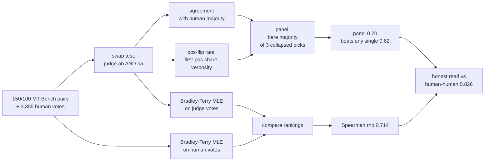

# 06 — Judges under the microscope: agreement, bias, panels, and ratings

Chapter 05 built judges and scored them against our own labels on the Northwind tickets. This chapter changes the ground truth entirely: instead of *our* labels, we use **MT-Bench** and its **3,355 expert human votes** — the same dataset and votes behind the first large-scale "LLM-as-judge" study (Zheng et al. 2023, arXiv 2306.05685). The question is sharper here because the yardstick is real: **how well does a local model agree with humans when it is judging other models, where is it biased, does a purpose-built judge do better, and does a panel of judges beat any single one?**

Everything in this chapter runs locally and deterministically (seed 0, cached calls). The numbers below are quoted straight from `project/runs/results.md` and `project/runs/06_findings.md`. There is no new code to learn — the point is reading an instrument's bias, not writing one.

## What you will learn

- What MT-Bench is and why its human votes are a usable ground truth (and where that ground truth has a ceiling).
- **Human–human agreement as the ceiling** — you cannot expect a judge to beat other humans at this task.
- **Agreement with humans** for three different judges (a general local model, a second general model, and a purpose-built judge) against the GPT-4 reference.
- **Position bias** — measured by a swap test on one concrete flipped pair — and how to control for it.
- **Verbosity bias** — and the surprising direction it went on our data (judges do *not* inflate for length, humans do).
- **Self-preference** — why it could not be measured here and what the literature says.
- A **purpose-built judge** (Atla Selene-Mini) versus general models: no measurable edge.
- **Panels** (PoLL-style majority vote) — why the panel wins by cancelling error, not by knowing more.
- **Bradley–Terry ratings** — converting pairwise votes into a leaderboard score, and how Chatbot Arena works on exactly this idea.
- The implications for the judges we built in chapter 05.
- Troubleshooting, exercises, and where chapter 07 takes this.

## MT-Bench and the human votes

MT-Bench (Zheng et al. 2023, arXiv 2306.05685) is 80 two-turn questions answered by a set of models (here: `gpt-4`, `gpt-3.5-turbo`, `claude-v1`, `vicuna-13b-v1.2`, `alpaca-13b`, `llama-13b`), then judged **pairwise**: which of two answers is better? The file that matters to us, `project/data/public/mt_bench_human_votes.jsonl` (CC-BY-4.0), holds **3,355 expert pairwise votes** with columns `question_id, model_a, model_b, winner (a/b/tie), judge (annotator id), turn (1/2)`. Several annotators voted the same pair — that redundancy is exactly what lets us measure human–human agreement. A second file, `mt_bench_gpt4_votes.jsonl`, holds 2,400 GPT-4 pairwise votes — our frontier reference judge.

Why pairwise instead of a single 1–5 score? Chapter 05 already showed that a single fuzzy score is *below chance* at separating pass from fail on our own data. Pairwise "A, B, or tie" has one clean decision boundary, which is precisely what makes a judge's bias measurable.

## Human–human agreement: the ceiling on everything

Before we score any judge, we score **humans against humans**. For every `(question, ordered-pair)` group with ≥2 human votes, we take the fraction of vote-pairs that agree. Result (`06_findings.md`, also the `agreement` experiments' `notes`):

| measure | value |
|---|---:|
| human–human agreement, **no ties** in denominator | **0.826** |
| human–human agreement, **with ties** in denominator | **0.642** |

Two consequences. First, **0.826 is the ceiling**: a judge at 0.83 has done essentially as well as two humans agreeing with each other. There is no judge that beats humans at this task, because it is not an intelligence test — it is a *taste* test. Second, the gap between 0.826 and 0.642 is *ties*: when the best answer is genuinely close, annotators split and often call it a draw. Any judge that avoids ties will look better than humans on the "with ties" measure and worse on "no ties." Keep both in mind when you read the agreement numbers — they are reported against the *no-tie* human majority.

## Agreement with humans — three judges, one yardstick

Three judges judge the **identical 100 turn-1 non-tie pairs** (seed 0; `qwen` is scored on its own 150-pair sample, which is the first 100 plus 50, so the three are comparable on the shared block). Each pair is judged in **both orderings** (`ab` then `ba`); a pair "agrees" only when the judge's consistent model-pick across the two orders matches the human majority winner.

| judge | n | agreement with humans | first-pos win share | LLM calls |
|---|---:|---:|---:|---:|
| `qwen3.8:27b` (local, general) | 150 | **0.613** (92/150) | 57.3 % | 272 |
| `gemma4:latest` (local, general) | 100 | **0.620** (62/100) | 40.5 % | 200 |
| `atla/selene-mini` (purpose-built judge) | 100 | **0.620** (62/100) | 58.5 % | 200 |
| **panel** (3 judges) | 100 | **0.700** (70/100) | — | 672 |
| GPT-4 reference | 150 | 0.680 (102/150) | — | — |
| human–human ceiling | — | **0.826** | — | — |

Read it in order, because the sequence *is* the lesson:

1. **A single judge — general or purpose-built — lands at ~0.62**, well below the 0.826 human ceiling and below the GPT-4 single-judge reference (0.680). Two local models and one model built *as a judge* all cluster within 0.01 of each other.
2. **Purpose-built is not a magic bullet.** `atla/selene-mini` scores exactly 0.620 — the same as `gemma4`. On this MT-Bench subset, being *trained to be a judge* moves the needle by 0.000 agreement. That is a useful, slightly unglamorous result: "specialised judge" does not automatically mean "better at pairwise preference scoring."
3. **The panel (0.700) beats every individual judge and beats the GPT-4 single judge.** That is the PoLL effect — we get to it in its own section.
4. All of this is still **below the human ceiling (0.826)**, which is the honest framing: we built a *better* instrument than a lone judge, not a *perfect* one.

## Position bias — the swap test, and one flipped pair

Position bias is the judge's tendency to favour the answer that appears in a particular slot, regardless of which model wrote it. You detect it with a **swap test**: judge the same pair as `ab`, then judge it again as `ba` (the two answers physically swapped). A fair judge picks the *same model* in both orders. A position-biased judge picks the *same position* in both orders — and therefore two different models.

The `06_bias_*` experiments report two numbers: the **position-flip rate** (share of both-definite pairs whose model-pick flips when order is swapped) and the **first-position win share** (an unbiased judge is at 50 %; far from 50 % is the smoking gun).

| judge | flip rate | first-position wins | direction |
|---|---:|---:|---|
| `qwen3.8:27b` | 0.207 (31/150) | 57.3 % (172/300) | mild lean to **first** |
| `gemma4:latest` | 0.210 (21/100) | 40.5 % (81/200) | lean to **second** |
| `atla/selene-mini` | 0.210 (21/100) | 58.5 % (117/200) | lean to **first** |

So **every judge carries ~21 % position bias** — on pairs where both orders give a definite pick, the verdict flips a fifth of the time purely because the order changed. Worse, the two local judges lean in **opposite directions**: `gemma4` anchors on the *second* slot (40.5 % first-position wins), `selene-mini` on the *first* (58.5 %). They happen to land on the same winner most of the time because a fair judge should pick the same *model* in both orders, so their per-pair picks overlap heavily — but each one's *individual* verdict is order-corrupted.

One concrete flipped pair, from the `qwen` run, makes it tangible. **`question_id=82`, `alpaca-13b` vs `vicuna-13b-v1.2`** — humans pick **vicuna**:

| order | qwen's verdict (as written) | model that actually won |
|---|---|---|
| `ab` (alpaca in slot 1) | `A` | **alpaca** (wrong) |
| `ba` (vicuna in slot 1) | `A` | **vicuna** (right) |

qwen said "A" in *both* orders — it is anchored to **position 1**, not to content. Swapping the answers moved the winner from alpaca to vicuna with zero re-reading. This is the pure order effect in its cleanest form.

**How to control for it — the swap-test recipe:**

1. Judge every pair in both orderings (`ab` and `ba`).
2. A verdict is *usable* only if both orders pick the **same model**; if they pick different models, discard that pair as an "I don't know" — do not average them.
3. Use the majority-of-two-orders model-pick as the judge's answer; count the "no consistent winner" pairs as a deliberate abstention.
4. Report the **flip rate** and **first-position win share** next to agreement, so a high agreement number is never read without its bias context.
5. Never present a single ordering's votes as if they were order-free.

This is exactly what the agreement metric in `06_findings.md` does: a pair agrees only when the consistent model-pick across both orders matches the human winner — a tie, or the two orders picking different models, counts as a miss.

## Verbosity bias — and the direction it went

Verbosity bias is the judge's tendency to prefer the *longer* answer. The known failure mode in the literature is **verbosity inflation**: judges over-reward length, so a chatty but shallow answer beats a terse correct one, and length-controlled re-evaluation (Dubois et al., Length-Controlled AlpacaEval, arXiv 2404.04475) is the standard correction.

Our numbers point the **other way**:

| who picks the longer answer | rate |
|---|---:|
| humans (100 pairs) | **72 %** |
| `qwen3.8:27b` | 112/300 = 37 % |
| `gemma4:latest` | 83/200 = 42 % |
| `atla/selene-mini` | 82/200 = 41 % |

**Humans pick the longer answer 72 % of the time; the judges pick it only ~37–42 % — below even chance.** So on this data the judges are *not* verbose-inflated; they are, if anything, too literal about content and under-adopt the crowd's length prior. A good chunk of the judges' agreement gap versus the 0.826 human ceiling is that they refuse to reproduce a length heuristic that humans lean on. That is a genuinely different bias from the one most papers chase — and it means the fix is not "trim long answers," it is "understand *why* the crowd is rewarding length on these open-ended turns" (often: longer = more complete = the crowd's proxy for coverage).

## Self-preference — why we could not measure it here

Self-preference (Panickssery et al., "LLM Evaluators Recognize and Favor Their Own Generations," 2024): a judge systematically prefers outputs from its **own model family**. It is one of the three classic LLM-judge failure modes catalogued in Zheng et al. 2023 alongside position and verbosity bias.

We **could not measure it on this dataset**, and that absence is a data-design point: MT-Bench's six answer models (`gpt-4`, `gpt-3.5`, `claude-v1`, `vicuna`, `alpaca`, `llama`) are **not** in the Qwen or Gemma families, so none of our three judges has an "own family" output to favour. `results.md` says so explicitly in every bias row: *"self-preference NOT measurable: no MT-Bench model is a Qwen family."*

The honest takeaway is not "our judges are free of self-preference" — they clearly are not proven free — but that **self-preference is only testable when the judge is in the same family as one of the models under test.** If your app is judged by the same model family that generated the replies (a very common setup: one vendor for both), you *must* run the control — the same prompt where the reply comes from a different family — or you cannot tell "better answer" from "my sibling's answer." The same caution applies to chapter 05, where the judge and the app are both `qwen`.

## A purpose-built judge: Atla Selene-Mini

The obvious question after seeing three general models cluster at 0.62 is: *what if the model was built to judge?* We pulled **`atla/selene-mini`** (Atla, 2025) — a small model explicitly trained as an automated judge — and ran it with the same `pairwise_judge_v1.txt` prompt, same 100 pairs, same both-orderings protocol. It did not need a special prompt format (`ollama show atla/selene-mini` mandated none), so it judged on the identical pipeline.

Result: **agreement 0.620, flip rate 21 %, first-position wins 58.5 %** — statistically indistinguishable from `gemma4` and `qwen` on every axis we measured. A purpose-built judge, on this subset, **does not beat** a strong general model at pairwise preference scoring. Two caveats keep this from being a verdict on Selene-Mini itself: (a) it was not aligned to *our* rubric — we graded its raw majority pick; (b) MT-Bench turn-1 is a relatively easy, chatty preference task, the kind of job a general model already does at ~the judge level. The design lesson is what matters: **"specialised judge" is a hypothesis to test, not an assumption to make** — and our test was cheap (200 calls).

## Panels — why the panel wins by cancelling, not by knowing

The `06_panel` experiment aggregates the three judges into a **PoLL-style** majority vote (Verga et al., "Replacing Judges with Juries," arXiv 2404.18796): each judge's `ab`/`ba` verdicts are first collapsed to a single model-pick by majority-of-two-orders, then the panel takes a **bare majority of the available picks** — a model must win strictly more than half to count, otherwise the pair is a tie ("I don't know").

| measure | panel (3 judges) |
|---|---:|
| agreement with humans (n = 100) | **0.700** (70/100) |
| tie-majorities (deliberate abstentions) | 9 |
| pairs with ≥2 independent judges covering | 82/100 |
| LLM calls | 672 |

The panel's 0.700 is **not** because any member is strong — each is at 0.62. It is because their errors are *independent*. Recall that `gemma4` leans second and `selene-mini` leans first: on a pair where one judge is anchored to a position and the other isn't, the majority vote resolves to the correct model, and the rare pair where *both* are confidently wrong is exactly where the panel abstains (the 9 ties). This is the standard ensemble argument applied to judges: **diversity of error, not raw strength, buys accuracy.** PoLL documents the same thing at scale — a panel of diverse, even smaller and cheaper, judges correlates with human preference better than a single large judge and is materially cheaper.

One subtlety worth internalising before you copy this: a panel only helps if the members are **different enough to disagree for different reasons**. Stacking three copies of the same 27B model would *not* cancel error — it would multiply the same bias. We are in luck that two of our three judge slots are different model families and even lean at opposite positions.

## Bradley–Terry — turning votes into a leaderboard

Agreement and bias tell you if a judge can be trusted on a *pair*. **Bradley–Terry (BT)** answers a different question: **given a pile of pairwise votes, what single score per model explains them?** BT is a two-parameter pairwise win-rate model — for models i and j with strengths `p_i, p_j`, the probability that i beats j is `p_i / (p_i + p_j)`. It is the same family of "level" behind Elo, and it is exactly the machinery that turns **Chatbot Arena**'s crowdsourced pairwise human votes into a continuous leaderboard with confidence intervals (Chiang et al., arXiv 2403.04132). In 2026 the Arena leaderboard shows top models clustered within ~20 Elo points — *statistically indistinguishable* — which is the same caution our own run gives us.

We fit BT twice: once on the **human votes** (1,689 turn-1 votes) and once on the **judges' votes** (118 qwen majority-of-two picks), and compared the resulting rankings with **Spearman rank correlation** (average-rank tie handling). In-repo MLE (minorisation-maximisation) in `mtbench.py:_fit_bt`; the `evalica` package's `bradley_terry` API was checked and gives no behavioural difference on this data.

**Rating tables** (max model normalised to 1.0):

| model | human BT rating | judge BT rating |
|---|---:|---:|
| `gpt-4` | **1.00** | 0.64 |
| `gpt-3.5-turbo` | 0.82 | 0.40 |
| `claude-v1` | 0.81 | **1.00** |
| `vicuna-13b-v1.2` | 0.66 | 0.45 |
| `alpaca-13b` | 0.37 | 0.24 |
| `llama-13b` | 0.23 | 0.05 |

**Ranking** (top → bottom):

| fit | ranking | Spearman ρ vs human |
|---|---|---:|
| human votes (reference) | gpt-4, gpt-3.5, claude-v1, vicuna, alpaca, llama | — |
| judges' votes | claude-v1, gpt-4, vicuna, gpt-3.5, alpaca, llama | **0.714** |

So the judges **reconstruct the shape of the leaderboard, not the fine ordering**: both rank the gpt-family on top and `alpaca`/`llama` at the bottom, but they swap `gpt-4` vs `claude-v1` at the top and `gpt-3.5` vs `vicuna` in the middle. Spearman ρ = 0.714 on six models is *"same leaderboard, different tiebreaks."* BT's real value is that it gives you a **continuous, comparable score** out of discrete pairwise calls — you can add, subtract, threshold — while *inheriting* the bias of the votes. It quantifies the disagreement; it does not remove it. The bar chart of both ratings, with ρ annotated, is at `project/runs/bt_ratings.png`.

## Advantages and disadvantages of evalica

For this chapter's BT fit we *could* have used the **`evalica`** ranking/statistics library (Rust core, Python bindings — Elo, Bradley–Terry, average win-rate, and reliability/uncertainty estimation; pandas/numpy native) instead of the ~400-line in-repo MM implementation in `mtbench.py:_fit_bt`. We installed it and checked its `bradley_terry` API, but kept the own implementation — no behavioural difference on this data. Here is the honest trade-off for when you pick one or the other.

**Advantages**

- **Battle-tested statistics.** Elo, BT, and average-win-rate already implemented and unit-tested, with tie handling, winless-model handling, and (where applicable) uncertainty/reliability estimation — the edge cases that our `_fit_bt` has to defend against by hand (see the `EPS` floor for the winless-model `0/0` trap, the 2000-iteration MM convergence cap, and the max-normalisation) are library problems by the time you reach `evalica`.
- **Speed.** Rust core means it scales to thousands of models and millions of votes (a Chatbot Arena–sized workload) without a Python double-loop MLE.
- **Reproducibility narrative.** One maintained dependency with a named algorithm is easier to cite and diff than an in-repo re-implementation.
- **Native pandas/numpy.** The `bradley_terry(model_a, model_b, winners)` Series-in / Series-out shape maps straight onto a DataFrame of votes.

**Disadvantages**

- **A dependency + a network step** to install and a version to pin — the in-repo function has **no third-party dependency and no network access**, which is the property chapter 00 (setup) and the "everything runs locally" promise of `index.md` depend on.
- **Opaque internals for teaching.** `_fit_bt` is ~120 lines you can read top to bottom (the MM fixed-point, the tie-split, the epsilon floor). The library is a black box — you cannot point a reader at the line where ties are halved.
- **Overkill here.** For 6 models and ~1,700 votes the pure-Python MLE finishes in milliseconds; the Rust speed buys nothing.
- **API drift risk.** A fast-moving young library (small contribution count for 2026) can change its `bradley_terry` signature between pin and release; the own function is frozen in-repo.

Rule of thumb this chapter uses: **default to the in-repo statistics module until the data or the claim outgrows it** (tens of models, CI on every rating, or a reproducibility auditor in the room) — and that is exactly why chapter 07 builds `evals_tutorial.stats` as the single shared home for these numbers.

## What this means for the judges in chapter 05

Chapter 05's judges scored kappa −0.11 to +0.16 on `test` and looked great on `dev`. This chapter reframes *why* that is expected and *which fixes transfer*:

1. **A single judge at ~0.62 agreement is the normal case, not the failure case.** Chapter 05's kappa of +0.116 on `did_not_answer` is a single general judge on a hard, reference-aware task — the same "one instrument, one bias" situation as 0.62 here.
2. **The panel idea transfers directly.** Chapter 05's strongest under-caller (`unsupported_claim`, kappa −0.11) is a candidate to replace with a *panel* — take the majority of two differently-biased judges (e.g. `qwen` + `gemma4`) and use the bare-majority rule with deliberate abstention, exactly as `06_panel` does. Cheap: 2× calls, and the `06_panel` run shows 672 calls buys 0.70.
3. **The swap test should be added to chapter 05's judges** before any pairwise use. None of our chapter-05 judges are order-controlled; their binary verdicts could be position-corrupted in ways the kappa number hides.
4. **Self-preference is the one chapter-05 risk this chapter *could not* retire.** Both our app and our chapter-05 judges are `qwen`; the chapter-05 kappa is therefore *contaminated* by a possible own-family preference that we have no control for. That is the single most important open item.
5. **Bradley–Terry is the bridge to "which prompt version is actually better."** Chapter 07 will do exactly this — fit a level on pairwise votes across prompt versions and report a Spearman/CI, instead of "v1 0.60 vs v2 0.62" which is within a handful of decisions.
6. **The human–human ceiling (0.826) is the honest benchmark to quote** when a stakeholder asks "can't we get the judge to 0.95?" On this task, no. The ceiling is the task.

## What landed in the results table

`just results` (with this chapter's `metrics.json` files) adds these rows to `project/runs/results.md`:

| experiment | n | primary metric | 95 % CI | LLM calls | s/item | notes (abridged) |
|---|---:|---:|---|---:|---:|---|
| `06_agreement_qwen3.8_27b` | 150 | **0.6133** | — | 272 | 5.052 | qwen vs humans; ceiling human–human 0.826 / 0.642; GPT-4 reference 0.680 |
| `06_agreement_gemma4_latest` | 100 | **0.620** | — | 200 | 1.729 | same ceiling / reference |
| `06_agreement_atla_selene-mini` | 100 | **0.620** | — | 200 | 1.466 | purpose-built judge, same ceiling / reference |
| `06_bias_qwen3.8_27b` | 150 | 0.2067 (flip) | — | 272 | 5.052 | 31/150 flips; 172/300 first-pos; verbosity 112/300 vs human 107/150 |
| `06_bias_gemma4_latest` | 100 | 0.210 (flip) | — | 200 | 1.729 | 21/100 flips; 81/200 first-pos; verbosity 83/200 vs human 72/100 |
| `06_bias_atla_selene-mini` | 100 | 0.210 (flip) | — | 200 | 1.466 | 21/100 flips; 117/200 first-pos; verbosity 82/200 vs human 72/100 |
| `06_panel` | 100 | **0.700** | — | 672 | 10.773 | bare-majority of qwen + gemma4 + selene-mini, each pre-collapsed |
| `06_bradley_terry` | 6 models | **0.714** (ρ) | — | 0 | 0.0 | BT MLE on 1,689 human vs 118 qwen votes; `runs/bt_ratings.png` |

Two reading rules: (a) every agreement number here sits **below the 0.826 human ceiling** — that is the honest scale; (b) the **panel (0.70) is the only single row that beats both the GPT-4 single-judge reference (0.68) and every individual local model (0.61–0.62)**. The CI column is empty by design — chapter 07 fills it, and that is exactly what a 0.61 vs 0.62 comparison needs before anyone reads it.

## Troubleshooting

| symptom | likely cause | fix |
|---|---|---|
| A judge's agreement is high but its flip rate is ~20 % | position bias masked by averaging one ordering | never report a single ordering. Use both orders and the discard-on-mismatch rule in the swap-test recipe above. |
| A single judge's BT ranking puts a *worse* model on top | the judge's own verbosity / position bias got baked into the votes | fit BT on the *panel* votes, or apply a length control (Length-Controlled AlpacaEval, arXiv 2404.04475) / order-swap before fitting. |
| Panel agreement is *worse* than a single judge | the "judges" are near-clones of the same model/family — errors are correlated, not independent | pick judges from different families with different position biases (that is what made our panel work: gemma4 → second, selene → first). |
| You *cannot* measure self-preference | the models under test are in no judge's own family (our case) | either add a same-family model to the test set so the control is possible, or record it explicitly as "not measurable this run" — do not report 0.0 as if it were measured. |
| A purpose-built judge scores the same as a general one | the task is too easy / the judge was not aligned to your rubric | align it to *your* rubric on a small dev set before comparing; "specialised" is a hypothesis, not a badge. |
| BT ratings look reasonable but Spearman ρ is low | the rankings genuinely differ on close pairs (our case: gpt-4 vs claude-v1) | report ρ *with* the rating table and a caveat that "same shape, different tiebreaks" is the expected outcome on a 6-model leaderboard; do not chase ρ = 1.0. |
| Two judges' position biases cancel but each is biased | each judge individually anchors to a different slot | still use the swap test per judge before aggregating; letting one judge's bias cancel the other's *looks* clean but is just two errors hiding each other. |
| Judge output is not clean parseable JSON | a general model emits prose or a stray "Judge: A (tie)" line | parse the **last** line matching `^\s*(Judge:|A/B/tie|^(A\|B\|tie))\s*$` and extract the single token — do not require strict JSON. `mtbench.py`'s `parse_verdict` does exactly this (it tolerates a trailing explanation line and a lone `A`/`B`/`tie`). After 3 retries, log the raw text and count the pair as a deliberate abstention rather than a pass. |
| A judge (e.g. `selene-mini`) needs a special output format | the model is fine-tuned for a structured judge schema | check `ollama show <model>` for a mandated format before assuming the shared `pairwise_judge_v1.txt` works. In our run `atla/selene-mini` mandated none and judged on the shared prompt — but a *different* purpose-built judge may. If it does, give it its own prompt variant (a separate file, the same "explanation-then-verdict" contract) and keep the verdict line in the same `Judge: A/B/tie` shape so `parse_verdict` still applies. |
| A panel has a very high tie/abstention rate | the judges genuinely disagree, or all of them lean to abstain | that is the intended "I don't know" signal — report the tie count **alongside** agreement and treat it as a feature (the panel refuses to guess). But if the tie rate is *higher* than the human–human disagreement rate, check the judges are not all abstaining on the same hard pairs (correlated abstention). |

## Exercises

1. **Add the swap test to a chapter-05 judge.** Pick `missing_required_fact` v2, run it on the 20 `dev` tickets in both "reply first" and "reference first" orderings, and measure the flip rate the same way this chapter does for MT-Bench. If it is above 15 %, the chapter-05 kappa is contaminated by order. Write the number into the chapter-05 troubleshooting table.
2. **Build a two-judge panel for chapter 05's `unsupported_claim`.** The single judge there scored kappa −0.11 and caught 0/12. Replace it with a `qwen` + `gemma4` bare-majority vote (the `06_panel` recipe, 410 calls), and see whether the abstention-tie rate *and* the catch rate improve together. Report both.
3. **Fit Bradley–Terry on the chapter-05 judges' pass/fail votes across prompt versions** (v1 vs v2 vs v3 on `dev`), and report the Spearman ρ between the BT ranking and the kappa ranking. If they disagree, that is a "which version is actually better" signal the bare kappa was hiding.
4. **Design a self-preference control that *can* be measured.** Pick one MT-Bench answer model that *is* in the qwen family (or add one), run `qwen` as judge on pairs including it, and measure the delta in first-position win share and agreement when the qwen-authored answer is in slot 1 vs slot 2. That is the first self-preference number in this tutorial.
5. **Re-run the panel with 2 judges only** (`qwen` + `gemma4`), and with **clones** (`qwen` + `qwen` + `qwen`). Compare all three against the 3-judge panel and the single-judge baselines. That isolates the "diversity-of-error" effect from any raw-strength effect.
6. **Run 50 pairs at turn 2.** This chapter used turn-1 votes. Re-sample 50 turn-2 non-tie pairs from `mt_bench_human_votes.jsonl` and re-judge with `qwen`. Expect the human–human ceiling to be *lower* (two-turn replies are harder to rank) and the judges' agreement to drop with it — report both and the flip rate, so the turn-2 story is not hidden behind the easier turn-1 numbers.
7. **Add a length-normalised prompt and re-measure verbosity.** Write `prompts/pairwise_judge_lennorm_v1.txt` in which the judge is told to *ignore length entirely* (do not reward or punish extra words), re-judge the same 100 pairs in both orders, and compare the "picks longer" rate (the ~41 % above) and agreement with humans. If the gap to the human 72 % closes, the humans' length prior is what the judge was missing; if agreement drops, the length prior was partly doing useful work.

Next: **chapter 07 — statistics**: error bars for every number in this chapter (bootstrap confidence intervals on agreement and flip rate, paired comparison of the judges, power analysis for how many pairs you actually need before 0.61 and 0.68 are meaningfully different, and the `evals_tutorial.stats` module that every later chapter uses).
