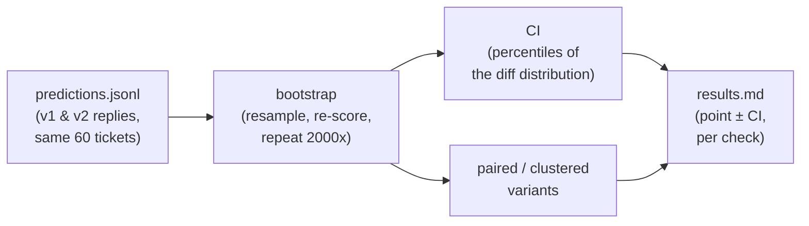

# 07 — Statistics: error bars for every number

## What you will learn

- Why "0.72 vs 0.78" on 60 tickets is **noise until proven otherwise**, and how a
  confidence interval (CI — *confidence interval*, a range the true score most likely
  falls in) turns a single number into a defensible one.
- How the **bootstrap** works, in plain words, with a 10-line code excerpt.
- **Wilson vs bootstrap** for a pass rate, and when each is the right tool.
- How wide the CIs are at **n = 60** (n = *number of items scored*), and the
  "eval questions are a sample" framing from Miller (2024, arXiv 2411.00640).
- **Paired vs unpaired** comparisons, and why pairing the same ticket across both
  versions shrinks the error (the A/B table, discordant pairs, McNemar's test).
- **Clustered standard errors** (SE — *standard error*, the size of the sampling
  noise): tickets that share a topic are not independent, and the plain CI lies if
  you ignore that.
- **How many tickets you need** — the power table read out loud.
- **Multiple comparisons**: one check may look "significant" just because you
  checked six, and Bonferroni / Benjamini-Hochberg (BH) fix that.
- A short **"how to report a number" checklist** so any number in `results.md` is
  reproducible on its face.

Chapter 05 gave you a number — "the judge says 70% pass". A bare number is a
headline; the statistics in this chapter are the **error bar** that tells you how
much to trust that headline. Everything below is run on the real A/B experiment
from this repo: 60 test-split tickets, version v1 vs version v2, the same frozen
judge, a fixed random seed. No numbers here are invented.



A single pipeline, four stops: raw predictions → a resampling engine → one
interval → a table row. The rest of the chapter opens each of those boxes.

---

## "0.72 vs 0.78" is not a result

Suppose v1 passes 43/60 tickets and v2 passes 47/60. v2 looks better by 6.7
points. Should you ship it? **Not yet** — because those 60 tickets are a *sample*
of the real world, and a different 60 would give different scores. The question
isn't "which is bigger in this sample" (v2 is, by 4 tickets) but "is the gap so
big that we'd almost certainly see it again on a fresh batch?".

That is exactly what Miller (2024, *arXiv 2411.00640*) keeps hammering: the
eval questions on your table are **a sample, not the population**. A score on
60 questions is an estimate of an unknown true pass rate, and the honest thing
to report is not the estimate alone but the estimate **plus the band of
uncertainty around it**. When the band is wider than the gap between two
versions, you do not have a difference — you have a tie with a coin flip. Our
A/B lands exactly there: v1 = 0.70, v2 = 0.70, gap = **0.0**, and the interval
on that gap is **[-0.117, +0.117]**. Even a 10-point real improvement would be
invisible inside this band. The bootstrap is how we build the band.

---

## The bootstrap, in one paragraph

The bootstrap (a resampling method) sidesteps the usual assumptions of
classical statistics. Instead of *assuming* your scores follow a bell curve, it
**re-uses the data you already have**: it resamples the 60 tickets *with
replacement* (so any ticket can appear twice, and some not at all), recomputes
the score on that fake 60, and repeats a few thousand times. You end up with a
few thousand "what the score would have been if we'd drawn a slightly different
sample" values. The middle 95% of those *is* the 95% CI. No formula, no
"normality" assumption — just the data pretending to be a lot of slightly
 different datasets.
(Efron & Tibshirani, 1993, *An Introduction to the Bootstrap*; its use for eval
scores: Miller, 2024, arXiv 2411.00640.)

Here is the whole thing from `project/src/evals_tutorial/stats.py`:

```python
def bootstrap_ci(values, stat=np.mean, n_boot=2000, alpha=0.05, seed=0):
    x = np.asarray(values, dtype=float)
    n = x.size
    rng = np.random.default_rng(seed)
    idx = rng.integers(0, n, size=(n_boot, n))   # 2000 fake samples of size n
    dist = np.array([stat(x[i]) for i in idx])    # re-score each fake sample
    lo = float(np.percentile(dist, 100 * alpha / 2))   # 2.5%
    hi = float(np.percentile(dist, 100 * (1 - alpha / 2)))  # 97.5%
    return (lo, hi)
```

Ten lines, and nothing hidden: `idx` builds `n_boot` random re-draws of length
`n`; `dist` is the score on each re-draw; the 2.5th and 97.5th percentiles give
the interval. Because a `seed` is set, you get the **identical** interval every
run — which is why reproducibility (chapter 06's obsession) is automatic here.
Change `stat` from `np.mean` to anything (a median, a ratio, an A/B *difference*)
and the rest of the logic still applies. That flexibility is the whole point.

---

## Wilson vs bootstrap: two ways to band a pass rate

For a simple "k of n pass" number there are two idiomatic tools.

- **Wilson score interval** — a closed-form formula for a proportion. Fast (one
  line of math, no resampling), and well-behaved near 0% and 100% where the
   naive "p ± 1.96·σ" rule breaks. (Wilson, 1927.)
- **Bootstrap percentile interval** — slower (a few thousand rescores) but
  works for *any* statistic, and it is the tool you *must* use for things like
  "the difference between v1 and v2" where no Wilson formula exists.

Our v2 pass rate is **0.70** (42/60). The two methods agree to a tenth:

| method | 95% CI for v2 pass rate | notes |
|---|---|---|
| Wilson (42/60) | **[0.575, 0.801]** | fast, formula, best for a single proportion |
| bootstrap, plain | **[0.583, 0.817]** | matches Wilson; treats the 60 as independent |
| bootstrap, **clustered** | **[0.567, 0.833]** | wider — correct for topic clustering |

Notice the ordering. Wilson and the plain bootstrap are nearly identical (that's
a good sign the estimate is stable). The **clustered** one is wider by a couple
of points on each side — and that is not a bug, it is the price of telling the
truth about how the tickets are grouped. More on that below.

**Rule of thumb:** single proportion → Wilson (fast, clean). Anything more
complex — a difference, a median, a per-check rate, a ratio → bootstrap.

---

## The retrofitted results table: how wide are the CIs at n = 60?

Chapter 05 reported judge pass rates as bare numbers. Here, with the same 60
test-split tickets, we **retrofitted CIs** — i.e. we took those finished pass
rates and wrapped each in a bootstrap interval without re-running the judge.
The widths are the lesson. A few rows from `runs/results.md`:

| experiment | n | point est. | 95% CI |
|---|---|---|---|
| 05_judge_did_not_answer | 60 | +0.116 | **[-0.125, +0.386]** — wide, includes zero |
| 05_judge_unsupported_claim | 60 | −0.111 | **[-0.189, −0.031]** — narrow, excludes zero |
| 07_ab_answer_v2_vs_v1 | 60 | **0.0** | **[-0.117, +0.117]** |

The pattern is unavoidable at n = 60: **the CIs are wider than most of the
version gaps they are being used to separate.** A pass rate of 0.70 carries a
band of roughly ±0.12. That is the "eval questions are a sample" point in
numbers — you have only 60 of an effectively infinite question space, and
60 is not enough to pin a ±0.10 effect. If a metric's CI (or the CI on the
difference between two versions) contains both plausible values, the honest
conclusion is "no detectable difference, yet."

This is precisely the trap of re-reading a point estimate as a verdict. The
retrofit did not change any chapter-05 *winner*; in our case it mostly
confirmed that the differences were real at the check level but **not** worth
chasing the last few points on the aggregate pass rate.

---

## Paired vs unpaired: pairing the same ticket shrinks the error

There are two ways to compare v1 and v2.

- **Unpaired**: treat v1's 60 scores and v2's 60 scores as two *independent*
  groups. Simple, but it throws away the fact that ticket #7 was scored under
  *both* versions — a hard ticket is hard in v1 *and* v2, and a ticket's
  difficulty is common to both readings.
- **Paired**: compare the two readings **per ticket** (v2 − v1 for each of the
  60) and ask whether the *differences* are consistently positive. The shared
  ticket-to-ticket difficulty cancels out, which is where the error bar shrinks.

Our A/B is paired. The per-ticket differences mostly cancel: v1 passed 42, v2
passed 42, and **7 tickets flipped v1→fail** while **7 flipped v2→pass** — a
perfect wash. McNemar's test (the paired version of a significance test; McNemar, 1947) only
cares about those 14 *discordant* tickets, and 7-vs-7 gives **p = 1.0**. The
bootstrap on the paired *difference* agrees: diff = **0.0**, CI
**[-0.117, +0.117]**, p = **1.0**.

| comparison type | statistic | p |
|---|---|---|
| paired bootstrap on (v2 − v1) | diff 0.0, CI [−0.117, 0.117] | 1.0 |
| McNemar (7 vs 7 discordant) | statistic 0.0 | 1.0 |

Two independent methods, one verdict: **no detectable difference.** And notice
how *paired* is what makes the comparison meaningful at all — an unpaired test
on 60 noisy scores would drown the same signal, because it would attribute half
the noise to "which ticket is intrinsically hard," which pairing removes.
**When you run both versions on the same tickets, always pair.**

---

## Clustered standard errors: tickets that share a topic are not independent

The bootstrap above has a quiet assumption baked in: the 60 tickets are 60
independent draws. They are not. They come in **topic clusters** — returns,
shipping, warranty, payments, and so on — and tickets inside a cluster look
similar to each other (same domain, same vocabulary, same failure modes). That
intra-cluster similarity means you have *less genuine information* than 60
"free" samples, so a plain CI is a little too **narrow**.

The fix is to resample **clusters, not rows**: draw 12 topics with replacement,
take *all* tickets in each drawn topic, re-score. Cluster-level resampling is
coarser, so the interval correctly comes out wider. For our v2 pass rate (0.70):

| clustering | CI for v2 pass rate | reading |
|---|---|---|
| plain (resample tickets) | [0.583, 0.817] | assumes independence |
| **clustered** (resample topics) | **[0.567, 0.833]** | honest about topic grouping |

Same point estimate (0.70), a few points wider in the clustered version. That
is the clustered standard error, and it is not a pedantic correction — on a
dataset where topics dominate the variance it is the difference between a CI
that is right and one that is just *optimistically small*. Our A/B is a 12-topic
split, so the gap is modest here; on a topic-heavy corpus it would be the
difference between calling a change real and calling it noise.

---

## How many tickets do you need? (reading the power table)

**Power** is the chance you can actually *see* a real effect of a given size,
if it exists. **α (alpha)** is the false-alarm rate you're willing to accept.
Together they tell you a minimum sample size. This is the table in
`runs/07_power_table.md`, read out loud for the most common setting —
two proportions, unpaired, baseline 0.5, α = 0.05, power = 0.80:

| real gap you want to detect | tickets **per arm** (unpaired) |
|---|---|
| 5 points | 1565 |
| 10 points | 388 |
| 20 points | 93 |

Three things to notice. First, **detection cost explodes as the gap shrinks**:
catching a 20-point change needs 93 per arm, but a 5-point change needs 1565 —
a 17× jump for 4× less gap. Second, pairing is a cheat code — the same table,
with the pairs McNemar can use, says a 10-point gap needs only **236 pairs**
instead of 388 unpaired, and 20-points needs just **59 pairs**. Third — and this
is the punchline — **our tutorial runs n = 60**. At our baseline (50% pass)
the 20-point row wants 93 per arm — *above* the 60 we have — and the 10-point
row wants 388. The power table's own conclusion is that with n = 60 the
**smallest honest pass-rate change we could detect is ~24–25 points** at 80 %
power; pairing the same items is the only lever that moves that floor down
(388 per arm → 236 pairs for a 10-point gap). **Sixty tickets cannot resolve a
small prompt change. That is a design fact, not a coincidence, and the CIs
above are it made visible.**

---

## Multiple comparisons: one "significant" check is expected by chance

A pass rate is not one number — we report *per-check* rates (length, keywords,
forbidden promises, …). We checked **six** in the A/B. If v1 and v2 are truly
identical, any given check will still *look* different by chance, and the more
checks you run, the more chances you hand the luck. Bonferroni and BH (the
Benjamini-Hochberg procedure, a less conservative cousin) correct the
 p-threshold so you don't promote a coin flip to a finding. (Bonferroni, 1936;
 Benjamini & Hochberg, 1995.)

Here's the real per-check table from the A/B, with raw p and the corrected
verdicts:

| check | v1 | v2 | Δ | boot. p | Bonferroni | BH |
|---|---|---|---|---|---|---|
| max_words_150 | 0.167 | 0.150 | −0.017 | 0.893 | not rejected | not rejected |
| mentions_all_answer_point_keywords | 0.933 | 0.917 | −0.017 | 0.895 | not rejected | not rejected |
| mentions_section_name | 0.900 | 0.867 | −0.033 | 0.429 | not rejected | not rejected |
| no_forbidden_promises | 0.917 | 0.950 | +0.033 | 0.571 | not rejected | not rejected |
| no_phone_or_email_invented | 1.000 | 1.000 | 0.0 | 1.0 | not rejected | not rejected |
| nonempty | 1.000 | 1.000 | 0.0 | 1.0 | not rejected | not rejected |

Every check is **not rejected** under either correction — consistent with the
"no detectable difference" verdict at the pass-rate level. But the mechanism is
the lesson: had one check dipped to p = 0.03, Bonferroni (p < 0.05/6 ≈ 0.0083)
would have called it a wash, because at six checks one p under 0.05 is exactly
what chance produces about 26% of the time. **Don't promote the first "!" you
see; run the correction first.**

---

## How to report a number (checklist)

Every line in `runs/results.md` should be reproducible on its face. Before you
ship a number, make sure you can answer, for that specific number:

1. **n** — how many tickets, or pairs, or clusters was it scored on?
2. **split** — which split (train / test / holdout) and which experiment name?
3. **CI** — what interval, and *what method* (Wilson / bootstrap / clustered)?
4. **paired?** — were both versions scored on the *same* tickets? (If yes, the
   paired interval is the one to cite.)
5. **seed** — which random seed made the bootstrap reproducible?
6. **correction** — if it came from a family of checks, Bonferroni or BH, and
   how many checks were in the family?

A number missing any of these is a headline, not a result.

---

## What landed in the results table

Concretely, the numbers this chapter is built on (all from
`runs/07_ab_answer_v2_vs_v1/metrics.json` and `runs/results.md`):

- v1 pass **0.70**, v2 pass **0.70**, delta **0.0**.
- Paired bootstrap on the difference: **[-0.117, +0.117]**, p = **1.0**.
- McNemar: **7 vs 7** discordant tickets, p = **1.0**.
- v2 pass-rate CI — Wilson **[0.575, 0.801]**, plain bootstrap **[0.583, 0.817]**,
  clustered **[0.567, 0.833]**.
- Six per-check comparisons: **zero** survive Bonferroni or BH.
- Power at n = 60: smallest honest gap we can detect is **~24–25 points**;
  pairing (388 per arm → 236 pairs at a 10-point gap) is what moves that floor.

**Verdict: no detectable difference between the v1 and v2 prompts on 60
tickets.** That is a legitimate, *useful* outcome — it tells you the change is
either real-and-tiny (unresolvable at n = 60) or genuinely zero, and it tells
you exactly how many more tickets (≈ 388 per arm unpaired, ≈ 236 pairs) you'd
need to decide a 10-point gap.

---

## Troubleshooting

| symptom | likely cause | fix |
|---|---|---|
| CI is wider than the effect you care about | n too small for a small gap | **add items** (see the power table) **or pair** the comparison; pairing is the cheap lever |
| Bootstrap CI on a Cohen's κ (inter-analyst agreement) is unstable or weird | κ is a bounded ratio, not a mean — the percentile bootstrap distorts at the 0/1 edges | report the point κ with a **Wilson / kappa-specialized** interval, or drop the bootstrap for agreement metrics |
| Same two versions, but a re-run flips the "winner" | you **re-ran the judge** between versions (judge drift, different seed) | freeze the judge + seed before both arms; only re-run *once* per arm, same model and seed |
| A per-check "significant" difference you can't explain | multiple-comparisons luck | apply **Bonferroni / BH** over the whole check family before believing it |
| Clustered CI much wider than plain and you're sure the data is independent | tickets are clustered by *something* (topic, user, session) you didn't pass as the cluster key | cluster by the true grouping you can name; if you truly have one unit per cluster, plain is fine — but name it |
| Bootstrap results differ between machines | no seed set, or a different n_boot | set `seed` and fix `n_boot`; both are recorded in the metrics |

The first three rows are the ones that actually bite in real eval work.

---

## Exercises

1. **Recompute the v2 pass-rate CI with `n_boot=200` vs `n_boot=20000`.** Keep the
   seed fixed. How much does the interval move? (It shouldn't move much — that
   movement *is* the bootstrap's own Monte-Carlo noise, separate from the real
   sampling noise the CI is trying to measure. Confusing the two is a classic
   mistake.)

2. **Cluster by persona instead of topic.** Resample the tickets grouped by a
   second attribute (e.g. user persona) rather than topic, and note how the
   clustered CI shifts. Which grouping produces the wider, more conservative
   interval, and does that tell you *where* the correlated information actually
   lives?

3. **Build the power table for a 3-point gap** at α = 0.05, power = 0.80, both
   unpaired and paired. How many tickets/pairs does it want? That answer is your
   "what it would cost to detect this small a change" number — write it under the
   relevant `results.md` row as a footnote.

4. **Add a seventh check** to the A/B's check family and re-run the
   Bonferroni/BH correction. Watch the Bonferroni threshold tighten (0.05/7) and
   confirm no check that wasn't already significant becomes one. This is the
   mechanical cost of "let me just look at one more thing."

---

Next: [chapter 08 — RAG evals](08_rag_evals.md) — retrieval metrics (hit@k,
recall@k, MRR), the RAGAS triad, and agreement between RAGAS, DeepEval and our
own judge.
