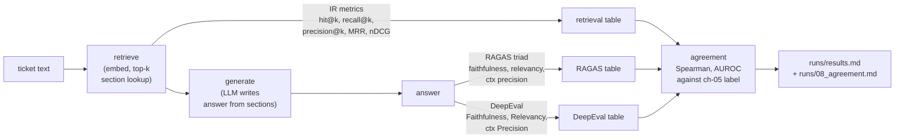

# 08 — RAG evals: where exactly does the pipeline break?

## What you will learn

- What **RAG** (*Retrieval-Augmented Generation*) actually is in our helpdesk SUT, and why it
  creates **two separate failure points** — retrieval can be wrong *or* generation can be wrong,
  and you need both evaluated independently.
- The five classical retrieval information-retrieval (IR) metrics — **hit@k, recall@k, precision@k,
  MRR** (Mean Reciprocal Rank), **nDCG@k** (normalized Discounted Cumulative Gain) — with a
  worked example on one real ticket so you can do the arithmetic by hand.
- How the **recall@k curve** (k = 1 through 8) exposes the cost of "just grab more chunks" and why
  **precision@k** collapses as k grows.
- The **retrieval-vs-generation split**: of our 18 failed tickets, only 1 is a retrieval failure and
  17 are generation failures — retrieval is *not* the bottleneck here.
- The **RAGAS triad** (faithfulness, answer relevancy, contextual precision — Es et al. 2023,
  arXiv 2309.15217) with an Ollama wiring excerpt, the per-item cost, and the known rough edges.
- The **DeepEval** counterpart (Faithfulness, AnswerRelevancy, ContextualPrecision) with its own
  wiring excerpt, and why its scores are nearly a constant 1.0.
- **Cross-evaluator agreement**: Spearman and AUROC between RAGAS, DeepEval, and an embedding
  cosine score against our chapter-05 judge verdicts. The honest verdict: **they are unaligned
  judges**, the same trap as chapter 05's cross-model judge agreement.
- **Advantages & disadvantages** tables for both libraries, so you can pick the right tool
  before you hit the rough edge.

Chapters 05–07 gave you a *verdict* — "the judge says 70% pass" — and an *error bar* on that
verdict. This chapter pulls the SUT apart: for a RAG system there is a **retrieval stage** (find
the right helpdesk section) and a **generation stage** (write an answer from those sections).
A ticket can fail at either stage, and you need different tools to see which one. Everything
below is run on the real helpdesk SUT from this repo: 60 test-split tickets, 3 sections retrieved
per ticket, Ollama at `http://127.0.0.1:11435`, model `qwen3.8:27b`, embeddings
`nomic-embed-text`. No numbers here are invented.



One ticket enters, five numbers come out per stage, and at the end an agreement analysis tells
you whether those numbers actually *agree with each other* or are just different opinions on the
same question. The rest of the chapter opens each box.

---

## RAG in one paragraph, and where it can break

Our SUT is a helpdesk assistant. The user types a question ("I got a cracked screen — what now?"),
the system **retrieves** the most relevant helpdesk sections by embedding the ticket and doing a
cosine lookup, then **generates** an answer conditioned on those sections. Two things can go
wrong, and they are *different things*:

1. **Retrieval failure** — the right section never made the top-k, so the LLM wrote a plausible
   but off-topic answer from the wrong sections.
2. **Generation failure** — the right section *was* retrieved, but the LLM missed a key fact,
   invented a detail, or ignored the instructions.

You cannot tell which one happened from the final answer alone. That is the whole reason this
chapter exists: **score the retrieval stage independently of the generation stage**, then look at
where the failures actually live.

---

## Retrieval IR metrics: five numbers, one worked example

The five standard information-retrieval metrics all take one argument — **k**, the "consider only
the top-k retrieved items" cutoff — and are computed per ticket, then averaged.

| metric | formula (per ticket) | what it answers |
|---|---|---|
| **hit@k** | 1 if *any* gold section is in top-k, else 0 | "Did we find *something* right?" |
| **recall@k** | (gold sections in top-k) / (total gold sections) | "How much of the relevant set did we find?" |
| **precision@k** | (gold sections in top-k) / k | "Of what we retrieved, how much was relevant?" |
| **MRR** | 1 / rank-of-first-gold-section (0 if none) | "How *early* did the first hit appear?" |
| **nDCG@k** | DCG@k / IDCG@k, DCG = Σ relᵢ / log₂(i+1), rel = *graded* relevance (earlier gold section = higher grade) | "How well-ordered are the relevant hits?" |

### Worked example: ticket `tkt-005`

From `runs/08_retrieval_answer_v1/predictions.jsonl`:

- **Gold sections:** `["returns", "shipping"]` — the ticket asks about a return *and* how
  shipping is handled, so two sections are relevant.
- **Retrieved (k = 2):** `["returns", "damaged_items"]` — the system picked "returns" and
  "damaged_items".

| metric | calculation | value |
|---|---|---|
| hit@2 | "returns" is in top-2 → 1 | **1.0** |
| recall@2 | 1 gold hit / 2 gold total | **0.5** |
| precision@2 | 1 gold hit / 2 retrieved | **0.5** |
| MRR | first gold at rank 1 → 1/1 | **1.0** |
| nDCG@2 | graded relevance: `returns` = grade 2, `shipping` = grade 1. DCG@2 = 2/log₂(2) + 0/log₂(3) = 2.0; IDCG@2 = 2/log₂(2) + 1/log₂(3) = 2.6309; nDCG = 2.0 / 2.6309 | **0.760** |

Read the row: the system found the *right* section (hit@2 = 1, MRR = 1) but missed *one of two*
relevant sections (recall@2 = 0.5), and half of what it retrieved was noise (precision@2 = 0.5).
nDCG lands between 0.5 and 1.0 because the ordering is partially right — the highest-grade gold
section (`returns`, grade 2) is at rank 1, but the lower-grade one (`shipping`, grade 1) was never
retrieved. Note nDCG here uses **graded relevance**, not binary: the code grades the gold list by
order — `graded_relevance(["returns", "shipping"])` → `{"returns": 2.0, "shipping": 1.0}`
(`graded_relevance` in `project/src/evals_tutorial/rag_evals.py:102`). This is the
**recall-vs-precision trade-off** in miniature: you found something, but not everything, and
you also grabbed a wrong item.

---

## The retrieval table and the recall@k curve

Running those five metrics over all 60 test-split tickets (v1 and v2 give identical retrieval
numbers because retrieval is the same frozen lookup in both) gives this table, with bootstrap
CIs over tickets from `runs/08_retrieval_answer_v1/metrics.json`:

| metric | point est. | 95% CI | notes |
|---|---|---|---|
| recall@2 | **0.842** | [0.758, 0.917] | primary — "did we find the relevant section?" |
| hit@2 | 0.917 | — | "did we find *anything* relevant?" |
| precision@2 | 0.475 | — | "of the 2 we grabbed, half was noise" |
| MRR | 0.869 | — | "first hit near rank 1" |
| nDCG@2 | 0.838 | — | "ordering is mostly right" |

### Why precision is half: the recall@k curve

The `metrics.json` also records a **recall@k curve** computed with one fresh `retrieve(k=k)` per
ticket for k = 1 through 8 (embeddings are cached):

| k | recall | precision | hit |
|---|---|---|---|
| 1 | 0.708 | **0.800** | 0.800 |
| 2 | 0.850 | 0.483 | 0.917 |
| 3 | 0.892 | 0.344 | 0.950 |
| 4 | 0.925 | 0.271 | 0.967 |
| 5 | 0.950 | 0.223 | 0.983 |
| 6 | 0.950 | 0.186 | 0.983 |
| 7 | 0.958 | 0.162 | 0.983 |
| 8 | 0.958 | 0.142 | 0.983 |

Two things to notice. First, **recall plateaus at k ≈ 5 → 0.95** — beyond that, pulling more
sections adds almost no new relevant hits. Second, **precision collapses linearly** from 0.80 at
k = 1 to 0.14 at k = 8, because you are grabbing 8 sections when only 1–2 are relevant. The
practical reading: **k = 2 is the sweet spot** for this SUT. k = 1 misses ~15% of the time
(recall = 0.71); k = 5 gives you almost no extra recall but floods the prompt with irrelevant
sections, which is where generation failures start.

One ticket stands out: **tkt-045** has gold sections that are *never* in the top-8 retrieved —
a genuine retrieval blind spot. It is the single retrieval failure in the failure split below.

---

## Retrieval failures vs generation failures

Of the 18 tickets that failed the chapter-05 judge in v1, the `failure_split` in
`metrics.json` says:

| category | count |
|---|---|
| retrieval failure (gold section not in top-2) | **1** |
| generation failure (gold section *was* in top-2) | **17** |

**Retrieval is not the bottleneck.** 17 of 18 failures happened after the right section was
already on the table. The one retrieval failure (tkt-045) is a true blind spot — the right
section was never retrieved in even k = 8. For the other 17, the LLM had the right material and
still produced a wrong answer. If your eval pipeline only scores the final answer, all 18 look
identical. The retrieval IR metrics are what let you say "only 1 of the 18 needs a retrieval
fix; the other 17 need a prompt or model fix." That is the whole point of splitting the
pipeline before you evaluate.

---

## RAGAS: the three-question judge

**RAGAS** (Es et al. 2023, *arXiv 2309.15217*) is a library that turns "is this RAG answer
good?" into three concrete, LLM-judged sub-questions. The triad:

| RAGAS metric | question it asks |
|---|---|
| **faithfulness** | "Is every claim in the answer supported by the *retrieved context*, not by the LLM's prior knowledge?" |
| **answer relevancy** | "Does the answer actually address the *question* asked (no drift, no padding)?" |
| **contextual precision** | "Of the retrieved chunks, are the *relevant ones ranked first* (vs irrelevant noise on top)?" |

All three are **reference-free** — RAGAS needs the question, the answer, and the retrieved
context, but not a gold answer. That makes them practical (you don't need annotations) but also
loose (the judge LLM is doing the scoring, and "supported" means whatever the judge thinks
"supported" means).

### Ollama wiring (excerpt from `project/src/evals_tutorial/rag_evals.py`)

RAGAS expects an OpenAI-compatible chat endpoint. We point its `OpenAI` client at Ollama's
`/v1` route and wrap the embeddings the same way:

```python
# rag_evals.py, _ragas_core (excerpt)
from openai import OpenAI
from ragas.llm import LLM
from ragas.embeddings import LangchainEmbeddingsWrapper
from ragas.metrics import Faithfulness, AnswerRelevancy, ContextualPrecision

client = OpenAI(base_url=settings.ollama_url + "/v1", api_key="ollama")
judge = LLM(provider="openai", model=settings.chat_model,
            client=client, max_tokens=4096)

embeddings = LangchainEmbeddingsWrapper(
    OllamaEmbeddings(model="nomic-embed-text", base_url=settings.ollama_url)
)

# Per ticket: build a RAGAS Sample, run the three metrics, collect scores.
# NaN rows are dropped per-metric before averaging (see rough edges below).
```

Key design choices: `RAGAS_DO_NOT_TRACK=true` is set before import (RAGAS phones home by
default); the judge model is the same `qwen3.8:27b` as the SUT (we are evaluating the pipeline,
not the judge — the cross-model agreement question is a chapter-05 concern); `show_progress=False`
so logs don't interleave. Every LLM call is wrapped in a counter (the `generate`/`agenerate`
wrappers at `rag_evals.py:515`) so the 146-call total is measured, not estimated.

### Results (n = 30, test split)

From `runs/08_ragas_answer_v1/metrics.json`:

| metric | mean | 95% CI |
|---|---|---|
| faithfulness | **0.676** | [0.590, 0.760] |
| answer relevancy | 0.709 | — |
| contextual precision | 0.933 | — |

146 LLM calls over 30 tickets ≈ **4.9 calls/sample** (each RAGAS metric makes ~1–2 internal LLM
round-trips: one to decompose the answer into claims, one to judge each claim). Wall time ≈
**61.5 s/item** (30 items) on the local GPU.

### Rough edges (from `runs/08_findings.md` + `research/SOURCES_tools.md`)

- **NaN scores**: RAGAS 0.4.3 returns `NaN` (not 0, not an exception) when the judge model
  outputs a refusable or malformed response. GitHub issues #1099, #1120, #1226, #1246 document
  this; we drop NaN rows per-metric before averaging, and record `dropped_nan` in the metrics JSON.
- **NaN is silent**: there is no exception to catch — the bad ticket just produces a `NaN` cell,
  so a naive `mean()` quietly mixes in `nan` and the whole metric column becomes unusable. The
  code filters `math.isnan` per-metric and records `dropped_nan` in the metrics JSON
  (`rag_evals.py:548`); if you write your own harness, add the same guard.
- **Cost scales with answer length**: faithfulness first *decomposes* the answer into claims
  (1 LLM call), then judges each claim (1 call each). A 10-claim answer = 11 LLM calls for
  faithfulness alone. At n = 30, 146 calls is within budget; at n = 600 it would be ~2,900.
- **Claim list gets truncated**: with `max_tokens=4096` on `qwen3.8:27b`, the list of atomic
  claims is frequently cut off mid-list, so the scored set of claims is smaller than the real one
  — this is what pushes the faithfulness CI wide to [0.590, 0.760] (from `runs/08_findings.md`).

---

## DeepEval: the same three questions, different judge

**DeepEval** (v4.2.1) offers the same triad — `FaithfulnessMetric`, `AnswerRelevancyMetric`,
`ContextualPrecisionMetric` — with a `deepeval.models.OllamaModel` wrapper so `is_native_model`
is True and the cost-accruing code path is used:

```python
# rag_evals.py, _deepeval_core (excerpt)
import os
os.environ.setdefault("DEEPEVAL_TELEMETRY_OPT_OUT", "1")  # before import

from deepeval.metrics import (FaithfulnessMetric, AnswerRelevancyMetric,
                              ContextualPrecisionMetric)
from deepeval.models import OllamaModel
from deepeval.test_case import LLMTestCase

model = OllamaModel(model=settings.chat_model,
                    base_url=settings.ollama_url, temperature=0)

# Per ticket: 3 metrics × metric.measure(tc)
for name, cls in (("faithfulness", FaithfulnessMetric),
                  ("answer_relevancy", AnswerRelevancyMetric),
                  ("ctx_precision", ContextualPrecisionMetric)):
    m = cls(model=model, threshold=0.5, async_mode=False)
    m.measure(tc)
    row[name] = float(m.score)
```

LLM calls are counted by monkey-patching `model.generate` / `model.a_generate` before the metric
loop, because DeepEval routes every internal LLM call through those two methods.

### Results (n = 30, test split)

| metric | mean | 95% CI |
|---|---|---|
| faithfulness | **0.987** | [0.973, 0.998] |
| answer relevancy | 0.985 | — |
| contextual precision | 0.950 | — |

270 LLM calls over 30 tickets = **exactly 9 calls/sample** (30 tickets × 3 metrics × ≈ 3
internal sub-calls per metric — the extract-then-check then-aggregate pattern), within the
300-call budget. Wall time ≈ **96 s/item**, more than RAGAS's ~61.5 s due to the higher
per-ticket call count (from `runs/08_findings.md`, ~48 min total).

### Why the scores are all ≈ 1.0

DeepEval is **effectively binary** in this run — on faithfulness, **26 of 30 tickets
score exactly 1.0** (values: 1.0 ×26, 0.929 ×1, 0.9 ×2, 0.875 ×1), and the 4 non-1.0
tickets are the only ones with a partially unmet atomic claim. That is why the mean is
0.987 rather than ~0.85, and why its Spearman against RAGAS is near zero: **a near-constant
column has almost no rank structure to correlate on.**

The reason it saturates is a different prompt than RAGAS's. Per `runs/08_findings.md`:
DeepEval's `Faithfulness` treats the `reference` field as a *grounding source* and
decomposes the response into atomic claims it can confirm against it; RAGAS instead asks the
LLM to *list every* claim and check each against the reference, so anything the model
**infers-but-doesn't-state** drops the ticket. For this corpus — short, grounded answers —
the difference reads as **DeepEval being more lenient and RAGAS more demanding.**

**Read 0.987 faithfulness as "DeepEval did not find a single unsupported atomic claim in ~97%
of tickets,"** not "the answers are 98.7% faithful in an absolute sense." A near-saturated
score is a pass/fail signal, not a calibrated quality score.

---

## Cross-evaluator agreement: do these three tools agree?

`runs/08_agreement.md` aligns three scoring stacks by `ticket_id` on the **n = 28** tickets
where all sources are non-null (2 dropped for a NaN anywhere), and scores each two ways:

| metric | RAGAS faith. | DeepEval faith. | embed cosine |
|---|---|---|---|
| **AUROC vs ch-03 gold `pass` label** | 0.578 | 0.567 | **0.756** |
| **AUROC vs ch-05 ensemble verdict** | 0.578 | 0.520 | 0.571 |

And the pairwise **Spearman rank agreement** between the stacks:

| pair | Spearman ρ |
|---|---|
| RAGAS × DeepEval | **−0.234** |
| RAGAS × embed cosine | **+0.379** |
| DeepEval × embed cosine | **−0.239** |

Three findings, read in order.

**1. The rank order does not transfer between stacks.** The Spearman between RAGAS and DeepEval
faithfulness is **−0.234** — *slightly negative*. The tickets RAGAS scores high are not the ones
DeepEval scores high; both sit at ±0.23–0.38 against the embedding cosine with **conflicting
signs**. Three stacks, three different orderings — there is no single "quality ranking" the
community stacks agree on. (DeepEval's near-saturated scores remove most rank structure to
correlate on — the near-constant column is a big part of why ρ is ~0.)

**2. Against the gold pass label, all LLM-judge stacks sit at ~chance — and the cheapest
feature wins.** AUROC vs the ch-03 gold `pass` label is **0.578** (RAGAS) and **0.567**
(DeepEval) — barely above the 0.5 "no signal" line. The raw **embedding cosine** does *better*:
**AUROC 0.756**. None of the expensive LLM-judge stacks beats the single cheapest feature in the
pipeline for this task. The LLM judges add little on top of the cosine for predicting the label.

**3. Against our own ch-05 ensemble verdict, every single judge falls to chance (0.52–0.58).**
This is expected and informative: the ch-05 verdict is the *ensemble* of several per-ticket
judges, and a single component cannot reliably reconstruct the aggregate it is part of. So "the
stacks disagree with the ensemble" is the **ceiling of single-feature evaluation**, not a bug in
any one judge. **Same lesson as chapter 05: judge models are unaligned with each other.**

### Two counter-example tickets

The two where RAGAS and DeepEval disagree **sharply and in opposite directions**, both on the
gold-fail side, caught by RAGAS and missed by DeepEval (from `runs/08_agreement.md`):

| Ticket | gold `pass` | ch-05 verdict | ch-04 embed | RAGAS fid | DeepEval fid |
|---|---|---|---|---|---|
| **tkt-012** | True | False | 0.853 | **0.250** | **1.000** |
| **tkt-014** | False | True | 0.534 | **0.222** | **1.000** |

- **tkt-012**: gold says *pass*, the ch-05 ensemble *flags it failing*, the cosine rates it high
  (0.853), DeepEval calls it "perfectly faithful" (1.0) — and **RAGAS rates 0.250**. Here
  DeepEval's lenient decomposition saturates at 1.0 while RAGAS stays aligned with the
  failure-flagging signals.
- **tkt-014**: gold says *fail*, the ch-05 ensemble *misses it* (predicts pass), and the cosine
  is borderline (0.534). **Both DeepEval (1.0) and our own ensemble miss it; RAGAS's 0.222 is
  the only signal aligned with the gold.** This is the "even our own ensemble and the
  third-party stack both miss it" ticket.

Across the 28 aligned tickets, DeepEval and RAGAS split on the 0.5 faithfulness threshold in
**8 tickets — and in the same direction every time**: DeepEval leans pass, RAGAS leans fail.
That one-directional skew (never the reverse) is the fingerprint of DeepEval's lenient saturation,
not of random noise. The practical read, straight from `runs/08_agreement.md`: **if you need a
failure-catch, use RAGAS; if you need a cheap "is this plausibly faithful" screen, DeepEval.**
There is no single "correct scorer" — three tools telling three different stories about the
same two tickets.

---

## What landed in the results table

From `runs/results.md`, the five chapter-08 rows:

| experiment | n | primary metric | score | 95% CI | LLM calls | s/item |
|---|---|---|---|---|---|---|
| 08_retrieval_answer_v1 | 60 | recall@2 | **0.842** | [0.758, 0.917] | 0 | 0.000 |
| 08_retrieval_answer_v2 | 60 | recall@2 | **0.842** | [0.758, 0.917] | 0 | 0.000 |
| 08_ragas_answer_v1 | 30 | faithfulness | **0.676** | [0.590, 0.760] | 146 | 61.5 |
| 08_deepeval_answer_v1 | 30 | faithfulness | **0.987** | [0.973, 0.998] | 270 | 96.0 |
| 08_agreement_metrics | 28 | auroc_ragas_vs_label | **0.578** | [0.363, 0.806] | 0 | 0.000 |

The retrieval rows are free (0 LLM calls, < 1 s). The RAGAS and DeepEval rows cost real wall
time and GPU compute — factor that into your eval budget when n > 30.

---

## Advantages and disadvantages

### RAGAS

| | |
|---|---|
| **Advantage** | **Reference-free** — needs only question, answer, and retrieved context. No gold answers required, so it scales to unlabeled production traffic. |
| **Advantage** | **Claim-decomposition** catches specific unsupported sentences, giving a more diagnostic signal than a holistic yes/no. |
| **Disadvantage** | **NaN on malformed judge output** (RAGAS 0.4.3, GitHub #1099/#1120/#1226/#1246) — requires per-metric NaN filtering before averaging. |
| **Disadvantage** | **LLM-call cost scales with answer length** — faithfulness makes 1 + N_claims LLM calls; a 10-claim answer = 11 calls for that metric alone. At n = 600, budget ~2,900 calls. |
| **Disadvantage** | **NaN is silent and `show_progress=False` hides it** — a bad ticket yields a `NaN` cell with no exception; without per-metric `isnan` filtering (the code does this at `rag_evals.py:550`) your mean becomes `nan`. |

### DeepEval

| | |
|---|---|
| **Advantage** | **Deterministic call count** — exactly 9 LLM calls per ticket (3 metrics × 3 calls each), regardless of answer length. Easy to budget. |
| **Advantage** | **`deepeval set-ollama` CLI** and a first-class `OllamaModel` class — no monkey-patching needed to wire Ollama as the judge. |
| **Disadvantage** | **Lenient claim decomposition** — DeepEval does decompose into atomic claims, but it treats the `reference` as the grounding source and stops scoring once a claim is *confirmable* there, so 26/30 faithfulness scores land at exactly 1.0. Scores compress near the ceiling, cutting discriminative power (this is why its Spearman against RAGAS is ~0). |
| **Disadvantage** | **Telemetry is opt-out** (`DEEPEVAL_TELEMETRY_OPT_OUT=1` must be set *before* import) — easy to miss in a shared venv. |
| **Disadvantage** | **`async_mode` on the metric class** defaults to async execution; the code sets `async_mode=False` per metric (`rag_evals.py:697`) so a failure surfaces per-ticket instead of being swallowed by the executor. |

---

## Troubleshooting

| symptom | likely cause | fix |
|---|---|---|
| RAGAS faithfulness = `NaN` for several tickets | judge model returned a refusal or malformed response (known RAGAS 0.4.x issue) | set `RAGAS_DO_NOT_TRACK=true`, filter `math.isnan` per-metric before averaging, record `dropped_nan` in your metrics JSON (`rag_evals.py:550`) |
| DeepEval scores all cluster at 0.95–1.0 | DeepEval's claim decomposition stops at "is this claim confirmable against the reference" (lenient), so 26/30 land at exactly 1.0; RAGAS demands a *listed* match, so partial credit survives | pair DeepEval with RAGAS to recover discrimination; do not read 0.987 faithfulness as "98.7% faithful" in absolute terms |
| Retrieval recall@2 looks low (0.84) but generation scores are fine | the one or two retrieval failures are hidden inside the aggregate; most failures are generation failures | run the retrieval-vs-generation failure split (filter tickets where gold section ∉ top-k) before touching the prompt — only fix retrieval if retrieval is actually the bottleneck |
| Precision@k collapses as k grows (0.80 at k=1 → 0.14 at k=8) | expected — you are pulling irrelevant sections that dilute the prompt | cap k at the point where recall plateaus (k ≈ 5 for this SUT); check the recall@k curve before choosing k |
| RAGAS/DeepEval wall time is 50–100 min for n=30 | 4.9–9 LLM calls per ticket on a local GPU; n× that for larger samples | budget `n × calls/item × s/call` before launching; for DeepEval, confirm `async_mode=False` gives correct per-ticket results before switching on the async path (`rag_evals.py:697`) |
| Cross-stack Spearman is negative (RAGAS vs DeepEval = −0.23) | not a bug — the two libraries use different prompts and different judging strategies; they are unaligned judges, same as chapter-05 cross-model finding | do not average across stacks; report each stack separately; use the agreement table (Spearman + AUROC vs reference label) to decide which stack is more trustworthy for *your* SUT |
| Embedding cosine AUROC (0.756) outperforms both LLM-judge AUROCs (0.57) | a cheap similarity heuristic is a better *calibration signal* against the reference judge than the LLM-judge stacks in this setting | consider the embedding cosine as a fast triage gate before spending LLM-judge budget; do not use it as a replacement for the full RAGAS/DeepEval triad — it captures similarity, not faithfulness |

---

## Exercises

1. **Compute nDCG@2 by hand for tkt-005.** Gold: `["returns", "shipping"]` → graded relevance
   `{"returns": 2.0, "shipping": 1.0}`. Retrieved top-2: `["returns", "damaged_items"]`.
   DCG@2 = 2.0/log₂(2) + 0/log₂(3) = 2.0. IDCG@2 (ideal order of the gold) =
   2.0/log₂(2) + 1.0/log₂(3) = 2.0 + 0.6309 = 2.6309. nDCG@2 = 2.0 / 2.6309 = **0.7602**,
   which matches the stored value in `predictions.jsonl`. If you accidentally use binary relevance
   (both gold = 1.0) you get 1/1.631 = 0.613 — that mismatch is the tell that you missed the
   graded-relevance step.

2. **Pick a k from the recall@k curve for a production setting where the prompt token budget
   is capped at 512 tokens and each section is ~80 tokens.** You can retrieve at most 6
   sections (480 tokens). What are recall and precision at k = 6? Is that better or worse
   than k = 2 for this SUT, and what is the practical trade-off?

3. **Run RAGAS and DeepEval on the same 30 tickets but swap the judge model** (e.g. from
   `qwen3.8:27b` to `gemma4:latest`). Does the Spearman between the two stacks change sign?
   Does the AUROC against the chapter-05 label improve or degrade? What does that tell you
   about whether the disagreement is a *library* effect or a *judge* effect?

4. **Write a one-paragraph "which tool to use" recommendation** for two scenarios:
   (a) a low-latency production eval that must run < 5 s/item; (b) a research eval where you
   want the most diagnostic, claim-level signal. Cite the specific RAGAS/DeepEval advantage
   or disadvantage rows from the table above.

---

Next: [09 — Hallucination detectors: five methods, one question](09_hallucination_detectors.md)
