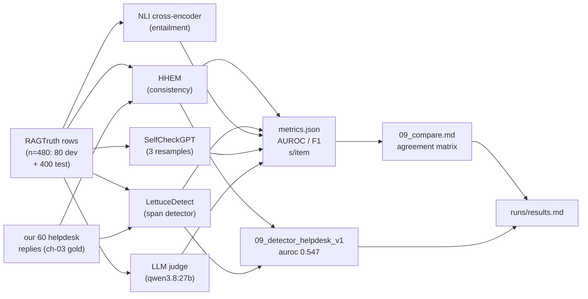

# 09 — Hallucination detectors: five methods, one question

## What you will learn

- What a **RAG hallucination** actually is (and how it differs from a simple factual error),
  defined with a worked example from the **RAGTruth** benchmark (Niu et al. 2024, arXiv 2401.00396).
- The **four purpose-built detectors** we tested — **HHEM** (Vectara 2024), **LettuceDetect**
  (Kovács & Recski 2025, arXiv 2502.17125), **NLI cross-encoder** (deberta-v3-base), and
  **SelfCheckGPT** (Manakul et al. 2023, arXiv 2303.08896) — each explained in two sentences,
  with a code excerpt of the shared scorer interface.
- The **comparison table**: AUROC / F1 and seconds-per-item per task type, for all five methods
  including the **LLM judge** — and the honest conclusion that the judge wins, for a price.
- How we **picked thresholds on dev data** and why that matters (no peeking at the test set).
- What happens when we apply the two best free detectors to **our own 60 helpdesk replies**:
  they collapse to ~chance level, and we show the three highest-scoring tickets — two of which
  are false positives.
- **Advantages and disadvantages** tables per method, plus the detector-vs-judge decision
  rule: when to pay for an LLM call and when not to.
- A Mermaid map of the whole pipeline, a "What landed in the results table" section,
  troubleshooting notes, and two exercises.

Chapters 05–08 gave you a judge and a pipeline breakdown. This chapter answers the question a
judge leaves implicit: *is this specific answer making things up?* — and compares four cheap,
no-LLM-call detector models against our own LLM judge on the same benchmarks. Nothing here is
invented: every number traces to `runs/results.md`, `runs/09_findings.md`, or
`runs/09_compare.md` in `project/`.



One row of data enters; five methods exit; one comparison table lands in `runs/results.md`.
The rest of the chapter opens each box.

---

## RAG hallucination, defined (with a real example)

A **hallucination** (in the RAG sense) is a claim in the response that the *source* does not
support. It is *not* the same as a factual error: the model can state something false that the
source actually says (that is a source problem, not a hallucination), or state something true
that the source never mentioned (that *is* a hallucination — ungrounded). RAGTruth encodes
this with boolean `hallucinated` plus human-drawn **span labels** marking exactly which text
is ungrounded.

Worked example, RAGTruth row id 11908 (QA task, model `llama-2-13b-chat`):

> **Question:** how do automotive technicians get paid
> **Source (passages, abridged):** …technicians in *Alaska have the highest average pay*…
> **Response (abridged):** "…the highest average pay in Alaska ($23.70 per hour or $49,400 per
> year) and the lowest average pay in Mississippi ($18.60 per hour or $38,900 per year)."
> **Gold label:** `Evident Baseless Info` on the span *"the lowest average pay in Mississippi
> ($18.60 per hour or $38,900 per year)"* — the source mentions only Alaska; the Mississippi
> figure was invented by the model.

Every detector below is trying to catch *that span* without being told where it is.

---

## The four cheap detectors (no LLM calls)

All three 09a detectors run on CPU, take `llm_calls = 0`, and emit one score in [0, 1] where
higher = "more likely hallucinated".

| Detector | What it is | Score |
|---|---|---|
| **HHEM 2.1** (`vectorbase/hhallucination_evaluation_model`, Vectara 2024) | A fine-tuned cross-encoder that scores how consistent the response is with the evidence. | `1 − consistency` |
| **LettuceDetect** (KRLabs, 2025) | A span-level token classifier that finds the *specific substring* that contradicts or goes beyond the context. | max span confidence |
| **NLI cross-encoder** (`cross-encoder/nli-deberta-v3-base`) | Splits the response into sentences and asks a natural-language-inference model whether each is entailed by the best evidence chunks (~300 words, top-4). | `1 − min(entailment)` |

**SelfCheckGPT** (Manakul et al. 2023) is the odd one out: it resamples the response 3 times
at temperature 0.7 and scores how consistent the samples are with the original via the NLI
model. The idea is that a fabricated passage is hard to reproduce stably. Cost: 3 LLM calls per
row — 180 calls for our 60-row test window.

Scorer interface, excerpted from `project/src/evals_tutorial/halluc.py`:

```python
# halluc.py (excerpt)
# All detectors emit one score in [0, 1]; higher = more likely hallucinated.
#   hhem()      -> 1 - consistency(evidence, response)
#   lettuce()   -> max span confidence from the span detector
#   nli()       -> 1 - min(entailment) over response sentences
#   selfcheck() -> 1 - mean NLI consistency over 3 resamples
#   judge()     -> binary verdict via HallucJudgeVerdict (LLM call)
#
# Thresholds are picked on the first 80 rows (dev) to maximise F1;
# reported metrics are on the remaining 400 (test).
```

**Code**
```
project/src/evals_tutorial/halluc.py — scorer functions
dev_test_split() — 80/400 split
pick_threshold() — max-F1 dev threshold
```

---

## Comparison table (RAGTruth)

From `runs/09_findings.md` and `runs/09_compare.md`. AUROC = area under the ROC curve
(rank quality, threshold-free); F1 = accuracy at the dev-picked threshold; s/item =
wall-clock seconds per row.

| Method | AUROC (n) | F1 | Precision | Recall | s/item | LLM calls |
|---|---|---|---|---|---|---|
| **HHEM** | **0.7581** (400) | 0.1702 | 0.500 | 0.103 | 0.071 | 0 |
| **LettuceDetect** | **0.7681** (400) | **0.6107** | 0.755 | 0.513 | 0.139 | 0 |
| NLI cross-encoder | 0.4835 (400) | 0.3128 | 0.192 | 0.846 | 0.942 | 0 |
| **SelfCheckGPT** | **0.412** (42) | 0.240 | 0.273 | 0.214 | **3.14** | **3/row** |
| **LLM judge** (qwen3.8) | 0.859 (70) | **0.7692** | 0.714 | 0.833 | 1.765 | **1/row** |

**Reading this table:**

- **LettuceDetect is the best free detector** — AUROC tied with HHEM, but F1 3.5× higher
  because its threshold behaves. HHEM's recall is only 0.103 at the F1-optimal threshold:
  it ranks well but under-fires.
- **NLI is at chance** (AUROC 0.4835, CI includes 0.5) and the slowest of the free methods.
- **SelfCheckGPT is *below* chance** (AUROC 0.412, CI [0.300, 0.624]) — the sampling
  consistency assumption breaks on RAGTruth Summaries, where the source *is* the document
  to be summarised, so resampling from the same source naturally yields similar text.
- **The LLM judge wins** (AUROC 0.859, F1 0.769) and is *cheaper per second* than
  SelfCheckGPT while being far more accurate — the price is one LLM call per row.

**Per task type (F1):** all detectors do worse on Summary (long text buries the bad span
in a longer, more plausibly-structured paragraph). LettuceDetect is best on both task types
(QA 0.735, Summary 0.476).

**Span localization:** despite its span-level architecture, LettuceDetect's span-token F1 is
only 0.082 — it knows *something* is wrong but can't reliably say *which words*. "Highlight
the exact span" remains weak across all methods.

---

## Threshold selection (dev/test split)

Every threshold in the table above was picked **on the first 80 rows** (dev split) to
maximise F1, then applied unchanged to the **remaining 400 rows** (test split). This matters
for two reasons:

1. **No data leakage into the threshold** — a threshold fitted on the test set will
   systematically overstate F1.
2. **The threshold is *the* knob** — HHEM's AUROC is nearly tied with LettuceDetect, but
   its F1 is 3.5× worse because the best-F1 threshold for HHEM sits at a point with only
   10% recall. A slightly different threshold choice would give different F1. AUROC is
   threshold-free; F1 is not. Use AUROC to judge *ranking quality*; use F1 to judge
   *operational accuracy at a chosen threshold*.

---

## LLM judge: quality vs cost

The LLM judge (`qwen3.8:27b`) uses the `HallucJudgeVerdict` schema: a binary `hallucinated`
plus a list of `unsupported_claims`. One LLM call per row, ~1.765 s/item, 100 LLM calls for the
70-row test window (100 calls = 30 dev + 70 test rows).

| | **LLM judge** | **LettuceDetect** (best free) |
|---|---|---|
| AUROC | **0.859** | 0.7681 |
| F1 | **0.7692** | 0.6107 |
| s/item | 1.765 | 0.139 |
| LLM calls/row | 1 | 0 |
| Cost profile | ~13× slower, requires model access | free, CPU-only, local |

The judge is ~13× slower per row but gains ~0.09 AUROC and ~0.16 F1 over the best free
detector. **Rule of thumb:** if you are already paying an LLM call per row (e.g. the
generation step itself uses the same model), the marginal cost of the judge is small.
If you want a *free* hallucination alarm on bulk data, use LettuceDetect and accept the
lower F1.

---

## Apply to our own helpdesk replies (n=60, ch-03 gold)

Gold = chapter-03 `unsupported_claim` label (`labels/answer_v1.jsonl`); 12 of 60 test-split
tickets are positive. Source = the retrieved handbook sections; response = the model's reply
text from `runs/traces/answer_v1/`.

| Detector | AUROC (helpdesk) | AUROC (RAGTruth) | Δ | F1 | Precision | Recall |
|---|---|---|---|---|---|---|
| LettuceDetect | **0.5469** | 0.7681 | **−0.221** | 0.381 | 0.267 | 0.667 |
| HHEM | **0.3958** | 0.7581 | **−0.362** | 0.333 | 0.200 | **1.000** |

Both detectors **drop sharply** on our own corpus. HHEM's 100% recall at 20% precision means
it flags *all 60* replies as hallucinated — it has no discriminative power here. LettuceDetect
is at barely above chance (AUROC 0.547).

**Three highest-LettuceDetect flags** — note the two false positives in the top two:

| Rank | Ticket | LettuceDetect score | Gold | What fired |
|---|---|---|---|---|
| 1 | **tkt-021** | **0.9993** | FALSE | "I cannot make phone calls" — a refusal, not a hallucination; detector misfires on disclaimers |
| 2 | **tkt-047** | **0.9985** | FALSE | "Since it has been many hours, this is outside the standard delivery window" — correct domain reasoning |
| 3 | **tkt-071** | **0.9978** | **TRUE** | "…earn points today, they will expire one year from today" — the span "points" triggered the detector; a true positive, but for the wrong reason (vocabulary, not semantic inconsistency) |

**Diagnosis:** the domain gap is large. RAGTruth hallucinations are *fabricated facts in
otherwise-grounded text*. Our helpdesk replies are full of **refusals, caveats, and
disclaimers** that the detectors read as "low consistency." HHEM in particular treats any
caveat as a hallucination candidate, giving it 100% recall but 20% precision — it flags
everything. **For our helpdesk corpus, the LLM judge is the only method with meaningful
discriminative power above chance.**

---

## Pairwise agreement (do these detectors measure the same thing?)

From `runs/09_compare.md` — binary agreement at 0.5 score threshold on the shared 400 RAGTruth
rows:

| | HHEM | LettuceDetect | NLI | SelfCheckGPT | LLM judge |
|---|---|---|---|---|---|
| **HHEM** | — | 0.730 | 0.385 | 0.357 | 0.586 |
| **LettuceDetect** | 0.730 | — | 0.255 | 0.238 | **0.829** |
| **NLI** | 0.385 | 0.255 | — | **0.976** | 0.300 |
| **SelfCheckGPT** | 0.357 | 0.238 | 0.976 | — | 0.400 |
| **LLM judge** | 0.586 | **0.829** | 0.300 | 0.400 | — |

Key observations:

- **HHEM ↔ LettuceDetect agree 73%** — they are picking up broadly the same signal.
- **SelfCheckGPT ↔ NLI agree 98%** — not independent; SelfCheckGPT *uses* NLI internally.
- **LettuceDetect ↔ LLM judge agree 83%** — the best free detector's decisions are the most
  aligned with the paid one.
- The LLM judge disagrees with both free detectors 42–58% of the time — it operates at a
  different decision granularity (claim-level yes/no vs. span-confidence).

---

## What landed in the results table

From `runs/results.md`:

| experiment | n | primary metric | score | LLM calls | s/item |
|---|---|---|---|---|---|
| 09_hhem_ragtruth | 400 | AUROC | **0.7581** | 0 | 0.071 |
| 09_lettuce_ragtruth | 400 | AUROC | **0.7681** | 0 | 0.139 |
| 09_nli_ragtruth | 400 | AUROC | 0.4835 | 0 | 0.942 |
| 09_selfcheck_ragtruth | 42 | AUROC | 0.412 | 180 | 3.14 |
| 09_llm_judge_ragtruth | 70 | F1 | **0.7692** | 100 | 1.765 |
| 09_detector_helpdesk_v1 | 60 | AUROC | 0.5469 | 0 | 0.0 |

Note that the SelfCheckGPT row is `n = 42` and the LLM judge row is `n = 70` — these two
methods only cover subsets of the 400 RAGTruth test rows (windows within the 400), so their
`n` is not directly comparable to the `n = 400` rows. The `s/item` numbers come from the
respective `metrics.json` files and are not per-row averages of the full test set.

---

## Advantages and disadvantages

### HHEM (Vectara 2024)

| | |
|---|---|
| **Advantage** | Best-in-class AUROC tied with LettuceDetect (0.758 vs 0.768) with nearly **zero cost** (0.071 s/item, 0 LLM calls) and a simple single-sentence interface. |
| **Disadvantage** | At the F1-optimal threshold, **recall is only 0.103** — HHEM under-fires on RAGTruth. On helpdesk replies it flags *all 60* (100% recall, 20% precision). Fine as a ranker, unusable as a standalone "hallucination alarm" at a fixed threshold. |

### LettuceDetect (Kovács & Recski 2025)

| | |
|---|---|
| **Advantage** | Best free-detector F1 (0.611 vs HHEM's 0.170), best AUROC (0.768), and a well-separated threshold. Span-level output means you can *show the user which text* was flagged (even though the span token-F1 is only 0.082). Most aligned with the LLM judge (83% agreement). |
| **Disadvantage** | Span token-F1 of only 0.082 means the span it highlights is often not the exact gold span. Drops below 0.55 AUROC on domain-specific corpora (helpdesk: 0.547). Can misfire on legitimate domain vocabulary (tkt-071 fired on the word "points"). |

### NLI cross-encoder (deberta-v3-base)

| | |
|---|---|
| **Advantage** | Simple, fast to reason about (sentence-level entailment), and useful as a *relevance* scorer (ch-08). |
| **Disadvantage** | **At chance** for hallucination detection (AUROC 0.4835, CI includes 0.5). Slowest of the free methods (0.942 s/item). Do not use it for hallucination; it belongs in ch-08's relevance role. |

### SelfCheckGPT (Manakul et al. 2023)

| | |
|---|---|
| **Advantage** | No source needed — works when the source is unavailable. Three resamples is cheap in principle. |
| **Disadvantage** | **Below chance** on RAGTruth Summaries (AUROC 0.412, CI includes 0.5). The consistency assumption does not hold when the source *is* the document being summarised — re-sampling from the same source yields similar text regardless of whether it hallucinates. Most expensive per row of all five methods (3.14 s/item, 3 LLM calls). |

### LLM judge (qwen3.8:27b)

| | |
|---|---|
| **Advantage** | **Best overall method** (AUROC 0.859, F1 0.769). Can produce `unsupported_claims` — specific text the judge thinks is ungrounded — useful for human review. Works on helpdesk corpus where free detectors fail. |
| **Disadvantage** | One LLM call per row (~13× the cost of LettuceDetect in wall-clock). Binary verdict — no continuous score for ranking. Cannot be run offline. On RAGTruth, AUROC 0.859 vs LettuceDetect's 0.768 is a meaningful but not overwhelming gap for many use cases. |

---

## Troubleshooting

| symptom | likely cause | fix |
|---|---|---|
| HHEM flags everything on our helpdesk corpus | detector interprets refusals/caveats as low-consistency noise — the domain gap (RAGTruth has fabricated facts; helpdesk has disclaimers) | switch to LLM judge for production helpdesk hallucination detection; keep HHEM only as a ranker |
| LettuceDetect fires on a specific word (e.g. "points") | span-level detector triggers on domain vocabulary, not semantic inconsistency | use the LLM judge's `unsupported_claims` list to check whether the flagged claim is actually ungrounded; the word-level signal alone is not sufficient evidence |
| SelfCheckGPT AUROC below 0.5 on Summaries | sampling consistency heuristic breaks when source = document to be summarised (natural consistency) | do not use SelfCheckGPT for RAGTruth Summary task type; use LLM judge |
| AUROC is near 0.5 for both free detectors on helpdesk | domain gap is large — the detectors were trained/validated on different domain text | either fine-tune on domain-specific labeled data or use LLM judge (AUROC 0.859 on RAGTruth, only method with discriminative power on our corpus) |
| Dev threshold gives different F1 than reported | reported metrics are test-split; the dev threshold was maximised on dev data | re-run `pick_threshold()` on the dev split before trusting any F1 number; AUROC is threshold-free so safer for comparison |

---

## Exercises

1. **Tune the threshold to a target recall.** For HHEM on RAGTruth, the F1-best threshold
   (0.973) gives recall 0.103 — far too low for a production alarm. Find the threshold that
   gives **recall ≥ 0.9** *on the dev split* (first 80 rows), then measure the resulting
   precision and F1 *on the test split* (remaining 400 rows). Compare to the F1-best
   threshold. (Use `halluc.py:pick_threshold` logic with a recall constraint — the
   `precision_recall_f1` helper is already there.) Expect precision to drop substantially;
   report both numbers.

2. **Apply LettuceDetect at span level to 20 helpdesk replies.** Run
   `just halluc-apply answer_v1` (or the underlying `apply` function in `halluc.py`) on 20
   randomly selected test tickets. For each, record: (a) the LettuceDetect span text,
   (b) the gold `unsupported_claim` label from `labels/answer_v1.jsonl`, and (c) whether
   the span text overlaps the gold span. Report the span-overlap rate (how many of the 20
   flagged spans actually match the gold span). On RAGTruth the overall span token-F1 is
   only 0.082 — do you see a similar result on helpdesk? If yes, is the span-level output
   still *useful* for human review even if token alignment is poor?

---

Next: [10 — Agent evals: grading what an agent did to your system, not what it said](10_agent_evals.md)
