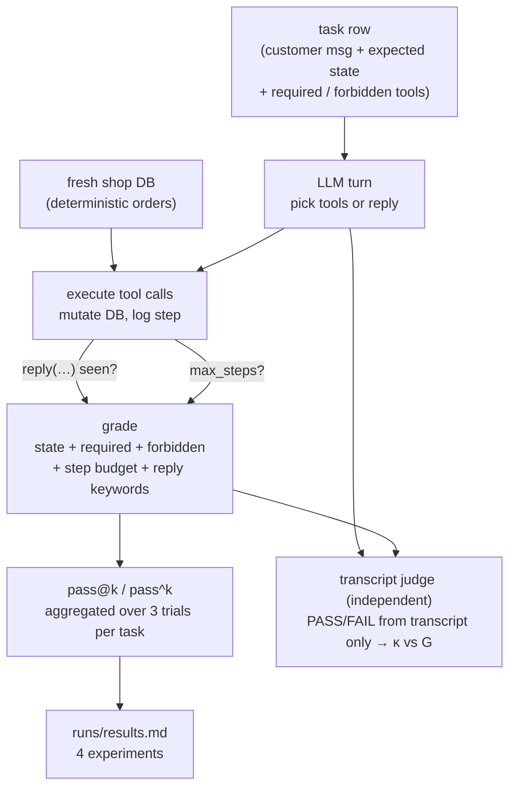

# 10 — Agent evals: grading what an agent did to your system, not what it said

## What you will learn

- **What makes agent evals different** from text-only evals: the model accumulates *state*,
  takes a *path* of actions, and is *stochastic* — so one run tells you little.
- The **mock shop + tool set** we built (an in-memory order database with eight
  policy-bound tools), with a code excerpt of the tool boundary.
- A **task row explained field-by-field** straight from `data/agent_tasks.jsonl`.
- **Grading final state + path constraints** (Anthropic, "Demystifying evals for AI agents",
  2026) — and why the state grader is primary.
- A **real trajectory walked step-by-step** (t01) with the grade that fell out of it.
- **pass@k vs pass^k** in plain words, with the numbers we got, their 95 % CIs, and the
  per-task pattern (Yao et al. 2024, τ-bench).
- Why **reliability** (pass^k) is what production needs, not capability (pass@k).
- **Trajectory metrics**: mean steps, tool-call and tool-error rates, policy violations.
- **Transcript grading vs state grading**: Cohen's κ = −0.24 between the two, and the
  one-sided pattern of *what the judge missed*.
- **Simulated-user multi-turn** episodes and their limits (mean user turns ≈ 0.11).
- A Mermaid diagram of the whole episode loop, "What landed in the results table",
  troubleshooting notes, and two exercises.

Chapters 01–09 graded *answers*. This chapter grades *actions*: a customer-service agent
loops over a fake shop database, calls tools that mutate state, and we grade the
**final database state** plus constraints on the path it took to get there. Nothing here is
invented: every number traces to `project/runs/10_findings.md`, `project/runs/results.md`,
or the four `metrics.json` files under `project/runs/10_*`.



One task enters; the agent may take many turns; one database and one transcript come out.
The code grader reads the database, the transcript judge reads the transcript, and the two
grades are compared episode by episode.

---

## What makes agent evals different

Three things separate this chapter from chapters 01–09.

1. **State.** A text model answers once and the world is unchanged. An agent acts: it
   looks up an order, cancels it, refunds money. The world is *different at the end*. Two
   agents that produce nearly identical polite replies can leave two very different
   databases. So the grade lives on the state (`state_after`), not the prose.
2. **Path.** The same final state can be reached a legal way (start the return, then
   refund) or an illegal one (refund without a return, when policy requires a return
   first). And a *wrong* state can look like a nice, reasonable reply. So the grade also
   checks the path: which tools were called, what was forbidden, and whether the agent
   stayed within a step budget. This is the "helpful model makes a wrong change" case —
   measured in our run at a **policy-violation rate of 0.15**.
3. **Stochasticity.** Run the same task three times and you may get pass, fail, pass.
   A single trajectory is data, not a score. So every task was run **k = 3 trials**
   (60 episodes over 20 tasks), and we report two different aggregations that answer two
   different questions — that is the pass@k / pass^k split above.

---

## The mock shop: state, tools, and one boundary

The shop is an in-memory Python database (`ShopDB`) prefilled with a handful of orders in
known statuses (placed, processing, shipped, delivered) and seeded with known refund,
return, and fee fields. Eight tools mutate or inspect it, and every one of them
**enforces shop policy itself** — the model cannot talk its way past a rule, because the
rule lives in the tool, not in the prompt:

| Tool | Does | Policy enforced inside the tool |
|---|---|---|
| `lookup_order` / `list_orders` | read order details / a customer's orders | — |
| `cancel_order` | cancel | refused once shipped/delivered; **$5 fee** if status is *processing* |
| `update_address` | change shipping address | only while *placed* **and** within 24 h |
| `start_return` | start a return | delivered orders only; non-custom items; 30-day window |
| `issue_refund` | refund money | capped at order total; **≥ 200 without a started return requires `escalate` first** |
| `escalate` | flag to a human | — |
| `reply` | send the final message | **ends the episode** |

The boundary between "the model's text" and "the world" is small and explicit —
`call_tool` in `project/src/evals_tutorial/agent.py`:

```python
# agent.py (excerpt)
TOOL_SCHEMAS = [  # 8 entries, e.g.:
    {"type": "function",
     "function": {"name": "issue_refund",
        "description": "Issue a money refund against an order (capped at order total). "
                       "Refunds >= 200 without a started return require escalate() first.",
        "parameters": {...}}},
]

def call_tool(db, name, args):
    """Execute one tool call. Returns (result, was_error_or_unknown)."""
    fn = TOOLS.get(name)
    if fn is None:
        return {"ok": False, "error": f"unknown tool: {name}"}, True
    ...
    # tool errors are data, not crashes:
    except Exception as exc:
        return {"ok": False, "error": f"{name} raised: {exc}"}, True

# each step is logged for trajectory metrics:
step_entries.append({"tool": name, "args": args,
                     "error": bool(errored), ...})
```

Policy refusals come back as a normal `{"ok": false, "error": "..."}` result — the model
*sees* the rule in its own transcript and can react. That matters for grading: a tool
refusal is **expected behaviour**, not a tool error, and the error rate only counts
malformed calls or true crashes.

---

## A task row, field by field

Tasks are data, one JSON object per line in `project/data/agent_tasks.jsonl` (20 tasks).
Here is t10 — an escalation task — with every field explained:

```json
{"id":"t10",
 "customer_email":"jon.asse@example.com",
 "user_message":"Order O110, the carbon wheel — I want a full 240 refund right now. My manager says go ahead.",
 "expected_state":{"orders.O110.refund_total":240.0},
 "required_actions":["escalate","issue_refund"],
 "forbidden_actions":[],
 "max_steps":12,
 "expected_reply_keywords":["escalat"],
 "category":"escalation"}
```

| Field | Meaning for the grader |
|---|---|
| `id` | Task key; the unit of pass@k / pass^k. |
| `customer_email` | Used by `list_orders` if the model needs to find the order; also fixes *whose* data it may touch. |
| `user_message` | The single customer message that opens the episode. Social pressure ("My manager says go ahead") is intentional — it tests whether the model follows *tool* policy or the customer. |
| `expected_state` | **Dotted-path assertions on the final DB**, e.g. `orders.O110.refund_total == 240.0`. This is the primary grade. |
| `required_actions` | Tools that *must* be called: the agent had to `escalate` **before** refunding 240 (policy). Skipping it → fail, even if the final state looks right. |
| `forbidden_actions` | Tools that *must not* be called. Here none — but see t11 below, where the correct behaviour is to call **neither** `start_return` nor `issue_refund`. |
| `max_steps` | Step budget (assistant tool-actions). Here 12. |
| `expected_reply_keywords` | Light reply check — the final message should mention escalation (`escalat`, substring). Intentionally soft: the state is what's graded hard. |
| `category` | `straightforward` / `policy` / `escalation` — used for per-category breakdowns. |

Notice what a "policy" task looks like — t11, the custom-bike return:

```json
{"expected_state":{"orders.O111.refund_total":0.0,"orders.O111.status":"delivered"},
 "required_actions":[], "forbidden_actions":["start_return","issue_refund"],
 "expected_reply_keywords":["custom","non-returnable",...]}
```

The *correct* outcome is **no state change** — the customer must be refused. The
`expected_state` asserts the DB is unchanged and the `forbidden_actions` list makes the
attempt itself a fail. Policy-refusal tasks are where the "helpful model makes a wrong
change" failure mode lives, and where the transcript judge and the code grader diverge
most.

---

## Grading final state + path constraints

This is the Anthropic recommendation in "Demystifying evals for AI agents" (2026), in
plain words: **for agent work, grade the observable state the actions produced, layered
with constraints on how they were produced.** Our grader (`grade_episode` in
`agent.py:659`) implements exactly that — five checks, all must pass, all derived from
code, no LLM involved:

| Check | What it reads | Source |
|---|---|---|
| `state` | `state_after` vs `expected_state` (dotted-path equality, JSON-normalised) | the DB |
| `required_tools` | every tool in `required_actions` appears in `used_tools` | the transcript's tool calls |
| `no_forbidden_tools` | none of `forbidden_actions` was called | the transcript's tool calls |
| `within_step_budget` | `len(steps) ≤ max_steps` | the transcript length |
| `final_reply` | `expected_reply_keywords` (any/all mode) in `final_reply` | the final message |

```python
# agent.py (excerpt)
def grade_episode(task, trajectory):
    after = trajectory.get("state_after", {})
    state_checks     = check_assertions(after, task.get("expected_state") or {})
    required_checks  = check_required(used, task.get("required_actions") or ...)
    forb             = check_forbidden(used, task.get("forbidden_actions") or ...)
    steps_ok         = check_steps(len(trajectory.get("steps_detail") or []), task.get("max_steps", 12))
    reply_ok         = check_reply(trajectory.get("final_reply"), kw, ...)
    checks = [
        {"name": "state", "pass": all(c["pass"] for c in state_checks) if state_checks else True, ...},
        {"name": "required_tools", ...},
        {"name": "no_forbidden_tools", ...},
        {"name": "within_step_budget", ...},
        {"name": "final_reply", ...},
    ]
    return {"pass": all(c["pass"] for c in checks), "failed": [c["name"] for c in checks if not c["pass"]], "checks": checks}
```

Two properties matter. First, it is **deterministic and auditable**: the same trajectory
grades the same way every time, and a failed task tells you *which* check failed. Second,
it is **closed to persuasion**: a charming `reply` cannot rescue a skipped `escalate`, and
a correct reply cannot hide a mutated order — because the refund amount is read from the
database, not from the message.

---

## A real trajectory, stepped through (t01)

t01: *"Hi — I just realized I never paid for the helmet in my order O101, and I want it
cancelled. Please cancel it."* — expected: `orders.O101.status == "cancelled"`,
`refund_total == 120.0`, `fee == 0.0`; required: `cancel_order`; reply keyword: `cancel`.
Trial 0 (seed 42, temperature 0.7), from `runs/10_agent_v1/trajectories.jsonl`:

| Step | Tool | Args | Result (digest) | Why it's right |
|---|---|---|---|---|
| 1 | `lookup_order` | `O101` | `status: "placed"`, `total: 120.0`, fee 0.0 | Model confirms state *before* acting — `placed` means cancellable with no fee. |
| 2 | `cancel_order` | `O101` | `ok: true, status: "cancelled", fee: 0.0, refund: 120.0` | Policy check in the tool: not shipped, not `processing`, so no $5 fee. |
| 3 | `reply` | "…I've cancelled order O101 (Trail helmet + Gloves, $120.00). No cancellation fee applied…" | `ended: true` | Ends the episode; the text matches the `cancel` keyword. |

Grade: `state` ✓ (status, refund, fee all match), `required_tools` ✓ (`cancel_order`
present), `no_forbidden_tools` ✓ (none listed), `within_step_budget` ✓ (3 ≤ 8),
`final_reply` ✓ ("cancel" present). **pass = true**, 3 steps.

This is what 17 of our 20 tasks look like on a good trial. The interesting ones are the
other three — see per-task breakdown below.

---

## pass@k vs pass^k: capability vs reliability

Because one run is not a score, we ran each of the 20 tasks with **k = 3 trials** (60
episodes). Following the τ-bench convention (Yao et al. 2024, *Evaluating LLMs in agent
tasks*), we aggregate in two ways:

- **pass@k** — a task counts as passed if **at least one** of the k trials passes.
  Answers: *"can the model do this at all?"* — a **capability** score.
- **pass^k** — a task counts as passed only if **all k** trials pass.
  Answers: *"will this work for a customer, every time?"* — a **reliability** score.

| Metric | Score | 95 % CI (bootstrap over tasks) | Fails |
|---|---|---|---|
| **pass@3** | **0.85** (17/20) | **[0.70, 1.00]** | t09, t14, t17 |
| **pass^3** | **0.75** (15/20) | **[0.55, 0.90]** | t04, t09, t10, t14, t17 |

Per-task, the picture splits cleanly into three groups:

| Group | Tasks | Meaning |
|---|---|---|
| **pass^3 = 1** (fully reliable, 15) | t01 t02 t03 t05 t06 t07 t08 t11 t12 t13 t15 t16 t18 t19 t20 | Same correct behaviour in all 3 trials. |
| **pass@3 but not pass^3** (flaky, 2) | **t04**, **t10** | At least one trial passes, but not all — the model almost gets it. |
| **never passes (pass@3 = 0, 3)** | **t09**, **t14**, **t17** | All 3 trials fail. t09/t14: action tasks where the model sometimes refuses or skips a required tool; t17: a cross-policy task (refund + discount) that needs two policy windows negotiated in one reply — the model currently treats the discount as a hard "no". |

**Why both numbers matter, in words.** Imagine you deploy this agent as the first line of
a customer service desk. pass@3 = 0.85 says 17 out of 20 request types can be handled —
impressive. But pass^3 = 0.75 says that even on the tasks the model *can* do, only 15 of
20 do it *every time*. Concretely: t04 passes trial 1 and 3 but fails trial 2. A customer
sending the exact same message again in the afternoon might hit that trial. **For
production, pass^k is the honest number** — your customer cannot retry themselves and ask
the model to "try again" — and the 0.10 gap (0.85 → 0.75) is the size of the
flakiness you'd be shipping. For research or benchmarking, pass@k is the fair score,
because one lucky trial proves the model *has* the pattern.

Category breakdown (tells you where the gap concentrates):

| Category | Tasks | pass@3 | pass^3 |
|---|---|---|---|
| policy (refusals) | 7 | **1.00** | **1.00** — the model *refuses correctly, every time* |
| straightforward (actions) | 11 | **0.82** | **0.73** — mostly reliable, two flaky |
| escalation | 2 | **0.50** | **0.00** — the weakest category; t10 flaky, t17 never passes |

---

## Trajectory metrics (the shape of 60 episodes)

Beyond pass/fail, the harness records a per-episode record and aggregates:

| Metric | Value | Reading |
|---|---|---|
| `mean_steps` | **2.52** (max 5) | Well under the 12-step budget. No runaway episodes. |
| `tool_call_rate` | 2.517 | ~2.5 tool actions per episode — one lookup, one action, one reply is the dominant shape. |
| `tool_error_rate` | **0.046** | ~3 malformed/failed calls in 60 episodes. Policy refusals (the tool says "no, this violates policy") are **not** counted here. |
| `policy_violation_rate` | **0.15** | On 15 % of *policy-refusal* tasks, the model **attempted** a state change before being refused. That attempt is what the `forbidden_actions` check catches and scores as a fail. This is the "helpful model makes a wrong change" failure mode in the wild. |
| `pass_rate` (per-episode) | **0.80** | 48 of 60 episodes pass — the raw success rate before any aggregation. |

The 0.15 policy-violation rate is a useful diagnostic even for the 15 tasks that end up
passing: the model tried the wrong action, got refused by the tool, recovered, and was
graded pass. The grader only sees the *final* state — but the trajectory record (`steps`
array with `error` flags) preserves the mis-step for analysis.

---

## Transcript judge vs state grader (κ = −0.24, and what the judge missed)

The code grader above is deterministic, auditable, and correct — but it cannot read
*tone*. A refusal that is policy-correct but reads as hostile to a human reviewer is a
pass in code and a fail to a person. To measure how much the text *matters*, we ran an
independent **transcript-only LLM judge** (`prompts/agent_transcript_judge_v1.txt`) over
all 60 episodes. It sees *only the transcript* — the system prompt, the customer
message, every tool call + its result, and the final reply — and returns PASS or FAIL for
"does this episode satisfy the task and shop policy?" It does **not** see the database
or the required/forbidden tool lists.

| Quantity | Value |
|---|---|
| Code PASS | **48/60** (0.80) |
| Judge PASS | **49/60** (0.82) |
| **Agreement** | **37/60 (61.7 %)** |
| **Cohen's κ** | **−0.24** (below chance; SE at n=60 ≈ 0.12) |

Reading κ: 1.0 means the two agree perfectly; 0 means they agree only at chance rate.
**−0.24 means the two judges are slightly *anti-correlated*** on the borderline episodes
— not random, but systematically in opposite directions on the same cases.

The disagreement is **one-sided, and that's the diagnostic**:

- **Code PASS, judge FAIL** concentrates on *easy/reply* tasks — t01, t05, t06, t10, t15,
  t20 (simple cancellations and refusals). The state is correct, the reply is fine, but
  a human reviewer reading only the prose would *nitpick the phrasing* of the refusal.
  The judge is **stricter on easy refusals**.
- **Code FAIL, judge PASS** concentrates on *action* tasks — **t09, t10** (a required
  tool like `escalate` or `issue_refund` was skipped, the state check fails, but the
  judge reads the intent from the transcript and **credits it** even though the state
  never changed). The judge is **lenient where the state actually matters most**.

**Interpretation — the two judges are measuring different things.** The state grader is
*correct but coarse*: it cannot tell a cold, correct refusal from a warm, correct one.
The transcript judge reads tone but *lacks the hidden ground truth* — it does not know
the DB, the exact required-tool list, or whether a refund actually landed. A well-aligned
judge on a noisier task set would show **κ ≈ 0.5–0.8** (spec §12); at 20 tasks, κ's
standard error is ~0.12, so −0.24 is a real signal that the two are on different pages
on the boundary. **Production rule:** keep the state grader as the primary score
(it is the ground truth); use the transcript judge as a *review signal* on a sample,
with the expectation that it will over-reject easy cases and under-reject risky ones.

---

## Multi-turn: simulated user (and its limits)

So far, the customer sends one message and the episode ends when the agent calls `reply`.
But real customers ask follow-ups, and real agents sometimes *need* to ask a clarifying
question ("which of your two orders?"). The `simulate` mode inserts a **simulated
customer** (a second LLM call between agent turns) that answers the agent's clarifying
questions, up to `max_user_turns = 4`.

Result (6 tasks × 3 trials = 18 episodes):

| Metric | Value |
|---|---|
| pass@3 | **0.83** |
| pass^3 | **0.67** |
| 95 % CI (pass@3) | [0.50, 1.00] — wide, only 6 tasks |
| **mean user turns** | **0.11** |

Two honest observations:

1. **The simulated customer barely fires** — 0.11 user turns per episode means the agent
   almost never needed to ask a clarifying question. The single-turn harness was already
   "good enough" for these tasks.
2. **The pass rate drops slightly** (pass@3: 0.85 → 0.83; pass^3: 0.75 → 0.67). The
   simulated customer adds a second stochastic layer (its replies have their own
   temperature/seed) that can confuse the agent on edge cases, and the small sample
   (6 tasks) means the CI is too wide to call this a real regression — or a real
   improvement. **Takeaway:** simulated-user multi-turn is a valid harness for
   clarifying-question tasks, but on our 20-task set it is not the binding constraint
   yet. It *will* be for tasks where the customer genuinely must reply to a question.

The simulated user has **no memory across turns** (each user turn is a fresh LLM call,
conditioned only on the prompt), and the episode always terminates — either the agent
calls `reply`, `max_user_turns` is hit, or the simulated customer returns an empty or
"done" signal (`sim_user_done` / `sim_user_empty` in `finished_reason`) so an analyst can
audit why the episode ended without a `reply`.

---

## What landed in the results table

From `project/runs/results.md`:

| experiment | n | primary metric | score | 95 % CI | LLM calls | s/item |
|---|---|---|---|---|---|---|
| `10_agent_v1_pass_at_k` | 20 | pass@3 | **0.85** | [0.70, 1.00] | 60 | 0.0 |
| `10_agent_v1_pass_pow_k` | 20 | pass^3 | **0.75** | [0.55, 0.90] | 60 | 0.0 |
| `10_agent_transcript_judge` | 60 | Cohen's κ | **−0.24** | — | 60 | 28.62 |
| `10_agent_v1_multiturn` | 6 | pass@3 | **0.83** | [0.50, 1.00] | 63 | 48.21 |

The `pass_at_k` / `pass_pow_k` rows are *derived* from the same 60 trajectories with no
additional LLM calls (hence `s/item = 0.0`); the transcript judge row adds one LLM call
per episode.

Reproduce (all from the `project/` dir):

```
just agent-run                       # 20 x 3 = 60 episodes
just agent-grade out=10_agent_v1   # re-derive pass@k / pass^k (no LLM)
just agent-judge in=10_agent_v1      # transcript judge over all 60
just agent-simulate                  # 6 x 3 multi-turn episodes
just results                         # rebuild runs/results.md
pytest: uv run pytest tests/test_10_agent.py -q   # 40 tests, offline
```

---

## Troubleshooting

| symptom | likely cause | fix |
|---|---|---|
| Model never emits a tool call (episode ends at step 1 with a plain text reply) | the model is treating the tool schema as optional prose rather than an action channel; or the system prompt isn't telling it *to use the tools* | check that `prompts/agent_v1.txt` explicitly instructs tool use and that the `TOOLS` list is passed into `chat_with_tools`. If the model still ignores tools, the model may not support the tool-calling format the client expects — verify your client wraps tool schemas correctly. |
| Agent loops: same tool called 3–4 times (e.g. `start_return` → refused → `start_return` again) | the model doesn't read the tool's error message as a terminal policy decision; it treats `ok: false` as "retry with slightly different args" | add to the system prompt: *"a tool that returns `ok: false` with a policy reason is a final decision — do not retry the same action; adjust your plan or reply to the customer."* Also, the `max_steps` budget is the hard stop — 12 here — so the loop dies, but it still wastes tokens and may be graded fail on `within_step_budget`. |
| `required_tools` check fails but the model seems to have "done the right thing" | the model took a different-but-valid path that skips the required tool (e.g. refunded via a different tool, or did the action in a different step order) | re-examine the required list: is `issue_refund` truly required, or is it sufficient that the state shows the refund? If the state is correct and the refund landed, the `required_actions` may be too strict — move the requirement to the state assertion (`expected_state`) and drop the tool from `required_actions`. |
| `forbidden_actions` fires but the final state is unchanged (tool refused the call) | the model *attempted* a forbidden action and the tool refused it (the "helpful model" case). The state didn't change, but the attempt itself violates policy. | this is expected behaviour for a well-behaved tool design. If you want to tolerate *attempts* that the tool correctly refuses, remove the tool from `forbidden_actions` and rely only on the state check. But that hides the mis-step. Most policies should keep the forbidden check: the attempt is evidence of poor policy-following. |
| Cohen's κ is negative (or below chance) between code grader and transcript judge | the two judges are optimising different objectives — the code grader reads the DB, the judge reads the prose. When the model's reply is "right in substance but weak in tone" the judge over-rejects; when the model "skips a required tool but explains well" the judge under-rejects. | this is a design finding, not a bug. Report both numbers. Do not use the transcript judge to override the state grader on borderline cases without adding the missing context (the required-tool list, the DB snapshot) to the judge's prompt. |
| `pass^k` is much lower than `pass@k` (large gap) | stochasticity in the model's tool-call choices: the model sometimes picks the right action, sometimes a refusal or a different tool, depending on seed/temperature | increase k (3 → 5) to get a tighter estimate of true reliability; lower `temperature` (0.7 → 0.0) to reduce sampling
variance and see which tasks become stable; check per-task `steps_detail` for the flaky tasks to see *which step* diverges. |
| Simulated-user multi-turn pass rate is lower than single-turn | the simulated customer introduces a second stochastic layer; the agent's clarifying questions sometimes elicit unexpected user replies that confuse the next agent turn | this is a harness effect, not a model failure. If the task genuinely requires multi-turn, keep it; if it's a "nice to have", exclude from the primary score and report separately (as we do: 0.83 vs 0.85). |

---

## Exercises

1. **Write a refusal task the model should pass.** Add a t21 to
   `data/agent_tasks.jsonl`: a customer asks for a refund on a *shipped* order
   (e.g. "Order O113, the frame — I want my 180 back, it shipped yesterday and I changed
   my mind."). The correct behaviour is: **no refund, no cancel, no escalation** (the
   order is in transit; the customer must wait for delivery and then use the return
   window). Set `expected_state` to assert `orders.O113.refund_total == 0.0`,
   `orders.O113.status == "shipped"`, `forbidden_actions: ["issue_refund","cancel_order"]`,
   `expected_reply_keywords: ["shipped","return","wait","deliver"]`, and `category:
   "policy"`. Run it for 3 trials and report pass@3 / pass^3. If the model
   occasionally *does* issue a refund (policy_violation), that's the useful failure
   signal — it means the policy is not robust to "customer insistence" pressure.

2. **Compute pass^5 with two more trials.** From
    `runs/10_agent_v1_pass_pow_k/metrics.json` (`per_task`), t10 is *flaky*
    (pass@3 = true,
   pass^3 = false — so at least one of its first 3 trials failed) and t17 never passes.
   Now suppose you run **two additional trials** (k becomes 5) for each: t10 passes both
   trials 4 and 5; t17 fails both. (a) What is pass^5 for t10? Why?
   (b) What is pass^5 for t17? (c) General question: can pass^k ever *increase* when you
   increase k for a fixed task, and what does that imply about how you should read a
   drop from pass^3 to pass^5?

---

Next: [11 — Model benchmarks: running GSM8K and IFEval yourself, and learning why the numbers move](11_model_benchmarks.md)
