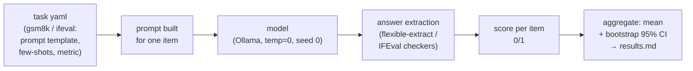

# 11 — Model benchmarks: running GSM8K and IFEval yourself, and learning why the numbers move

## What you will learn

- What **GSM8K** (Cobbe et al. 2021, arXiv:2110.14168) and **IFEval** (Zhou et al. 2023, arXiv:2311.07911) actually measure, with one real item from each.
- How **lm-evaluation-harness** (Gao et al., arXiv:2405.14782) talks to our Ollama server, and the exact command we run.
- The **score table with CIs** for `qwen3.8:27b`, `gemma4:latest` and a **110M-parameter model** — and why the tiny model scores ≈ 0.
- **Error bars**: with 50 items the margin is ±0.13, so (per Miller 2024, arXiv:2411.00640) what we can and cannot conclude from a benchmark number.
- **Prompt sensitivity**: 0-shot vs 5-shot vs CoT vs a plain prompt on the *same* 50 questions, the 29 flipping items, one worked example — and the lesson that a leaderboard number is a **(model, template, extractor, n)** tuple, not a property of the model.
- What the harness prints about uncertainty (`stderr`) vs our bootstrap CI.
- **Contamination** (GSM1k, Zhang et al. 2024, arXiv:2405.00332) and **saturation** (arXiv:2602.16763), with the reported numbers.
- What the **2026 leaderboards** are and how to read them.
- How this connects to the tutorial's own evals: **benchmarks pick a model; your evals pick a prompt/system**.
- Troubleshooting (thinking tokens, `base_url` path, rate limits), and two exercises.

Chapters 01–10 measured *our system*: triage, RAG, judges, agents. This chapter steps out and measures the *models themselves* on public benchmarks — using the exact same statistics discipline (95 % CIs, paired comparisons) that the rest of the tutorial insists on. Every number below traces to `project/runs/11_findings.md`, `project/runs/results.md`, or the `metrics.json` files under `project/runs/11_*`. Nothing is re-invented.



One item enters; a template, a model, an extractor and a metric all sit *between* the item and the 0/1. That is the whole story of the chapter: **every box in that chain is a place the number can be different**.

---

## The two benchmarks

### GSM8K — grade-school math word problems

GSM8K (Cobbe et al. 2021) is a set of 7,473 word problems at grade-school level. Each item is a question with a multi-step arithmetical solution and a single numeric gold answer. The score is **exact match on the extracted final number**: the model may reason however it likes, but one number out, compared to the gold.

A real item from our run (first row of `project/runs/11_gsm8k_qwen3.8:27b/predictions.jsonl`):

> Janet's ducks lay 16 eggs per day. She eats three for breakfast every morning and bakes muffins for her friends every day with four. She sells the remainder at the farmers' market daily for $2 per fresh duck egg. How much in dollars does she make every day at the farmers' market?

Gold answer: **18** (`(16 − 3 − 4) × 2`). The model's reply does the steps in prose and ends with `#### 18` — the harness's **flexible-extract** filter finds that `18`, it matches the gold, item = 1. Notice what is *not* graded: the quality of the reasoning prose, whether the steps make sense. Only the final number.

### IFEval — instruction following

IFEval (Zhou et al. 2023) tests a different axis: can the model follow **verifiable output instructions** — "use at most 2 paragraphs", "do not use any commas", "highlight 3 sections"? The trick that makes it benchmarkable: every instruction comes with a **deterministic checker** (regex/string checks), so grading needs no human and no judge.

A real item from our run:

> Write a 300+ word summary of the wikipedia page "https://en.wikipedia.org/wiki/Raymond_III,_Count_of_Tripoli". Do not use any commas and highlight at least 3 sections that has titles in markdown format, for example *highlighted section part 1*, …

The instructions decompose into three checks (≥ 300 words; no commas; ≥ 3 `*…*` highlighted sections). IFEval then reports **prompt-level** (all-or-nothing: did *every* instruction pass?) and **instruction-level** (fraction of instructions passing) scores, each in **strict** and **loose** variants (loose normalizes whitespace/punctuation a bit). Our primary metric is `prompt_level_strict_acc` — the same all-or-nothing standard a user experiences.

Note the contrast with GSM8K: IFEval never asks *whether the content is true*, only whether the **format constraints** are obeyed. That difference matters for the score table below.

---

## lm-evaluation-harness and our exact command

**lm-evaluation-harness** (`lm_eval`, EleutherAI; Gao et al., arXiv:2405.14782) is the standard open-source way to run academic benchmarks. A *task* is a YAML file defining the prompt template, few-shot examples, and metric; the harness handles data download, prompt construction, scoring, and per-sample logging. Its paper is, among other things, a report that **small implementation details — prompt formatting, few-shot drawing, the answer-extraction regex — silently swing scores by double digits**. That warning is exactly what we reproduce in §"Prompt sensitivity" below.

We use it with the `local-chat-completions` backend: an OpenAI-chat-compatible client pointed at Ollama's `/v1` endpoint (chapter 00), so no API key and no GPU box other than ours. The full command, as constructed by `harness_run` in `project/src/evals_tutorial/bench.py:131`:

```bash
OPENAI_API_KEY=ollama HF_HOME=project/data/hf_home \
uv run lm_eval \
  --model local-chat-completions \
  --model_args model=qwen3.8:27b,base_url=http://127.0.0.1:11435/v1/chat/completions,num_concurrent=1,max_retries=3,tokenized_requests=False \
  --tasks gsm8k \
  --limit 50 \
  --num_fewshot 5 \
  --seed 0 \
  --apply_chat_template \
  --gen_kwargs temperature=0 \
  --output_path project/runs/11_lmeval/gsm8k \
  --log_samples
```

Worth knowing before running:

- `--model local-chat-completions` is what makes Ollama work; **`base_url` must include `/chat/completions`**, not just `/v1` (troubleshooting below).
- `OPENAI_API_KEY` must be set to *some* string even though it is ignored (`bench.py:149`).
- `--limit 50` caps *questions*, `--seed 0` makes few-shot selection and (with `temperature=0`) decoding reproducible, `--log_samples` writes the per-item `samples_*.jsonl` that our statistics read.
- We use harness **0.4.13** for all numbers in this chapter.

`bench.py` wraps this in subcommands (`bench run / collect / sensitivity / all`); `collect` is where the per-sample file meets our chapter-07 stats module.

---

## The score table — three models, two tasks

All `n=50`, `seed=0`, `temperature=0`. "Our bootstrap 95% CI" is 10 000 resamples of the per-item 0/1s (`evals_tutorial.stats`); "harness stderr" is the harness's own standard error (1 SE, normal approximation) so we can compare the two uncertainty accounts side by side.

| model (params) | task | primary metric | score | our bootstrap 95% CI | harness stderr | total s |
|---|---|---|---|---|---|---|
| **qwen3.8:27b** (27.3B) | gsm8k (5-shot) | exact_match (flexible-extract) | **0.46** | [0.32, 0.60] | 0.0712 | 368.8 |
| qwen3.8:27b | ifeval | prompt_level_strict_acc | **0.82** | [0.72, 0.92] | 0.0549 | 429.1 |
| **gemma4:latest** (8.0B) | gsm8k (5-shot) | exact_match (flexible-extract) | **0.06** | [0.00, 0.14] | 0.0339 | 110.4 |
| gemma4:latest | ifeval | prompt_level_strict_acc | **0.74** | [0.62, 0.86] | 0.0627 | 258.8 |
| **tiny-qwen35-110m-sft** (108.6M) | gsm8k (5-shot) | exact_match (flexible-extract) | **0.00** | [0.00, 0.00] | 0.0 | 23.2 |
| tiny-qwen35-110m-sft | ifeval | prompt_level_strict_acc | **0.14** | [0.06, 0.24] | 0.0496 | 38.6 |

Read it three ways:

1. **The 110M model's ≈ 0 on GSM8K is expected, not a failure.** A model of 108.6M parameters has essentially no multi-step arithmetic; with 50 items and a score of 0 the CI is degenerate `[0.00, 0.00]` — *not* "zero to infinite", just "we saw zero correct". Yet it scores **0.14 on IFEval**: constraints like "answer in one sentence" or "no bullet points" are surface-form rules a small LM can copy from its training without understanding the content. So the tiny model tells us that IFEval-strict credit can be earned by *style*, while GSM8K credit cannot.
2. **gemma4 is the "task drives the number" case.** IFEval **0.74** vs GSM8K **0.06** — the same 8B model is ~12× better at obeying format instructions than at doing the arithmetic. Format-following and reasoning are different axes, and a single leaderboard number hides which axis it covers.
3. **qwen3.8:27b is the only model that clears both** (0.46 / 0.82) — but its GSM8K CI `[0.32, 0.60]` is wide: with n=50, "0.46" really means "somewhere in 0.32–0.60".

---

## Error bars: what 50 items can and cannot tell you

Miller (2024, "Adding Error Bars to Evals", arXiv:2411.00640) studies why so many headline model deltas turn out to be inside the noise, and gives the concrete recipe: report **variance / CIs, not point estimates**, and use paired comparisons when the items are the same.

Applied to this chapter, with `n=50`:

- The standard error of a proportion at p≈0.5 is `√(p(1−p)/n) ≈ 0.07`, so a **95 % CI is about ±0.13–0.14** — exactly the width we see on the main table (`[0.32, 0.60]` for qwen's GSM8K).
- **What we can conclude:** rough ordering when CIs do not overlap (qwen over gemma on GSM8K; all over the 110M on both tasks), and *within-n* claims with CI attached ("qwen solves roughly 32–60 % of these 50").
- **What we cannot conclude:** that 0.46 is "46 %", that a 0.06 gap between overlapping CIs is a real difference, that a near-identical score on two benchmarks means the models are interchangeable (their CIs overlap *differently* per task), or anything about models on questions we did not sample.
- Note the two columns of uncertainty agree in scale (harness stderr ≈ 0.05–0.07; bootstrap half-width ≈ 0.07–0.13): the harness's normal-approx SE is defensible here, and our bootstrap adds the *directional* shape the SE assumes away. The chapter-07 lesson holds: **same items, paired bootstrap, report the interval**.

The honest reading of the table is therefore: qwen is clearly the strongest of the three, the 110M is clearly the weakest, and *between* those, the specific gaps are too uncertain at n=50 to quote as anything but ranges.

---

## Prompt sensitivity: the score is not the model's alone

The harness's own documentation (arXiv:2405.14782) warns that prompt formatting, few-shot choice and the answer-extraction regex can swing benchmark scores by double digits. So we ran the **same 50 GSM8K questions** through `qwen3.8:27b` with four different ways of asking:

| variant | what is different | score | 95% CI |
|---|---|---|---|
| **0shot** | `gsm8k` template, no examples | 0.46 | [0.32, 0.60] |
| **5shot** | `gsm8k` template + 5 few-shot examples (default) | 0.46 | [0.32, 0.60] |
| **cot** | the harness `gsm8k_cot` task (different template, CoT few-shots baked in) | 0.52 | [0.38, 0.66] |
| **plain** | our own one-shot prompt (`prompts/gsm8k_plain_v1.txt`) + a lenient "last plausible number" regex (`gsm8k_extract`, `bench.py:84`) | **0.96** | [0.90, 1.00] |

Plain's 0.96 is not because the model suddenly got better — it is the combination of a prompt the model finds natural *and* an extractor that accepts `"The answer is 18."` the way humans do. The harness's flexible-extract is stricter than human grading but the template still costs the model ~0.50 on *these* items.

### How many items flip?

A **flipping item** is a question whose 0/1 verdict changes between two variants. Counts (from `11_gsm8k_prompt_sensitivity/predictions.jsonl`):

| pair | flips (of 50) |
|---|---|
| 0shot vs 5shot | 4 |
| 0shot vs CoT | 9 |
| 0shot vs plain | **25** |
| 5shot vs CoT | 9 |
| 5shot vs plain | **25** |
| CoT vs plain | 22 |

**29 of 50 questions** change verdict for at least one variant. The paired differences versus plain are all significant (bootstrap **p = 0.001**, CI `[−0.64, −0.36]` for both 0-shot and 5-shot; `[−0.56, −0.30]` for CoT) — this is not noise, it is the template.

### One worked example: the Josh question

> Josh decides to try flipping a house. He buys a house for $80,000 and then puts in $50,000 in repairs. This increased the value of the house by 150%. How much profit did he make? (gold: **70000**)

| variant | extracted answer | correct? |
|---|---|---|
| 0shot | 80000 | ✗ (echoes the purchase price) |
| 5shot | *nothing parseable* (extraction returned `None`) | not scored |
| cot | 800 | ✗ (arithmetic slip) |
| plain | **70000** | ✓ |

One item, one model, one ground truth — and four different verdicts. That is the mechanism: **the template and the extractor do not just add noise, they select which of the model's many answerable paths gets scored.**

### The lesson

A leaderboard number is a tuple **(model, template, few-shot count, extractor, n)** — all five must be reported together with the score. Compare two benchmark numbers and you have compared five unknowns; the chapter-03 "look at your data" habit applies here too: open the per-item `predictions.jsonl`, find the flips, and ask *why each one flipped*.

---

## Harness stderr vs our bootstrap

Two uncertainty numbers sit next to each other in the metrics files (`bench.py:277-309`):

- **harness stderr**: the harness reports `metric_stderr` per task using the normal approximation for a proportion (`p(1−p)/n`-style). Cheap, standard, but assumes items are independent Bernoulli and says nothing about *which direction* the error runs.
- **our bootstrap 95% CI**: resample the 50 per-item 0/1s 10 000 times and take the 2.5/97.5 percentiles. Robust to the actual mixture of easy/hard items and gives us the same intervals the rest of the tutorial reports.

They agree in width on every row of the main table (stderr 0.03–0.07; bootstrap half-width 0.06–0.13) — a nice sanity check that our per-item pipeline and the harness's own scoring agree on *how uncertain* the result is, not just on the point estimate.

---

## Contamination and saturation: why old benchmarks lie to you

**Contamination** — the benchmark was in the training data. The cleanest local example is **GSM1k** (Zhang et al. 2024, arXiv:2405.00332): a held-out, matched-difficulty set of GSM8K-style problems. Several model families (Phi, Mistral, some Llama releases) **lose up to 8 points** on GSM1k versus GSM8K — direct evidence of benchmark-specific overfitting — while Gemini/GPT/Claude show little drop. Contamination is not uniform: some models memorized the set, others didn't. The practical question to always ask is *"could this model have seen this exact benchmark?"* — and the answer for any 2021–2023 dataset is probably *yes, partially*.

**Saturation** — the benchmark has become too easy to separate models. A 2026 systematic study (arXiv:2602.16763, "When AI Benchmarks Plateau") analyzed 60 widely used benchmarks and found **~48 %** show high or very-high saturation, and that **older benchmarks saturate faster: 54.5 % of benchmarks > 60 months old are saturated vs 42.9 % of benchmarks < 24 months old**. SWE-bench Verified, the human-reviewed 500-task coding benchmark that OpenAI and the labs treated as "the" coding number through 2025, was declared by OpenAI itself in 2026 to **no longer discriminate frontier models** — a textbook saturation lifecycle played out in public. MMLU is effectively retired for the same reason (arXiv:2406.01574 documents the successor MMLU-Pro being built because MMLU crossed ~90 % for frontier models).

Our own numbers fit the pattern: with local 7–27B models, the three models (qwen / gemma4 / 110M) score **0.46 / 0.06 / 0.00 on GSM8K** and **0.82 / 0.74 / 0.14 on IFEval** — the benchmarks still **separate these** models well. The saturation story is about the *top* of the leaderboard; the contamination story is about the *middle*. Both say the same operational thing: **quote the benchmark date, the version, and the sample size, and prefer a fresher set when comparing similar models.**

### What the 2026 leaderboards are, and how to read them

From the research notes (`research/SOURCES_papers.md`):

- The **2026 frontier set** labs report is now **HLE** ("Humanity's Last Exam", expert-vetted closed-ended questions, arXiv:2501.14249), **FrontierMath**, **ARC-AGI-2**, **GPQA Diamond**, **SWE-bench Verified** (human-curated 500-task coding, now saturated per §above), **Aider Polyglot**, **AIME 2025**, **τ/τ²-bench** (agentic tool-calling), **BFCL**, **MMMU-Pro**, **RULER**, and **LiveBench/LiveCodeBench** (continuously-refreshed to fight contamination). MMLU and GSM8K are on this list the way MMLU was on *our* list in 2022: historical reference, not a discrimination tool.
- **Chatbot Arena / "Arena"** (rebranded Jan 2026; Chiang et al., arXiv:2403.04132) is a different *kind* of leaderboard: crowd-sourced pairwise votes converted to a **Bradley–Terry / Elo** rating (the same model we met in chapter 06). Reading it well means knowing that (a) it measures *preference*, not correctness, (b) it carries its own biases (verbosity, position — chapter 06), and (c) **as of 2026 the top models cluster within ~20 Elo points**, i.e. the differences are often not statistically meaningful. Treat top-of-Arena rankings as a tie until the CI says otherwise.
- **Judge reliability is still open in 2026.** Swapping the judge model changes which system "wins" (arXiv:2607.08535), a large-scale audit found weak domain-specific calibration with no agreed meta-evaluation standard (arXiv:2606.19544), and judge-confidence calibration (e.g. a linear probe, arXiv:2512.22245) is emerging but not standard. This is a direct warning for any chapter-05-style judge you might use *on* a benchmark: judge identity belongs in the metadata alongside model and template.
- **Agent benchmarks decay fastest.** SWE-bench Verified's story (§above) is the canonical case; Terminal-Bench, SWE-bench-CL and the like are the current candidates, none yet as canonical. If you are benchmarking *agents* (chapter 10), the benchmark is as important as the model, and it changes.

### How this relates to this tutorial's own evals

The tutorial's chapters 01–10 measured a *system* (prompt + model + tools + retrieval) on *our tickets*. Benchmarks do the reverse: fix the prompt and the metric, vary the model. The two are **complements, not replacements**:

- **Benchmarks (this chapter)** tell you which model to put under the hood — a 27B vs an 8B on GSM8K/IFEval is a model question, decided by numbers on a *public, fixed* prompt.
- **Your evals (chapters 01–10)** tell you which *prompt / system* to ship, on *your* data with *your* graders — where "plain vs harness-template" matters more than "27B vs 8B", because your users are on your templates, not the leaderboard's.

In practice the workflow is: run chapter 11 to **shortlist models with CIs**; run chapters 01–10 to **choose the prompt/system for the chosen model**. Never skip either — the model that tops GSM8K can still fail your triage task, and the prompt that nails your tickets can be one that a different model handles worse. The 110M row in our score table is the boundary case of this: on a *model-selection* benchmark it is useless; on a *prompt-tuning* benchmark (chapter 07) it might still be a fine canary for CI plumbing. Match the eval to the decision it serves.

---

## What landed in the results table

From `project/runs/results.md` (rows `11_gsm8k_*` and `11_ifeval_*`):

| experiment | n | primary | 95% CI | notes |
|---|---|---|---|---|
| 11_gsm8k_qwen3.8:27b | 50 | 0.46 | [0.32, 0.60] | gsm8k 5-shot via lm-eval |
| 11_gsm8k_gemma4:latest | 50 | 0.06 | [0.00, 0.14] | gsm8k on gemma4 |
| 11_gsm8k_tiny-qwen35-110m-sft:latest | 50 | 0.00 | [0.00, 0.00] | gsm8k on 110M |
| 11_gsm8k_0shot_qwen3.8:27b | 50 | 0.46 | [0.32, 0.60] | sensitivity member |
| 11_gsm8k_5shot_qwen3.8:27b | 50 | 0.46 | [0.32, 0.60] | sensitivity member (reuses main run) |
| 11_gsm8k_cot_qwen3.8:27b | 50 | 0.52 | [0.38, 0.66] | sensitivity member |
| 11_gsm8k_plain_qwen3.8:27b | 50 | 0.96 | [0.90, 1.00] | sensitivity member (our prompt) |
| 11_gsm8k_prompt_sensitivity | 50 | score_range 0.50 | — | summary row; flip counts in details |
| 11_ifeval_qwen3.8:27b | 50 | 0.82 | [0.72, 0.92] | ifeval on qwen |
| 11_ifeval_gemma4:latest | 50 | 0.74 | [0.62, 0.86] | ifeval on gemma4 |
| 11_ifeval_tiny-qwen35-110m-sft:latest | 50 | 0.14 | [0.06, 0.24] | ifeval on 110M |

Plus the per-item `predictions.jsonl` in each directory — that is where the Josh-flip example, the IFEval Raymond-III example, and every extraction failure live.

---

## Advantages and disadvantages of lm-evaluation-harness

**Advantages**

- **One command for a real benchmark.** The task YAML carries the prompt template, few-shot examples, extraction filter and metric — no hand-built pipeline, no re-invented grader.
- **Reproducible plumbing.** `--seed`, `--limit`, `--gen_kwargs` and `--log_samples` give you the per-item file we need for bootstrap CIs; version is stamped into the results JSON.
- **Any OpenAI-compatible server works**, including Ollama, via `local-chat-completions` — no paid API, no GPU cluster.
- **Standard vocabulary.** `exact_match`, `prompt_level_strict_acc`, etc. are the same names the leaderboard numbers use, so a local run is directly comparable to a paper's table.
- **Task catalogue.** GSM8K, IFEval, MMLU(-Pro), ARC, HumanEval and many more ship with the harness — adding a benchmark is a `--tasks` change.

**Disadvantages**

- **The template/extractor choice is invisible by default.** As §"Prompt sensitivity" shows, `gsm8k` (5-shot, strict flexible-extract) scores 0.46 while a plain prompt + lenient regex scores 0.96 on the *same 50 items and same model*. If you do not report the full (template, few-shot, extractor) tuple, you cannot reproduce or compare the number.
- **Its stderr is a normal-approximation SE**, not a bootstrap CI; for small n or non-bernoulli per-item scores it under-describes the uncertainty. We compute the bootstrap separately.
- **Heavy for a single question.** The harness is built around "run the whole task"; exploring one prompt variant means a fresh run and a fresh output directory.
- **Ollama-specific friction**: `base_url` must end in `/chat/completions`, `OPENAI_API_KEY=dummy` must be set, and reasoning models that emit `<thinking>` blocks can break the extractor (see below).
- **The harness is a fixed choice of defaults.** It makes the template *explicit* in the YAML — but it is still *a* template. The paper's own warning, quoted in the research notes, is that "small implementation details (prompt formatting, few-shot sampling, answer extraction) silently swing scores by double digits" — the harness does not remove that degree of freedom, it just names it.

---

## Troubleshooting

| Symptom | Likely cause | Fix |
|---|---|---|
| Harness hangs / 401 errors against Ollama | `OPENAI_API_KEY` missing | Set `OPENAI_API_KEY=ollama` (or any string) before `lm_eval` |
| Extractor returns `None` for correct-looking answers | reasoning model emitted `<thinking>`/scratch-math blocks before the final `#### N`; the regex picks up the scratch work's last number instead of the gold line | Use a template that forces a final `#### N` line (the harness `gsm8k`/`gsm8k_cot` both do), or swap to a non-reasoning model for benchmark runs; a lenient extractor like `gsm8k_extract` (`bench.py:84`) is a workaround but not a fix |
| `connect timeout` / 429 from Ollama mid-run | concurrent requests or a busy GPU box | `num_concurrent=1` (we set it), `max_retries=3` (set), or move the run to a quieter window |
| `base_url` 404 or "model not found" on the first call | `base_url` set to `/v1` instead of `/v1/chat/completions` | Append `/chat/completions` — the harness does not do the path join for you |
| `results*.json` not found under `--output_path` | the harness appends its own sanitized-model subdirectory (`qwen3.8:27b` → `qwen3.8__27b`) | Use `find_harness_output` (`bench.py:160`) or glob one level deeper |
| Per-item CI is wider than expected at low scores | n=50 is small; a 0.06 score has CI `[0.00, 0.14]` | Increase `--limit` (the 200-item exercise below), or report the CI as-is and stop quoting the point estimate as precise |

---

## Exercises

1. **Run gsm8k with `--limit 200` overnight** on `qwen3.8:27b` (you will need ~200 Ollama calls; the `data/cache` from chapter 00 does *not* cover harness calls, so this is a real run). Re-run `bench collect` and compare the 95 % CI width to the n=50 row: expect it to shrink by roughly `√(50/200) ≈ 0.5×` (i.e. from ±0.13 to about ±0.06–0.08). Report which model-ordering conclusions from §"The score table" survive and which flip.
2. **Add a fourth prompt-variant template** to the sensitivity study — for example a 5-shot template that instructs the model to answer in exactly 25 words, or a "show your work then put the final answer in a code fence" template. Run the `sensitivity` pair on the same 50 items against the plain variant, re-compute the paired bootstrap, and add the row + flip-count to the table in this chapter. Then write two sentences about whether the new template's score is closer to the harness's `gsm8k` number or to `plain`'s, and what that implies about which degree of freedom (template? extractor?) dominates the 0.46 vs 0.96 gap.

---

Next: [12 — Inspect AI: turning chapters 05 and 11 into a proper eval framework](12_inspect_ai.md) — building the *same* Northwind helpdesk eval as an Inspect AI `Task` (dataset → solver → scorer), running GSM8K through Inspect and reconciling the numbers with this chapter's harness run, and asking when a framework beats a hand-rolled harness.
