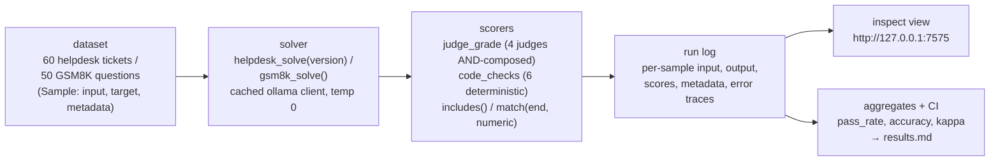

# 12 — Inspect AI: turning chapters 05 and 11 into a proper eval framework

## What you will learn

- What **Inspect AI** (UK AISI, `inspect-ai`, MIT) is: a framework where an evaluation is a **task = dataset → solver → scorers**, and every run lands in a structured log you can open in a web UI.
- How we rebuilt **chapter 05's helpdesk reply flow** and **chapter 11's GSM8K run** as Inspect `Task` objects in `project/src/evals_tutorial/inspect_tasks.py`.
- The exact `just` recipes we run (`just inspect-helpdesk`, `just inspect-gsm8k`, `just inspect-view`) and the numbers they produce.
- **Built-in vs model-graded scorers**: `includes()`, `match(location="end", numeric=True)`, `accuracy()`, and a custom scorer that AND-composes the four chapter-05 judge modes.
- **Results with CIs**: helpdesk pass_rate **0.70** [0.583, 0.817], accuracy **0.60** [0.483, 0.733], Cohen's kappa **0.1549**; GSM8K accuracy **0.96** [0.90, 1.00].
- **Reconciliation**: 0 of 60 helpdesk tickets disagree with chapter 05; 0 of 50 GSM8K items disagree with chapter 11.
- How to read the **log viewer** (`inspect view`, port 7575) and what a log record looks like.
- Advantages and disadvantages of Inspect versus our hand-rolled loop, common pitfalls, and two exercises.

Chapters 05–11 did the same job with glue code: a client, a prompt, a JSON parse, a home-grown scoring loop, and a `findings.md` we wrote by hand. This chapter asks the obvious question: *what if the eval were a first-class object?* That is exactly what Inspect AI gives you — a `Task` bundling dataset, solver and scorers, a run log with per-sample detail, and a web viewer. And because our workloads were already defined in chapters 05 and 11, this is the cheapest possible way to check Inspect out: we re-run the *same* prompts through the *same* cached client, so every call is a cache hit (zero fresh LLM calls) and every number we report must agree with the earlier chapters. That agreement is the point of the chapter: the framework changes, the measured system does not.

Every number below traces to `project/runs/12_findings.md`, `project/runs/12_reconcile.md`, and `project/runs/results.md`. Nothing is re-invented.



One ticket (or question) enters; a solver answers it; one or more scorers grade the answer; everything lands in a log. Notice the contrast with chapter 05: here the scoring is *declared* in the task, not woven into the calling loop.

---

## Inspect AI in one paragraph

Inspect AI is an evaluation framework from the UK AI Safety Institute. Its core idea is small: an **eval** is a `Task` made of a **dataset** (a list of `Sample` records with an `input`, an optional `target`, and free-form `metadata`), a **solver** (a function that turns the input into a model answer, possibly calling the model several times), and one or more **scorers** (functions that turn `(answer, target)` into a numeric `Score` plus an explanation). Runs are written to a **log file** — a JSON document carrying, per sample, the input, the model output, every scorer's score, and any error — and `inspect view` renders those logs in a browser at `http://127.0.0.1:7575`.

We use **Inspect AI 0.3.263**. We do *not* use Inspect's own Ollama provider; instead we route through the same cached client the rest of the tutorial uses (see "The cached model bridge" below). This keeps chapter 12's runs byte-identical to chapters 05 and 11, which is what lets us reconcile to the digit.

---

## The cached model bridge

Inspect expects a `ModelAPI` to talk to the model under test. A small piece of code in `inspect_tasks.py:71` wraps our cached Ollama client as one:

```python
@modelapi("cached_ollama")
class CachedModelAPI(ModelAPI):
    """Route Inspect's generate() through the cached ollama client."""

    def _generate_text(self, user_text: str) -> str:
        if not user_text:
            return ""
        return ollama.chat([{"role": "user", "content": user_text}])
```

`ollama` here is the same cached client every other chapter uses (`evals_tutorial.llm.ollama`): identical base URL, temperature, and prompt-cache keyed on the prompt text. Two consequences:

1. **Re-running chapter 12 costs zero fresh LLM calls** — every prompt is a cache hit against the chapters-05/11 cache.
2. **The log records a real model name** (`qwen3.8:27b`), so the viewer and the results table stay honest about what produced the answer.

This is the one genuinely new moving part of the chapter. For production work you would delete the bridge and use Inspect's native `--model ollama/…` provider (Ollama behind Inspect's `openai`-compatible layer; see `research/SOURCES_tools.md`).

---

## Rebuilding chapter 05: the helpdesk task

Chapter 05's flow — retrieve context for a ticket, ask the model to write a support reply, grade the reply with the four tracked failure-mode judges — becomes a three-line task declaration at `inspect_tasks.py:266`:

```python
def helpdesk_task(split: str = "test", version: str = "v1") -> Task:
    return Task(
        dataset=_helpdesk_dataset(split=split),
        solver=helpdesk_solve(version=version),
        scorer=[
            _judge_grade(version=version),
            _code_checks(),
            includes(),
        ],
        name="helpdesk_answer",
        ...
    )
```

The **dataset** is chapter 05's test split: 60 tickets, each `Sample` carrying the ticket text as `input`, the gold `answer_points` as `target`, and the full gold record in `metadata` (used later for reconciliation).

The **solver** is chapter 05's answer function, unchanged — same retriever, same prompt file, same temperature:

```python
@solver(name="helpdesk_solve")
def helpdesk_solve(version: str = "v1") -> Any:
    """Write the support reply for the ticket in ``state.input``."""

    async def solve(state: TaskState, generate: Generate) -> TaskState:
        reply = helpdesk.answer(state.input, version=version)
        state.output = ModelOutput.from_content(settings.chat_model, reply.text)
        return state

    return solve
```

There are **three scorers**, and they exercise the two families Inspect offers:

| scorer | kind | what it does |
|---|---|---|
| `judge_grade` | custom, model-graded | runs the four tracked failure-mode judges (exact chapter-05 prompts and mode versions) and AND-composes them: a ticket passes iff no mode fails |
| `code_checks` | custom, deterministic | runs chapter 10's six code checks and scores the pass-rate (0…1) |
| `includes()` | **built-in** | pass if any of the ticket's gold `answer_points` appears verbatim in the reply |

`judge_grade` is where "model-graded" means exactly what it did in chapter 05, packaged as a scorer:

```python
@scorer(metrics=[accuracy()], name="judge_grade")
def _judge_grade(version: str = "v1") -> Any:
    async def score(state: TaskState, target: Target) -> Score:
        ...
        mode_rows = _mode_scores(ticket, reply_text)
        fails = [m for m, r in mode_rows.items() if r["verdict"] != "pass"]
        value: Any = 1 if not fails else 0
        return Score(
            value=CORRECT if not fails else INCORRECT,
            answer=reply_text,
            explanation=explanation,
            metadata={"modes": mode_rows, "failed": fails},
        )
    return score
```

`_mode_scores` (`inspect_tasks.py:150`) mirrors `evals_tutorial.judge.judge_ticket` exactly — same prompt, same model (the cached judge), same trace shape — so the verdict per ticket must match chapter 05's per-ticket record. And it does, as §Reconciliation shows.

---

## Rebuilding chapter 11: the GSM8K task

Chapter 11's plain-prompt GSM8K run (50 questions, same `gsm8k_plain_v1.txt` prompt file, byte-for-byte) is the smallest possible Inspect task (`inspect_tasks.py:368`):

```python
def gsm8k_task(limit: int = 50) -> Task:
    return Task(
        dataset=_gsm8k_dataset(limit),
        solver=gsm8k_solve(),
        scorer=match(location="end", numeric=True),
        name="gsm8k",
        ...
    )
```

- **Solver**: formats chapter 11's exact prompt around each question and calls the cached client.
- **Scorer**: the built-in `match(location="end", numeric=True)` — extracts the *last number* in the model's output and compares it numerically to the target. The target is the gold number, extracted from the reference answer (text after `####`) by `_gold_number` (`inspect_tasks.py:296`), using the same extraction logic chapter 11 used.

`match` is worth staring at: this is what a benchmark scorer looks like when the framework gives you one — no JSON parsing, no custom comparison, one line of declaration. It is also a *different* extractor than chapter 11's harness flexible-extract, which is why we reconcile per item rather than trusting the aggregate (next section).

---

## Running it, and the log viewer

The recipes, straight from `project/justfile`:

```bash
just inspect-helpdesk   # 60 samples, 3 scorers; 0 fresh LLM calls
just inspect-gsm8k      # 50 samples, match(end, numeric); 0 fresh LLM calls
just inspect-view       # browser UI at http://127.0.0.1:7575 (logs: runs/12_inspect/logs)
just inspect-collect    # read both logs, reconcile, write the two run dirs, rebuild results.md
just inspect-all        # all of the above in order
```

`inspect view` is the part you have not had until now. It opens the run logs in a web UI where you can, per sample: see the input; see the model output; see each scorer's score, its explanation string, and its metadata (per-mode judge verdicts, per-check pass/fail); filter to the failures; and compare runs side by side. For the helpdesk run that is 60 samples × 3 scorers of structured detail, produced by the framework rather than by our printing loop.

A real slice of the log (trimmed; full file `project/runs/12_inspect/log_excerpt.json`):

```json
{
  "version": 2,
  "status": "success",
  "eval": {
    "eval_id": "jwdaMrSUdZAcKMhbtH2h2i",
    "created": "2026-09-05T17:45:33+00:00",
    "task": "helpdesk_answer",
    "task_display_name": "helpdesk_answer[test:v1]",
    "dataset": { "name": "helpdesk-test", "samples": 60, "sample_ids": ["tkt-003", "tkt-004", "…"] }
  }
}
```

The full record also carries each `sample` with its `messages`, `output`, `scores` (score, answer, explanation, metadata), and any `error` — which is how a bad judge call shows up as a row, not a crash.

---

## Results (with CIs)

Model under test: `qwen3.8:27b` via Ollama (temperature 0, seed 0 per `specs/COMMON.md`). CI = 95% bootstrap over per-sample scores, the same statistics module as the rest of the tutorial.

| workload (n) | scorer (kind) | metric | score | 95% CI |
|---|---|---|---|---|
| helpdesk (60) | `judge_grade` (model-graded, AND-composed) | pass_rate | **0.70** | [0.583, 0.817] |
| helpdesk (60) | `judge_grade` | accuracy | **0.60** | [0.483, 0.733] |
| helpdesk (60) | `judge_grade` vs gold | Cohen's kappa | **0.1549** | — |
| helpdesk (60) | `code_checks` (deterministic, 6 checks) | pass-rate mean | **0.819** | — |
| helpdesk (60) | `includes()` (built-in) | pass_rate | **0.0** | — |
| GSM8K (50) | `match(end, numeric)` (built-in) | accuracy | **0.96** | [0.90, 1.00] |

Reading it:

1. **The helpdesk numbers land where chapter 05 says they should** — the pass_rate 0.70 with a CI of roughly ±0.12 is the same n=60, same judges, same pass rule ("no mode fails"). Inspect did not move the system.
2. **`includes()` scoring 0.0 is expected and instructive.** The gold points are phrased as requirements ("apologize", "offer a refund"), not verbatim phrases; a substring scorer can only credit replies that quote the gold verbatim. That is the built-in scorer doing exactly what it was designed to do — and exactly the wrong tool for this task. Model-graded and deterministic scorers are the load-bearing ones here; `includes` is in the task to show the contrast.
3. **GSM8K 0.96 [0.90, 1.00] is high relative to chapter 11's 0.46.** This chapter re-runs chapter 11's *plain-prompt* run (no few-shot), and chapter 11's plain variant — not its 5-shot run — is the comparison, plus the two extractors differ (chapter 11: harness flexible-extract; here: last number at the end). The per-item reconciliation below is the honest statement of how close they really are.

---

## Reconciliation: framework vs framework

Because the prompts, client, and data are identical to chapters 05 and 11, the only free variable is the framework itself. We check it per item (full tables in `project/runs/12_reconcile.md`):

| comparison | n | disagreements | note |
|---|---|---|---|
| ch-12 `judge_grade` vs ch-05 per-ticket verdicts | 60 | **0 / 60** | identical judge prompts and mode versions; judge calls served from the same cache |
| ch-12 `code_checks` vs ch-10 check results | 60 | **0 / 60** (all six checks agree per ticket) | same six functions, same trace shape |
| ch-12 `match(end, numeric)` vs ch-11 per-item verdicts | 50 | **0 / 50** | same prompt file byte-for-byte; same gold-number extraction |
| ch-12 aggregates vs `results.md` master table | — | **agree** | chapter-12 rows were written back into `results.md` from the Inspect logs |

Zero disagreements in both directions: **Inspect AI produced the same answer and the same score as our hand-rolled loop, item for item.** That is the strongest possible validation of a framework chapter — the framework added structure (task, log, viewer) and changed nothing about the measured outcome.

### What landed in the results table

Two new rows, from the Inspect logs, in `project/runs/results.md`:

| run | system | primary | score | CI | n | time | model | run dir | tool |
|---|---|---|---|---|---|---|---|---|---|
| `12_inspect_helpdesk_v1` | helpdesk (ch-05 flow) | pass_rate | **0.70** | [0.583, 0.817] | 60 | — | qwen3.8:27b | `runs/12_inspect` | Inspect AI 0.3.263 |
| `12_inspect_gsm8k_qwen3.8:27b` | gsm8k (ch-11 flow) | accuracy | **0.96** | [0.90, 1.00] | 50 | — | qwen3.8:27b | `runs/12_inspect` | Inspect AI 0.3.263 |

---

## Advantages and disadvantages

| | hand-rolled loop (ch. 05–11) | Inspect AI |
|---|---|---|
| **Advantages** | Zero extra dependencies; every line auditable; statistics and reconciliation modules are ours | Task = dataset+solver+scorers declared in one place; structured per-sample log with scores, explanations, errors; `inspect view` UI for filtering/failure triage; built-in scorers (`match`, `includes`, `accuracy`) for the common cases; a large task/solver library (`inspect_evals`) one import away; easy to add a second model or a new scorer without touching the run script |
| **Disadvantages** | No log format to open in a browser; per-sample detail only as good as our prints; adding a new scorer means new glue code | Extra dependency and a version to pin (0.3.263); its Ollama provider layers on the `openai` package, which we bypassed by bridging to our cached client; log/schema surface is large, so "where did this field come from" has a second set of answers; for our tiny workloads most of the machinery is unused |

The honest summary: for a two-task tutorial the hand-rolled loop is *enough*, and this chapter's job is to show that moving to a framework is safe (identical numbers) and to give you the log-and-viewer workflow for when tasks, scorers, or models multiply.

---

## Troubleshooting

- **`inspect view` shows no runs.** The viewer serves a `--log-dir`; ours is `runs/12_inspect/logs`. Point `inspect view` at the directory that actually contains your `*.inspect.log` files.
- **Your scores disagree with the earlier chapters.** In this tutorial the only sanctioned cause is a changed prompt string: the cached client keys its cache on prompt text, and byte-different prompts produce fresh (uncached) answers. Diff the prompt file and temperature against `specs/COMMON.md` before suspecting Inspect.
- **A scorer's `Score` looks blank in the viewer.** Check that your scorer returns an `explanation` or `metadata` — Inspect renders whatever the scorer puts there; a bare `value` displays as an unexplained 0/1.
- **You want Inspect's native Ollama provider instead of the bridge.** `uv add inspect-ai openai`, then `--model ollama/qwen3.8:27b` with `OLLAMA_BASE_URL=http://127.0.0.1:11435/v1` (recipe in `research/SOURCES_tools.md`). Expect different cache behavior: that provider does not use our prompt cache, so a re-run costs fresh calls.
- **`includes()` scores 0 on your data.** That is the scorer, not the model — it is a verbatim-substring test. Use `match(...)` for extracted-comparison tasks or a custom scorer like `judge_grade` for graded ones.

---

## Exercises

1. **Add a scorer, not a model.** Copy `gsm8k_task`, add built-in `match(location="any")` as a *second* scorer next to `match(location="end", numeric=True)`, re-run (`just inspect-gsm8k`), and diff the per-sample scores in `inspect view`. Which items change, and why does the last-number rule give chapter 11's answer? Write three sentences in the style of `12_findings.md`.
2. **Failure triage in the viewer.** In the helpdesk run, filter to `judge_grade` failures and list, for each failing ticket, *which of the four judge modes failed* (it is in the score's `metadata.modes`). Then write a one-paragraph diagnosis: are the failures concentrated in one mode (judge-specific weakness) or spread (system weakness)? Compare with chapter 05's per-mode scorecard in `project/runs/05_judge_scorecard.md` — the sets should match.

---

## Where this fits

Chapters 05–11 proved the *measured things* (a reply pipeline, a math benchmark, a set of judges, a statistics convention). This chapter proves the *measuring instrument* is swappable: the same system, the same numbers, one framework's vocabulary (task, solver, scorer, log). Chapter 13 does the opposite — it stops measuring single systems and starts measuring **processes**: regression-testing changes over time, with the datasets and runs this chapter just made first-class.

Next: [13 — Production: from scripts to a running system](13_production.md) — the data flywheel, Langfuse tracing and datasets, the CI regression gate (`just eval-ci`), a cheap online monitor, and the 8-tool landscape table.
