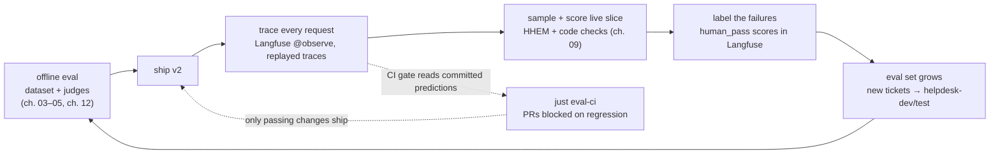

# 13 — Production: from scripts to a running system

## What you will learn

- The **data flywheel** loop — offline eval → ship → trace → sample → label → the eval set grows — as Haney (Hamel) Husain describes it, and where each of this chapter's pieces plugs in (Hamel Husain, "Your AI Product Needs Evals", 2024).
- **Langfuse self-hosted**: the compose stack (6 services, profile `langfuse`, the single published port `3030 → 3000`), the bootstrap keys, and first start.
- **Tracing our app**: the `@observe` guard in `tracing.py` (a no-op when no keys are set), and what one trace of a helpdesk answer contains.
- **Datasets and experiment runs** in Langfuse: `helpdesk-test` (60) and `helpdesk-dev` (20), the two experiment runs `answer_v1` and `answer_v2`, and the three score families attached (judge, code checks, human labels).
- The **CI regression gate**: the rule in words, why it inspects the *upper bound of the confidence interval* (CI) rather than the point estimate (chapter 07), the actual summary output, and the GitHub Actions workflow.
- **Online monitoring** on a sampled slice of traced traffic, using a cheap CPU-only detector (HHEM) plus one code check, with a rolling table, a sparkline plot and one alert rule.
- **A/B tests** (Hamel's "level 3") in one section: what to randomise, how long to run, and how chapter 07's power table sets the duration.
- The **landscape table** of 8 eval/observability tools, with advantages and disadvantages for each (from the committed landscape note only).
- Troubleshooting (ClickHouse memory, bootstrap keys, SDK v2 vs v3, port 3030), and two exercises.

Chapters 00–12 produced *measurements*: scores, CIs, judges, a framework log. This chapter assembles the *pipeline that keeps producing them* once the system is live. Nothing here invents new numbers — every figure traces to `project/runs/13_findings.md`, `project/runs/13_landscape.md`, `project/runs/13_monitor/rolling.md`, and `project/runs/results.md`. The CI gate and the monitor were built deliberately to run with **zero LLM calls** and **no running server**, reading the committed `runs/**/predictions.jsonl` files; Langfuse is where the live pieces (traces, datasets, experiment runs, human scores) live.



The loop is the point: evaluation output (traces and human scores) feeds back into the dataset, so `helpdesk-test` keeps getting harder exactly where the model gets worse. That is the "data flywheel" of (Hamel Husain, "Your AI Product Needs Evals", 2024): "Evaluation systems create a flywheel that allows you to iterate very quickly."

---

## Langfuse, self-hosted

We chose Langfuse after comparing eight tools (see the landscape section below): the only one that is fully MIT, fully self-hostable, **and** covers all five of chapter 13's needs — tracing, datasets, experiments with scores, live score attachment, and a judge-against-Ollama story. The stack lives in `project/docker-compose.yml`, behind compose profile `langfuse`:

| service | role | host port |
|---|---|---|
| `evals-langfuse-web` | the web UI + API | **3030 → 3000** (the only published port) |
| `evals-langfuse-worker` | background job processing | — (internal network only) |
| `evals-langfuse-postgres` | metadata (users, datasets, items) | — |
| `evals-langfuse-clickhouse` | traces / observations / scores | — |
| `evals-langfuse-redis` | queue / cache | — |
| `evals-langfuse-minio` | S3-backed blob storage (mandatory in Langfuse v4) | — |

A trimmed excerpt of the compose file (the full file is committed at `project/docker-compose.yml`):

```yaml
services:
  evals-langfuse-web:
    image: docker.langfuse.com/langfuse/langfuse:4
    profiles: ["langfuse"]
    # Only published port of the whole stack: UI 3030 -> 3000 (index.md).
    ports:
      - "3030:3000"
    environment:
      <<: *evals-langfuse-env
      NEXTAUTH_SECRET: evals-langfuse-nextauth-local-dev-only
    depends_on:
      - evals-langfuse-worker
      - evals-langfuse-postgres
      - evals-langfuse-clickhouse
      - evals-langfuse-redis
      - evals-langfuse-minio
# ... worker, postgres, clickhouse, redis, minio — all with the
# same shared env (SALT, TELEMETRY disabled) and profiles: ["langfuse"].
# All six volumes are named evals-langfuse-* so no other stack collides.
```

Two deliberate choices: **only the UI exposes a host port** (the five storage/data services are reachable on the internal network only), and **all volumes are `evals-langfuse-*`** so a second project or tutorial cannot clobber them. The image `docker.langfuse.com/langfuse/langfuse:4` resolved to build **4.30.0** at first start (health: `{"status":"OK","version":"4.30.0"}`). First start needs the `LANGFUSE_INIT_*` bootstrap variables (org, project, user, public key, secret key), which `evals-langfuse-web` consumes exactly once. Then:

```bash
just langfuse-up      # docker compose --profile langfuse up -d
just langfuse-down    # tear it down; no containers left behind (verified in the findings)
```

The public/secret keys go into `project/.env` (documented in `.env.template`). Every command in the `prod` CLI that talks to the stack checks for them first (`require_live()` in `prod.py`), so the package stays fully importable — and the whole offline test suite stays runnable — when the stack is down.

---

## Tracing our app: `@observe` with a kill switch

The helpdesk answer function is the unit we trace. `helpdesk.py:190`:

```python
@observe
def answer(ticket_text: str, version: str = "v1", client=None) -> Reply:
    """chapter-05 reply; every call becomes a Langfuse span when configured."""
```

The `@observe` here is *not* Langfuse's directly — it is our guard in `tracing.py`, which makes the import-time decision once and never again:

```python
_LIVE = bool(settings.langfuse_host and settings.langfuse_public_key)

def observe(fn: Callable) -> Callable:
    """`@observe` when Langfuse is configured, identity wrapper otherwise."""
    if not _LIVE:
        return fn
    client()  # register our keyed client as the SDK singleton first
    from langfuse import observe as _langfuse_observe
    decorated = _langfuse_observe(name=fn.__name__, as_type="span")(fn)
    functools.update_wrapper(decorated, fn)
    return decorated
```

The `client()` call before the decorator exists because of a real SDK quirk: `langfuse`'s auto-client reads keys from the **OS environment**, while ours live in a pydantic-settings `.env`. With no OS keys it silently degrades to a *disabled* client — the exact gotcha recorded in `13_findings.md`. Explicitly instantiating a keyed client and registering it as the singleton (via `set_current_langfuse`) makes the decorator route through our client.

What a trace shows: for each `answer(...)` call, one span named `answer` carrying the ticket text (input), the generated reply (output), the prompt version in metadata, the elapsed time, and any scores we later attach to its id. In the 13a live run we did not generate fresh traffic — we **replayed** the committed ch-05 traces (`prod.py` `trace --run answer_v1`): 80 traces pushed, with a `ticket_id → trace_id` map saved to `data/langfuse/answer_v1`. That map is what lets the `scores` command later attach a score to the right trace:

```
prod trace --run answer_v1
pushed 80 traces of run 'answer_v1' (ticket_id->trace_id map: data/langfuse/answer_v1)
```

Note the environment guarantee that made this safe: every `helpdesk.answer` call hit the disk cache under `data/cache`, so even the live stack run made **0 fresh LLM calls**.

---

## Datasets and experiment runs

Langfuse's datasets are the production home of what chapter 03 split by hand. `upsert_datasets()` in `prod.py:127` creates two from the same tickets and gold labels:

| dataset | items | source |
|---|---|---|
| `helpdesk-test` | **60** | chapter 03 test split |
| `helpdesk-dev` | **20** | chapter 03 dev split |

Each item carries `input` (ticket text), `expected_output` (gold answer), and `metadata.ticket_id` — the id is the join key for everything that follows, because the committed ch-04/ch-05 verdicts are keyed by it. (One gotcha from the findings: `create_dataset_item(id=...)` is an *upsert*, so stale items had to be deleted via the REST API before re-creating.)

The experiment runs then go through the *real* `helpdesk.answer` (and therefore the `@observe` span above), while the evaluator rows come from the committed verdicts:

| prod command | result (from `13_findings.md`) |
|---|---|
| `experiment --version v1` | run **`answer_v1`** — 60 items, 60 traced, 60 scored: `judge_overall_pass`, `all_checks_pass` |
| `experiment --version v2` | run **`answer_v2`** — 60 items, 60 traced, 60 scored (same two scores) |

The evaluator is deliberately boring, which is the point (`prod.py:186`): it is a lookup over the committed predictions, not a re-run of the judge.

```python
def evaluate(*, input, output, expected_output, metadata, **_):
    tid = (metadata or {}).get("ticket_id")
    v = verdicts.get(tid)          # chapter-05 overall judge, per ticket
    c = checks.get(tid)            # chapter-04 code checks, per ticket
    results.append({"name": "judge_overall_pass",
                    "value": 1.0 if v.get("pred_pass") else 0.0, ...})
    results.append({"name": "all_checks_pass",
                    "value": 1.0 if c.get("pass") else 0.0, ...})
    return results
```

So both runs land on the table from the earlier chapters with the correct scores attached: pass rate **0.70** for v1 and the same **0.70** for v2 (95% CI [0.583, 0.817], `runs/results.md`), `all_checks_pass` **0.117** → **0.133**. The third score family is the human one: chapter 03's labels, pushed onto the 80 replayed traces of `answer_v1`:

```
prod scores --run answer_v1
80 `human_pass` scores attached (0 skipped)
```

In the Langfuse UI these three families show up on the same trace: the judge's verdict, the deterministic checks, and the human label — which is exactly the level-2 evidence stack of (Hamel Husain, "Your AI Product Needs Evals", 2024), now living next to the trace instead of in three separate files.

---

## The CI regression gate (`just eval-ci`)

The question the gate answers: *does candidate `v2` regress against baseline `v1` on the helpdesk test set?* The rule, in words (from `gate_decision` in `prod.py` and `runs/13_findings.md`):

1. **Pair** the candidate and baseline predictions by `ticket_id` (a ticket present on only one side is dropped).
2. Compute the **95% CI of the paired pass-rate delta** (Δ = pass_v2 − pass_v1) with the same `stats.paired_bootstrap` every chapter uses.
3. **FAIL if the CI's upper bound is below −0.05** — i.e. even the most optimistic plausible delta is a drop of more than 5 points.
4. **Also FAIL if `all_checks_pass` drops by more than 0.10** — the deterministic checks are a hard floor, and for a 0/1 rate a plain difference is enough (there is no estimation to be uncertain about the way there is for a judge pass rate).
5. Otherwise PASS, with the reasons written into the audit dir.

Why the *upper bound* and not the point estimate? Because chapter 07 established what our point estimates can't see: at n = 60 the CI on each pass rate is about ±0.12, and our power is limited to roughly 20-point gaps with pairing. If we gated on "Δ < 0", a real 3-point regression and pure noise would look identical. By demanding the *upper* bound of the delta's CI be under −0.05 before failing, the gate only rejects candidates for which the data rules out "no worse than v1 within a 5-point tolerance". A candidate whose delta is *consistently* negative but tiny (Δ = −0.01, CI [−0.03, +0.01]) passes — correctly, because at our n we genuinely cannot tell it from v1. This is the same logic that made chapter 07's CI on each version [0.583, 0.817] instead of a bare "0.70": we gate on the *uncertainty*, not the *estimate*.

The actual output of a real run (`just eval-ci version=v2 baseline=v1`, from `runs/13_findings.md`):

```
# CI regression gate — v2 vs v1

- n tickets: 60
- pass rate: 0.700 (v1) → 0.700 (v2)  Δ = +0.000
- pass-rate delta CI [95%]: [+0.000, +0.000]
- p-value (paired bootstrap): 1.000
- all_checks_pass: 0.117 → 0.133  (drop -0.017)

**Decision: PASS ✅**
```

(EXIT=0; a FAIL would be EXIT=1, which in the workflow fails the job and blocks the PR.) The gate writes `runs/13_ci_gate/{config.json, metrics.json, predictions.jsonl}` for the audit trail, and its logic has 5 dedicated unit tests in `tests/test_13_prod.py` (pass, fail-on-delta-CI, fail-on-checks-drop, both-fail, and the edge Δ = 0 case).

The GitHub workflow (`project/.github/workflows/evals-ci.yml`, excerpt):

```yaml
name: evals-ci
on:
  pull_request:
    paths: ["knowledge/research_topics/evaluation_and_benchmarks/tutorials/evals/project/**"]

jobs:
  gate:
    runs-on: ubuntu-latest
    defaults:
      run:
        working-directory: knowledge/research_topics/evaluation_and_benchmarks/tutorials/evals/project
    steps:
      - uses: actions/checkout@v4
      - uses: astral-sh/setup-uv@v5
        with: { python-version: "3.12" }
      - run: uv sync --frozen
      - name: Offline tests (no network, skips @pytest.mark.slow)
        run: uv run pytest tests/ -q -m "not slow"
      - name: CI gate — candidate vs baseline (exit 1 fails the job)
        run: just eval-ci version="${EVAL_CI_VERSION}" baseline="${EVAL_CI_BASELINE}"
      - name: Upload gate report on failure
        if: failure()
        uses: actions/upload-artifact@v4
        with:
          name: evals-ci-gate
          path: knowledge/research_topics/evaluation_and_benchmarks/tutorials/evals/project/runs/13_ci_gate/
```

Notice what the job does **not** need: no GPU, no Ollama, no API keys — the predictions it gates on are committed files, and the gate computes on them in-process. That is why the tutorial can ship a working CI gate as a *workflow file* rather than require you to stand up infrastructure.

---

## Online monitoring: a cheap detector on a sample of traffic

Hamel's framework says level-2 grading on every live request is too expensive for a local setup; the standard compromise is to **sample** and score a slice, and to score it with something that doesn't cost LLM calls. We did exactly that: 112 live-traffic scores, 0 LLM calls, using two cheap signals.

**The detector.** Per request, two things, both CPU-only:

1. **HHEM** (Halogen Hallucination Evaluation Metric, a small T5-110M cross-encoder, loaded locally from `HF_HOME=data/hf_home`) — a proxy for consistency / hallucination severity on the helpdesk context. This is the same detector we validated (or in this case, *invalidated*) in chapter 09; here we use only its cheap, fast, no-LLM-call property.
2. **One code check**: `words ≤ 150` (the same `max_words_150` from chapter 04).

A trace "passes" only if both are satisfied. The `just prod-monitor sample=0.2 run=answer_v1` recipe does this over the 80 committed `answer_v1` traces, cut into 7 disjoint daily samples of 16 (`seed=42`) — a stand-in for 7 real production days. The resulting rolling table (`runs/13_monitor/rolling.md`):

| day | n | passed | daily pass rate [95% CI] | HHEM mean (severity proxy) | alert |
|---|---|---|---|---|---|
| 1 | 16 | 0 | 0.000 [0.000, 0.000] | 0.933 | |
| 2 | 16 | 0 | 0.000 [0.000, 0.000] | 0.889 | |
| 3 | 16 | 0 | 0.000 [0.000, 0.000] | 0.881 | |
| 4 | 16 | 0 | 0.000 [0.000, 0.000] | 0.928 | |
| 5 | 16 | 1 | 0.062 [0.000, 0.181] | 0.782 | |
| 6 | 16 | 0 | 0.000 [0.000, 0.000] | 0.933 | |
| 7 | 16 | 0 | 0.000 [0.000, 0.000] | 0.889 | |

Pooled across the 7 days: **112 traces, 1 passed (0.009)**, 95% CI [0.000, 0.026] — a Wilson interval, the same `stats.wilson_ci` chapter 07 used. The plot `rolling.png` (committed, matplotlib sparkline) is the 7 daily rates with the pooled CI band shaded.

**The alert rule**, deliberately simple: *alert on a day whose pass-rate CI does not overlap the pooled baseline* — here, a day whose pass rate is below the pooled CI lower bound (0.0). No day qualifies in this demo run, so **0 alerts** (by design: the dataset is a degenerate pool where both detectors fail nearly 99% of the time, so any day is indistinguishable from the rest). The "an alert fires" code path is covered by the unit tests, not by the shipped demo. That is the honest framing: the demo shows you the *shape* of a monitor (pooled baseline, daily CIs, one threshold, a plot) rather than a real alert, and it is intentionally cheap enough to run against any trace log without a live model.

---

## A/B tests (level 3): what to randomise, for how long

Hamel's three-level framework (ch. 01) ends with **level 3: A/B tests in production, after the change ships**. This is the only level that measures the thing you actually care about — user outcomes — but it is also the most expensive and the one that chapter 07's statistics *constrain*.

**What to randomise.** The unit of randomisation is the *user* (or the session, if the product state is per-user), not the request — a user who gets 50% of their traffic on v2 and 50% on v1 learns a hybrid behaviour, contaminating both arms. The *variable* you randomise is the answer version (`v1` vs `v2`) — in this tutorial's case, the prompt version — and you measure a *downstream* outcome (helpfulness votes, reopen rate, CSAT), not the intermediate pass rate, which level 2 already covers.

**How long — read the power table.** This is the one part of the A/B question where chapter 07's numbers are directly load-bearing. From `07_statistics.md`, for an *unpaired* 10-point gap at α=0.05, power=0.80 you need **388 users per arm**; for a 5-point gap you need **1,565 per arm**. If your product does 200 requests/day *total* and you split 50/50, you are at ~100 users/arm/day, so a 10-point-gap test needs ~4 days of traffic minimum and 10× that if you want to be *confident* at 5-point resolution. The practical rule: **decide the minimum detectable effect before you start the test, then let the power table set the duration.** Running an A/B "until it's significant" is the anti-pattern chapter 07 called out: you will eventually cross the threshold by noise alone.

**Why this tutorial does not run one.** An A/B on real user traffic is the one of Hamel's three levels we cannot execute inside this repo (there is no real user traffic, and the DoD is "zero LLM calls"). What we *can* and did is the *offline surrogate* — the paired v1-vs-v2 comparison on the committed ch-05 test set, run inside the CI gate. The gate is what an A/B test *would have to justify* before going live; chapter 07's CIs on the delta are the honest statement of how much evidence that offline comparison provides.

---

## The landscape: which tools do what

The 8 tools from `project/runs/13_landscape.md` (source: `research/SOURCES_tools.md`, web research 2026-09-03). Verdicts are for a local-first, no-paid-API, OSS setup on Apple Silicon + Ollama.

| Tool | Licence | Self-host | Datasets / experiments | Online scoring | Judge library | Price model |
|---|---|---|---|---|---|---|
| **promptfoo** | MIT core (+ paid enterprise) | Yes (single binary / Docker) | Yes (YAML matrices, CI-style) | No (batch/CI focus) | Yes (LLM-as-judge, any OpenAI-compatible API) | Free OSS |
| **Opik** (Comet) | Apache-2.0 | Yes (docker compose) | Yes (datasets + UI) | Yes (OTel live runs) | Yes (built-in + custom) | Free self-host; Comet paid |
| **Phoenix / arize-phoenix** | ELv2 (source-available, **not** permissive OSS) | Yes (single container) | Yes (datasets, auto-evals) | Yes (OTel ingest, core design) | Yes (via LiteLLM) | Free self-host; Arize paid |
| **LangSmith** | SDK MIT; platform closed | No (Cloud or Enterprise) | Yes (flagship) | Yes (live trace → score) | Yes | Paid per-trace; no free self-host |
| **Braintrust** | Library MIT; platform commercial | No for platform; `autoevals` runs standalone | Platform only | Platform only | `autoevals` is clean standalone OSS | Free tier, then paid |
| **MLflow** | Apache-2.0 | Yes (`mlflow server`) | Yes (`genai.evaluate()`) | Limited (metrics, no live-eval pipeline) | Yes (Guidelines) | Free OSS; Databricks paid |
| **Weave** (Weights & Biases) | Apache-2.0 (library) | Partial (OSS lib; UI wants W&B) | Basic | Yes (`@weave.op` at call time) | Yes | Free tier with limits; W&B core paid |
| **Langfuse** | **MIT** | **Yes — full MIT stack, ships compose** | **Yes** | **Yes (score attachment, dashboards)** | Yes (vs any OpenAI-compat endpoint) | Free self-host; Cloud optional |

### Advantages and disadvantages (one line each, from the committed landscape)

| Tool | What it did well for us / the setup | Where it hurt / the limitation |
|---|---|---|
| **promptfoo** | Best zero-code YAML for CI regression gates (need #4); MIT core | No live-trace ingest / online scoring (need #5) |
| **Opik** | Strongest Apache-2.0 all-in-one (tracing + datasets + judge) | Bigger footprint than needed; Comet managed tier is paid |
| **Phoenix** | Great UI and tracing core; OTel native | ELv2 is source-available, **not** OSI-open — fails the "fully MIT" bar |
| **LangSmith** | Live-trace + score-attach is its reason for existing | Not free / not self-hostable at OSS tier — out of scope for this tutorial |
| **Braintrust** | `autoevals` is a clean standalone MIT LLM-as-judge library | Datasets / experiments / live scoring all gated behind the paid platform |
| **MLflow** | Powerful tracking + `genai.evaluate()` scorers | Big dependency footprint; not a dataset/experiment product loop |
| **Weave** | Solid OSS `@weave.op` instrumentation, scores at call time | Full UI nudges toward a paid W&B account |
| **Langfuse** | The only fully-MIT tool covering all five of ch. 13's needs; composes with Ollama out of the box; the chapter builds on it directly | v4 added a mandatory MinIO service and a ClickHouse backend (heavier local footprint than a single-binary tool); v4 is `events_only` so `GET /api/public/traces/{id}` returns 404 (scores/OTLP writes still work) |

Reading the table against chapter 13's five needs (from `13_landscape.md`): **promptfoo** is canonical for need #4 (CI gate) with zero Python; **Opik / Phoenix** cover needs 1–3 and 5 with a bigger footprint; **LangSmith / Braintrust / Weave** all gate the useful parts behind a paid platform; **MLflow** covers tracking but not the dataset/experiment/online-scoring loop; **Langfuse** is the only MIT, fully self-hostable tool covering needs 1–3 and 5 (and need 4 we implement ourselves over the committed predictions, keeping the "zero LLM calls" DoD).

---

## Troubleshooting

| Symptom | Likely cause | Fix |
|---|---|---|
| Langfuse web (port 3030) loads but ClickHouse reports memory errors | ClickHouse's default memory limit is lower than what the stack allocates by default; a long-running stack on Apple Silicon can hit it | Restart the stack (`just langfuse-down` then `up`); if it recurs, pin lower memory in `docker-compose.yml` (not done in this tutorial — the stack ran fine for the 13a live run) |
| `@observe` is a no-op — no traces appear, no error | Langfuse's auto-client reads the **OS environment**, not our pydantic-settings `.env` | `tracing.client()` explicitly instantiates a keyed client and registers it as the SDK singleton before the decorator runs; this is already the fix in `tracing.py` — if you bypass `tracing.observe` and call `@observe` from `langfuse` directly, you lose the fix |
| `trace --run answer_v1` (or similar) gets a 404 from `GET /api/public/traces/{id}` | Langfuse v4 is `events_only` — that read endpoint no longer exists | Use the v4 events-write APIs (OTLP or `create_score`), which still work; do not depend on the v2/v3 read endpoint in new code |
| Port 3030 already in use when starting the stack | Another process (or a previous run of a different service) is bound to 3030 | Change the host port in `docker-compose.yml` (the container's 3000 stays the same) **and** update `LANGFUSE_HOST` in `.env` to match |

---

## Exercises

1. **Add a latency score.** The `answer()` span already records wall time in Langfuse. Add a score (e.g. `latency_pass`, value 1.0 if `duration < 40 s`, else 0.0 — 40 s is the per-call budget from `COMMON.md`) to the `run_experiment` evaluator in `prod.py`, re-create the `answer_v1` and `answer_v2` runs, and confirm both runs show the new score. Write two sentences in the style of `13_findings.md` stating what the score distribution says about the latency budget on the helpdesk test set.
2. **Make the gate also check a retrieval metric.** Chapter 08 measured `recall@2` per ticket. Extend `gate_decision` in `prod.py` with a third FAIL condition (in parallel with the existing two): *FAIL if the candidate's mean `recall@2` drops by more than 0.05 from the baseline's*. Add one unit test for the "fail-on-recall-drop" case (a synthetic pair of prediction dicts where only recall@2 differs) and confirm the full `tests/test_13_prod.py` suite still passes.

---

## Where this fits

Chapters 00–12 each measured one thing and reported it with a CI. Chapter 13 is the chapter that makes the *measuring* a continuous, auditable process: a traced system (Langfuse), a labelled dataset that grows from that trace (the flywheel), a regression gate on every PR that blocks a candidate only when the data rules out "no worse than baseline" (chapter 07's CIs, applied as a decision rule), and a sampled, cheap online monitor for the days in between releases. The A/B test (Hamel's level 3) stays out of this tutorial by design — it is the one level that needs real user traffic, and chapter 07's power table is the honest estimate of what that traffic has to look like before a result is trustworthy.

Next: [14 — The wrap-up](14_wrapup.md) — the story of the 58 experiments in one sitting, a decision guide by goal, a pre-ship checklist, and where to go from here.
