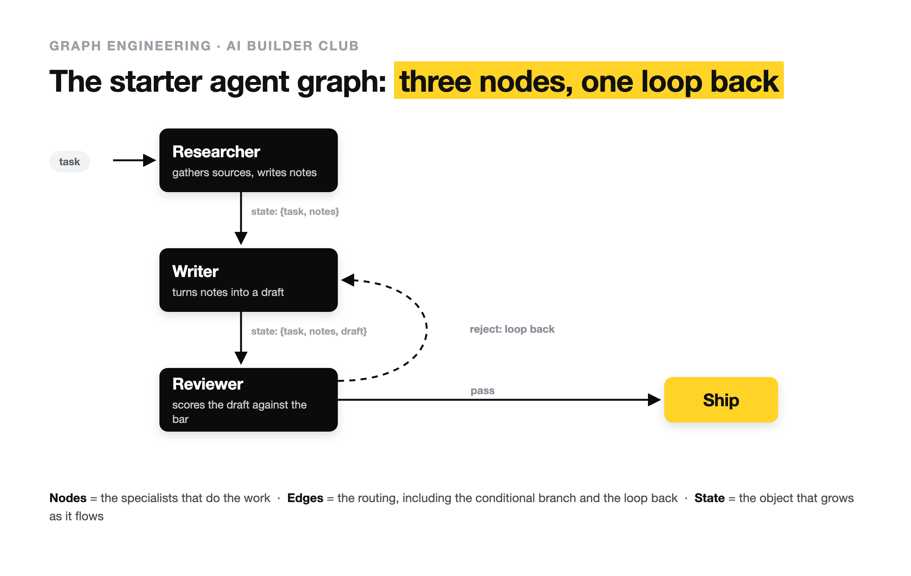

> [[../index|Wiki]] | [[../summary|Summary]] | [[../digest|Digest]]

# What Is Graph Engineering?

**In one sentence:** Graph engineering is the practice of designing the graph your agents run in — which specialized nodes exist, which edges route work between them, and what shared state travels along those edges — the layer directly above loop engineering, and mostly a new vocabulary for orchestration that already existed.

## Key points

- Graph engineering designs *how loops connect*: nodes (the units that do work), edges (the routing between them), and shared state (the object that travels along those edges); loop engineering designs the cycle one agent repeats inside a single node.
- Graph engineering is NOT knowledge graphs/GraphRAG (those model *data* as entities-and-relations for retrieval, while graph engineering models *execution* — which agent runs next and what state it gets); NOT a new capability (nothing shipped in July 2026 that you couldn't build in 2025 — LangGraph, Microsoft AutoGen, and Google ADK did graph orchestration well before the term existed; what's new is only the vocabulary); and NOT a default (most tasks are one job with one verifier, i.e. a loop, and reaching for a graph too early buys a distributed-systems problem you didn't have).
- The term crystallized on X around July 18–19, 2026, from Peter Steinberger's (OpenClaw creator) question "Are we still talking loops or did we shift to graphs yet?" — followed by @svpino's "Loop Engineering is dead. Long live Graph Engineering!", @rohit4verse's "Agents are graduating from while-loops to org charts," and @VaibhavSisinty's description of a quiet shift away from a year of loops — with no launch, no paper, and no new capability shipped.
- An agent graph has exactly three parts: **nodes** (each with one job — a specialized agent like a researcher/writer/reviewer, or a deterministic step like a function, tool call, or data fetch); **edges** (straight: A then B; conditional: if the review passes, ship, if not, loop back; fan-out: one node kicks off three in parallel; fan-in: three results join back into one); and **shared state** (the object every node reads from and writes to — task, draft, notes, verdict — what turns a pile of agents into a system instead of a group chat that forgets everything).
- A loop is just a single-node graph with an edge back to itself, so graph engineering is not a replacement for loop engineering — a graph is what you get when several loops need to hand off to each other, with the agent's freedom living inside each node rather than across the whole job.

---

## Definition: loops inside, graphs around

Graph engineering is the practice of designing the graph your agents run in: which specialized nodes exist, which edges route work between them, and what shared state travels along those edges. Loop engineering designs the cycle one agent repeats; graph engineering decides how several of those loops connect. A single loop is the smallest possible graph — one node with an edge back to itself — so this is the layer directly above loop engineering, not a replacement for it.

The motivating scenario: an agent grinding through a loop (discover, plan, execute, verify, repeat) is fine until the task stops being one job — now it's research, then write it up, then have something skeptical tear the draft apart, then decide whether to ship or send it back. Cram all of that into one agent's loop and it loses the plot; give each job its own node and wire them together, and the second thing is a graph.

The sharpest one-line test showed up on X on July 20, 2026: @shannholmberg framed loops and graphs as two ways to run an agent where "the difference is who decides the path, the agent or you." In a loop you set the goal and the bar, and the agent picks its own route to clear it. In a graph you declare the valid paths and the checks along them — this node, then that one, branch here if the review fails — while some edges are still decided at runtime, so the agent's freedom lives inside each node instead of across the whole job.

That framing explains why the term drew fire as fast as it drew followers: Harrison Chase, who built LangGraph, replied to the same thread: "So i didn't really know what graph engineering is, and i still don't really... but it's basically just langgraph?" When the person whose framework is the reference implementation isn't sure the word names anything new, that's worth registering rather than waving off. Pushing the other way, @daleverett published a piece on July 19 titled "Loops are just shitty graphs," arguing the graph was always the real structure and the single loop was the degenerate case we settled for.

### Three things graph engineering is NOT

All three get confused with it:

1. **Not knowledge graphs or GraphRAG.** Those are about modeling *data* as entities and relations for retrieval. Graph engineering is about modeling *execution* — which agent runs next and what state it gets. Same word, unrelated problem.
2. **Not a new capability.** Nothing shipped in July 2026 that you couldn't build in 2025. LangGraph, Microsoft AutoGen, and Google ADK were doing graph orchestration well before the term existed. What's new is the vocabulary.
3. **Not a default.** Most tasks are one job with one verifier, and that's a loop. Reaching for a graph before the work forces you is how you buy yourself a distributed-systems problem you didn't have.

## Origin of the term: a question on X, mid-July 2026

Every year the leverage in AI engineering moves one level further out from the model; graph is the newest rung, newest by a matter of days. The word crystallized on X around July 18–19, 2026. The seed was a question: **Peter Steinberger** — the creator of OpenClaw — asked, in a line relayed by @sairahul1: "Are we still talking loops or did we shift to graphs yet?" That's the whole origin: not a launch, not a paper, a builder wondering out loud whether the frame had already moved.

Within a day the timeline answered:

- **@svpino** put it as a mock-eulogy: "Loop Engineering is dead. Long live Graph Engineering!"
- **@rohit4verse** gave it the framing that stuck: "Loop engineering was the last unlock. Graph engineering is the next one. Agents are graduating from while-loops to org charts. Specialized nodes running in parallel, state flowing between them."
- **@VaibhavSisinty** described the underlying motion without the hashtag: "There's a quiet shift happening in how AI agents are built... For the last year, AI agents worked in loops. You give it a task. It plans. It acts. It checks. It fixes."

Notice what's not here: a new capability. Nobody shipped a thing on July 18 that you couldn't do on July 17. What shifted was the name people put on a design problem they were already having — the problem of one loop no longer being the right shape for the work.

## The mechanics: nodes, edges, shared state

Strip the jargon and an agent graph has exactly three parts:

- **Nodes** — the units that do work. A node is usually a specialized agent (a "researcher," a "writer," a "reviewer") or a plain deterministic step (a function, a tool call, a data fetch). Each node has one job.
- **Edges** — the routing between nodes. An edge says: after this node, go to that one. Edges can be **straight** (A then B), **conditional** (if the review passes, ship; if not, loop back), **fan-out** (one node kicks off three in parallel), and **fan-in** (three results join back into one).
- **Shared state** — the object that travels along the edges. It's the thing every node reads from and writes to: the task, the draft so far, the notes, the verdict. State is what turns a pile of agents into a system instead of a group chat that forgets everything.

### The org-chart metaphor (@rohit4verse) and its limits

The metaphor doing the heavy lifting on X is @rohit4verse's org chart: a company doesn't make one person do research, writing, and review in a single unbroken stint — it gives those to different roles, routes work between them, and lets results roll back up. An agent graph is the same idea: specialized roles, defined hand-offs, a shared record.

But the metaphor has a limit: when the roles are actual *business functions* rather than nodes in one workflow, most teams never need edges at all. Point every loop at the same folder and let it read state, work, and write state back. That version — roles as business functions, no explicit wiring — is the "AI-native company" pattern referenced in the guide's companion piece.

### The starter diagram

The canonical starter graph: a researcher feeds a writer, a reviewer checks the draft, and a conditional edge decides whether to ship or send it back.

What it shows, per the figure description: a task enters a **Researcher** node that gathers sources and writes notes, which passes state `{task, notes}` down to a **Writer** node that turns notes into a draft, which passes state `{task, notes, draft}` to a **Reviewer** node that scores the draft against the bar. A solid conditional edge labelled "pass" routes to **Ship**; a dashed edge labelled "reject: loop back" routes back to the Writer. Nodes are the specialists, edges are the routing, and state is the object that grows as it flows.

Counted out: three nodes, four edges — one of them conditional, one of them a loop back to the writer. State grows as it flows: the researcher's notes ride along to the writer, the draft rides along to the reviewer, and the reviewer's verdict decides the next edge.

## Closing: a graph is several loops that hand off to each other

The part that keeps the whole thing from feeling like a brand-new universe: a loop is just a single-node graph with an edge back to itself. Everything learned about designing loops — the discover/plan/execute/verify cycle, the stop condition, the verifier — is the inside of one node. A graph doesn't replace the loop. It's what you get when you have several loops that need to hand off to each other. Graph engineering is the layer that decides how they connect.

**Covers:** Definition of graph engineering; what it's not; the term's July 2026 origin on X; nodes/edges/state mechanics; the org-chart metaphor; the starter diagram (source chunk 01)
