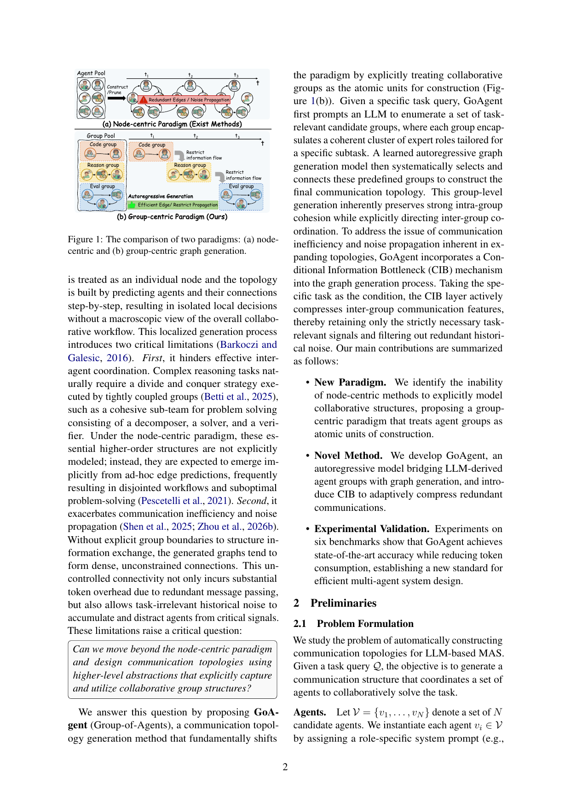

> [[../index|Wiki]] | [[../summary|Summary]] | [[../digest|Digest]]

# Problem and Motivation

**In one sentence:** Existing LLM-based multi-agent systems build communication topologies agent-by-agent (node-centric), which fails to model divide-and-conquer group structures and causes noise propagation and token overhead, so GoAgent flips the paradigm by treating task-relevant collaborative groups as the atomic construction units and compressing inter-group communication with a conditional information bottleneck.

## Key points

- LLM-based multi-agent systems (MAS) solve complex tasks (code generation, mathematical reasoning, multi-step decision-making), and the communication topology — a directed graph governing how agents interact and share information — matters more than individual agent capabilities for overall performance.
- Existing topology design has progressed from static hand-crafted structures (chains, trees, fully connected debate graphs) to template-based learning (AgentPrune, AgentDropout, GDesigner, GTD prune/reweight a dense template graph) to autoregressive generation from scratch (ARG-Designer), but all share the node-centric flaw.
- Node-centric generation — predicting each agent and its connections step-by-step as an isolated local decision — has two critical failure modes: (1) higher-order divide-and-conquer structures (e.g., a decomposer–solver–verifier sub-team) must emerge implicitly from ad-hoc edge predictions, yielding disjointed workflows; (2) without explicit group boundaries, graphs become dense and unconstrained, incurring redundant message-passing token overhead and letting task-irrelevant historical noise accumulate.
- GoAgent (Group-of-Agents) treats collaborative groups as the atomic units: an LLM first enumerates a pool of task-relevant candidate groups (each a coherent cluster of expert roles for a subtask), then a learned autoregressive model selects and connects whole groups to build the final graph, preserving intra-group cohesion while explicitly directing inter-group coordination.
- A Conditional Information Bottleneck (CIB) objective, conditioned on the specific task, compresses inter-group communication features to retain only strictly task-relevant signals and filter redundant historical noise.
- GoAgent achieves state-of-the-art results: 93.84% average accuracy across six benchmarks while reducing token consumption by about 17%.
- The problem is formally: given a task query Q, generate a group-level communication graph G = (M, E) over K collaborative groups, each defined as M_i = (S_i, E(S_i)) with S_i ⊆ V and intra-group relations E(S_i), with the final agent-level topology induced jointly by intra-group relations and inter-group dependencies.
- Topology generation is autoregressive over groups: P(G|Q) = ∏ P(M_i | G_<i, Q) · ∏ P(e_ji | M_i, G_<i, Q), where the first factor selects the next group and the second predicts its edges to previously generated groups.

---

## Node-centric vs. group-centric paradigms

The introduction frames the entire paper as a paradigm shift. Prior systems — chains for sequential reasoning, trees for hierarchical deliberation, fully connected graphs for exhaustive debate, and later template-optimization methods (AgentPrune, AgentDropout, GDesigner, GTD) that prune or reweight edges of a predefined dense graph — plus the autoregressive ARG-Designer that adds agents, roles, and connections from scratch, all build the topology one node at a time. Each decision is local, with no macroscopic view of the collaborative workflow.

Two limitations follow. First, inter-agent coordination suffers: divide-and-conquer tasks require tightly coupled sub-teams (e.g., a decomposer, a solver, and a verifier), but under node-centric construction these higher-order structures are never explicitly modeled — they are expected to emerge implicitly from ad-hoc edge predictions, frequently producing disjointed workflows and suboptimal problem-solving. Second, communication becomes inefficient and noisy: without explicit group boundaries structuring information exchange, the generated graphs form dense, unconstrained connections, causing substantial token overhead from redundant message passing while task-irrelevant historical noise accumulates and distracts agents from critical signals.

GoAgent answers by shifting the atomic unit of construction from agent to group (Figure 1(b)). Given a task query, an LLM enumerates task-relevant candidate groups, each encapsulating a coherent cluster of expert roles tailored to a subtask; a learned autoregressive graph generation model then selects and connects these predefined groups. Group-level generation inherently preserves strong intra-group cohesion while explicitly directing inter-group coordination, and the CIB mechanism compresses inter-group communication to curb the remaining redundancy and noise.

Figure 1 visualizes this contrast along a discrete generation time axis (t₁ → t₂ → t₃ → …). Panel (a) shows the node-centric paradigm of existing methods: an agent pool of individual agent nodes is expanded into a graph edge-by-edge at each step, with a red-shaded region marking the failure mode — redundant edges and noise propagation as uncontrolled dense inter-agent connections let task-irrelevant signals accumulate. Panel (b) shows the group-centric paradigm of GoAgent: the same agents are pre-clustered into role-coherent groups (e.g., code / reason / eval) in a group pool, and generation is autoregressive over whole groups — at each step a complete group is selected and wired in, with arrows and a "restrict information flow" legend indicating that inter-group communication is deliberately bottlenecked to limit redundant message passing. Qualitatively, the topology moves from a dense node-level mesh (more edges, more noise) to a sparse group-level structure (fewer, more purposeful edges, constrained propagation).

## Contributions

- **New Paradigm.** Identification of the inability of node-centric methods to explicitly model collaborative structures, and proposal of a group-centric paradigm that treats agent groups as atomic units of construction.
- **Novel Method.** Development of GoAgent, an autoregressive model bridging LLM-derived agent groups with graph generation, plus the CIB mechanism that adaptively compresses redundant communications.
- **Experimental Validation.** State-of-the-art accuracy on six benchmarks with reduced token consumption, establishing a new standard for efficient multi-agent system design.

## Problem formulation

The problem: automatically construct communication topologies for LLM-based MAS. Given a task query Q, generate a communication structure coordinating a set of agents to solve the task.

- **Agents.** Let V = {v_1, ..., v_N} be N candidate agents. Each v_i ∈ V is instantiated by assigning a role-specific system prompt (e.g., "Math Solver" or "Code Reviewer") to a shared LLM. Given input prompt P_i, agent v_i produces response R_i = v_i(P_i). Communication is via prompt composition: if an edge v_i → v_j exists, R_i is appended to v_j's input prompt as context.
- **Collaborative Groups.** Higher-order coordination units: a group M_i = (S_i, E(S_i)), where S_i ⊆ V is the participating agent subset and E(S_i) the predefined intra-group communication relations (e.g., fully connected or chain). M = {M_1, ..., M_K} is the set of groups.
- **Group-Level Communication Graph.** G = (M, E), where E denotes communication dependencies between groups; edge e_ij means information from group M_i can be transmitted to group M_j. The final agent-level topology is induced jointly by intra-group relations E(S_i) and inter-group dependencies E.
- **Topology Generation.** Sequential group generation, where each new group may connect to previously built groups. Formally:

  P(G|Q) = ∏_{i=1}^{|M|} P(M_i | G_<i, Q) · ∏_{j<i} P(e_ji | M_i, G_<i, Q)

  where G_<i is the partial graph of the first i−1 groups. The first term models collaborative group selection; the second predicts edges between the newly generated group and previously constructed groups.

## Information bottleneck background

The information bottleneck (IB) principle (Tishby et al., 2000) seeks a compressed representation X̃ of signals X that preserves maximum information relevant to a target Y, formulated as minimizing:

L_IB = −I(X̃; Y) + β I(X̃; X)

where β is a Lagrange multiplier balancing prediction of Y against compression of X.

Since standard IB compresses unconditionally, it is extended to the Conditional Information Bottleneck (CIB) (Gondek and Hofmann, 2003) with a condition variable Z that is maximally informative about the signal: CIB extracts Y while compressing X, conditioned on Z:

min L_CIB = −I(X̃; Y|Z) + β I(X̃; X|Z)

By conditioning on Z, CIB selectively filters noise while preserving the structural or semantic patterns dictated by the condition. GoAgent uses exactly this form with Z = the specific task query, so the CIB layer compresses inter-group communication features and retains only strictly task-relevant signals.

**Covers:** Title, Abstract, Section 1 (Introduction), Section 2 (Preliminaries: 2.1 Problem Formulation, 2.2 Information Bottleneck)
