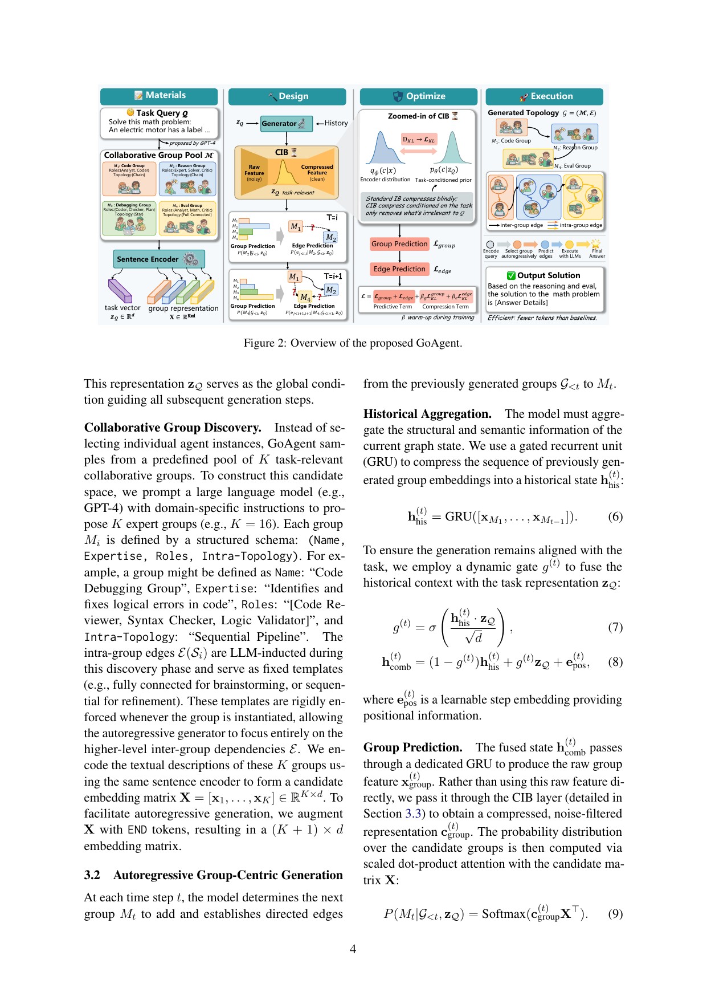

> [[../index|Wiki]] | [[../summary|Summary]] | [[../digest|Digest]]

# Method: GoAgent

**In one sentence:** GoAgent autoregressively generates a task-specific multi-agent communication topology in which groups of agents — not individual agents — are the atomic generative units, using task-conditioned gated state aggregation plus a Conditional Information Bottleneck (CIB) to filter task-irrelevant signals, trained end-to-end with supervision (Teacher Forcing) instead of online RL.

## Key points

- **Group-centric generation:** the task topology is factorized as an autoregressive sequence of group selections and inter-group edge predictions, so the generator works over K predefined collaborative groups (e.g., K = 16) rather than individual agent instances, sharply reducing the search space and matching human-like organizational structure.
- **Task encoding and candidate pool:** the task query Q is mapped to a global condition vector z_Q = FFN(SentenceEncoder(Q)) that guides every generation step; an LLM (GPT-4) proposes K groups, each with a schema (Name, Expertise, Roles, Intra-Topology) whose LLM-inducted intra-group edges E(S_i) are rigidly enforced templates (e.g., sequential for refinement), leaving only inter-group edges E to be generated.
- **State fusion with a task gate:** a GRU compresses the sequence of previously chosen group embeddings into h(t)_his, and a learned gate g(t) = σ(h(t)_his · z_Q / √d) blends history with the task vector z_Q plus a learnable step embedding e(t)_pos to form the fused state h(t)_comb.
- **Prediction heads:** the next-group distribution is Softmax(c(t)_group X^⊤) over the candidate embedding matrix X (padded with END tokens to (K+1)×d), and each incoming edge (M_i, M_t) is a binary classifier σ(MLP(c(edge_i,t))) over a compressed edge feature — both features pass through CIB first.
- **Conditional Information Bottleneck:** CIB minimizes −I(c; y | z_Q) + β I(x; c | z_Q), replacing the standard IB's fixed standard-normal prior with a **task-conditioned prior** p_θ(c | z_Q), so compression is task-aware rather than blind; the compression term is bounded by a KL divergence L_KL, and the decoder exploits the assumption z_Q → x → c → y to predict y from c alone.
- **Training data is auto-curated:** ground-truth trajectories G* are collected by heuristically sampling diverse topologies, executing them with LLMs on the tasks, and keeping the minimal viable graphs that solved the tasks — no manual annotation.
- **Supervised end-to-end learning:** Teacher Forcing on the curated set D = {(Q, G*)} avoids the high variance of online RL; the total loss combines group NLL (L_group), edge BCE (L_edge), and the KL regularizer with per-head coefficients β_g, β_e linearly warmed up over E_warm = 10 epochs.

---

## Task encoding and group discovery

GoAgent first maps unstructured text — both the task requirements and the agent/group descriptions — into a shared continuous vector space.

**Task encoding.** Given a task query Q, a pre-trained sentence encoder followed by a feed-forward network produces the global task representation

> z_Q = FFN(SentenceEncoder(Q)), z_Q ∈ R^d. (Eq. 5)

z_Q is not a one-off feature: it serves as the **global condition guiding all subsequent generation steps** — it re-enters the state gate, the edge features, the CIB prior, and both prediction objectives.

**Collaborative group discovery.** Instead of selecting individual agent instances, GoAgent samples from a predefined pool of K task-relevant collaborative groups. The candidate space is built by prompting a large LLM (e.g., GPT-4) with domain-specific instructions to propose K expert groups (K = 16 in practice). Each group M_i is defined by a structured schema (Name, Expertise, Roles, Intra-Topology); for instance, *Name: "Code Debugging Group", Expertise: "Identifies and fixes logical errors in code", Roles: [Code Reviewer, Syntax Checker, Logic Validator], Intra-Topology: "Sequential Pipeline"*.

The intra-group edges E(S_i) are **LLM-inducted during this discovery phase and then fixed as rigid templates** (fully connected for brainstorming, sequential for refinement). Because these are enforced whenever a group is instantiated, the autoregressive generator can focus entirely on the higher-level inter-group dependencies E. The textual descriptions of the K groups are encoded with the same sentence encoder into the candidate embedding matrix X = [x_1, …, x_K] ∈ R^(K×d); to support autoregressive generation, X is augmented with END tokens into a (K+1)×d matrix.

## Autoregressive group-centric generation

At each time step t the model does two things: it selects the next group M_t to add, and it establishes directed edges from all previously generated groups G_<t to M_t.

**Historical aggregation.** A gated recurrent unit compresses the sequence of previously generated group embeddings into a historical state

> h(t)_his = GRU(x_M1, …, x_M(t−1)). (Eq. 6)

A dynamic gate then fuses this history with the task to keep generation task-aligned:

> g(t) = σ(h(t)_his · z_Q / √d) (Eq. 7)
> h(t)_comb = (1 − g(t)) h(t)_his + g(t) z_Q + e(t)_pos, (Eq. 8)

where e(t)_pos is a learnable step embedding providing positional information. When the current graph state is weak or off-task, g(t) lets the task vector z_Q dominate the fused state — an explicit task-steering mechanism.

**Group prediction.** The fused state h(t)_comb passes through a dedicated GRU to produce a raw group feature x(t)_group. Rather than using this raw feature directly, it is passed through the CIB layer (Section 3.3) to obtain a compressed, noise-filtered representation c(t)_group. The distribution over candidate groups is then computed via scaled dot-product attention with the candidate matrix X:

> P(M_t | G_<t, z_Q) = Softmax(c(t)_group X^⊤). (Eq. 9)

**Edge prediction.** Once M_t is selected, the model predicts the incoming edges from all existing groups M_i ∈ G_<t. For each candidate edge (M_i, M_t), it concatenates the source group's historical state, the new group's embedding, and the task representation into a raw edge feature

> x(edge_i,t) = h(comb_i) ∥ x_Mt ∥ z_Q,

compresses it via CIB into c(edge_i,t), and applies a binary classifier for edge existence:

> P(e_i,t = 1 | M_i, G_<t, z_Q) = σ(MLP(c(edge_i,t))). (Eq. 10)

## Conditional information bottleneck (CIB)

As the communication graph grows, raw historical features x (i.e., x(t)_group or x(edge_i,t)) inevitably accumulate task-irrelevant signals — e.g., spurious group co-occurrences — that could propagate into the target prediction y (the next group M_t or edge e_i,t). The CIB layer inserts a bottleneck that extracts a compressed latent c from x. Following the paper's general IB formulation (Eq. 4), the **condition variable is instantiated as the global task representation z_Q**; CIB is applied to both group and edge prediction for architectural uniformity, though the primary motivation is inter-group noise filtering.

> min L_CIB = −I(c; y | z_Q) + β I(x; c | z_Q) (Eq. 11)
>
> (Predictive Term) (Compression Term)

Because mutual information is intractable in closed form here, both directions are upper-bounded variationally.

**Minimizing the predictive term.** The first term keeps c informative for predicting y:

> −I(c; y | z_Q) ≤ E_{c ~ q_φ(c|x)}[−log p_ψ(y | c, z_Q)] ≜ L_task. (Eq. 12)

Because the architecture explicitly fuses z_Q into the historical state x **prior to compression**, the authors assume the Markov chain z_Q → x → c → y. Under this assumption c acts as a sufficient statistic for predicting y (y is conditionally independent of z_Q given c), so the decoder is efficiently parameterized as p_ψ(y | c) — a valid approximation of p_ψ(y | c, z_Q) provided the predictive term successfully forces c to retain the task-relevant signals.

**Minimizing the compression term.** Here CIB departs from standard Variational IB (Alemi et al., 2017): instead of a fixed standard-normal prior, the compression references a **task-conditioned prior p_θ(c | z_Q)** — the prior itself is conditioned on the task, so that "irrelevant" is defined relative to Q rather than globally blind. The premise is that different task types (e.g., math reasoning vs. code generation) inherently require different baseline topological structures, so the latent space of valid communication graphs is fundamentally task-dependent. Both the encoder q_φ(c | x) and the conditional prior p_θ(c | z_Q) are parameterized as multivariate Gaussians with diagonal covariances via MLPs, and the mutual information is upper-bounded by their KL divergence:

> I(x; c | z_Q) ≤ E_{x, z_Q}[D_KL(q_φ(c | x) ∥ p_θ(c | z_Q))] ≜ L_KL. (Eq. 13)

Latent samples are drawn with the reparameterization trick:

> c = μ_φ(x) + σ_φ(x) ⊙ ε, ε ~ N(0, I). (Eq. 14)

**Tractable objective.** Combining the two bounds yields an end-to-end optimizable loss:

> L_CIB ≤ L_task + β L_KL. (Eq. 15)

L_task corresponds to the supervised cross-entropy losses of the prediction heads, and L_KL acts as a **task-guided regularizer** to filter structural noise — a regularizer whose notion of "noise" is itself defined by the task.

## Training and inference strategy

**Data construction.** Supervising the autoregressive generator requires ground-truth sequences of groups and edges, but manually authoring optimal task–graph pairs is infeasible. So the training set D = {(Q, G*)} is curated via an **automated heuristic exploration** process: for a set of training queries, diverse candidate topologies G are sampled by varying group combinations and edge densities; these graphs are executed on the target tasks using the underlying LLMs; graphs that produce the correct final answer are collected; and to encourage efficiency, the successful set is filtered down to **minimal viable topologies** (fewer groups and edges). These form the positive ground-truth trajectories G*.

**Training objective.** GoAgent is trained end-to-end with **Teacher Forcing** on the curated trajectories in D, deliberately avoiding the high variance typical of online reinforcement learning. The total loss L is the empirical realization of the CIB objective across all generation steps. L_task is instantiated as the negative log-likelihood for group prediction (L_group) and binary cross-entropy for edge prediction (L_edge):

> L_group = −E_D [Σ_t log P(M*_t | G*_<t, z_Q)] (Eq. 16, part 1)
> L_edge = −E_D [Σ_t Σ_{i<t} log P(e*_i,t | M*_i, G*_<t, z_Q)] (Eq. 16, part 2)

The two separate CIB heads for groups and edges carry their own coefficients β_g and β_e (analyzed in Appendix E), each applied with a **linear warm-up** over the first E_warm = 10 training epochs — ramping the task-conditioned KL pressure from zero so early training learns prediction before being penalized for compression.

**Inference.** At test time the pipeline runs the same autoregressive loop: encode Q to z_Q, then at each step gate-fuse history and task, predict the next group via Eq. 9 (or an END token to stop) and, once chosen, predict its incoming edges via Eq. 10; the realized topology G = (M, E) is executed with the underlying LLMs and a summarizer agent aggregates the dialogue history into the final answer.

The overview decomposes the system into four stages that mirror the four-phase pipeline. The *Materials* stage is exactly Section 3.1's encoding: a task query Q and a pool M of K collaborative groups (each specified by Name/Expertise/Roles/intra-group topology) enter a sentence encoder that maps the query to z_Q and the group descriptions to the embedding matrix X (padded with END tokens). The *Design* stage traces one autoregressive step: the Generator (conditioned on z_Q and history) routes the raw feature through the CIB, then alternates Group Prediction and Edge Prediction heads as the loop advances t = 1 → i+1. The *Optimize* stage is a zoom on the CIB's two Gaussian distributions — the encoder posterior q_φ(c|x) and the task-conditioned prior p_θ(c|z_Q) bridged by the KL term — illustrating the paper's central claim that standard IB compresses "blindly" while CIB conditions on the task so it only removes what is irrelevant to Q. Finally, *Execution* is the realized topology with intra-group edges (fixed templates) and inter-group edges (generated) handed to the LLMs, producing a solution the paper notes uses fewer tokens than baselines.

**Covers:** Section 3 (Methodology: 3.1-3.4)
