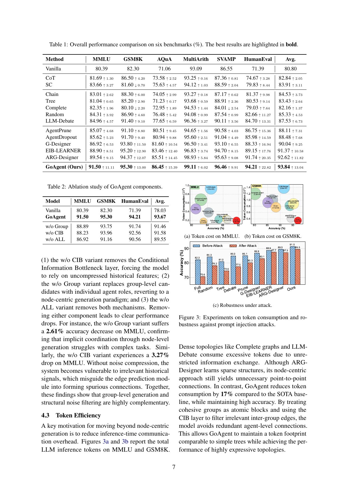
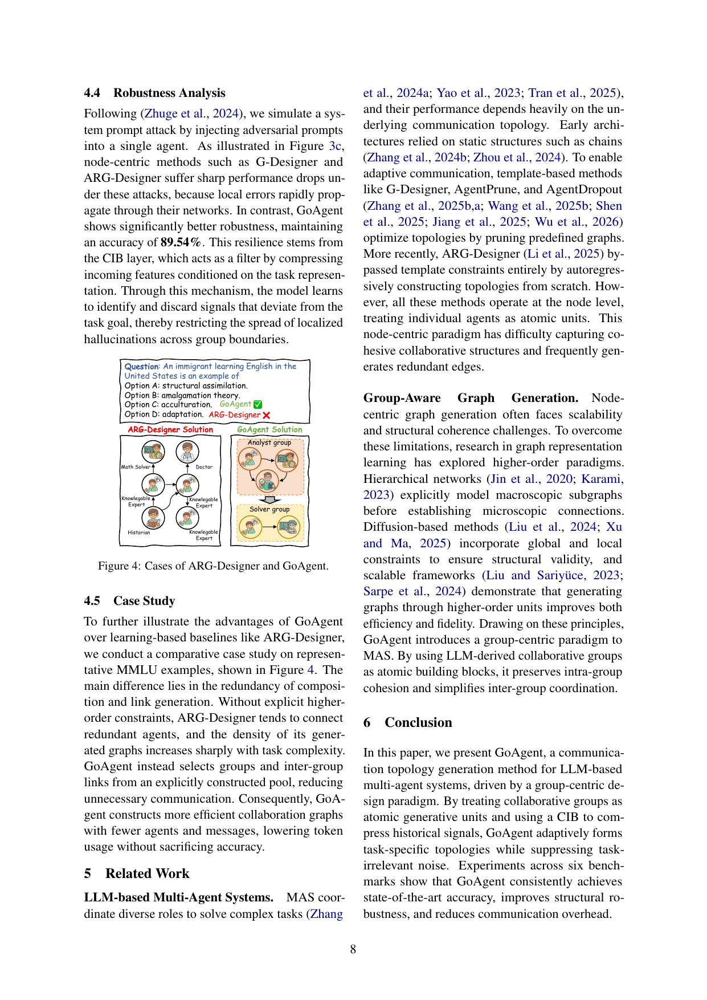

> [[../index|Wiki]] | [[../summary|Summary]] | [[../digest|Digest]]

# Experiments, Related Work, and Conclusion

**In one sentence:** GoAgent achieves state-of-the-art accuracy on all six benchmarks (avg 93.84%) while cutting inference token cost by 17% versus the best baseline, remains the most attack-robust method (89.54% after a prompt-injection attack), and the paper closes with related-work positioning, a conclusion, acknowledged limitations, and an ethics statement.

## Key points

- GoAgent reaches 91.50 (MMLU), 95.30 (GSM8K), 86.45 (AQuA), 99.11 (MultiArith), 96.46 (SVAMP), 94.21 (HumanEval), average 93.84 — best on all six benchmarks, beating Vanilla (avg 80.80) by 13.04 points and the strongest node-centric baseline ARG-Designer (avg 92.62) by 1.22 points.
- Gains are largest on hard reasoning tasks: MMLU +1.96% over ARG-Designer (91.50 vs 89.54) and HumanEval +2.47% (94.21 vs 91.74); over Vanilla, HumanEval improves by a massive 22.82 points (71.39 → 94.21).
- Ablation on 3 benchmarks: full GoAgent 91.50/95.30/94.21 (avg 93.67); w/o Group 88.89/93.75/91.74 (avg 91.46, −2.61 on MMLU); w/o CIB 88.23/93.96/92.56 (avg 91.58, −3.27 on MMLU); w/o ALL 86.92/91.16/90.56 (avg 89.55) — group-level generation and CIB noise filtering are both necessary and complementary.
- Token cost: GoAgent uses 1.9e+05 tokens on MMLU (vs LLM-Debate 1.6e+06, Complete 6.7e+05) and 3.4e+06 on GSM8K (vs LLM-Debate 2.8e+07, Complete 1.2e+07) — a 17% reduction versus the SOTA baseline ARG-Designer (2.1e+05 / 4.1e+06) while keeping the highest accuracy.
- Robustness to a simulated system-prompt injection attack (one agent compromised): GoAgent drops only from 91.5 to 89.5 (keeping 89.54% accuracy), while node-centric baselines lose more (ARG-Designer 89.5 → 87.3, G-Designer 88.9 → 87.7, Full 82.3 → 70.6).
- Case study on an MMLU item ("An immigrant learning English in the U.S. is an example of …", answer: acculturation): GoAgent's group-centric topology answers correctly; ARG-Designer's denser node-centric graph answers incorrectly.
- Related work positions GoAgent against LLM multi-agent systems (static chains; template-based pruning: G-Designer, AgentPrune, AgentDropout; autoregressive ARG-Designer — all node-centric) and group-aware graph generation (hierarchical networks, diffusion-based generation, higher-order scalable frameworks), showing GoAgent is the first to bring group-centric atomics into LLM MAS.
- Limitations: the group pool is predefined offline by an LLM (no novel groups/roles can be synthesized at inference), and evaluation is limited to static reasoning tasks — dynamic/interactive settings (embodied AI, MARL) are untested. The ethics statement reports no human subjects, animals, or environmental concerns and no conflicts of interest.

---

## Experimental setup

Experiments evaluate on six benchmarks: general reasoning MMLU, mathematical reasoning GSM8K, MultiArith, SVAMP, and AQuA, and code generation HumanEval (following Zhang et al., 2025b). Inference generates a group-level graph autoregressively from the task embedding: at each step the model deterministically picks a new group via the mean (bypassing stochastic sampling), then samples the existence of incoming edges from all previously generated groups via a Bernoulli distribution, continuing until the END token.

## Performance comparison

Table 1 (overall performance, %; deltas vs Vanilla, ↑ improved / ↓ worse):

| Method | MMLU | GSM8K | AQuA | MultiArith | SVAMP | HumanEval | Avg. |
|---|---|---|---|---|---|---|---|
| Vanilla | 80.39 | 82.30 | 71.06 | 93.09 | 86.55 | 71.39 | 80.80 |
| CoT | 81.69 ↑1.30 | 86.50 ↑4.20 | 73.58 ↑2.52 | 93.25 ↑0.16 | 87.36 ↑0.81 | 74.67 ↑3.28 | 82.84 ↑2.05 |
| SC | 83.66 ↑3.27 | 81.60 ↓0.70 | 75.63 ↑4.57 | 94.12 ↑1.03 | 88.59 ↑2.04 | 79.83 ↑8.44 | 83.91 ↑3.11 |
| Chain | 83.01 ↑2.62 | 88.30 ↑6.00 | 74.05 ↑2.99 | 93.27 ↑0.18 | 87.17 ↑0.62 | 81.37 ↑9.98 | 84.53 ↑3.73 |
| Tree | 81.04 ↑0.65 | 85.20 ↑2.90 | 71.23 ↑0.17 | 93.68 ↑0.59 | 88.91 ↑2.36 | 80.53 ↑9.14 | 83.43 ↑2.64 |
| Complete | 82.35 ↑1.96 | 80.10 ↓2.20 | 72.95 ↑1.89 | 94.53 ↑1.44 | 84.01 ↓2.54 | 79.03 ↑7.64 | 82.16 ↑1.37 |
| Random | 84.31 ↑3.92 | 86.90 ↑4.60 | 76.48 ↑5.42 | 94.08 ↑0.99 | 87.54 ↑0.99 | 82.66 ↑11.27 | 85.33 ↑4.53 |
| LLM-Debate | 84.96 ↑4.57 | 91.40 ↑9.10 | 77.65 ↑6.59 | 96.36 ↑3.27 | 90.11 ↑3.56 | 84.70 ↑13.31 | 87.53 ↑6.73 |
| AgentPrune | 85.07 ↑4.68 | 91.10 ↑8.80 | 80.51 ↑9.45 | 94.65 ↑1.56 | 90.58 ↑4.03 | 86.75 ↑15.36 | 88.11 ↑7.31 |
| AgentDropout | 85.62 ↑5.23 | 91.70 ↑9.40 | 80.94 ↑9.88 | 95.60 ↑2.51 | 91.04 ↑4.49 | 85.98 ↑14.59 | 88.48 ↑7.68 |
| G-Designer | 86.92 ↑6.53 | 93.80 ↑11.50 | 81.60 ↑10.54 | 96.50 ↑3.41 | 93.10 ↑6.55 | 88.33 ↑16.94 | 90.04 ↑9.25 |
| EIB-LEARNER | 88.90 ↑8.51 | 95.20 ↑12.90 | 83.46 ↑12.40 | 96.83 ↑3.74 | 94.70 ↑8.15 | 89.15 ↑17.76 | 91.37 ↑10.58 |
| ARG-Designer | 89.54 ↑9.15 | 94.37 ↑12.07 | 85.51 ↑14.45 | 98.93 ↑5.84 | 95.63 ↑9.08 | 91.74 ↑20.35 | 92.62 ↑11.82 |
| **GoAgent (Ours)** | **91.50** ↑11.11 | **95.30** ↑13.00 | **86.45** ↑15.39 | **99.11** ↑6.02 | **96.46** ↑9.91 | **94.21** ↑22.82 | **93.84** ↑13.04 |

GoAgent achieves consistent state-of-the-art accuracy on all six benchmarks. Versus node-centric autoregressive ARG-Designer and template-based EIB-LEARNER, the gains are largest on complex reasoning: MMLU +1.96% and HumanEval +2.47%. The paper argues these hard-task gains support the core motivation — group-level construction leverages cohesive expert clusters (e.g., a solver paired with a verifier) and avoids the disjointed workflows and missing inter-role connections typical of node-centric generation.

## Ablation study

Table 2 (ablation of GoAgent components, %):

| Model | MMLU | GSM8K | HumanEval | Avg. |
|---|---|---|---|---|
| Vanilla | 80.39 | 82.30 | 71.39 | 78.03 |
| GoAgent | **91.50** | **95.30** | **94.21** | **93.67** |
| w/o Group | 88.89 | 93.75 | 91.74 | 91.46 |
| w/o CIB | 88.23 | 93.96 | 92.56 | 91.58 |
| w/o ALL | 86.92 | 91.16 | 90.56 | 89.55 |

Three variants: **(1)** *w/o CIB* removes the Conditional Information Bottleneck layer, forcing reliance on uncompressed historical features; **(2)** *w/o Group* replaces group-level candidates with individual agent roles (reverting to node-centric generation); **(3)** *w/o ALL* removes both. Removing either component causes clear drops: w/o Group loses **2.61%** on MMLU (91.50 → 88.89), confirming node-level generation with only implicit coordination struggles on complex tasks; w/o CIB loses **3.27%** on MMLU (91.50 → 88.23) — without noise compression, irrelevant historical signals misguide the edge-prediction module into forming spurious connections. Group-level generation and structural noise filtering are highly complementary; together they lift GoAgent 15.15 points over Vanilla's average.

## Token efficiency

Figures 3a and 3b report total LLM inference tokens on MMLU and GSM8K.

The scatter panels (3a MMLU, 3b GSM8K) plot accuracy (x-axis) against token consumption (y-axis). Dense, node-centric topologies cluster in the high-token/moderate-accuracy region: on MMLU, LLM-Debate burns 1.6e+06 tokens, Complete Graph 6.7e+05, Random Graph 3.8e+05, and Tree 4.6e+05 — unrestricted information exchange wastes tokens. Sparse learning-based baselines are cheaper but still above the ideal region: G-Designer 2.2e+05, EIB-LEARNER 2.3e+05, ARG-Designer 2.1e+05 (MMLU); on GSM8K the costs are an order of magnitude larger (LLM-Debate 2.8e+07, Complete 1.2e+07, Tree 9.2e+06, ARG-Designer 4.1e+06, EIB-LEARNER 8.8e+06). GoAgent lands in the lower-right Pareto corner on both benchmarks — 1.9e+05 tokens on MMLU and 3.4e+06 on GSM8K — achieving the highest accuracy with one of the lowest token budgets. The paper attributes this to treating cohesive groups as atomic blocks and using the CIB layer to filter irrelevant inter-group edges, avoiding the redundant point-to-point agent connections that ARG-Designer's node-centric design still produces. Net result: a **17%** token-consumption reduction versus the SOTA baseline while maintaining top accuracy — a token footprint comparable to simple trees with the performance of highly expressive topologies.

## Robustness analysis

Following Zhuge et al., 2024, the authors simulate a system-prompt attack by injecting adversarial prompts into a single agent (Figure 3c). Node-centric methods such as G-Designer and ARG-Designer suffer sharp post-attack drops because local errors rapidly propagate through their networks: Full falls 82.3 → 70.6, Random 84.3 → 78.2, Tree 81.0 → 74.6, Debate 85.0 → 77.5, Prune 85.1 → 80.3, G-Designer 86.9 → 83.1, EIB-LEARNER 88.9 → 87.7, ARG-Designer 89.5 → 87.3. GoAgent, in contrast, starts at 91.5 and keeps **89.54%** accuracy after the attack — the smallest degradation of all methods. The paper attributes this resilience to the CIB layer, which compresses incoming features conditioned on the task representation, letting the model identify and discard signals that deviate from the task goal, thereby restricting localized hallucinations from spreading across group boundaries.

## Case study

On a representative MMLU item — "An immigrant learning English in the United States is an example of …" (options: A structural assimilation, B amalgamation theory, C acculturation, D adaptation; correct: C) — the two methods diverge both structurally and outcome-wise.

Figure 4 shows the side-by-side topologies: ARG-Designer produces a denser, node-centric graph of individual agents (Math Solver, Doctor, Historian, plus several Knowledgeable-Expert nodes) linked by many direct edges, over-connecting redundant agents and failing the question; GoAgent instead groups agents into higher-order units — an Analyst group and a Solver group connected by a single inter-group link — and answers correctly. The core difference is redundancy in composition and link generation: without explicit higher-order constraints, ARG-Designer's graph density grows sharply with task complexity, while GoAgent selects groups and inter-group links from an explicitly constructed pool, building collaboration graphs with fewer agents and messages — lower token usage without sacrificing accuracy.

## Related work

**LLM-based multi-agent systems.** MAS coordinate diverse roles for complex tasks, with performance heavily dependent on the communication topology. Early architectures used static structures such as chains; template-based methods (G-Designer, AgentPrune, AgentDropout) optimize topologies by pruning predefined graphs; ARG-Designer bypassed templates entirely, autoregressively constructing topologies from scratch. However, all operate at the node level, treating individual agents as atomic units — a paradigm that struggles to capture cohesive collaborative structures and frequently generates redundant edges.

**Group-aware graph generation.** Node-centric generation faces scalability and structural-coherence limits. Graph representation learning has explored higher-order paradigms: hierarchical networks model macroscopic subgraphs before microscopic connections; diffusion-based methods enforce global and local structural-validity constraints; scalable frameworks show generating graphs through higher-order units improves both efficiency and fidelity. GoAgent brings this group-centric paradigm to MAS for the first time: LLM-derived collaborative groups become the atomic building blocks, preserving intra-group cohesion and simplifying inter-group coordination.

## Conclusion, limitations, and ethics

**Conclusion.** GoAgent is a communication-topology generation method for LLM-based MAS driven by a group-centric design: treating collaborative groups as atomic generative units and using a CIB to compress historical signals, it adaptively forms task-specific topologies while suppressing task-irrelevant noise. Experiments across six benchmarks show consistent state-of-the-art accuracy, improved structural robustness, and reduced communication overhead.

**Limitations.** (1) The group pool is predefined offline by an LLM — this shrinks the search space and ensures intra-group cohesion, but GoAgent cannot synthesize entirely novel group structures or roles at inference if a task needs expertise outside the pool. (2) Evaluation focuses on static reasoning tasks (MMLU, GSM8K); effectiveness in highly dynamic, interactive environments (embodied AI, multi-agent reinforcement learning) remains to be investigated.

**Ethics statement.** The work involves no human subjects, animals, or environmentally sensitive materials; no ethical risks or conflicts of interest are foreseen, with a commitment to scientific integrity.

**Covers:** Section 4 (Experiments: 4.1-4.5), Section 5 (Related Work), Section 6 (Conclusion), Limitations, Ethics Statement