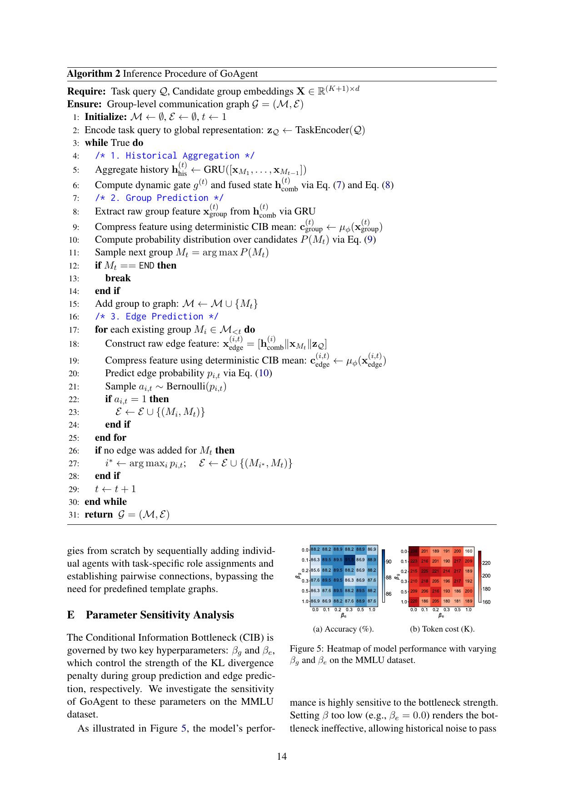

> [[../index|Wiki]] | [[../summary|Summary]] | [[../digest|Digest]]

# Appendix: Algorithms, Complexity, and Implementation Details

**In one sentence:** The appendix pins down GoAgent's full training/inference pseudocode, proves the generator is computationally cheap (O(T²d² + TKd) time, O(d² + Kd) space), itemizes the six benchmarks and thirteen baselines, quantifies the β_g/β_e sensitivity trade-off, and specifies the exact training configuration, architecture dimensions, and LLM prompt design used to curate the task data.

## Key points

- **Time complexity:** With T generated groups, K candidate-pool size, and hidden dimension d, graph generation costs O(Td² + TKd + T²d²) = O(T²d² + TKd), negligible vs. LLM inference since T is typically < 3 and K (e.g., 16) is tiny.
- **Space complexity:** Generator parameters are bounded by O(d²) (lightweight GRUs, MLPs, CIB projections) plus O(Kd) for candidate embeddings — total O(d² + Kd), highly parameter-efficient.
- **Datasets:** Six benchmarks — MMLU (153 multi-choice), GSM8K (1,319 numeric), MultiArith (600), SVAMP (1,000), AQuA (254), HumanEval (164 code, Pass@1) — following G-Designer's setup.
- **Baselines (13 total):** 3 single-agent (Vanilla, CoT, Self-Consistency with 5 paths + majority vote), 5 fixed topologies (Chain, Tree, Complete, Random, LLM-Debate), 5 learning-based (Agent-Prune, Agent-Dropout, G-Designer, EIB-Learner, ARG-Designer), each learning-based method trained separately per dataset.
- **Inference:** CIB stochastic sampling is bypassed; the deterministic mean c = μ_φ(x) is used for both group and edge predictions, and a Bernoulli edge sample falls back to the argmax edge if none is sampled, guaranteeing connectivity.
- **β sensitivity:** Optimal config is highly asymmetric (β_g ≈ 0.0, β_e ≈ 0.3) — edge prediction benefits far more from compression than group prediction; accuracy stays ~86–90% across the grid while token cost (160–220 K) drops steeply as β_e rises from 0.
- **Training config:** AdamW, lr 1e-4, weight decay 1e-3, grad clipping 1.0, 100 epochs, batch 40, linear β warm-up over first 10 epochs; only B ∈ {40, 60} curated queries per dataset suffice because the generator learns structural collaboration patterns, not task reasoning.
- **Prompts:** GPT-4o at temperature 0.7 generates (query, topology) pairs with roles from a 16-group pool and topologies from {Chain, Star, FullConnected}; e.g. a 4-agent Chain "0->1 1->2 2->3" over roles solver/verifier/knowledge/coder group.

---

## More related work (Information Bottleneck in Graph Learning)

The IB principle (Tishby & Zaslavsky 2015; Alemi et al. 2017) extracts minimal sufficient statistics for a task, balancing compression and prediction. In graph learning, IB optimizes communication efficiency by minimizing message entropy (Wang et al., 2020a) or dynamically pruning redundant messages (Yuan et al., 2024). More recently IB has been applied to LLM-based MAS: GUARDIAN (Zhou et al., 2026b) compresses temporal interaction graphs to mitigate hallucination and error propagation. GoAgent extends IB to the *generative* process of MAS topologies itself: a Conditional IB dynamically conditions compression on the task representation, actively filtering out redundant historical communication noise as the topology expands.

## Algorithm and complexity analysis

**Algorithm 1 — Training Procedure.** Inputs: training dataset D = {(Q, G*)} curated via heuristic exploration, total epochs E, warm-up epochs E_warm. Output: optimized parameters.

1. For epoch e = 1 .. E:
   - Update CIB bottleneck strength: compute β_g, β_e from the warm-up schedule (e.g., linear increase if e < E_warm).
   - For each batch (Q, G*) ∈ D:
     - Encode task query: z_Q ← TaskEncoder(Q).
     - Initialize L_group ← 0, L_edge ← 0, L_KL^group ← 0, L_KL^edge ← 0.
     - For step t = 1 .. |M*| (teacher forcing with ground-truth history):
       - Aggregate history h_his(t) using the ground-truth sequence M*_<t.
       - Fuse with task z_Q via Eqs. (7)–(8) to obtain h_comb(t).
       - Group CIB & prediction: extract raw group feature x_group(t); sample c_group(t) via reparameterization (Eq. 14); accumulate L_group (Eq. 16) and L_KL^group (expected KL divergence).
       - Edge CIB & prediction: for each existing group M*_i ∈ M*_<t: construct x_edge(i,t) = [h_comb(i) ∥ x_M*t ∥ z_Q]; sample c_edge(i,t) via reparameterization (Eq. 14); compute p_i,t via Eq. 10; accumulate L_edge (Eq. 17) and L_KL^edge.
     - Compute total loss L via Eq. 18; update parameters with gradient descent.
2. Return optimized parameters.

**Algorithm 2 — Inference Procedure.** Inputs: task query Q, candidate group embeddings X ∈ R^((K+1)×d). Output: group-level communication graph G = (M, E).

1. Initialize M ← ∅, E ← ∅, t ← 1; encode z_Q ← TaskEncoder(Q).
2. While True:
   - Historical aggregation: h_his(t) ← GRU(x_M1, ..., x_M(t−1)); compute dynamic gate g(t) and fused state h_comb(t) via Eqs. (7)–(8).
   - Group prediction: extract x_group(t) from h_comb(t) via GRU; compress with the deterministic CIB mean c_group(t) ← μ_φ(x_group(t)); compute P(M_t) via Eq. 9; sample M_t = argmax P(M_t); if M_t == END, break; else add M_t to M.
   - Edge prediction: for each existing group M_i ∈ M_<t: construct x_edge(i,t) = [h_comb(i) ∥ x_Mt ∥ z_Q]; compress with deterministic mean c_edge(i,t) ← μ_φ(x_edge(i,t)); predict p_i,t via Eq. 10; sample a_i,t ~ Bernoulli(p_i,t); if a_i,t = 1, add edge (M_i, M_t).
   - If no edge was added for M_t, take i* = argmax_i p_i,t and add (M_i*, M_t) to guarantee connectivity (steps 26–28).
   - Increment t.
3. Return G = (M, E).

**Time complexity.** At each step t, group prediction costs O(d² + Kd) (GRU state updates plus attention over K candidates) and edge prediction costs O(t·d²) over all t−1 previous groups. Summing over T steps gives O(Td² + TKd + T²d²) = O(T²d² + TKd). Because generation happens at the macroscopic group level (T typically < 3, K e.g. 16) rather than the agent level, the generator's overhead is negligible compared with the LLMs' inference cost.

**Space complexity.** Learnable parameters (GRUs, MLPs, CIB projection layers) are bounded by O(d²); candidate group embeddings require O(Kd). Total: O(d² + Kd) — parameter-efficient and easy to integrate alongside LLMs.

## Dataset details

Dataset statistics (Table 3), following the same experimental setup as G-Designer:

| Category | Dataset | Answer type | Metric | #Test | License |
|---|---|---|---|---|---|
| General reasoning | MMLU | Multi-choice | Acc. | 153 | MIT |
| Math reasoning | GSM8K | Number | Acc. | 1,319 | MIT |
| Math reasoning | MultiArith | Number | Acc. | 600 | Unspecified |
| Math reasoning | SVAMP | Number | Acc. | 1,000 | MIT |
| Math reasoning | AQuA | Multi-choice | Acc. | 254 | Apache-2.0 |
| Code generation | HumanEval | Code | Pass@1 | 164 | MIT |

## Baseline details

**Single-agent methods** (3):
1. **Vanilla** — direct prompting without reasoning enhancement.
2. **Chain-of-Thought (CoT)** (Wei et al., 2022) — prompts the LLM for intermediate reasoning steps with "Let's think step by step".
3. **Self-Consistency (SC)** (Wang et al., 2023) — samples five CoT reasoning paths and selects the most consistent answer via majority voting.

**Fixed multi-agent topologies** (5, hand-crafted):
1. **Chain** — sequential linear chain A₁ → A₂ → ... → A_n.
2. **Tree** — hierarchical structure with multiple layers culminating in a root agent.
3. **Complete** — fully connected graph enabling maximum information sharing.
4. **Random** — randomly generated topology with random role assignments.
5. **LLM-Debate** — debate-based topology where agents critique each other's reasoning over multiple rounds.

**Learning-based topology design** (5, each trained separately per dataset):
1. **Agent-Prune** (Zhang et al., 2025a) — one-shot pruning of spatial-temporal message-passing graphs to remove communication redundancy, yielding token-economic topologies while defending against adversarial attacks.
2. **Agent-Dropout** (Wang et al., 2025b) — optimizes adjacency matrices across rounds to identify and eliminate redundant agents/communications, enhancing token efficiency and task performance.
3. **G-Designer** (Zhang et al., 2025b) — variational graph auto-encoder encoding agents and task-specific virtual nodes to design task-adaptive topologies per task difficulty/requirements.
4. **EIB-Learner** (Shen et al., 2025) — causal framework analyzing error propagation patterns; fuses connectivity patterns from dense and sparse graphs to balance error suppression with beneficial information diffusion.
5. **ARG-Designer** (Li et al., 2025) — autoregressively constructs topologies from scratch by sequentially adding individual agents with task-specific role assignments and pairwise connections, bypassing predefined template graphs.

## Parameter sensitivity analysis

The CIB is governed by two hyperparameters: β_g and β_e, controlling the KL-divergence penalty strength during group and edge prediction respectively. Sensitivity is studied on MMLU.



Figure 5 renders the (β_g, β_e) grid as two heatmaps: accuracy remains comparatively flat (roughly 86–90%) with a slight decline toward larger β_e/β_g, whereas token cost shows a strong gradient — lowest at β_e ≈ 0 (~210–220 K) and steadily decreasing to ~160–190 K at moderate/high β_e. The paper confirms the trade-off: setting β too low (e.g., β_e = 0.0) renders the bottleneck ineffective, letting historical noise through, producing over-connected graphs with high token costs and lower accuracy; setting β too high (e.g., β_e > 0.5) forces aggressive compression, discarding necessary history and yielding under-connected, poorly coordinated topologies. Crucially, the optimum lies in a highly asymmetric region (β_g ≈ 0.0, β_e ≈ 0.3), indicating edge prediction benefits far more from compression than group prediction — deciding *which* group comes next needs full historical context to avoid role duplication, while deciding *how* groups connect is highly susceptible to the redundant connectivity patterns common in prior generative models, which the CIB layer filters out.

## Implementation details (training, architecture, prompts)

**Training.** Candidate topologies for heuristic exploration are drawn from three structural families: Chain, Star, and FullConnected. Optimizer: AdamW with learning rate 1×10⁻⁴, weight decay 1×10⁻³, gradient clipping 1.0; E = 100 epochs, batch size 40. The CIB bottleneck strength undergoes linear warm-up over the first E_warm = 10 epochs. Remarkably, only B ∈ {40, 60} training queries per dataset suffice, because the generator learns *structural collaboration patterns* (which group types co-occur and how they connect) rather than task-specific reasoning, which is handled entirely by the underlying LLMs.

**Architecture.** All modules use hidden dimension h = 256. The task encoder FFN projects d → h → d with ReLU. The historical aggregation GRU, group prediction GRU, and edge prediction GRU are each single-layer with input and hidden size d. For edge prediction, the concatenated feature x_edge(i,t) ∈ R^(3d) is projected via a two-layer MLP (3d → h → d, ReLU), passed through the edge GRU, then the CIB layer; the final edge classification head maps d → h → 1 with sigmoid output. At inference edges are sampled via Bernoulli; if no edge is sampled for a newly added group, the highest-probability edge is added to guarantee connectivity.

**F.1 LLM Prompt Templates.** GPT-4o at temperature 0.7 generates diverse (query, topology) pairs. The system prompt instructs the LLM to generate queries spanning multiple domains (code implementation, mathematical reasoning, multiple-choice questions, knowledge-based Q&A, medical consultation, psychology) and to propose suitable MAS configurations using roles from the group pool and topologies from {Chain, Star, FullConnected}. A representative example output (verbatim in the paper):

```json
{"query": "def odd_count(lst)...", "agent_count": 4,
 "roles": ["solver group", "verifier group",
 "knowledge group", "coder group"],
 "topology": "Chain", "edges": "0->1 1->2 2->3"}
```

**F.2 Group Role Prompts.** The group role pool contains 16 specialized groups for GSM8K/MultiArith/SVAMP/AQuA, with representative group generation and role prompts given in the paper (the chunk lists the pool size and scope; the role-prompt appendix continues in the source).

**Covers:** Appendix A-F (More Related Work, Algorithm and Complexity Analysis, Dataset Details, Baseline Details, Parameter Sensitivity Analysis, Implementation Details)
