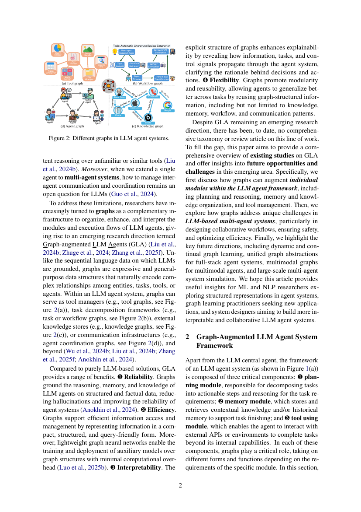
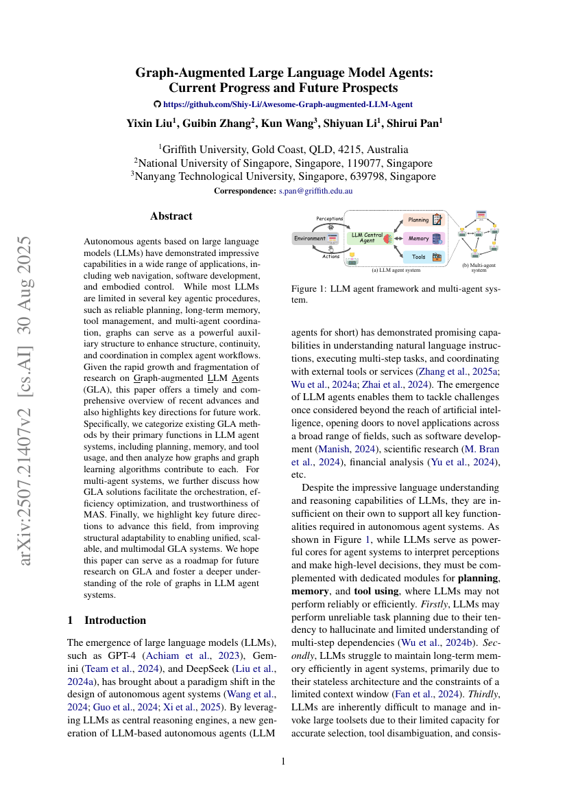

> [[../index|Wiki]] | [[../summary|Summary]] | [[../digest|Digest]]

# Introduction and Agent Framework

**In one sentence:** Plain LLM agents are unreliable at planning, long-term memory, and tool use, and cannot coordinate in multi-agent systems, so the paper argues that graphs — as an auxiliary, expressive structure encoding relationships among entities, tasks, tools, and agents — should augment the three core modules of an LLM agent system: planning, memory, and tool use.

## Key points

- LLMs are insufficient on their own for autonomous agent systems: they hallucinate in task planning, struggle to maintain long-term memory (stateless architecture, limited context window), cannot reliably manage and invoke large toolsets (selection, disambiguation, consistent reasoning over similar tools), and inter-agent communication/coordination in multi-agent systems remains an open problem.
- Graphs are expressive, general-purpose data structures that naturally encode complex relationships among entities, tasks, tools, or agents — a complement to the sequential language data LLMs are grounded on.
- Within an LLM agent system, graphs can act as tool managers (tool graphs), task decomposition frameworks (task/workflow graphs), external knowledge stores (knowledge graphs), or communication infrastructures (agent coordination graphs).
- The paper lists four benefits of Graph-augmented LLM Agents (GLA) over purely LLM-based solutions: (1) Reliability — graphs ground reasoning, memory, and knowledge on structured, factual data, reducing hallucinations; (2) Efficiency — compact, structured, query-friendly representation plus lightweight graph neural networks that run over graphs with minimal overhead; (3) Interpretability — explicit graph structure reveals how information, tasks, and control signals propagate, clarifying decision rationales; (4) Flexibility — graphs promote modularity and reusability of knowledge, memory, workflow, and communication patterns across tasks.
- The LLM agent system framework (Figure 1a) consists of a central LLM agent plus three critical components: a planning module (decompose tasks into actionable steps, reason over requirements), a memory module (store and retrieve contextual knowledge and/or historical memory), and a tool-using module (interact with external APIs or environments beyond internal capabilities).
- Graphs play a critical role in each of the three modules, taking different forms and functions depending on each module's requirements.
- GLA research is rapidly growing but fragmented, with no prior comprehensive taxonomy or review; this survey categorizes GLA methods by their primary function in LLM agent systems (planning, memory, tool usage) and by how they benefit multi-agent systems (orchestration, efficiency optimization, trustworthiness).

---

## Why LLMs need graphs

LLMs such as GPT-4, Gemini, and DeepSeek act as the central reasoning engines of autonomous agents, enabling natural-language understanding, multi-step task execution, and coordination with external tools across applications (web navigation, software development, scientific research, financial analysis, embodied control). Yet the paper identifies four concrete limits:

1. **Unreliable task planning** — LLMs tend to hallucinate and lack understanding of multi-step dependencies (Wu et al., 2024b).
2. **Inefficient long-term memory** — the stateless architecture and limited context window (Fan et al., 2024) prevent efficient memory maintenance in agent systems.
3. **Difficulty managing large toolsets** — limited capacity for accurate selection, tool disambiguation, and consistent reasoning over unfamiliar or similar tools (Liu et al., 2024b).
4. **Multi-agent coordination** — when a single agent is extended to a multi-agent system, managing inter-agent communication and coordination remains an open question for LLMs (Guo et al., 2024).

To address these, researchers increasingly use graphs as complementary infrastructure to organize, enhance, and interpret the modules and execution flows of LLM agents, a direction termed **Graph-augmented LLM Agents (GLA)** (Liu et al., 2024b; Zhuge et al., 2024; Zhang et al., 2025f). Unlike the sequential language data LLMs are grounded on, graphs are expressive and general-purpose structures that naturally encode complex relationships among entities, tasks, tools, or agents.

## Benefits of graph augmentation

Compared to purely LLM-based solutions, GLA provides four benefits (the paper's numbered points, rendered 1–4):

1. **Reliability** — graphs ground the reasoning, memory, and knowledge of LLM agents on structured and factual data, reducing hallucinations and improving agent-system reliability (Anokhin et al., 2024).
2. **Efficiency** — graphs support efficient information access and management in a compact, structured, query-friendly form; lightweight graph neural networks enable training and auxiliary-model deployment over graph structures with minimal computational overhead (Luo et al., 2025b).
3. **Interpretability** — the explicit structure of graphs enhances explainability by revealing how information, tasks, and control signals propagate through the agent system, clarifying the rationale behind decisions and actions.
4. **Flexibility** — graphs promote modularity and reusability, letting agents generalize better across tasks by reusing graph-structured information (including, but not limited to, knowledge, memory, workflow, and communication patterns).

## Types of graphs used in agent systems

Within an LLM agent system, graphs serve (at minimum) four roles, illustrated in Figure 2:

1. **Tool managers — tool graphs** (Figure 2a): e.g., an automatic literature-review-generation system wiring a PDF parser, table extractor, chart reader, image reader, math solver, file manager, and search API as graph nodes (Liu et al., 2024b).
2. **Task decomposition frameworks — task/workflow graphs** (Figure 2b): e.g., the same review pipeline's workflow (topic analysis → literature retrieval → paper filtering → content extraction → trend & gap identification → generation).
3. **External knowledge stores — knowledge graphs** (Figure 2c): e.g., an entity graph with Steve Jobs, Apple Inc., Google, iPhone, Beats connected via relations like *Inventor*, *Founder of*, *Subsidiary of*.
4. **Communication infrastructures — agent coordination graphs** (Figure 2d): e.g., a software-development team of Manager, Backend, Frontend, DevOps, and Tester agents coordinated through the graph (Zhang et al., 2025f; Anokhin et al., 2024; Wu et al., 2024b; Liu et al., 2024b).

The paper notes graphs are used "and beyond" these four roles.

## The LLM agent system framework

Apart from the LLM central agent, the framework of an LLM agent system (Figure 1a) is composed of three critical components:

1. **Planning module** — responsible for decomposing tasks into actionable steps and reasoning over the task requirements.
2. **Memory module** — stores and retrieves contextual knowledge and/or historical memory to support task completion.
3. **Tool-using module** — enables the agent to interact with external APIs or environments to complete tasks beyond its internal capabilities.

In each component, graphs play a critical role, taking different forms and functions depending on the specific module's requirements. The rest of the paper details how graphs support planning, memory management, and tool management in LLM agent systems (e.g., Figure 3 shows a plan represented as a graph for a web-dashboard-with-daily-email task, and a task pool as a graph over subtasks such as style extraction, text-to-image, image caption, and translation).

Figure 1 also shows (b) the multi-agent system view, where the single LLM agent of (a) is extended to several agents coordinated over the environment.

## Scope of the survey and future directions

Despite GLA being an emerging direction, no comprehensive taxonomy or review existed; this survey fills the gap. It proceeds in three parts: (i) how graphs augment individual modules of the LLM agent framework — planning and reasoning, memory and knowledge organization, and tool management; (ii) how graphs address unique challenges of LLM-based multi-agent systems, particularly designing collaborative workflows, ensuring safety, and optimizing efficiency (orchestration, efficiency optimization, trustworthiness); (iii) key future directions — dynamic and continual graph learning, unified graph abstractions for full-stack agent systems, multimodal graphs for multimodal agents, and large-scale multi-agent system simulation. The authors aim to serve ML/NLP researchers exploring structured representations in agent systems, graph-learning practitioners seeking new applications, and designers of interpretable, collaborative LLM agent systems.

**Covers:** Abstract, Section 1 (Introduction), Section 2 opening (agent framework: planning/memory/tool modules)
