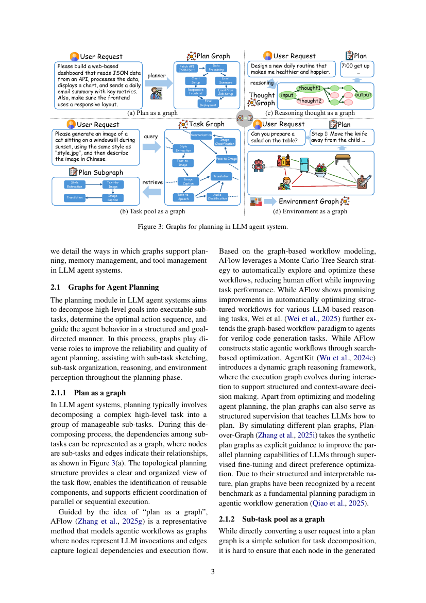

> [[../index|Wiki]] | [[../summary|Summary]] | [[../digest|Digest]]

# Graphs for Planning

**In one sentence:** The planning module of LLM agents decomposes high-level goals into executable sub-tasks, and graphs structure this process in four complementary ways — as plan graphs, constrained sub-task pool (task) graphs, reasoning thought graphs, and environment graphs — improving the reliability, interpretability, and quality of planning.

## Key points

- **Plan as a graph:** decomposing a complex task into sub-tasks and representing their dependencies as a graph (nodes = sub-tasks, edges = relationships) gives a clear topological view of the task flow, exposes reusable components, and supports coordinated parallel or sequential execution.
- **AFlow** (Zhang et al., 2025g) models agentic workflows as graphs where nodes are LLM invocations and edges capture logical dependencies and execution flow, then uses Monte Carlo Tree Search to automatically explore and optimize these static workflows with less human effort.
- **AgentKit** (Wu et al., 2024c) contrasts with AFlow by introducing a *dynamic* graph reasoning framework in which the execution graph evolves during interaction to support structured, context-aware decision making.
- **Plan-over-Graph** (Zhang et al., 2025i) turns plan graphs from runtime structure into *supervision*: it takes synthetic plan graphs as explicit guidance and improves LLM parallel planning via supervised fine-tuning and direct preference optimization; a recent benchmark (Qiao et al., 2025) treats plan graphs as a fundamental planning paradigm in agentic workflow generation.
- **Sub-task pool as a graph:** instead of freely generating a plan graph from the user request, one can ground sub-tasks in a *constrained task graph* built from a platform's pool of pre-defined, executable sub-task APIs (e.g. HuggingGPT), where each edge indicates that one task's output matches the next task's input requirement.
- A **GNN-based planner** (Wu et al., 2024b) built on HuggingGPT's sub-task pool treats the user request as a query and retrieves a plan subgraph of pre-defined sub-tasks; both training-free and training-based retrievers reliably generate executable plans and outperform LLM-based planners, which often hallucinate inexecutable steps.
- **Reasoning thought as a graph:** evolving from Chain-of-Thought and Tree of Thoughts, graph-structured reasoning (ToT, RATT, GoT, domain-specific thought graphs) lets agents refine, backtrack on, or expand reasoning steps before/during planning; RATT adds retrieval-augmented generation for factual grounding, and GoT (Besta et al., 2024) generalizes trees into arbitrary graphs supporting transformations like combining thoughts.
- **Environment as a graph:** modeling the environment (robotic rooms with entities and distance/interaction relations, or codebases with function-level and cross-file semantic links) gives agents the contextual constraints needed for feasible planning — used for real-time hazard detection (Huang et al., 2025) and bug localization (LocAgent, Chen et al., 2025c).

---

## Plan as a graph

In LLM agent systems, planning typically involves decomposing a complex high-level task into manageable sub-tasks. During decomposition, the dependencies among sub-tasks can be represented as a graph, where nodes are sub-tasks and edges indicate their relationships. This topological planning structure provides a clear, organized view of the task flow, enables identification of reusable components, and supports efficient coordination of parallel or sequential execution.

**AFlow** (Zhang et al., 2025g) is the representative method following the "plan as a graph" idea: it models agentic workflows as graphs where nodes represent LLM invocations and edges capture logical dependencies and execution flow. On top of this graph-based workflow modeling, AFlow leverages a Monte Carlo Tree Search strategy to automatically explore and optimize these workflows, reducing human effort while improving task performance on various LLM-based reasoning tasks.

**Wei et al. (2025)** further extend the graph-based workflow paradigm to agents for Verilog code generation tasks, applying the same workflow-modeling principle outside generic reasoning tasks.

**AgentKit** (Wu et al., 2024c) marks the key distinction the paper draws in this category: while AFlow constructs *static* agentic workflows through search-based optimization, AgentKit introduces a *dynamic* graph reasoning framework, where the execution graph evolves during interaction to support structured and context-aware decision making.

Plan graphs also serve a second purpose beyond runtime execution: as **structured supervision** that teaches LLMs how to plan. **Plan-over-Graph** (Zhang et al., 2025i) simulates different plan graphs and uses the synthetic plan graphs as explicit guidance to improve the parallel planning capabilities of LLMs through supervised fine-tuning and direct preference optimization. Because of their structured and interpretable nature, plan graphs have been recognized by a recent benchmark as a fundamental planning paradigm in agentic workflow generation (Qiao et al., 2025).

## Sub-task pool as a graph

Directly converting a user request into a plan graph is a simple solution for task decomposition, but it is hard to ensure that each generated node corresponds to a truly executable and meaningful sub-task. Agentic platforms such as **HuggingGPT** (Shen et al., 2023) provide a pool of pre-defined sub-task APIs, and a more reliable solution is to ground the sub-tasks into a *constrained task graph*: each node corresponds to an available and executable sub-task, and each edge represents a dependency relation between sub-tasks, typically indicating that the output of one task matches the input requirement of the next. This organization explicitly models sub-task dependencies, allowing more accurate and interpretable agent planning.

Building on a sub-task pool graph constructed from HuggingGPT, **Wu et al. (2024b)** introduce a graph neural network (GNN)-based approach for agent planning: given the user request as a query, the GNN model retrieves a plan subgraph composed of multiple pre-defined sub-tasks representing the most suitable plan for the request. Empirical evidence shows that both training-free and training-based retrievers achieve reliable performance in generating executable plans, outperforming LLM-based planners that often suffer from hallucinations.

The contrast with the previous subsection is thus between *free-form generated* plan graphs (risking inexecutable nodes) and *retrieved* plan subgraphs over a fixed pool of verified executable sub-tasks (with constraints on both nodes and edges).

## Reasoning thought as a graph

Rather than generating plans directly from the user request, involving intermediate reasoning before planning has been proven effective in improving planning accuracy and reliability (Huang et al., 2024). Evolving from the Chain-of-Thought paradigm (Wei et al., 2022), a recent research trend is to structure the reasoning flow as a graph: each intermediate thought is represented as a node in a thought graph, and the edges encode logical connections or dependencies between reasoning steps. This organization enables more flexible, interpretable, and self-refining reasoning — agents can refine, backtrack on, or expand upon previous steps, leading to more coherent and reliable planning outcomes.

- **Tree of Thoughts (ToT)** (Yao et al., 2023) is a pioneering approach: it enhances deliberate planning by exploring multiple reasoning paths and letting language models self-evaluate choices for complex problem-solving. Its limitation is balancing factual accuracy with comprehensive logical optimization.
- **RATT** (Zhang et al., 2025h) addresses factually grounded planning by integrating retrieval-augmented generation to ensure both logical coherence and factual correctness at each step.
- **Graph of Thought (GoT)** (Besta et al., 2024) recognizes that tree structures can be restrictive for complex planning and models reasoning as an *arbitrary graph*, enabling more adaptive planning through novel transformations such as combining thoughts into synergistic outcomes.
- Domain-specific adaptations: **Thought Graph** (Hsu et al., 2024) applies these principles to planning in biological research, specifically gene set analysis, improving the uncovering of semantic relationships between biological processes. The **goal-oriented thought graph** (Badagliacca et al., 2025) represents goals as explicit nodes, enabling transparent and verifiable reasoning processes.

## Environment as a graph

Environmental perception is vital for planning beyond the user request: it informs the agent of contextual constraints and available actions. For a robotic agent, modeling the environment directly determines the feasibility and efficiency of the generated action plan, and graphs are a powerful representation for doing so. In an environment graph, entities in the real-world environment (e.g. a room) and their relationships (e.g. distance and interaction) are explicitly modeled, offering essential contextual information for decision-making and planning.

Graphs describe environments across very different scenarios:

- **Robotic agents:** Huang et al. (2025) model safety constraints in robotic agent planning by constructing a *dynamic spatio-semantic safety graph*; the environment graph helps the LLM robotic agent perform real-time hazard detection and adaptive task refinement during planning.
- **Coding agents:** **LocAgent** (Chen et al., 2025c) leverages code structure graphs to help LLM agents localize and understand buggy functions; by explicitly modeling function-level and semantic relationships across files, the graph empowers the agent to retrieve relevant contexts, reduce hallucination, and significantly improve bug localization accuracy.

**Covers:** Section 2.1 (Graphs for Agent Planning)
