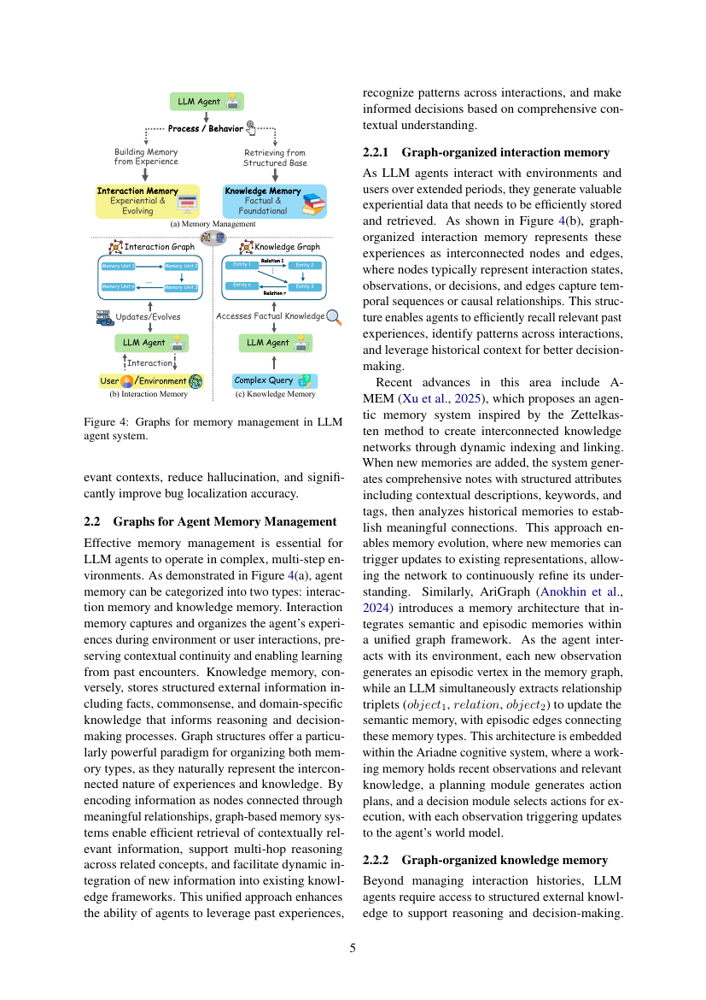
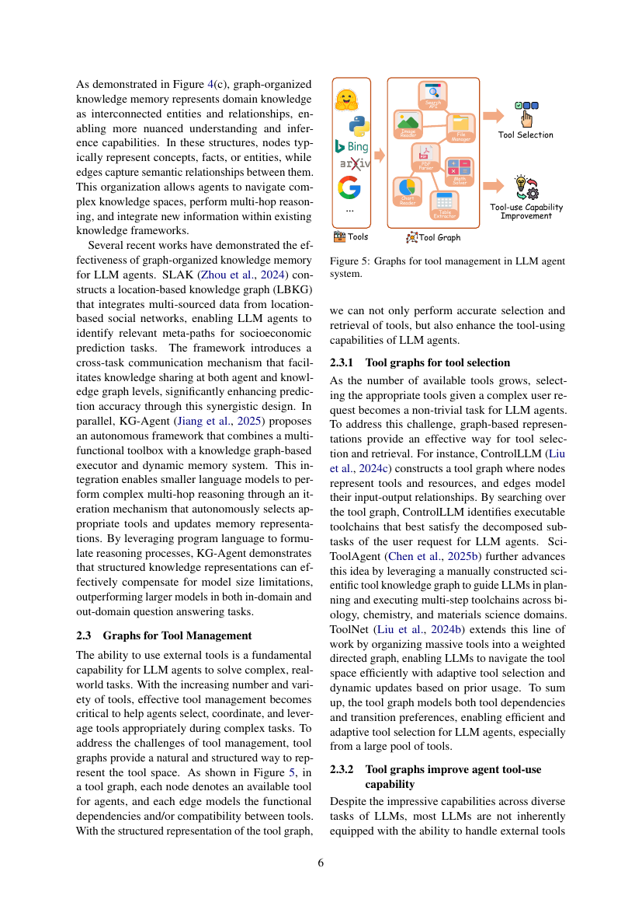

> [[../index|Wiki]] | [[../summary|Summary]] | [[../digest|Digest]]

# Graphs for Memory and Tools

**In one sentence:** Because agents must retain past interactions, reason over structured knowledge, select and combine a growing pool of external tools, and learn to call those tools reliably, graphs organize the agents' memory (both experiential interaction memory and external knowledge memory) and the tool space into node–edge structures that make context retrieval, multi-hop reasoning, and adaptive tool selection/combination practical — and even let sampled tool subsets double as fine-tuning data.

## Key points

- Agent memory splits into **interaction memory** (the agent's experiences with environments/users) and **knowledge memory** (structured external facts, commonsense, and domain knowledge); graphs are a strong paradigm for both because they naturally represent how experiences and knowledge interconnect.
- A graph-based memory lets an agent encode information as nodes joined by meaningful relationships, which enables efficient retrieval of contextually relevant information, multi-hop reasoning across related concepts, and dynamic integration of new information into existing knowledge.
- **Graph-organized interaction memory** represents experiences as nodes (interaction states, observations, decisions) and edges (temporal sequences or causal relationships), so agents can recall relevant past experiences and identify patterns across interactions.
- **A-MEM** (Xu et al., 2025) builds an agentic memory system inspired by the Zettelkasten method: new memories become notes with structured attributes (contextual descriptions, keywords, tags), then links are formed to historical memories, enabling *memory evolution* where new memories update existing representations.
- **AriGraph** (Anokhin et al., 2024) unifies semantic and episodic memory in one graph, where each observation becomes an episodic vertex and an LLM extracts relationship triplets (object1, relation, object2); embedded in the Ariadne cognitive system (working memory + planning + decision modules) it continuously updates the agent's world model.
- **Graph-organized knowledge memory** represents domain knowledge as interconnected entities and relationships, letting agents navigate complex knowledge spaces and do multi-hop reasoning — e.g. **SLAK** (Zhou et al., 2024) builds a location-based knowledge graph for socioeconomic prediction, and **KG-Agent** (Jiang et al., 2025) shows knowledge graphs can let smaller models do multi-hop reasoning that outperforms larger models.
- For **tool management**, a tool graph has a node per tool and edges that model functional dependencies and/or compatibility, enabling accurate tool selection/retrieval and improved tool-use capability beyond a flat tool list.
- Tool graphs improve capability by sampling related tool combinations as training data: **ToolFlow** (Wang et al., 2025e) builds a *parameter-level* tool graph from semantic similarity between tool inputs and outputs, samples coherent tool combinations, and uses the resulting tool subsets to generate multi-turn dialogue plans that supervise fine-tuning for better tool-calling.

---

## Graphs for Agent Memory Management

Effective memory management is essential for LLM agents operating in complex, multi-step environments. Following Figure 4(a), agent memory is categorized into two types:

- **Interaction memory** captures and organizes the agent's experiences during environment or user interactions, preserving contextual continuity and enabling learning from past encounters.
- **Knowledge memory** stores structured external information — facts, commonsense, and domain-specific knowledge — that informs reasoning and decision-making.

Graph structures are a particularly powerful paradigm for organizing both, because they naturally represent the interconnected nature of experiences and knowledge. By encoding information as nodes connected through meaningful relationships, graph-based memory systems enable (1) efficient retrieval of contextually relevant information, (2) support for multi-hop reasoning across related concepts, and (3) dynamic integration of new information into existing knowledge frameworks. This unified approach enhances the agent's ability to leverage past experiences, recognize patterns across interactions, and make informed decisions based on comprehensive contextual understanding.

### 2.2.1 Graph-organized interaction memory

As LLM agents interact with environments and users over extended periods, they generate valuable experiential data that must be efficiently stored and retrieved. As shown in Figure 4(b), graph-organized interaction memory represents these experiences as interconnected nodes and edges, where **nodes** typically represent interaction states, observations, or decisions, and **edges** capture temporal sequences or causal relationships. This structure enables agents to efficiently recall relevant past experiences, identify patterns across interactions, and leverage historical context for better decision-making.

Recent advances:

- **A-MEM (Xu et al., 2025)** proposes an agentic memory system inspired by the **Zettelkasten method** to create interconnected knowledge networks through dynamic indexing and linking. When a new memory is added, the system generates comprehensive notes with structured attributes — contextual descriptions, keywords, and tags — then analyzes historical memories to establish meaningful connections. This enables **memory evolution**: new memories can trigger updates to existing representations, allowing the network to continuously refine its understanding.
- **AriGraph (Anokhin et al., 2024)** introduces a memory architecture that integrates **semantic and episodic** memories within a unified graph framework. As the agent interacts with its environment, each new observation generates an **episodic vertex** in the memory graph, while an LLM simultaneously extracts **relationship triplets (object1, relation, object2)** to update the **semantic memory**, with **episodic edges** connecting the two memory types. AriGraph is embedded within the **Ariadne cognitive system**, where a *working memory* holds recent observations and relevant knowledge, a *planning module* generates action plans, and a *decision module* selects actions for execution; each observation triggers updates to the agent's world model.

### 2.2.2 Graph-organized knowledge memory

Beyond managing interaction histories, LLM agents require access to structured external knowledge to support reasoning and decision-making. As demonstrated in Figure 4(c), graph-organized knowledge memory represents domain knowledge as interconnected entities and relationships, enabling more nuanced understanding and inference. In these structures, **nodes** typically represent concepts, facts, or entities, while **edges** capture semantic relationships between them. This organization allows agents to navigate complex knowledge spaces, perform multi-hop reasoning, and integrate new information within existing knowledge frameworks.

Several recent works demonstrate the effectiveness of this approach:

- **SLAK (Zhou et al., 2024)** constructs a **location-based knowledge graph (LBKG)** that integrates multi-sourced data from location-based social networks, enabling LLM agents to identify relevant **meta-paths** for **socioeconomic prediction** tasks. The framework introduces a **cross-task communication mechanism** that facilitates knowledge sharing at both the agent and knowledge-graph levels, significantly enhancing prediction accuracy through this synergistic design.
- **KG-Agent (Jiang et al., 2025)** proposes an autonomous framework that combines a **multi-functional toolbox** with a **knowledge-graph-based executor** and a **dynamic memory system**. This integration enables smaller language models to perform complex multi-hop reasoning through an iteration mechanism that autonomously selects appropriate tools and updates memory representations. By leveraging program language to formulate reasoning processes, KG-Agent demonstrates that structured knowledge representations can effectively compensate for model-size limitations, outperforming larger models in both in-domain and out-domain question-answering tasks.

## Graphs for Tool Management

The ability to use external tools is a fundamental capability for LLM agents to solve complex, real-world tasks. As the number and variety of tools grows, effective tool management becomes critical to help agents select, coordinate, and leverage tools appropriately during complex tasks. To address these challenges, **tool graphs** provide a natural and structured way to represent the tool space.

As shown in Figure 5, in a tool graph each **node** denotes an available tool for agents, and each **edge** models the **functional dependencies** and/or **compatibility** between tools. With this structured representation of the tool graph, one can not only perform accurate selection and retrieval of tools, but also enhance the tool-using capabilities of LLM agents.

### 2.3.1 Tool graphs for tool selection

As the number of available tools grows, selecting the appropriate tools for a complex user request becomes a non-trivial task for LLM agents. To address this, graph-based representations provide an effective way for tool selection and retrieval:

- **ControlLLM (Liu et al., 2024c)** constructs a tool graph where nodes represent tools and resources, and edges model their **input-output relationships**. By searching over the tool graph, ControlLLM identifies **executable toolchains** that best satisfy the decomposed sub-tasks of the user request.
- **SciToolAgent (Chen et al., 2025b)** advances this idea by leveraging a **manually constructed scientific tool knowledge graph** to guide LLMs in planning and executing multi-step toolchains across Biology, Chemistry, and Materials Science domains.
- **ToolNet (Liu et al., 2024b)** extends this line of work by organizing massive tools into a **weighted directed graph**, enabling LLMs to navigate the tool space efficiently with adaptive tool selection and dynamic updates based on prior usage.

In summary, the tool graph models both **tool dependencies** and **transition preferences**, enabling efficient and adaptive tool selection for LLM agents, especially from a large pool of tools.

### 2.3.2 Tool graphs improve agent tool-use capability

Despite the impressive capabilities of LLMs across diverse tasks, most LLMs are not inherently equipped with the ability to handle external tools properly. To enhance the tool-use capability of LLM agents, supervised fine-tuning with high-quality **tool-interaction data** has become an effective solution.

To construct this tool-interaction data, tool graphs offer a practical way to **sample related tool combinations** as training examples, which helps improve the tool-calling capability of LLM agents. Following this idea:

- **ToolFlow (Wang et al., 2025e)** constructs a **parameter-level tool graph** based on **semantic similarity between tool inputs and outputs**, enabling the sampling of **coherent tool combinations**. The sampled tool subsets are then used to guide the generation of **multi-turn dialogue plans**, which serve as the **fine-tuning supervision signals** for LLMs to strengthen their tool-calling capability.

**Covers:** Section 2.2 (Graphs for Agent Memory Management), Section 2.3 (Graphs for Tool Management)
