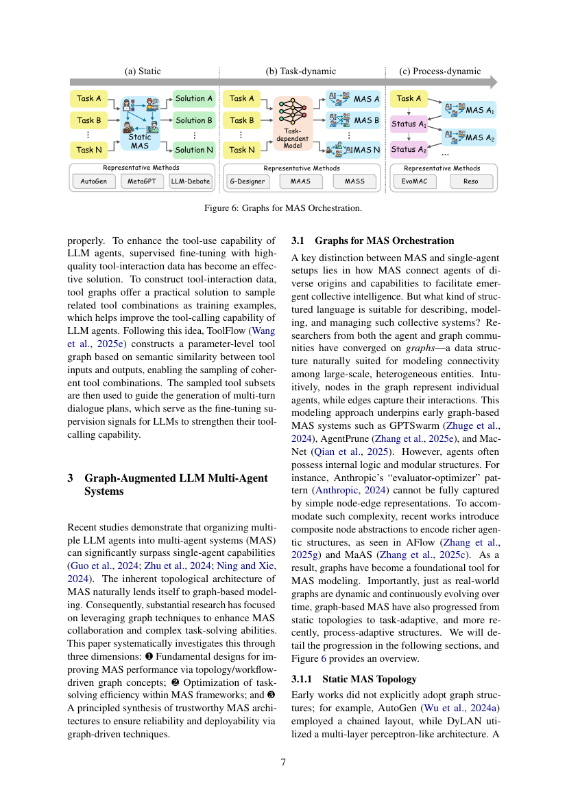
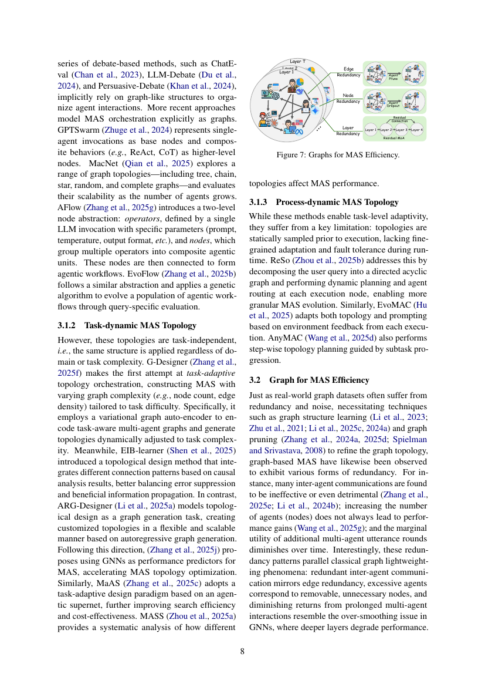

> [[../index|Wiki]] | [[../summary|Summary]] | [[../digest|Digest]]

# Graph-Augmented Multi-Agent Systems

**In one sentence:** Graph modeling improves multi-agent systems (MAS) on three dimensions — topology/workflow-driven orchestration (static → task-dynamic → process-dynamic), efficiency (de-redundancy of edges, nodes, and dialogue layers), and trustworthiness (modeling threat propagation and detecting malicious agents via graph neural networks).

## Key points

- Graphs are the natural modeling language for MAS: nodes represent individual agents and edges capture their interactions, underpinning early systems like GPTSwarm, AgentPrune, and MacNet; composite node abstractions (AFlow, MaAS) extend this to capture richer internal agentic structures such as Anthropic's "evaluator-optimizer" pattern that simple node-edge representations miss.
- MAS topology evolves along a clear progression: from static, task-independent topologies (AutoGen chains, DyLAN's MLP-like layout, MacNet's tree/chain/star/random/complete graphs, AFlow's operator/node workflows, EvoFlow's genetic-algorithm-evolved workflows) to task-adaptive topologies (G-Designer's variational graph auto-encoder, EIB-learner's causal-analysis-based design, ARG-Designer's autoregressive graph generation, MaAS's agentic supernet) and finally process-dynamic, runtime-adaptive topologies (ReSo's DAG-based dynamic planning, EvoMAC's feedback-driven adaptation, AnyMAC's step-wise planning).
- G-Designer makes the first attempt at task-adaptive topology orchestration, using a variational graph auto-encoder to generate graph complexity (node count, edge density) tailored to task difficulty, whereas static methods apply the same structure regardless of domain or task complexity.
- Graph-based MAS exhibit the same redundancy patterns as real-world graphs: ineffective inter-agent communication mirrors edge redundancy, excessive agents mirror removable nodes, and diminishing returns from extra debate rounds mirror GNN over-smoothing.
- AgentPrune is the first to formally define the Communication Redundancy problem in MAS, showing comparable performance after pruning communication edges; it models the communication pipeline as a spatio-temporal graph with a learnable adjacency matrix and trainable graph mask.
- Node de-redundancy in MAS (AgentDropout) removes underperforming or inactive agents and transfers well across datasets, while layer-level over-smoothing is addressed by Residual MoA's residual agents and DOWN's Debate Engagement Check, which debates only when necessary.
- G-Safeguard leverages the inductive bias of graph neural networks to model threat propagation in MAS, enabling prediction and detection of malicious nodes without explicit predictor training.
- Benchmarks Agent-SafetyBench and AgentAuditor systematically investigate safety issues in simulated environments and provide formal safety evaluation frameworks for monitoring agent behavior.

---

## Graphs for MAS Orchestration

MAS connect agents of diverse origins and capabilities to facilitate emergent collective intelligence. Both the agent and graph communities converged on graphs — nodes for individual agents, edges for their interactions — because graphs are naturally suited to modeling connectivity among large-scale, heterogeneous entities. This underpins early graph-based MAS such as GPTSwarm (Zhuge et al., 2024), AgentPrune (Zhang et al., 2025e), and MacNet (Qian et al., 2025). Because agents often possess internal logic and modular structures (e.g., Anthropic's "evaluator-optimizer" pattern), which simple node-edge representations cannot fully capture, recent works introduce composite node abstractions, as seen in AFlow (Zhang et al., 2025g) and MaAS (Zhang et al., 2025c). Overall, graph-based MAS have progressed from static topologies to task-adaptive, and more recently, process-adaptive structures.

**Static MAS topology.** Early works did not explicitly adopt graph structures: AutoGen (Wu et al., 2024a) used a chained layout, DyLAN (Liu et al., 2023) a multi-layer perceptron-like architecture, and debate-based methods such as ChatEval (Chan et al., 2023), LLM-Debate (Du et al., 2024), and Persuasive-Debate (Khan et al., 2024) implicitly rely on graph-like structures. More recent approaches model MAS orchestration explicitly as graphs. GPTSwarm represents single-agent invocations as base nodes and composite behaviors (e.g., ReAct, CoT) as higher-level nodes. MacNet evaluates a range of topologies — tree, chain, star, random, and complete graphs — and their scalability as the agent count grows. AFlow introduces a two-level node abstraction: *operators* (a single LLM invocation with specific parameters — prompt, temperature, output format) and *nodes* (groups of operators forming composite agentic units), connected into agentic workflows. EvoFlow (Zhang et al., 2025b) follows a similar abstraction and applies a genetic algorithm to evolve a population of agentic workflows through query-specific evaluation.

**Task-dynamic MAS topology.** These static topologies are task-independent — the same structure is applied regardless of domain or task complexity. G-Designer (Zhang et al., 2025f) makes the first attempt at task-adaptive topology orchestration, constructing MAS with varying graph complexity (node count, edge density) tailored to task difficulty via a variational graph auto-encoder that encodes task-aware multi-agent graphs and generates topologies dynamically adjusted to task complexity. EIB-learner (Shen et al., 2025) integrates different connection patterns based on causal analysis results, better balancing error suppression and beneficial information propagation. ARG-Designer (Li et al., 2025a) models topological design as a graph generation task, creating customized topologies in a flexible and scalable way via autoregressive graph generation. Following this direction, (Zhang et al., 2025j) uses GNNs as performance predictors for MAS to accelerate topology optimization. MaAS adopts a task-adaptive design paradigm based on an agentic supernet, improving search efficiency and cost-effectiveness. MASS (Zhou et al., 2025a) provides a systematic analysis of how different topologies affect MAS performance.

**Process-dynamic MAS topology.** Task-dynamic methods still sample the topology statically prior to execution, lacking fine-grained adaptation and fault tolerance at runtime. ReSo (Zhou et al., 2025b) decomposes the user query into a directed acyclic graph and performs dynamic planning and agent routing at each execution node, enabling more granular MAS evolution. EvoMAC (Hu et al., 2025) adapts both topology and prompting based on environment feedback from each execution. AnyMAC (Wang et al., 2025d) performs step-wise topology planning guided by subtask progression.

## Graph for MAS Efficiency

Just as real-world graph datasets suffer from redundancy and noise (motivating graph structure learning and graph pruning), graph-based MAS exhibit their own redundancy patterns: many inter-agent communications are ineffective or even detrimental (Zhang et al., 2025e; Li et al., 2024b); more agents does not always improve performance (Wang et al., 2025g); and the marginal utility of additional debate rounds diminishes over time. These parallel classical graph lightweighting: redundant inter-agent communication mirrors **edge redundancy**, excessive agents correspond to removable **nodes**, and diminishing returns from prolonged interaction resemble GNN **over-smoothing**. The paper examines these three perspectives.

**Edge redundancy.** Many MAS frameworks adopt predefined inter-agent communication paths, as in DyLAN (Liu et al., 2023), MachineSOM (Zhang et al., 2024b), and Consensus-LLM (Chen et al., 2023); the challenge is balancing sufficient information exchange against token consumption. MacNet observes that performance does not consistently improve with increased edge density across hand-crafted structures. AgentPrune (Zhang et al., 2025e) is the first to formally define the Communication Redundancy problem, demonstrating that many systems achieve comparable performance after pruning a subset of communication edges. Inspired by rank-based sparsification such as the low-rank sparsity loss in ProGNN (Jin et al., 2020), AgentPrune models the communication pipeline as a spatio-temporal graph with a learnable adjacency matrix, optimizing a trainable graph mask to prune redundant edges. MAD (Li et al., 2024b) shows that in multi-agent debate, sparse topologies enhance both effectiveness and efficiency while over-dense topologies become burdensome. TalkHier (Wang et al., 2025f) proposes a well-structured, context-rich communication protocol that activates agent teams hierarchically, offering more flexibility than the fixed topologies of AgentPrune and GPTSwarm. Edge redundancy remains an open challenge as task complexity and context length grow.

**Node redundancy.** In GNN research, dropping edges or nodes can improve efficiency and robustness without sacrificing (or even enhancing) performance (DropEdge, PTDNet, DropGNN). In MAS, AgentDropout (Wang et al., 2025g) identifies underperforming or inactive agents and dynamically removes them for node-level de-redundancy, with strong transferability — MAS pruned and optimized on one dataset generalize well to others.

**Layer redundancy.** GNN over-smoothing — performance plateauing or deteriorating with more layers — maps to MAS as performance not improving with more dialogue rounds. In debate frameworks, (Liang et al., 2024) found agent disagreement decreases with more iterations but performance does not consistently improve; (Li et al., 2024b) showed beyond five debate rounds, additional iterations yield no gains. Recent work addresses MAS over-smoothing via GNN-inspired strategies: Residual Mixture-of-Agents (MoA) (Xie et al., 2025) inserts residual agents between generation rounds to compress historical information for faster improvement in multi-turn MoA settings, and Debate Only When Necessary (DOWN) (Eo et al., 2025) introduces a Debate Engagement Check to determine whether debating is necessary, reducing unnecessary communication overhead.

## Graphs for Trustworthy MAS

Trustworthiness is a fundamental requirement for operational reliability of agentic systems. MAS's topological structure motivates research into how network configurations affect propagation of hazardous information. NetSafe (Yu et al., 2025b) and ARGUS (Li et al., 2025b) systematically investigate the flow of biases and harmful content through MAS architectures, while AgentSafe (Mao et al., 2025) examines their potential impacts on memory subsystems. Building on these, G-Safeguard (Wang et al., 2025c) leverages the inductive bias of graph neural networks (Wu et al., 2020) to model threat propagation in MAS, enabling prediction and detection of malicious nodes without requiring explicit predictor training. FlowReasoner (Gao et al., 2025) complements this by introducing a reasoning-based meta-agent to automate design optimization of query-level MAS architectures. Benchmarks also address agent safety concerns: Agent-SafetyBench (Zhang et al., 2024c) systematically investigates safety issues in simulated environments, and AgentAuditor (Luo et al., 2025a) provides formal safety evaluation frameworks for monitoring agent behavior throughout operational processes.

**Covers:** Section 3 (3.1 Graphs for MAS Orchestration, 3.2 Graph for MAS Efficiency, 3.3 Graphs for Trustworthy MAS)
