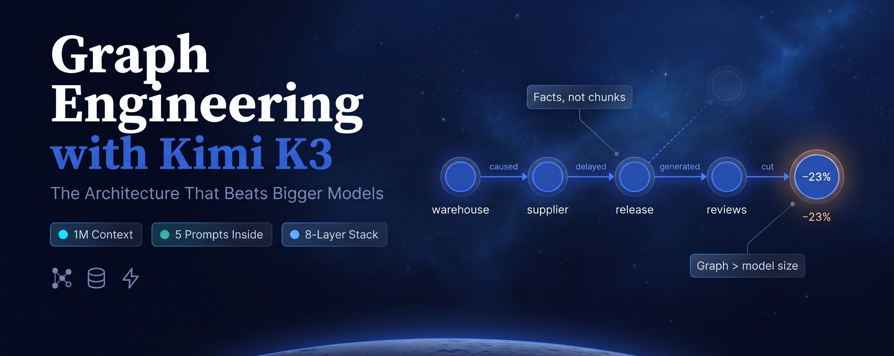

# Graph Engineering with Kimi K3: Complete A-Z Guide to the Architecture That Beats Bigger Models

**Article:** [Graph Engineering with Kimi K3: Complete A-Z Guide to the Architecture That Beats Bigger Models](https://x.com/kirillk_web3/status/2087619214915826155) — X (Twitter), Aug 12, 2026
**Wiki:** [[index]] | **Digest:** [[digest]]

> **Terminology note:** this article uses "graph engineering" in the **knowledge-graph / GraphRAG** sense — storing facts as triples (subject → relation → object) in a graph database and querying relationships directly. That is a DIFFERENT thing from the **agent-topology** sense of "graph engineering" (wiring multi-agent loops/pipelines into a graph of agent calls) used by most other sources in this research batch (e.g. [[YouTubeWhatIsGraphEngineering/summary]], [[LangGraph3YearsGraphEngineering/summary]]). Do not conflate the two when cross-referencing this entry.

## Human Readable TL;DR

Most chatbot-style question-answering systems ("RAG") work by finding text that *looks like* your question and reading it back to you — which falls apart the moment the real answer is a chain of causes spread across several documents (e.g. "why did sales drop?" → a supplier problem → a delayed shipment → bad reviews → fewer sales). This article proposes storing facts as a web of connected dots instead (a "knowledge graph") so the system can trace the actual chain of cause and effect, and argues that Kimi K3 — a large-language model with a huge 1-million-token memory window — is currently the best engine to run that web on, mainly because it can hold a big enough slice of the web in its head at once, not because it is the smartest model available.

## TL;DR

Standard vector-similarity RAG cannot answer multi-hop causal questions because it retrieves look-alike text, not connected facts. The fix is structural: store facts as subject→relation→object triples in a graph database and query relationship paths directly (Microsoft's local-search/global-search framing). Kimi K3 is recommended as the model to run this architecture not for raw capability (Moonshot's own blog admits it trails Claude Fable 5 and GPT-5.6 Sol) but because its 1,048,576-token context window, Kimi Delta Attention (up to 6.3x faster long-context decoding), and Attention Residuals (reduced signal degradation across depth) make passing whole subgraphs to the model economically viable. A cited comparison of 26 open-source models found graph quality beats model size consistently. The article specifies a concrete 8-layer pipeline (Ingestion → Extraction → Resolution → Storage → Retrieval → Agent → Verification → Update), 5 narrowly-scoped prompts to run it, a stack (Neo4j + Kimi K3 API + Kimi Code CLI + DSPy), a day-by-day week-one build plan, and troubleshooting for the failure modes (duplicate entities, invented relationships, bad Cypher, confident-but-wrong answers, cost creep, graph rot) — while cautioning that the widely-quoted "85% lower cost, 18% better accuracy" figures come from specific research on specific datasets, not a universal guarantee.

---

## Problem & Motivation

Standard RAG answers "what documents mention this?" by finding semantically similar text chunks. It cannot answer "why did this happen?" when the answer is a causal chain spread across documents that share no keywords — e.g. "why did sales drop in March?" requires connecting a release delay, a supplier problem, a warehouse failure, and negative reviews, none of which mention each other or "sales drop" directly. No amount of better embeddings closes this gap, because semantic similarity finds documents that *look* alike, not facts that *connect*. This is exactly the class of question — causal, multi-hop, cross-document — that matters most in practice, and it's the class standard RAG is structurally unable to answer.

---

## Main Original Ideas

1. **Facts as triples, not chunks as vectors.** Store subject→relation→object triples (e.g. "Kimi K3 → developed by → Moonshot AI", "Warehouse → caused → Supplier delay") in a graph database and query relationship paths directly, instead of storing "this paragraph is about X" and searching by similarity.
2. **Local search vs. global search (Microsoft's GraphRAG framing).** Local search answers node-and-neighbors questions ("what happened with supplier X in July?"); global search answers whole-graph pattern questions ("what are the recurring risk patterns across all suppliers?"). Standard RAG handles the first badly and the second not at all; a graph handles both.
3. **Model choice as an economics problem, not a capability contest.** Kimi K3 is chosen for its 1,048,576-token context window (so a full retrieved subgraph fits without truncation), Kimi Delta Attention (KDA, up to 6.3x faster long-sequence decoding), and Attention Residuals (AttnRes, less signal degradation between early and late context) — explicitly *not* because it's the strongest model on the market (Moonshot's own blog concedes it trails Claude Fable 5 and GPT-5.6 Sol).
4. **Graph quality beats model size.** A cited comparison across 26 open-source models on knowledge-graph tasks found: bigger model + bad graph → worse results; smaller model + good graph → better results, consistently.
5. **The Synergized (Mode 3) integration pattern.** Of three ways to combine an LLM and a graph — KG-enhanced LLM (one-directional), LLM-augmented KG (one-directional), and Synergized (the model writes new facts into the graph and the graph feeds structured context back) — Mode 3 is the one worth building, since the system compounds: each answer adds structure the next answer can use.
6. **An 8-layer closed-loop pipeline.** Ingestion → Extraction → Resolution → Storage → Retrieval → Agent → Verification → Update, with the loop closing at Update and restarting at Extraction — that recirculation is what makes the system "compound" rather than run as a one-pass flow.
7. **5 narrowly-scoped prompts, not one mega-prompt.** Extraction, Entity Resolution, Query Translation, Grounded Answer, and Graph Maintenance each has one verifiable job; graph engineering constrains prompting rather than replacing it.

---

## Key Findings

- 1M-token context (1,048,576 tokens) lets a full retrieved subgraph, evidence chain, and entity path list fit in one session, versus 128K–200K windows that force truncating the graph before the model sees it.
- KDA: Moonshot reports up to 6.3x faster decoding in million-token contexts.
- 26-model comparison: graph quality consistently beats model size on knowledge-graph engineering tasks.
- Arena.ai Code Arena (fullstack, Jul 28): Kimi K3 (Max) #1 (~1665), GPT-5.6 Sol #2 (~1635), Claude Fable 5 #3 (~1625) — a near-tie among top models, used to make the "not the strongest model, but the right one for this architecture" caveat concrete.
- Resolution is "the layer everyone skips and everyone regrets skipping" — unresolved name variants (e.g. "OpenAI" / "Open AI" / "OpenAI Inc.") fragment the graph into duplicates and cause partial query results; the single most common failure mode reported.
- The oft-quoted "85% lower cost, 18% better accuracy" figures come from specific research on specific document sets against a specific (unstated by default) baseline — the direction is well-supported across independent groups, but the magnitude is not a universal guarantee and should be measured on your own data.

---

## Suggestions & Future Directions

1. Run entity resolution (Prompt 2) as a batch job over new entities *before* insertion — retrofitting resolution onto an already-polluted graph is significantly harder.
2. Make the evidence field in the extraction prompt mandatory (exact quote or the relationship doesn't go in) to suppress invented relationships.
3. Pass the literal graph schema (not a description of it) into query-translation prompts and validate generated Cypher before executing it.
4. Cap traversal depth to 2-3 hops to control token cost; measure average tokens per query as an early-warning signal.
5. Run a scheduled maintenance pass (Prompt 5) so contradictions get flagged and superseded facts get timestamped rather than silently accumulating as graph rot.
6. Treat the widely-circulated cost/accuracy percentages as directionally right but not magnitude-guaranteed — validate on your own data during week one before committing to production architecture.

---

## Authors & Institutions

Kirill (@kirillk_web3) — independent practitioner/writer on X (Twitter); no institutional affiliation stated. The article cites (without independent verification in this summary) research and framing from Microsoft (GraphRAG), Stanford, and MIT, plus a comparison study of 26 open-source models.

## Figures

