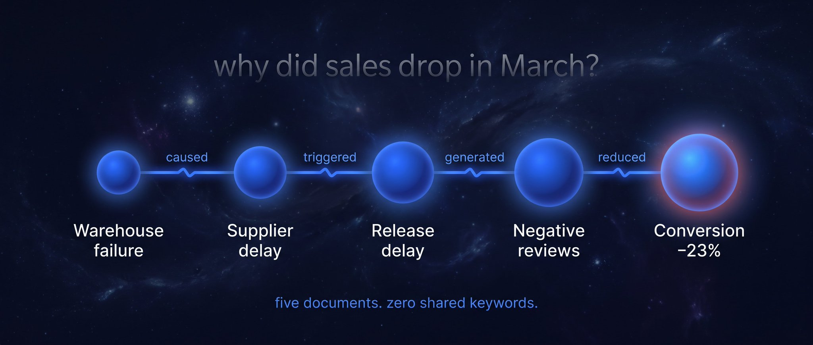
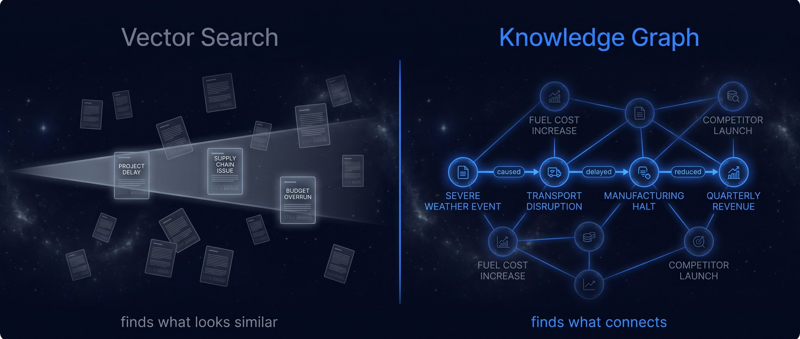

> [[../index|Wiki]] | [[../summary|Summary]] | [[../digest|Digest]]

# The Problem, and What Graph Engineering Actually Is

**In one sentence:** Standard RAG tops out on multi-hop causal questions because vector similarity finds look-alike text, not connecting facts — whereas "graph engineering" (knowledge-graph / GraphRAG: storing facts as triples and querying relationship paths) answers exactly those questions.

> **Terminology note:** this article uses "graph engineering" in the **KNOWLEDGE-GRAPH / GraphRAG** sense — storing facts as triples (subject → relation → object) and querying relationships directly. This is DIFFERENT from the **agent-topology** sense of "graph engineering" (wiring multi-agent loops/pipelines into a graph of agent calls), which is what most other sources in this research batch cover. Don't conflate the two.

## Key points

- Standard RAG (question → similar-text retrieval → answer from chunks) breaks the moment a question is complicated, because it can only return fragments, never a chain of causes spread across documents that share no keywords.
- The canonical failure case: "why did our sales drop in March?" — the real answer is a causal chain (release delay → supplier problem → warehouse failure → negative reviews → conversion cut by 23%), and no amount of better embeddings recovers it, since semantic similarity finds documents that look alike, not facts that connect.
- The fix is structural: instead of storing text and searching by similarity, store facts and their relationships as triples (Subject → Relation → Object) and query the paths directly — e.g. "Kimi K3 → developed by → Moonshot AI" and "Warehouse → caused → Supplier delay".
- A vector database stores "this paragraph is about supply chains"; a knowledge graph stores "this specific event caused that specific outcome" — the difference is structural, not cosmetic.
- The graph query is not "what text is similar to my question?" but "walk me the path from A to B and show me every link."
- Microsoft's GraphRAG framing distinguishes **local search** (a node plus its immediate connections, e.g. "What happened with supplier X in July?") from **global search** (patterns across the whole graph, e.g. "What are the recurring risk patterns across all suppliers?").
- Standard RAG handles local-style questions badly and global-style questions not at all; graph engineering handles both.
- The article credits the architecture as independently proven by Microsoft, Stanford, and MIT, and presents Kimi K3 as the best available model to run it.

---

## The Problem with Standard RAG

Standard RAG works like this: the user asks something, the system finds similar text chunks, and the model writes an answer from those chunks. It works fine until it doesn't.

Ask "why did our sales drop in March?" and a vector search finds documents containing "sales" and "March." It returns fragments. It cannot return a chain of causes, because the causes live in five different documents that share no keywords with each other. What you actually needed was:

> Sales dropped because of a release delay → caused by a supplier problem → triggered by a warehouse failure → which generated negative reviews → which cut conversion by 23%.

No amount of better embedding gets you there. Semantic similarity finds documents that look alike. It does not find facts that connect. That's the ceiling — and you hit it on exactly the questions that matter most.

## What Graph Engineering Actually Is

Instead of storing text and searching by similarity, you store facts and their relationships — then query the relationships directly.

Everything becomes a triple:

> Subject → Relation → Object

Concretely:

- Kimi K3 → developed by → Moonshot AI
- Kimi K3 → context window → 1M tokens
- Kimi K3 → built on → Kimi Delta Attention
- Warehouse → caused → Supplier delay
- Supplier → caused → Release delay
- Release → reduced → Conversion rate

The difference is structural, not cosmetic. A vector database stores "this paragraph is about supply chains." A knowledge graph stores "this specific event caused that specific outcome."

When you query it, you're not asking "what text is similar to my question." You're asking "walk me the path from A to B and show me every link."

Microsoft's framing from the GraphRAG research is the clearest way to think about it:

- **Local search** — "What happened with supplier X in July?" — finds a node and its immediate connections.
- **Global search** — "What are the recurring risk patterns across all suppliers?" — finds patterns across the whole graph.

Standard RAG handles the first badly and the second not at all. Graph engineering handles both.

**Covers:** Article intro through "What Graph Engineering Actually Is" (local/global search framing).
